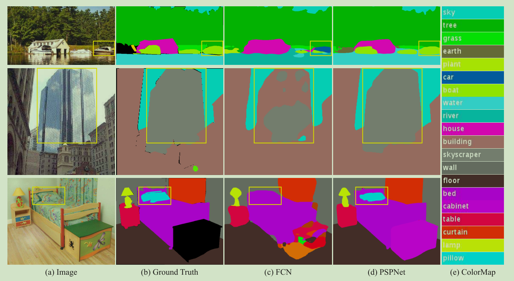
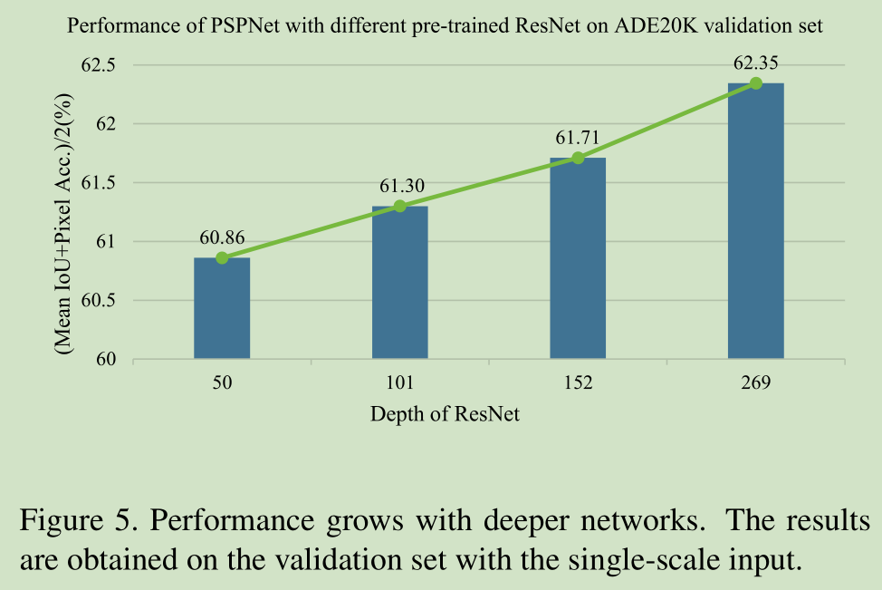
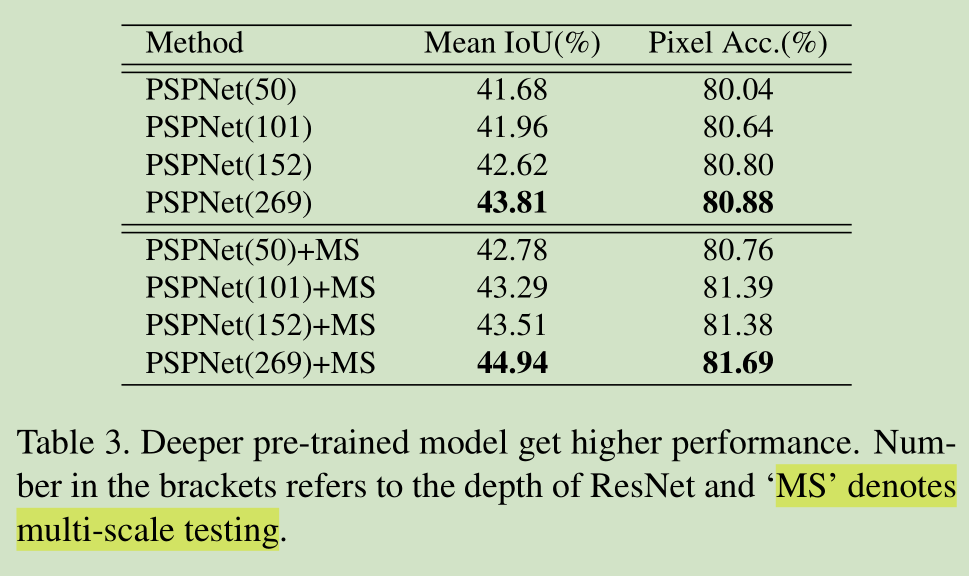
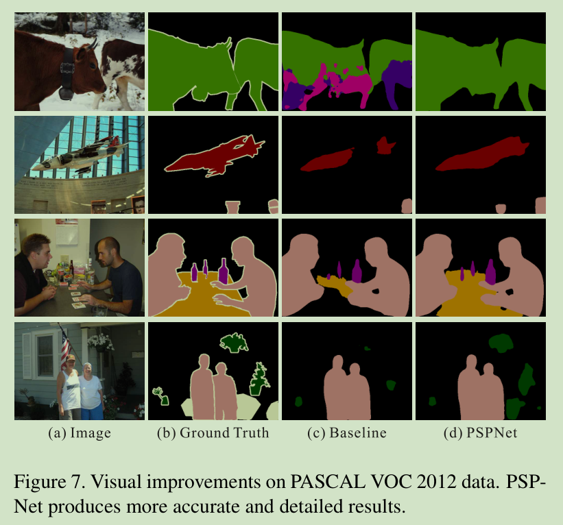
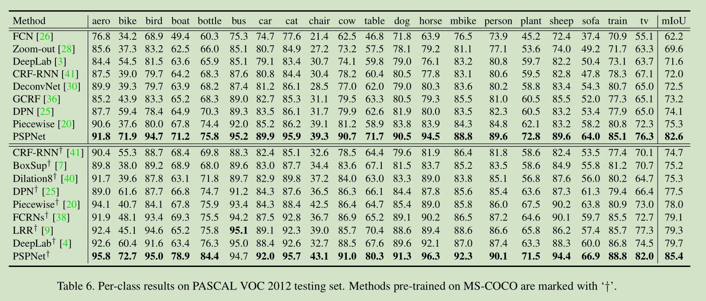
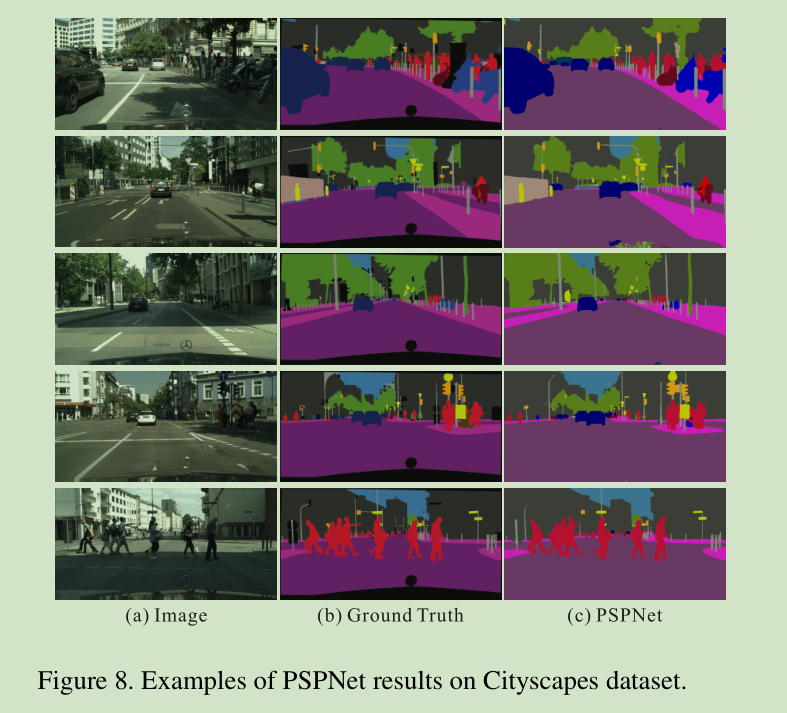

# PSPNet论文阅读笔记
[toc]

## 一、简介
&emsp;&emsp;[PSPNet官方地址](https://hszhao.github.io/projects/pspnet/)
&emsp;&emsp;[PSPNet论文地址](https://arxiv.org/abs/1612.01105)
&emsp;&emsp;[PSPNet代码PyTorch地址](https://github.com/hszhao/semseg)
&emsp;&emsp;[PSPNet代码Caffe地址](https://github.com/hszhao/PSPNet)
&emsp;&emsp;《Pyramid Scene Parsing Network》简称PSPNet是2016年ImageNet场景解析讨战赛第一名使用的结构，其旨在解决之前的语义分割网络FCN存在的无法有效使用全局场景不同类编之间关系信息的缺陷，希望通过提取不同维度的特征信息，增强特征的表现能力，能够将图像的上下文信息应用于最终的分类中去。
&emsp;&emsp;文章的主要三个贡献：
1. 提出了PSPNet网络结构能够更好的提取上下文信息;
2. 开发了一种有效优化深度残差网络的优化策略（辅助分支在Googlenet中就有应用过，算是创新吗？）
3. 构建了场景解析和语义分割的实用框架：[PyTorch](https://github.com/hszhao/PSPNet)

## 二、所面对的问题及其解决方向
&emsp;&emsp;之前的语义分割网络使用全卷积和空洞卷积的FCN来对像素进行分类，但是并没有有效地利用图像中的上下文信息。因此，作者提出提升性能的两个方向：
1. 在深度网络中，深层特征包含更多的语义信息而底层特征包含更多的空间位置信息，因此结合这两者的特征能够有效提升网络的性能；
2. 之前的工作都是使用CRF（条件随机场）进行图像后处理，也有使用端到端的网络进行学习的结构，因此作者认为通过结构预测在复杂条件下还是有大的空间提取更有效地信息。

&emsp;&emsp;在具体的任务中使用FCN作为基线所面对的具体的问题及其解决方向：
1. 类别失配。无法有效利用图像的上下文信息，类别错分。例如在下面的图像中第一行是一个湖畔，一般来说湖畔有车的概率小于有船的概率，而FCN将船错分成了车。这点可以通过利用图像的上下文信息解决；
2. 类别混淆。外形相似的类别错分。如下图中的第二行中的玻璃大厦，因为玻璃的反光使得其的外形有点儿变化网络错分。这点可以通过引入类别间的相互关系解决。
3. 小目标无法识别的问题。如下图中的第三行中的枕头，FCN直接就没有检测到。利用多尺度特征解决。



## 三、结构
### 1、Pyramid Pooling Module
&emsp;&emsp;Pyramid Pooling Module模块（下面简称PPM）是作者根据上面所提到的问题所提出的模块，能够多尺度的融合低层和高层的信息，增强特征，提升模型的表现力。
&emsp;&emsp;一般来说网络越深感受野越大(resceptive field)，但是理论上的感受野和实际网络中的感受野还是有差距的（实际的感受野小于理论的感受野），这使得网络无法有效的融合全局特征信息，作者提出的PPM就解决了这个问题。（论文中说的，没搞懂为什么）
&emsp;&emsp;GAP(Global Average Pooling,全剧平均池化)能够有效的融合全局上下文信息，但是其对信息的融合和提取能力有限，而且简单的使用GAP将信息压缩为一个通道很容易损失很多有用的信息，因此将不同感受野的特征和子区域的特征融合可以增强特征表征能力。

&emsp;&emsp;上图是PPM模型的结构，PPM的输入是图像经过特征提取网络比如Resnet50进行特征提取得到固定大小的特征图，然后分成两个分支，一个分支分为多个子区域进行GAP，再通过上采样到和另一个分支相同的尺寸，最后将两个分支融合。
&emsp;&emsp;关于中间的子区域作者选择不同的子区域进行了实验，最终选择了(1*1,2*2,3*3,6*6)(具体的结果在实验部分)，并且在每个子区域之后都使用一个1*1卷估计网络对该区域进行通道融合，如果金字塔级别是N，即子区域的个数，这里是4，则通道缩减为原来的$\frac{1}{N}$，这样既可以保障能能够提取足够的特征，融合更多的信息，而且参数量也不会有过多的增加。
&emsp;&emsp;PPM模块如下所示，bins是所指定的子区域的大小，网络中设置为(1,2,3,6)。
```python
class PPM(nn.Module):
    def __init__(self, in_dim, reduction_dim, bins, BatchNorm):
        super(PPM, self).__init__()
        self.features = []
        for bin in bins:
            self.features.append(nn.Sequential(
                nn.AdaptiveAvgPool2d(bin),
                nn.Conv2d(in_dim, reduction_dim, kernel_size=1, bias=False),
                BatchNorm(reduction_dim),
                nn.ReLU(inplace=True)
            ))
        self.features = nn.ModuleList(self.features)

    def forward(self, x):
        x_size = x.size()
        out = [x]
        for f in self.features:
            out.append(F.interpolate(f(x), x_size[2:], mode='bilinear', align_corners=True))
        return torch.cat(out, 1)
```
### 2、网络结构
&emsp;&emsp;网络结构如同上面的图片所示，只是将原来的AGAP替代成了PPM模块没有过多可说的。
### 3、Deep Supervision for ResNet-Based FCN
&emsp;&emsp;这个小节的名字是照搬原文的，我觉得就是在resnet中的res4b22后面加了一个辅助分支采用softmax损失进行辅助训练，很像googlenet中的辅助分支。在Resnet中GAP替换成了之前的backbone比较常用的全连接层，虽然性能上去了但是不好训练，我认为这里使用辅助分支应该是为了解决这个问题。
[](imgs/aux_loss.png)

&emsp;&emsp;另外需要辅助分支的结构并未出现在论文中，从代码中我们可以看到辅助分支的结构如下，就是两层卷积而已:
```python
self.aux = nn.Sequential(
                nn.Conv2d(1024, 256, kernel_size=3, padding=1, bias=False),
                BatchNorm(256),
                nn.ReLU(inplace=True),
                nn.Dropout2d(p=dropout),
                nn.Conv2d(256, classes, kernel_size=1)
            )
```

## 四、实验
&emsp;&emsp;作者的实验设置主要在ImageNet scene parsing challenge 2016,PASCAL VOC 2012 语义分割数据集 和城市场景理解Cityscapes三个数据集上进行实验。实验结果我只贴出了所有实验结果的图片，表格和图像数据一目了然无需过多的解释。
### 1、实验设置

|参数或策略|值或方式|
|:---:|:---:|
|基础学习率|0.01|
|学习率更新方式|$lr * (1-\frac{iter}{iter_{max}})^{power}$, power=0.9|
|权重衰减|momentum=0.9,weight decay=0.0001|
|数据增强策略|随机镜像，随机缩放0.5或2倍，随机旋转-10或者10度，随机高斯模糊|
|迭代次数|ImageNet=150K，VOC=30K，Cityscapes=90K|

### 2、ImageNet Scene Parsing Challenge 2016






### 3、PASCAL VOC 2012



### 4、Cityscapes


