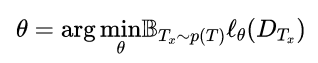
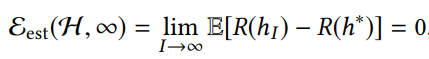
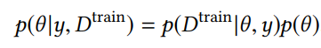

# Few-shot Learning: A Survey 

&emsp;&emsp;[原文链接](<https://arxiv.org/abs/1904.05046v1>)

[TOC]

&emsp;&emsp;追求“机器可以思考”和“机器可以做人类所做的事”是推动人工智能发展的任务。虽然最近的人工智能在许多数据密集型应用程序中取得了成功，但它仍然缺乏从有限的范例中学习并快速推广到新任务的能力。要解决这个问题，必须转向支持人工智能科学研究的机器学习。特别是在这种情况下，称之为Few-shot Learning（FSL）的机器学习问题。它可以通过转向先验知识，迅速推广到有限监督经验的新任务，这些先验知识模仿人类通过概括和类比从少数例子中获取知识的能力。它被视为真正的人工智能的试验平台，是一种减少费时费力数据收集和计算成本高昂的训练的方法，以及针对罕见学习任务的解毒剂。随着FSL的广泛开展，我们对其进行了全面的调查。我们首先给出FSL的正式定义。然后我们指出了FSL的核心问题，它将问题从“如何解决FSL”转变为“如何处理核心问题”。因此，从FSL诞生到最新发表的作品的现有作品被归类为统一的分类法，并对不同类别的利弊进行了详尽的讨论。最后，我们设想FSL在问题设置，技术，应用和理论方面可能的未来发展方向，希望为初学者和有经验的研究人员提供见解。

## 1 介绍

&emsp;&emsp;“机器能思考吗[121]？“这是阿兰图灵20世纪50年代题为”计算机器和智能“的开创性论文中提出的问题。他发表声明称，“数字计算机背后的想法可以解释为这些机器旨在执行任何可由人类计算机完成的操作”。换句话说，机器的最终目标是与人类一样聪明。这打开了由McCarthy等人命名的人工智能（AI）的大门。[1955]。自诞生以来，人工智能经历了自1956年以来的最初的繁荣和繁荣，以及自20世纪70年代以来的两个人工智能冬季[22,72]，并从2000年代开始复苏。近年来，由于强大的计算设备，如GPU，大型数据集，如ImageNet [24]，先进的模型和算法，如CNN [59]，人工智能将其步伐与人类紧密相连，在许多场景中击败人类。仅举几例，AlphaGo [105]在玩古代游戏go中击败了人类冠军，ResNet [46]已经击败了1000类ImageNet数据的人类分类准确率。在其他方面，人工智能作为高度智能的工具涉及人类的日常生活，，如语音助手，搜索引擎，自动驾驶汽车和工业机器人。

&emsp;&emsp;虽然它很繁荣，但是人工智能在它像人类一样行动之前仍然需要采取一些重要步骤，其中之一就是从少量数据中快速推广以执行任务。回想一下人类可以迅速将他们学到的东西概括为新的任务场景。例如，已经教过如何添加的孩子可以快速迁移其知识，以获得如何乘以给出几个例子，如2×3 = 2 + 2 + 2和1×3 = 1 + 1 + 1。另一个例子是，给定一张陌生人的照片，孩子们可以轻松地从大量照片中识别出来。人类可以将他们过去学到的东西与新的例子结合起来，因此可以迅速推广到新的任务。相反，上述成功的机器应用程序依赖于对大规模数据的详尽学习。

&emsp;&emsp;消除人工智能与人类学习之间的这种差距是一个重要方向。这可以通过转向机器学习来解决，机器学习是一种支持其科学研究基础的人工智能，如模型，算法和理论。具体而言，机器学习关注的是如何构建自动改进的计算机程序的问题[78]。为了从有限的监督信息中学习以获得任务的渴望，出现了一种称为Few-shot learning（FSL）[30,31]的新机器学习问题。当只有一个学习范例时，FSL也被称为一次性学习问题。FSL可以通过结合先验知识来学习有限监督信息的新任务。

&emsp;&emsp;如上所述，FSL充当真正的人工智能的试验平台。它首先适用于那些人类已经很好理解的应用程序，以便像人类一样充分学习。一个典型的例子是字符识别[62]，其中要求计算机程序分类，解析并生成新的手写字符。为了处理这个任务，可以将字符分解成可在字符之间转移的较小部分，然后将这些较小的部分聚合成新的字符。这是一种像人类一样学习的方式[63]。当然，FSL推进了机器人技术的发展[21]，其目标是开发可以复制人类行为的机器，以便在某些情况下取代人类。例如一次性模仿[28]，多臂匪[28]，视觉导航[28]，运动中的连续控制[32]。

&emsp;&emsp;除了测试真实的人工智能外，FSL还可以帮助减轻收集工业用途的大规模监督日期的负担。例如，ResNet [46]已经突破了1000类ImageNet数据的人类分类率。然而，这是在每个类具有足够标记图像的情况下。相比之下，人类可以识别大约30,000个类[14]，其中为机器收集每个类的足够图像是非常费力的。这几乎就像不可能的任务。相反，FSL可以帮助减少这些数据密集型应用程序的数据采集效率，例如图像分类[125]，图像检索[117]，对象跟踪[13]，手势识别[86]，图像字幕和视觉问题回答[26] ]，视频事件检测[135]，语言建模[125]。同样，能够执行FSL可以降低那些计算昂贵的应用程序的成本，例如一次性架构搜索[18]。当模型和算法成功实现FSL时，他们自然可以申请多次拍摄的数据集，这些数据集更易于学习。

&emsp;&emsp;FSL的另一个经典场景是由于某些原因（例如隐私，安全或道德问题）难以或无法获取受监督信息的任务。例如，药物发现是发现新分子特性的过程，以便将有用的分子鉴定为新药[3]。然而，由于可能的毒性，低活性和低溶解度，这些新分子在临床候选物上没有太多真实的生物学记录。这使得药物发现任务成为FSL问题。类似的罕见案例学习应用程序可以是少量翻译[52]，冷启动项目推荐[124]，其中目标任务没有太多样本。通过FSL可以为这些罕见情况学习合适的模型。

&emsp;&emsp;凭借真正人工智能的学术梦想和廉价学习的工业需求，FSL引起了很多关注并成为热门话题。作为一种学习范式，许多方法都在努力解决它，如元学习方法[98]，嵌入方法[125]和生成建模[29]。但是，没有可以连接它们的有组织的分类法，解释为什么有些方法可以工作而其他方法失败，并讨论了优缺点。因此，我们对FSL问题进行了全面的调查。本调查的贡献概括为:

- 我们为FSL提供正式定义。它可以自然然而地链接到[78]中提出的经典机器学习定义。定义不仅足以涵盖所有现有的FSL问题，而且还具体说明FSL的目标是什么以及我们如何解决它。这种定义有助于确定FSL领域的未来研究目标。
- 我们基于机器学习中的错误分解指出了FSL的核心问题。我们发现，不可靠的经验风险最小化因素使FSL难以学习。通过满足或降低学习的样本复杂性可以减轻这种情况。了解核心问题有助于根据解决核心问题的方式将不同的工作分类为数据，模型和算法。更重要的是，这提供了以更有组织和系统的方式改进FSL方法的见解。
- 我们从FSL的诞生到最近发表的文献综述进行了广泛的文献综述，并将它们分类为统一的分类法。详细讨论了不同类别的利弊。
  我们还提供了每个类别下的见解摘要。这些将成为初学者和经验丰富的研究人员的良好指导。
- 我们设想了FSL在问题设置，技术，应用和理论方面的四个有希望的未来方向。这些见解是基于FSL当前发展的弱点，以及未来可能的探索方向。我们希望这部分可以提供一些见解，有助于解决FSL问题，并努力实现真正的AI。
- 与现有的关于概念学习和小样本经验学习的FSL相关调查[103]相比，我们提供了FSL是什么的正式定义，为什么FSL很难，以及FSL如何将少数监督信息与先前知识结合起来 使学习成为可能。我们根据拟议的分类法进行了广泛的文献综述，详细讨论了利弊，总结和见解。我们还讨论了FSL与这些相关主题之间的相关性和差异，如半监督学习，不平衡学习，转移学习和元学习。

&emsp;&emsp;本调查的提醒内容如下。第2节提供了调查的概述，包括FSL的定义，其核心问题，相关的学习问题和现有工作的分类。第3节介绍了操纵数据以解决FSL问题的FSL方法，第4节讨论了限制模型以使FSL可行的FSL方法，第5节说明了如何改变算法以帮助FSL问题。在第6节中，我们从问题设置，技术，应用和理论的角度设想了FSL的未来发展方向。最后，调查以第7节中的结论结束。

## 2 预览

&emsp;&emsp;在本节中，我们首先给出了2.1节中本文中使用的符号。第2.2节给出了FSL问题的正式定义，并给出了具体的例子。考虑到FSL问题与许多机器学习问题有关，我们在2.3节讨论它们与FSL之间的相关性和差异。然后在2.4节中，我们揭示了导致FSL问题困难的核心问题。根据现有工作如何处理核心问题，我们在第2.5节中提出了统一的分类法。

### 2.1 符号

&emsp;&emsp;考虑监督学习任务T，FSL处理数据集$D={D^{train},D^{test}}$，训练集$D^train={x^{i},y^{i}}^I_{i=1}$小的$I$和测试集$D^test={x^{test}}$。通常，人们会考虑N路K shot分类任务，其中$D^{train}$包含来自N个类的$I=KN$示例，每个类都有$K$个示例。设$p(x，y)$为输入$x$和输出$y$的基础真实联合分布。FSL学习通过拟合$D^{train}$从$x$到$y$发现最佳假设$o^ *$，并且对$D^{test}$表现良好。为了近似$o ^*$，模型确定由θ2参数化的假设$h(·;θ)$的假设空间$H$。优化算法是搜索$H$的策略，以便找出参数化$D^{train}$的最优$h∈H$的$θ$。通过在预测$y$（例如，$ y= h(x;θ)$）和真实的$y$上定义的损失函数$l(\hat{y}，y)$来测量性能。

### 2.2问题定义

&emsp;&emsp;由于FSL在机器学习中自然是一个子领域，在给出FSL的定义之前，让我们回想一下机器学习是如何明确定义的。我们采用Mitchell的定义，定义2.1中显示。

&emsp;&emsp;**定义2.1**（机器学习[78]）:计算机程序可以从经验E中学习某些类别的任务T和性能测量P，如果其性能可以通过P测量的E在T上得到改善则称之为机器学习。

&emsp;&emsp;正如我们所看到的，机器学习问题由E，T和P指定。例如，让T成为图像分类任务，机器学习程序可以通过大规模标记图像训练获得的E通过分类精度来改善其P ，例如，ImageNet数据集[59]。另一个例子是最近的计算机程序AlphaGo [105]，它在玩古代游戏go（T）时击败了人类冠军。它利用人类专家记录的大约3000万次移动数据库以及反复对抗自身的数据库，提高了对抗对手的胜利率（P）。

&emsp;&emsp;上述机器学习的典型应用需要为给定任务提供大量监督信息。但是，如引言中所述，这可能是困难的，甚至是不可能的。FSL是机器学习的一个特例，其目的在于通过数据集D提供有限的监督信息来获得良好的学习性能。形式上，FSL在定义2.2中被定义。

&emsp;&emsp;**定义2.2:**Few-shot learning（FSL）是一种E包含目标T的很少监督信息的机器学习问题（由E，T和P指定）。

&emsp;&emsp;为了更好地理解这种定义，让我们展示三种典型的FSL情景（表1）：

- 用于类似人类学习的测试平台：为了实现人类智能，具有解决FSL问题能力的计算机程序至关重要。一个流行的任务（T）是仅仅举几个例子来生成新角色的样本[62]。仅仅根据给定的例子训练计算机程序是不够的。受人类学习的启发，计算机程序学习基于部分和关系的先验知识来识别这个角色。现在E包含数据集中给定的示例作为监督信息和预先训练的概念作为先验知识。通过视觉图灵测试（P）的通过率来评估所生成的字符，其辨别图像是由人还是机器生成的。通过这种扩大的体验，我们还可以分类，解析和生成像人类一样的新手写字符。
- 减少数据采集效率和计算成本的几点：FSL还可以帮助减轻收集大规模监督信息的负担。考虑通过FSL对少数类进行分类[30]。图像分类准确度（P）随着针对目标T的每个类别的受监督的少数标记图像获得的E而改善，并且从其他类别提取的先验知识，例如原始图像到共同训练，预训练模型以适应 ，或者算法开始的良好初始化点。然后，在这项任务中成功的模型通常具有更高的通用性，因此可以很容易地应用于多次拍摄。
- 由于极少数情况而引起的极少数情况：最后，考虑由于某些原因（例如隐私，安全或道德问题）难以或无法获取受监督信息的任务。通过FSL可以为这些罕见情况学习合适的模型。例如，药物发现是发现新分子特性的过程，以便将有用的分子鉴定为新药[3]。然而，由于可能的毒性，低活性和低溶解度，这些新分子在临床候选物上没有太多真实的生物学记录。这使得药物发现任务成为FSL问题。例如，考虑一个常见的药物发现任务T，它可以预测新分子是否会带来毒性作用。为了使FSL可行，E包含新分子的有限分析，以及许多类似分子的分析作为先验知识。P通过正确分配为有毒或无毒的分子百分比来测量。

表1 于定义2.2的三个few shot学习示例

|      T       |                 E                 |                  E                   |         P          |
| :----------: | :-------------------------------: | :----------------------------------: | :----------------: |
|              |             监督信息              |               先验知识               |                    |
|   字符生成   |         新字符的少量样例          |       部分和关系的预先学习知识       | 视觉图灵测验合格率 |
|   图像分类   | 针对目标T的每个类监督少数标记图像 | 其他类别的原始图像，或预先训练的模型 |     分类准确率     |
| 药物毒性发现 |         新分子的有限测定          |            类似分子的分析            |     分类准确率     |

&emsp;&emsp;下面为表格的原图：

&emsp;&emsp;由于E中只包含与T直接相关的一点监督信息，因此自然常见的监督机器学习方法在FSL问题上失败。因此，FSL方法将先验知识与E中的可用监督信息相结合，以使目标T的学习成为可能。

### 2.3 相关的学习问题

&emsp;&emsp;在本节中，我们将讨论FSL的相关学习问题。有关FSL的相关性和差异是特别明确的。

- **半监督学习**[145]通过经验E学习从输入$x$到输出$y$的最优假设$o^*$，经验E由标记和未标记的示例组成。示例应用程序是由于大规模x而无法获得每个输入$x$的输出$y$的文本和网页分类任务。通常，未标记的实例是大量的，而标记的实例是小规模的。无监督数据可用于在输入$x$的空间上形成簇。然后通过分离这些聚类来构建决策边界。以这种方式学习比单独使用小规模标记数据具有更好的准确性。正无标记学习[67]是半监督学习的一个特例，其中只给出了正类和未标记的样本。未标记的样品可以是正类或反类。例如，在社交网络中的朋友推荐中，我们只能推荐根据用户的朋友列表，而其与其他人的关系是未知的。另一个流行的半监督学习的特殊情况，主动学习[102]选择信息性的未标记数据来查询神秘的输出$y$。这通常用于注释成本高昂的应用，例如行人检测。通过定义，几乎学习可以是监督学习，半监督学习和强化学习，这取决于除了小监督信息之外可用的数据类型。
- 不平衡学习[45]从经验E中学习，输出y的分布严重偏差。当很少采用y的某些值时会发生这种情况，例如欺诈检测和灾难预期。它训练和测试以选择所有可能的y。相比之下，FSL用few shot训练y，同时可能将其他y作为先前知识来帮助学习，并且仅用few-shot预测y。
- 迁移学习[85]转移从源域和源任务中获得的知识，其中有足够的训练数据可用，目标领域和目标任务，其中训练数据是有限的。
  符号域由输入x的特征空间和边际分布指定[85]。它已被用于跨域推荐，跨时段的WiFi本地化，空间和移动设备。域适应[10]是一种迁移学习，其中任务是相同的，但域是不同的。例如，任务是情绪分析，而源域数据是关于电影的客户评论，而目标域数据是关于日常商品的客户评论。另一个与FSL密切相关的转学习问题是zero shot learning[64]。FSL和zero-shot学习都是转学习中的极端情况，因为它们需要转移从其他任务或领域学到的先验知识[38]。然而，FSL和zero shot learning使用不同的策略学习新类别：FSL设法借助先验知识学习有限的训练样例，而zero shot learning直接使用来自其他数据源的先验知识来构建假设h。它通过将新类别与已经学过的现有课程相关联来识别没有监督培训示例的新课程。由于缺乏监督信息，类之间的链接是从其他数据源中提取的。它适用于受监督的例子非常困难或昂贵的情况，例如神经活动编码[84]。例如，在图像分类中，这种关系可以由人注释，从文本语料库中挖掘或从词汇数据库中提取[133]。
- 元学习[100]或学会学习[47]通过任务T的数据集和元学习器跨任务提取的元知识来改进任务T上的性能P。在这里，学习发生在两个层面：元学习者逐渐学习跨任务的通用信息（元知识），学习者使用任务特定信息快速推广元学习者的新任务T. 它可以用于元知识有用的场景，例如学习优化算法[4,66]，强化学习[32]和FSL问题[98,125]。实际上，本次调查中讨论的许多方法都是元学习方法。因此我们正式引用它作为参考。元学习者生动地给出了$H$的草图，而学习者完成了具体的$H$。元学习者的学习需要大规模的数据。设$p(T)$为任务$T$的分布。在计量学习中，它从一组任务$T_s~p(T)$中学习。每个任务$T_s$对$N$个类的数据集$D_{T_s}$进行操作，其中$D_{T_s}=\{D_{T_s}^{train}, D_{T_s}^{test}\}$，$D_{T_s}^{train}={(x^{(i)}_{T_s},y^{(i)}_{T_s})}$和$D^{test}_{T_s}=\{(x^{test}_{T_s},y^{test}_{T_s})\}$。每个学习者都从$D^{train}_{T_s}$学习并测量$D^{test}_{T_s}$的测试误差。元学习者的参数$θ$按照下面的公式最小化所有学习者的误差,然后在元测试中，使用另一个不相交的任务集$T_t\sim p(T)$来测试元学习器的泛化能力。每个$T_t$对$N^{\prime}$类的数据集$D_{T_t}$起作用，其中$D_{T_t}=\{D^{train}_{T_t},D^{test}_{T_t}\}$，其中$D^{train}_{T_t}=\{(x^{(i)_{T_t}},y^{(i)}_{T_t})\}$，并且$D^{test}_{T_t}=\{x^{test}_{T_t}\}$。最后，学习者从$D^{train}_{T_t}$中学习并在$D^{test}_{T_t}$上进行测试以获得元学习测试错误。要理解元学习，其设置的说明如图1所示。

&emsp;&emsp;&emsp;&emsp;$\theta=\arg \min_{\theta} \mathbb{B}_{T_{x} \sim p(T)} \ell_{\theta}\left(D_{T_{x}}\right)​$

图1 元学习设置。该图改编自[91]

### 2.4 核心问题

&emsp;&emsp;通常，我们无法对机器学习问题进行完美预测，即存在一些预测误差。在本节中，我们基于机器学习中的错误分解来说明FSL下的核心问题[16,17]。

&emsp;&emsp;回想一下，机器学习是关于用P测量的$E​$在$T​$上的改进。就我们的符号而言，这可以写成如下公式。因此，学习是关于在$\mathcal{H}​$中搜索用于$θ​$的算法，该$θ​$参数化由模型选择的假设$h∈\mathcal{H}​$。最好的适应数据$D^{train}​$。

&emsp;&emsp;$\min _{\theta} \sum_{\left(x^{(i)}, y^{(i)}\right) \in D^{\operatorname{tain}}} l\left(h\left(x^{(i)} ; \theta\right), y^{(i)}\right)$						**(1)**

&emsp;&emsp;公式原图：

&emsp;&emsp;**2.4.1经验风险最小化**。实质上，我们希望最小化预期风险$R$，即相对于$p（x，y）$测量的损失。设$y$是$x$的某个函数$o$的预测。$R$被定义为:

&emsp;&emsp;$R(o)=\int \ell(o(x), y) d p(x, y)=\mathbb{E}[\ell(o(x), y)]$

&emsp;&emsp;公式原图：

&emsp;&emsp;同样，对于$h∈\mathcal{H}$，预期风险R表示为$R（h）$。但是$p（x，y）$是未知的。因此，经验风险$RI（h）$用于估计预期风险$R（h）$。它被定义为训练数据集（$D^{train}$）上样本损失的平均值：

&emsp;&emsp;$R_{I}(h)=\frac{1}{n} \sum_{i=1}^{I} \ell\left(h\left(x^{(i)}\right), y^{(i)}\right)$

&emsp;&emsp;公式原图：

&emsp;&emsp;并且通过经验风险最小化来完成学习[122]（也许还有一些正则化）。为了说明的目的，让

- $o^{*}=\arg \min _{f} R(o)$，其中$R$达到最小值；
- $h^{*}=\arg \min _{h \in \mathcal{H}} R(h)$，其中$R$相对于$h∈\mathcal{H}$最小化；
- $h_{I}=\arg \min _{h \in \mathcal{H}} R_{I}(h)$，其中$R_I$相对于$h∈\mathcal{H}$最小化。

&emsp;&emsp;假设$o^*$，$h^*$和$h_I$是简单的唯一。对随机选择训练集的学习总误差可以分解为:

&emsp;&emsp;$\mathbb{E}\left[R\left(\tilde{h}_{I}\right)\right]=\underbrace{\mathbb{E}\left[R\left(h^{*}\right)-o^{*}\right]}_{\mathcal{E}_{\mathrm{app}}(\mathcal{H})}+\underbrace{\mathbb{E}\left[R\left(h_{I}\right)-R\left(h^{*}\right)\right]}_{\mathcal{E}_{\text { est }}(\mathcal{H}, I)}$				**(2)**

&emsp;&emsp;公式原图：

&emsp;&emsp;其中近似误差$\mathcal{E}_{\mathrm{app}}(\mathcal{H})$测量$\mathcal{H}$中函数与最优解$o^*$的近似程度，估计误差$\mathcal{E}_{\mathrm{app}}(\mathcal{H},I)$测量最小化经验风险$R_I(h)$而不是预期风险$R(h)$。估计误差也称为泛化误差。

&emsp;&emsp;如上所示，总误差是由假设空间$\mathcal{H}$和$D^{train}$中的示例I的数量所影响的。换句话说，可以从$D^{train}$的数据的角度来尝试减少总误差，确定H的模型和在$\mathcal{H}$中搜索最佳$h$的参数$θ$的算法。

&emsp;&emsp;**2.4.2 样本复杂性。** 样本复杂性是指保证最小化经验风险的效果所需的训练样本的数量$R_I（h）$而非预期风险$R（h^*）$在概率$1-δ$的最佳可能$h∈\mathcal{H}$的精度$ε$内。在数学上，对于$0 <ε$，$δ<0.5$，样本复杂度$S$是一个整数，使得对于$I≥S$，我们得到：

&emsp;&emsp;$\operatorname{Pr}\left(R\left(h_{I}\right)-R\left(h^{*}\right) \geq \epsilon\right)<\delta \Rightarrow \operatorname{Pr}\left(\mathcal{E}_{\mathrm{est}} \geq \epsilon\right)<\delta$				**(3)**

&emsp;&emsp;公式原图：

&emsp;&emsp;当$S$是有限的时，$\mathcal{H}$是可学习的。总之，经验风险最小化与样本复杂性密切相关。为了获得可靠的经验风险最小化$h_I$，我们可以转向降低样本复杂度。对于无限空间$\mathcal{H}$，其复杂性可以用VapnikâĂCChervonenkis（VC）维度[123]来衡量。VC维度VC（H）被定义为可以被$\matchcal{H}$可分（以所有可能的方式分割）的最大输入集的大小。样本复杂度$S$紧密限制为:

&emsp;&emsp;$S=\Theta\left(\frac{\mathrm{VC}(\mathcal{H})}{\epsilon^{2}}+\frac{\log (1 / \delta)}{\epsilon^{2}}\right)$									**(4)**

&emsp;&emsp;公式原图：

&emsp;&emsp;其中下限和上限分别在[123]和[112]中得到证实。如图所示，样本复杂度$S$随着模型选择的更复杂的$\mathcal{H}$而增加，学习的$h_I$近似正确的概率$（1-δ）$更高，并且算法的优化精度要求更高。

&emsp;&emsp;**2.4.3 不可靠的经验风险最小化。**注意，对于（2）中的$\mathcal{E}_{\mathrm{est}}(\mathcal{H}, I)$，我们有

&emsp;&emsp;$\mathcal{E}_{\mathrm{est}}(\mathcal{H}, \infty)=\lim _{I \rightarrow \infty} \mathbb{E}\left[R\left(h_{I}\right)-R\left(h^{*}\right)\right]=0$				**(5)**

&emsp;&emsp;公式原图：

&emsp;&emsp;这意味着更多的例子可以帮助减少估计误差。此外，我们也有

&emsp;&emsp;$\lim _{I \rightarrow \infty} \operatorname{Var}\left[R\left(h_{I}\right)\right]=0$									**(6)**

&emsp;&emsp;公式原图：

&emsp;&emsp;因此，在监督学习任务的共同设置中，训练数据集具有足够的监督信息，即$I$很大。经验风险最小化器$h_I$可以为$\mathcal{H}$中的$h$提供良好的，即（5）和稳定的，即（6）近似R（$h_I$）到最佳可能的$R（h ^*）$。然而，可用示例I的数量在FSL中较小，小于所需的样本复杂度$S$.因此，经验风险$RI（h）$远不是预期风险$R（h）$的良好近似，并且结果 经验风险最小化者$h_I$不好也不稳定。实际上，这是FSL下面的核心问题，即经验最小化器$h_I​$不再可靠。因此，FSL比常见的机器学习设置困难得多。普通与few-shot设置的比较如图2所示。

图2 监督机器学习中常用设置与few-shot设置的比较

&emsp;&emsp;从历史上看，经典的机器学习方法通过正则化学习[38]来概括新数据的学习方法。正则化技术植根于机器学习，有助于减少估计误差并获得更好的学习效果[78]。经典的例子包括Tikhonov正则化[48]，lasso 正则化[115]和早期停止[140]。但是，这些简单的正则化技术，无法解决FSL的问题。原因是它们没有引入任何额外的监督信息或利用先验知识，因此它们不能满足或降低样本复杂度S，反过来它不能解决由小$D^{train}$引起的经验最小化的不可靠性。因此，正则化学习不足以为FSL问题提供良好的预测性能。

### 2.5 分类

&emsp;&emsp;在上面的部分中，我们展示了如何通过经验风险最小化来实现学习，以及为什么FSL下面的关键问题是不可靠的经验风险最小化。我们还将经验风险最小化与样本复杂度$S$联系起来，并根据数据，模型和算法检查样本复杂度$S$. 现有的工作试图通过以下三个方面克服经验风险最小化者的不可靠性：

- 数据：使用先验知识来增强$D^{train}$，以便提供较小方差的精确$R（h_I）$并满足通用模型和算法所需的样本复杂度$S$（图3（a））。
- 模型：基于经验$E$中的先验知识设计$\mathcal{H}$以约束$\mathcal{H}$的复杂性并降低其样本复杂度$S$。图3（b）中示出了图示，灰色区域不被考虑用于稍后的优化，因为它们是已知的 先验知识不可能包含最优$h^*$。
  对于这个较小的$\mathcal{H}$，$D^{train}$足以用更可靠的$R（h_I）$来学习$h_I$，因为样本复杂度$S$减小了。
- 算法：利用先验知识搜索最佳$h∈\mathcal{H}$参数化的$θ$。先验知识通过提供良好的初始点来开始搜索或直接提供搜索步骤来改变搜索。元学习方法是这种方法的一个流行的例子。这个观点直接针对$h^*$，而不是朝着不可靠的$R（h_I）$努力。我们在图3（c）中使用$h（I）$的透明标记来表明可以在此处跳过对经验风险的优化。利用来自其他任务的元学习先验知识，元学习方法可以为每个任务提供良好的初始化点，以便通过$D^{train}$进行调整，或者以正确的优化方向和速度引导它以优化朝向$h^*$。

图3 FSL方法如何从数据（左），模型（中间）和算法（右）的角度解决几个问题。

&emsp;&emsp;遵循此设置，我们提供了一个分类，用于在现有知识的帮助下，通过操纵样本复杂性来解决现有工作如何解决FSL问题。概述如图4所示，我们明确地展示了每个类别的体验中包含的先验知识。

图4 基于每种方法的分类法

## 3 数据

&emsp;&emsp;通过先验知识增加数据$D^{train}$来解决FSL问题的方法，以丰富$E$中的监督信息。通过更多样本，数据足以满足后续机器学习模型和算法所需的样本复杂度$S$，并获得更多 可靠的$R（h_I）$，方差较小。
&emsp;&emsp;接下来，我们将详细介绍如何使用先验知识在FSL中增强数据。根据先前知识的类型，我们将这些方法分为四类，如表2所示。因此，图5中示出了变换如何工作的说明。由于$D^{train}$中N个类中的每个类的增量是独立完成的，我们使用$D^{train}$中的类$n$的示例$(x^{(i)},y^{(i)})$作为例。

表2 侧重于数据视角FSL方法的特点

|    先验知识    |                          |                     变换                     |                                 |
| :------------: | :----------------------: | :------------------------------------------: | :-----------------------------: |
|                |           输入           |                    变换器                    |              输出               |
| 手动设置的规则 |      原始数据(x,y)       |         在x上应用手动设置的变换规则          |        变换后的数据(x,y)        |
|  学习到的变换  |      原始数据(x,y)       |            在x上应用学习到的变换             |        变换后的数据(x,y)        |
| 未标记的数据集 |       未标记的数据       |       预测器h在数据集$D^{train}$上训练       | (未标记的数据，h预测标记的数据) |
|  相似的数据集  | 从相似数据集中取出的样本 | 通过相似数据集的样本的加权平均来聚合新的x和y |            聚合样本             |

&emsp;&emsp;表格原图：

图5 数据集增强程序的例证。数据集Dtrain由变换器的输出增强，变换器转换一些输入

### 3.1 通过变换得到完全一样的数据集$D^{train}$

&emsp;&emsp;该策略通过将每个$(x^{(i)},y^{(i)})$复制到具有一些变换的若干样本中来增强$D^{train}$以引入变化。可以从类似数据中学习或由人类专业知识手工制作的转换过程包含在经验E中作为先验知识。它仅适用于目前为止的图像，因为合成的图像可以很容易地被人类评估。

&emsp;&emsp;**3.1.1 手工制作的规则。**在图像识别任务中，许多作品通过使用手工制作的规则转换$D^{train}$中的原始示例作为预处理例程来增强$D^{train}$，例如]给定的例子，变换[11,62,98,104]，翻转[87,104]，剪切[104]，缩放 [62,141]，反映[29,58]，裁剪[87,141]并旋转[98,125。

&emsp;&emsp;**3.1.2 学到的变换。**相比之下，这种策略通过将原始示例复制到几个样本中来增强$D^{train}$，然后通过学习转换对其进行修改。学习的转换本身是$E$中的先验知识，而当前的FSL任务既不需要其训练样本也不需要学习过程。
&emsp;&emsp;关于FSL [76]的最早的论文正是使用这种策略来解决FSL图像分类问题。通过对应于其他样本迭代地对齐每个样本，从类似的类中学习一组几何变换。
然后将该学习的变换应用于每个$(x^{(i)},y^{(i)})$以形成可以正常学习的大数据集。同样，Schwartz等人,[2018]从类似的类中学习一组自动编码器，每个自动编码器表示一个类内可变性，以通过将变化添加到$x^{(i)}$来生成新样本。假设所有类别在样本之间共享一般可变形的变异性，则在[44]中学习单个变换函数，以通过类比将从其他类学习的样本对之间的变化转移到$(x^{(i)},y^{(i)})$。在物体识别中，物体通常是主要的瞬态属性，例如场景晴天和白色。与列举成对内的可变性相反，Kwitt等,[2016]使用从具有细粒度注释的大量场景图像中学习的一组独立属性强度回归量将每个$x^{(i)}$变换为若干新样本，并且将这些新样本分配给原始$x^{(i)}$的标签。基于[60]，刘等人,[2018]进一步提出学习连续属性子空间以容易地对x进行内插和嵌入任何属性变化。

&emsp;&emsp;**3.1.3 讨论** 通过手工制作的规则复制$D^{train}​$是任务不变的，它广泛用于深层模型，以降低过载的风险[38]。然而，通常深度模型用于大规模数据集，其中样本足以估计其粗略分布（条件分布用于判别模型或生成分布用于生成模型）[78]。在这种情况下，通过更多样本来增加$D^{train}​$可以帮助分布的形状更清楚。相反，FSL仅包含一些监督信息，因此其分布不会暴露。直接使用这种手工制作的规则而不考虑$D^{train}​$中可用的任务或所需的数据属性可以使分布的估计容易偏离。因此，它只能调解而不是解决FSL问题，并且仅用作图像数据的预处理步骤。
&emsp;&emsp;至于通过学习转换复制$D^{train}​$，它可以增加更合适的样本，因为它是数据驱动的，并且可以利用类似于$D^{train}​$或任务$T​$的先验知识。但是，这些先验知识需要从类似的任务中提取，这些任务可能并不总是可用的 并且收集成本高昂。

### 3.2借用其他数据集

&emsp;&emsp;该策略借用来自其他数据集的样本并使它们适应目标输出的样本，以便增强到受监督信息$D^{train}​$。

&emsp;&emsp;**3.2.1未标记的数据集。**该策略使用大量未标记的样本$D^{unlabeled}$作为先验知识，其可能包含与$y^{(i)}$相同标记的样本。关键是要使用相同的标签来取样，并添加它们以增强$D^{train}$。由于这个未标记的数据集通常很大，因此它可能包含大量的样本变体。将它们添加到$D^{train}$可以帮助描绘更精确的$Var [R(h_I)]$。该策略用于[86]中的视频手势识别。从$D^{train}$学到的一个分类器用来从一个大而弱监督的手势水库中选择相同的手势，该手势水库包含不同人的连续手势的大变化但手势之间没有明显的中断。然后使用这些选定的样本构建最终手势分类。标签传播用于在[27]中直接标记$D^{unlabeled}$。

&emsp;&emsp;**3.2.2类似数据集。**该策略通过聚合来自具有many-shot的其他类似数据集的样本对来增强$D^{train}$。类似地，我们的意思是这些数据集中的类是相似的，例如一种不同种类的老虎的数据集和另一种不同种类的猫的数据集。基本假设是基础假设$o^*$适用于所有类，并且类$x$之间的相似性可以转移到类的$y$。因此，可以生成新样本作为类似数据集的类的样本对的加权平均值，其中权重通常是一些相似性度量。考虑$D^{train}$的类n，在第n类和类似数据集中的每个类之间测量相似性。通过这种方式，可以使用来自相似数据集的聚合样本来扩充$D^{train}$。具有多次拍摄的类似数据集是培训经验E中的先前知识以帮助学习。这种相似性可以从其他信息源中提取，例如文本语料库，层次结构被使用[120]。但是，由于这种相似性不是针对目标任务而设计的，因此可能会产生误导。此外，直接将聚集的样品增加到$D^{train}$可能具有高偏差，因为这些样品不是来自目标FSL类。高等人,[2018]设计了一种基于生成对抗网络（GAN）[39]的方法，用于生成从many-shot数据集聚合的不可辨识的合成$x$，其中每个类的均值和协方差都是many-shot数据集。用于聚合以允许生成过程中的更多变化。many-shot的相似数据集的类与当前的类n之间的相似性仅由$x$测量。

&emsp;&emsp;**3.2.3讨论。**$D^{unlabled}​$的使用通常很便宜，因为标记不需要人类的支持。然而，伴随这种廉价，$D^{unlabled}​$质量通常很低，例如粗糙且缺乏严格的数据集收集和审查程序，导致合成质量不确定。
此外，从这个大型数据集中挑选有用的样本也很昂贵。

&emsp;&emsp;类似的数据集与$D^{train}$共享一些属性，并包含足够的监督信息，使其成为一个可以利用的信息量更大的数据源。然而，确定关键属性以寻找类似的数据集可能是客观的，并且收集这个类似的数据集是费力的。

### 3.3 小结

&emsp;&emsp;通过增加$D^{train}​$，本节中的方法达到了所需的样本复杂度$S​$，并获得了可靠的经验风险最小化器$h_I​$。第一种方法通过手工或学习的转换规则转换每个原始样本∈$(x^{(i)},y^{(i)})∈D^{train}​$来复制$D^{train}​$。它基于原始样本增强了$D^{train}​$，因此构建的新样本不会离$D^{train}​$太远。但也正是由于这个原因，考虑到$D^{train}​$中的少量镜头和一些转换规则，可能没有太多的组合选择。第二种方法从其他数据集借用样本并使其适应$D^{train}​$中的模拟样本。考虑到要借用的大规模数据集，无论是未标记的还是类似的，都有大量的转换样本。但是，如何使这些样品适应$D^{train}​$中的样品可能很难。
&emsp;&emsp;一般来说，从增强$D^{train}​$的角度来解决FSL很简单。考虑到结合易于学习的问题的目标，可以增加数据。而这种增强程序通常对人类是合理的。如果指导增强的先验知识是理想的，则它可以生成与所需样本复杂度一样多的样本，并且可以使用任何常见的机器学习模型和算法。然而，由于 $p(x，y)​$未知，因此不可能获得完美的先验知识。这意味着增强过程并不精确。估计值和地面事实之间的差距很大程度上会干扰数据质量，甚至会导致概念漂移。

## 4 模型

&emsp;&emsp;模型确定由$θ​$参数化的假设$h（·;θ）​$的假设空间$\mathcal{H}​$，以近似从输入$x​$到输出$y​$的最优假设$o^*​$。
&emsp;&emsp;如果使用常见的机器学习模型来处理少数几个$D^{train}​$，他们必须选择小的假设空间$\mathcal{H}​$。如（4）所示，小$\mathcal{H}​$具有较小的样本复杂度$S​$，因此需要较少的样本进行训练[78] ]。当学习问题很简单时，例如，特征维度较低时，小的$\mathcal{H}​$确实可以获得期望的良好学习性能。然而，由于现实世界中的学习问题通常非常复杂，并且由于显着的$\mathcal{E}_{\mathrm{app}}(\mathcal{H})​$38]而无法通过小H中的假设$h​$很好地表示。因此，对于FSL，大$\mathcal{H}​$是优选的，这使得常见的机器学习模型不可行。正如我们将在续集中看到的那样，本节中的方法通过补充$E​$中先验知识缺乏样本来学习大$\mathcal{H}​$。具体而言，先验知识用于通过约束$\mathcal{H}​$来影响$\mathcal{H}​$的设计选择。这样， 样本复杂度降低，经验风险最小化更可靠，并且降低了过载风险。就使用先验知识而言，这种方法可以进一步分类为五个策略，如表3所示。

表3 FSL侧重于模型的方法的特点

|     策略     |               先验知识                |                   如何限制$ \mathcal {H} $                   |
| :----------: | :-----------------------------------: | :----------------------------------------------------------: |
|  多任务学习  |   嵌入从其他T中学习/与其他T一起学习   |                           共享参数                           |
|  嵌入式学习  |     其他任务T's和它们的数据集D’s      | 将样本投影到较小的嵌入空间，可以很容易地区分相似和不同的样本 |
| 学习外部记忆 | 与外部记忆交互从其他任务T's嵌入式学习 |  通过存储在存储器中的$D^{train}$细化样本以结合任务特定信息   |
|   生成模型   |      通过其他T‘s先验的学习参数θ       |                         限制分布形式                         |

&emsp;&emsp;表格原图：

### 4.1 多任务学习

&emsp;&emsp;多任务学习[20]自发地学习多个学习任务，利用跨任务共享的通用信息和每个任务的特定信息。这些任务通常是相关的。例如，考虑文档分类，任务是一个特定类别的分类，例如cat。它与其他任务有一些相似之处，例如可以利用的老虎或狗的分类。当任务来自不同的域时，这也称为域适应[38]。多任务学习通常用于存在多个相关任务的应用，每个相关任务都是有限的训练示例。因此，它可以用于解决FSL问题。这里我们介绍一些使用多任务学习来解决FSL问题的实例。有关多任务学习的全面介绍，请参阅[142]和[95]。

&emsp;&emsp;形式上，给定一组$R$相关任务Tt's包括few-shot和many-shot任务，每个任务Tt对数据集$D_{Tt}$'s进行操作，其中$D_{Tt} = \{D^{train}_{T_t}，D^{test}_{T_t}\}$，$D^{train}_{T_t}=\{(x^{(i)}_{T_t},y^{(i)}_{T_t})\}$和$D^{test}_{T_t}=\{x^{test}_{T_t}\}$。其中的任务，我们称few-shot任务为目标任务，而many-shot作为源任务。多任务学习从$D^{train}$获得，以获得每个$T_t$的$\theta_{T_t}$。由于这些任务是相关的，因此假设它们具有相似或重叠的假设空间$\mathcal{H}_{T_t}$。显然，这是通过在这些任务之间共享参数来完成的。并且这些共享参数可以被视为通过其他共同学习的任务来约束每个$H_{T_t}$的方式。就是否明确强制执行参数共享而言，我们将此策略中的方法分为硬和软参数共享。有关硬和软参数共享的插图如图6所示:

图6 用于FSL问题的多任务学习中的硬和软参数共享策略的图示。先验知识是与少数任务共同学习的其他任务（图中的任务1）。

&emsp;&emsp;**4.1.1 硬参数共享。**该策略明确地在任务之间共享参数以促进重叠$H_{T_t}​$，并且还可以为每个任务学习任务特定参数以考虑任务专业性。
在[141]中，这是通过共享两个网络的第一层来学习源和目标任务的通用信息，同时学习不同的最后一层来处理每个任务的不同输出。它还提出了一种方法，仅从源任务中选择最相关的样本以促进学习。Benaim和Wolf [2018]在域适应中以相反的方式运作，它在不同的域中为源和目标任务分别嵌入，以将它们映射到任务不变的空间，然后学习共享的分类，以对来自所有任务的样本进行分类。最后，Motiian等人，[2017]考虑一次性域转换，意味着以目标域中的少数目标任务为条件生成源域'样本。与[141]类似，它首先从源域中的源任务预先训练变分自动编码器，将其作为目标任务进行冒号。然后，它共享这些层以捕获通用信息，即编码器部分的顶层和解码器部分的较低层，并使两个任务具有一些任务特定层。目标任务只能更新其任务特定层，而源任务可以更新共享层及其特定层。它避免使用少量镜头直接更新共享层，以减少过载的风险。共享图层仅由目标任务的信息间接调整，以便进行迁移。

&emsp;&emsp;**4.1.2 软参数共享。** 不同任务的参数相似导致类似的$\mathcal{H}_{T_t}$。这可以通过正规化$θ_{T_t}$来完成。严等人,[2015]惩罚所有组合中$θ_{T_t}$的成对差异，迫使所有$θ_{T_t}$被类似地学习。如果给出Tt之间的关系，则该正则化器可以成为$θ_{T_t}$的相似性图上的图拉普拉斯正则化器，因此该策略不会明确地跨任务共享参数。相反，每个任务$T_t$具有其自己的假设空间$\mathcal{H}_{T_t}$和参数$θ_{T_t}$。它只鼓励关系可以指导Tt之间的信息流动。除了直接调整$θ_{T_t}$之外，另一种通过调整$θ_{T_t}$来减少软参数共享的方法。因此，在优化之后，学习的$θ_{T_t}$也利用彼此的信息。罗等人，[2017]通过预先训练的CNN从源域中的源任务学习来初始化CNN以用于目标域中的目标任务。在训练期间，它使用从多层CNN中的表示计算的对抗性损失来强制两个CNN将项目样本强制到任务不变的空间。它还利用来自目标任务的未标记数据作为数据扩充。

 &emsp;&emsp;**4.1.3 讨论。** 多任务学习通过共同学习的一组任务约束$\mathcal{H}_{T_t}$为每个任务$T_t$学习。通过在任务之间明确地或隐含地共享参数，这些任务一起消除了那些不可行区域。硬参数共享适用于多个类似的任务，例如不同类别的分类。共享假设空间用于捕获共性，而每个任务在其顶部构建其特定的模型假设空间。以这种方式共享可以轻松实施。相比之下，软参数共享仅鼓励类似的假设，这是一种更灵活的约束$\mathcal{H}_{T_t}$的方法。但是如何强制执行相似性约束需要仔细设计。 

### 4.2 嵌入式学习

&emsp;&emsp;嵌入学习[51,107]方法学习$\mathcal{H}$，其将$x^{(i)} \in X \subseteq \mathbb{R}^{d}$嵌入到较小的嵌入空间$z^{(i)} \in \mathcal{Z} \subseteq \mathbb{R}^{m}$其中可以容易地识别相似和不相似的对。嵌入功能主要通过先验知识学习，并且还可以使用$D^{train}$来引入任务特定信息。
&emsp;&emsp;嵌入学习方法具有以下关键组件：函数$f(\cdot)$嵌入样本以预测$x^{\text { test }} \in D^{\text { test }}$到$Z$，函数$g(\cdot)$将实例$x^{(i)} \in D^{\mathrm{train}}$嵌入$Z$，以及$Z$中相似性度量$s(\cdot, \cdot)$ .注意$x^{\text { test }} \in D^{\text { test }}$和$x^{(i)} \in D^{\operatorname{train}}$是由$f$和$g$嵌入的。这是因为$x^{(i)} \in D^{\operatorname{train}}$可以在不考虑$D^{test}$的情况下嵌入，而$x^{\text { test }} \in D^{\text { test }}$通常需要根据来自$D^{train}$的信息进行嵌入，以便调整比较兴趣[13,125]。然后，通过将$x^{test}$分配给$Z$中最相似的$x^{(i)} \in D^{\operatorname{train}}$的类来完成预测。通常，一组数据集$D_c$具有$D_{c}^{\text { train }}=\left\{\left(x_{c}^{(i)}, y_{c}^{(i)}\right)\right\}$和 使用$D_{c}^{\text { test }}=\left\{x_{c}^{\text { test }}\right\}$。请注意，$D_c$可以是多次拍摄或少拍摄的数据集。
&emsp;&emsp;表4以$f$，$g$和$s$表示了嵌入学习的现有方法的细节。嵌入式学习策略的插图如图7所示。接下来，根据嵌入中嵌入的信息，我们将这些方法分为任务不变（换句话说，一般），任务特定和两者的组合。

表4 嵌入学习方法的特点。通常，在嵌入空间Z中定义的相似性度量。

&emsp;&emsp;**4.2.1特定任务。**任务特定嵌入方法学习为$D$定制的嵌入函数。鉴于$D^{train}$中的少量镜头，通过枚举$D^{train}$中的示例之间的所有成对比较作为输入对，样本复杂度$S$大大降低。然后学习模型以验证输入对是否具有相同或不同的$y$。通过这种方式，每个原始示例可以包含在多个输入对中，从而丰富了训练经验中的监督信息E. Triantafllou等。[2017]为$D^{train}$中的每个$\left(x^{(i)}, y^{(i)}\right)$构建排名列表，其中相同类别的排名列表更高并且否则更低。学习嵌入以通过排序损失将这些排序列表保持在嵌入空间$Z$中。

图7 嵌入学习策略的例证为FSL问题。先验知识是嵌入函数f和g，以及相似性度量s。该图改编自[125]。

&emsp;&emsp;**4.2.2 任务不变。** 任务不变嵌入方法从不包括$D$的大量数据集$D_c$中学习嵌入函数。假设如果在由$\mathcal{H}$嵌入的$Z$上很好地分离了许多数据集，则它通常足以在没有在$D$上做再训练的情况下很好地工作。因此，学习嵌入是任务不变的。Fink [2005]提出了FSL的第一种嵌入方法，它从辅助$D_c$的内核空间学习$Z$，将$D^{test}$和$D^{train}$嵌入到$Z$中，其中$x^{test}∈D^{test}$到$D^{train}$中的最近邻居类。最近的深度模型卷积连接网络[56]学习了双卷积神经网络，将来自大量数据集$D_c$的样本对嵌入到共同的嵌入空间Z.它还使用$D^{train}$的原始样本构造输入对，并重新制定分类任务 作为验证/匹配任务，验证输入对的结果嵌入是否属于同一类。。这个想法已被用于许多嵌入式学习论文，如[13,125]，以降低样本的复杂性。

&emsp;&emsp;**4.2.3 结合任务不变和特定任务** 任务专用嵌入方法仅基于任务专业学习每个任务的嵌入，而任务不变嵌入方法可以快速推广新任务而无需重新训练。趋势是结合上述方法中的最佳方法：学习通过$D^{train}​$中包含的任务特定信息来调整从先验知识中学习的通用任务不变嵌入空间。唐等人，[2010]首先提出以微集的名义优化FSL任务的分布。它通过这些FSL任务的逻辑投影来学习$Z​$. 然后对于给定的$D^{train}​$和$x^{test}∈D^{test}​$，它将$Z^{test}​$上的最近邻居分类器的$x^{test}∈D^{test}​$分类。最近的工作主要使用元学习方法将任务不变的知识结合在每个任务的任务和专业之间。对于这些方法，$D_c​$是元训练数据集$D_T​$'s，新任务是元测试任务之一。我们根据核心思想对他们进行分组，并突出代表作品。

1. Learnet [13]通过将每个任务的$D^{train}​$的特性结合到$Z​$来改进卷积网络[56]。它学习了一个元学习器，将样本$x^{(i)}∈D^{train}​$映射到卷积网络中每层的参数 。但是，元学习者需要大量参数来捕获映射。为了降低计算成本，Bertinetto等人。[2016]对卷积暹罗网中每层的权重矩阵进行因式分解，从而减少了元学习者的参数空间。为了进一步减少学习者的参数数量，赵等人，[2018]预训练大量基础群，并且元学习者仅需要将样本映射到组合权重以线性组合要被馈送给学习者的那些基础群。最近的作品[12]用岭回归取代了Learnet的最终的分类层。现在，元差分学习条件卷积暹罗网和岭回归中的超参数。每个学习者只需要使用他们的嵌入式$D^{train}​$通过闭式解决方案来计算岭回归的参数。请注意，Learnet执行成对匹配以确定提供的样本对是否来自同一个类，如[56]。相反，[143]和[12]都直接对样本进行分类。这更有效地执行预测。但是如果类别数量发生变化，则需要重新训练模型。
2. 匹配网(Matching Nets )[125]将$x^{test}∈D^{test}​$分配给Z中最相似的$x^{(i)}∈D^{train}​$，其中$x^{test}​$和$x^{(i)}​$被$f​$和$g​$嵌入。元学习者从$D_{T}​$'s中学习$f​$和$g​$的参数，学习者是最近邻的分类。一旦学会了，就可以将学习的元学习器用于数据集$D_{T_t}​$的新任务，并直接执行最近邻搜索。特别地，$D^{train}​$中的信息被所谓的完全条件嵌入（FCE）利用，其中$f\left(\cdot ; D^{\text { train }}\right)​$是施加在CNN上的LSTM，注意$D^{train}​$中的所有示例并且$g\left(\cdot ; D^{\text { train }}\right)​$是双 - CNN上的定向LSTM。但是，使用双向LSTM进行学习会隐式强制执行$D^{train}​$中的示例之间的顺序。由于消失的梯度问题，附近的例子对彼此的影响较大。为了消除不自然的秩序，Altae-Tran等人，[2017]注意用LSTM替换д中使用的biLSTM，并进一步迭代地重新生成д和f以编码上下文信息。特别地，它涉及分子结构，因此预先使用GCN而不是CNN来提取样品特征。[7]中的主动学习变体将匹配网络[125]扩展到样本选择阶段，该阶段可以标记最有益的未标记样本并添加它以增强$D^{train}​$。
3. Prototypical Networks（ProtoNet）[106]将$x^{test}​$分配给$Z​$中最相似的类原型，因此在$x^{test}∈D^{test}​$和$D^{train}​$中的每个类之间只需要进行一次比较。类n's的原型被定义为该类的嵌入的平均值，即，$c_{n}=\frac{1}{K} \sum_{k=1}^{K} g\left(x_{n}^{(i)}\right)​$其中$x^i​$是$D^{train}​$中第n类的K个示例之一。这样，它就没有类不平衡问题。但是，它只能捕获均值，而方差信息则被删除。半监督变体[93]学习软分配相关的未标记样本以在学习期间增强$D^{train}​$。ProtoNet使用相同的CNN嵌入$x^{test}​$和$x^{(i)}​$，忽略了不同$D^{train}​$的特性，而在匹配网络中使用注意的LSTM使得难以参加稀有类。注意到，在[128]中提出了最佳匹配网络和ProtoNet的组合。它使用与匹配网络相同的$g​$，同时计算$c_n​$'s以在f中注意LSTM。在最近邻搜索期间，还在$x^{test}​$和$c_n​$'s之间进行比较以降低计算成本。Oreshkin等人还考虑了与任务相关的信息。[2018]平均$c_n​$'s作为任务嵌入，然后映射到ProtoNet中使用的CNN的缩放和偏置参数。
4. 相对表示进一步嵌入$x^{test}​$的嵌入和从Dtrain在Z中联合计算的每个$c_n​$'s，然后将其直接映射到相似性得分，如分类。这个想法是在细心的递归比较器（ARC）[104]和关系网[110]中独立开发的。ARC使用RNN注意反复比较$x^{test}​$和每个类原型$c_n​$'s的不同区域并产生相对表示，另外使用biLSTM将其他比较的信息嵌入为最终嵌入。关系网络第一次使用CNN将$x^{test}∈D^{test}​$和$x^{(i)}∈D^{train}​$嵌入$Z​$，简单地将它们连接为相对表示，并通过另一个CNN输出相似度得分。
5. 关系图取代了在样本中学习的排名列表[117]。使用来自$D^{train}​$和$D^{test}​$的样本作为节点来构造该图，而其节点之间的边缘由学习的相似性函数$s​$确定。为了建立关系图，必须使用转导学习，其中在训练期间提供$x^{test}​$。然后使用邻域信息预测$x^{test}​$。在[99]中使用GCN来学习来自$D^{train}​$的$（x^{(i)}，y^{(i)}）​$与测试实例$x^{test}∈D^{test}​$之间的关系图，并且结果用于节点$x^{test}​$的嵌入用于预测$y^{test}​$。相比之下，刘等人。
   [2019]元学习嵌入函数，其将每个$x^{(i)}∈D^{train}​$和$x^{test}​$映射到$Z​$，从而在那里建立关系图，并通过闭合形式标签传播规则标记$y^{test}​$。
6. SNAIL [77]设计了一种特殊的嵌入网络，由交织的时间卷积层和注意层组成。时间卷积用于聚合来自过去时间步骤的信息，并且注意力选择性地关注与当前输入相关的特定时间步长。在每个任务中，网络依次采用$(x^{(i)，y(i)}∈D^{train}$，并立即预测$x^{test}$。然后，跨任务优化网络参数。

&emsp;&emsp;**4.2.4 讨论** 任务专用嵌入充分考虑了$D​$的领域知识。但是，由于$D^{train}​$中给定的few-shots存在偏见，因此它们可能不是正确的代表。$D^{train}​$中的建模排名列表具有过度使用$D^{train}​$的风险。然后，生成的模型可能无法正常工作。此外，$\mathcal{H}​$学会这种方式不能概括新任务或容易适应。学习任务不变嵌入意味着使用预先训练的一般嵌入来完成新任务而无需重新训练。显然，新FSL任务的计算成本很低。但是，学习嵌入函数不考虑任何针对D的任务特定知识。对于一般常见任务，它们遵守通用规则。但是$D^{train}​$包含few-shots的原因是它很特殊，因此直接应用任务不变的嵌入函数可能不合适。结合任务不变嵌入方法的效率和通过任务特定嵌入方法集中的任务专业，通常通过元学习方法来完成。使用元学习进行学习可以对一般任务分布进行建模并捕获其通用信息。然后他们可以提供好的H并快速推广学习者的不同任务。学习者通常执行最近邻搜索以对$x^{test}∈D^{test}​$进行分类。这个非参数模型适合几次学习，因为它不需要学习$D^{train}​$的参数。一个缺点是元学习方法通常假设任务是相似的。但是，没有审查步骤来保证这一点。如何在负迁移中推广新的但不相关的任务，以及如何避免污染元学习者的无关任务是不确定的。

### 4.3 学习外部记忆

&emsp;&emsp;神经图灵机[42]和记忆网络[109,131]等外部记忆允许短期记忆和基于规则的操作[42]。注意，学习是将训练样本的有用信息映射到模型参数的过程。鉴于新的$D$，该模型必须重新训练以合并其信息，这是昂贵的。相反，学习外部存储器直接记忆要检索或更新的外部存储器中所需的知识，因此减轻了学习的负担并允许快速概括。形式上，将存储器表示为$M \in \mathbb{R}^{b \times m}$，其具有$b$个存储器时隙$M(i) \in \mathbb{R}^{m}$。给定样本$x^{(i)}$，它首先被f作为查询$q \in \mathbb{R}^{m}$嵌入，然后它出现于每个$M(i) \in \mathbb{R}^{k}, i=1, \dots$ ,$b$通过一些相似性度量$s$，例如余弦相似度。然后，它使用相似性来确定从内存中提取哪些知识，然后根据它进行预测。

&emsp;&emsp;对于FSL，$D^{train}$的样本数量有限，重新训练该模型是不可行的。学习外部存储器可以通过将从$D^{train}$提取的知识存储到外部存储器中来帮助解决这个问题。现在，不重新训练从先验知识中学习的嵌入函数f，因此初始假设空间$\mathcal{H}$不会改变。当新样本到来时，从存储器中提取相关内容并组合成该样本的局部近似。换句话说，内存使用$D^{train}$重新解释样本。然后将近似值馈送到随后的预测模型，该模型也没有改变。由于$D^{train}$存储在存储器中，因此可以有效地使用任务特定信息。样品被存储在存储器中的$D^{train}$重新解释并重新解释，从而重塑$\mathcal{H}$。

&emsp;&emsp;表5介绍了具有外部存储器的每种方法的详细特征。嵌入式学习策略的插图如图8所示。

表5 外记忆学习的特点。f是预先训练的嵌入函数，通常是CNN或LSTM。

图8 学习与FSL问题的外部记忆策略的例证。先验知识是嵌入函数f。

&emsp;&emsp;通常，当存储器未满时，可以将新样本写入空闲存储器插槽。但是，当内存已满时，必须决定哪些内存插槽要更新或替换为某些设计规则，例如终身学习和有选择地更新内存。根据其更新规则中显示的不同偏好，现有作品可以分为以下几组。

1. 更新最近最少使用的内存插槽。最早的工作[98]，使用内存来解决FSL问题，记忆增强神经网络（MANN）[98]基于神经图灵机（NTM）[42]设计其内存，并修改其寻址机制。当内存已满时，它会清除新样本中最近最少使用的内存插槽。由于图像标签绑定是跨任务的，因此MANN更关心将同一类的样本映射到同一标签。反过来，相同类的样本一起重新保存在存储器中的类表示。MANN是一种元学习方法，其中f是跨任务的元学习，并且在每个任务开始时内存被消除。
2. 通过神经图灵机的基于位置的寻址更新[42]。一些工作使用神经图灵机[42]中提出的基于位置的寻址，它根据梯度的反向传播随时更新所有存储器插槽[134]。它提出了一种新的高级键值存储器[75]，称为抽象存储器。它集中了来自大型固定外部存储器的有用信息，用于当前的FSL任务。大型外部存储器包含大规模辅助数据，其中由预先训练的CNN提取的图像特征用作密钥，并且其标签的字嵌入用作值。在每个任务中，元学习器首先从大的fxed存储器中提取相关的$f([(x^{(i)}，y^{(i)})]$，然后进一步嵌入并将它们放入抽象存储器中。然后将抽象存储器的输出用于预测。
3. 根据内存插槽的使用年限进行更新。终身内存[52]是一个内存模块，它通过设计一个更喜欢样本来更新相同类的内存插槽的内存更新规则来保护稀有类。它为每个内存插槽分配一个时间。每次处理内存插槽时，其年龄增加一。因此，具有老年的内存插槽通常包含罕见事件。由于更喜欢更新相同类的内存插槽，因此罕见事件受到保护。相反，CMN [144]在内存已满时更新最旧的内存插槽。这是因为它只将少量$D^{train}​$放入内存中，因此每个类占用相对数量的内存插槽。最老的一个更可能是一个无用的信息。它将抽象记忆的概念扩展到视频分类。抽象记忆仍然有助于仔细检查和总结相关信息。但是，它会移除大型固定外部存储器并按设计规则而不是梯度下降更新存储器。它将每个视频的原始嵌入矩阵放到一个额外的区域到抽象内存。嵌入矩阵是通过多个显着性描述符为不同类型嵌入视频的多个帧而获得的。然后将其压缩为一个嵌入作为抽象存储器中的键，同时保留原始嵌入以便稍后更新存储器。对于$x^{test}∈D^{test}​$，它以相同的方式嵌入到单个查询嵌入中，并且在抽象存储器的键中搜索最近邻居，并提取相应的值作为预测标签。
4. 仅在丢失较高时更新内存。基于惊讶的存储器模块[89]设计存储器更新规则，其使用$(x^{(i)}，y^{(i)})$在其预测损失高于阈值时更新存储器。因此，与可比较的存储器相比，计算成本降低，并且存储器包含用于等效预测的最小但不同的信息。
5. 仅将内存用作存储，并在任务中将其擦除。MetaNet [80]使用内存来包含模型参数。它将用于任务和样本的两个权重生成模型作为快速权重进行元学习，并且还包括嵌入模型和以快速权重为条件的分类模型。存储器用于包含$(x^{(i)}，y^{(i)})∈D^{train}$的样本级快速权重，其用于提取$x^{test}$的相关快速权重。通过这种方式，对于每个$x^{test}$，其嵌入和分类将任务和样本特定信息合并到一般的$x^{test}$中。MetaNet输出一个快速权重，重复应用于CNN的选定层。然而，正如在Learnet [13]中那样，学习生成整个层的参数在计算上是昂贵的。为了解决这个问题，Munkhdalai等人。[2018]而是学习快速权重以改变每个神经元的激活值。考虑到神经元的数量与层的参数的数量，获得了计算效率。
6. 将新信息汇总到最相似的信息中。Memory Matching Networks [19]将信息新样本合并到其最相似的内存插槽中。它通过匹配程序替换直接分类，如匹配网络[125]。回想一下，MANN和抽象网络都通过softmax损失直接执行N-way K-shot分类，因此它们只能处理固定的N和K.但是，这种设置并不自然。至少在推理期间，应该改变这些设置以显示一般性。在[19]中，记忆仍然包含$D^{train}$的所有上下文信息。然而，不是直接预测xtest，而是使用内存来重新生成$g(x^{(i)})$，并像Learnet [12]那样参数化CNN。然后对于$x^{test}$，它由该条件CNN嵌入，并通过最近邻搜索与$g(x^{(i)})$匹配。

**4.3.1 讨论。** 只需将Dtrain放入内存即可完成新任务的调整，因此可以轻松实现快速泛化。此外，可以将诸如终身学习或减少存储器更新的偏好结合到存储器更新和访问规则的设计中。但是，它依赖于人类的知识来设计所需的规则。现有的作品没有明显的赢家。如何根据不同的设置自动设计或选择更新规则是重要的问题。

### 4.4 生成模型

&emsp;&emsp;这里的生成建模方法涉及涉及学习$p(x，y)$的方法。它使用先验知识和$D^{train}$来获得估计的分布。先验知识通常是在每个$h∈\mathcal{H}$的概率分布之前学习的，这是从一组$C$数据集$D_c$'s学习的，其中$D_{c}^{\text { train }}=\left\{\left(x_{c}^{(i)}, y_{c}^{(i)}\right)\right\},$ 并且 $D_{c}^{\text { test }}=\left\{x_{c}^{\text { test }}\right\}$。通常，$D_c$'s很大而$D$不是$D_c$'s之一。最后，它更新了$D^{train}$上的概率分布以进行预测。具体地，后验是给定$D^{train}$的$x^{test}$的概率y由贝叶斯规则计算：

&emsp;&emsp;$p\left(y | x^{\text { test }}, D^{\text { train }}\right)=p\left(x^{\text { test }} | y, D^{\text { train }}\right) p(y)$

&emsp;&emsp;公式原图：

&emsp;&emsp;这可以通过参数化扩展为:

&emsp;&emsp;$\int_{\theta} p\left(x^{\text { test }} | \theta, y\right) p\left(\theta | y, D^{\text { train }}\right) d \theta$

&emsp;&emsp;公式原图：

&emsp;&emsp;其中$θ​$是$h \in \mathcal{H}​$的参数。如果$D^{train}​$足够大，我们可以用它来学习一个良好的峰值$p\left(\theta | y, D^{\text { train } )}\right.​$，并使用最大似然估计（MLE）获得$(\theta^{M L}=\arg \max _{\theta} p\left(\theta | y, D^{\operatorname{train}}\right)​$或最大后验（MAP）$\theta^{\mathrm{MAP}}=\arg \max _{\theta} p\left(\theta | y, D^{\operatorname{train}}\right) p(\theta)​$。然而，FSL任务中的$D^{train}​$具有有限的样本，这不足以学习$p\left(\theta | y, D^{\text { train }}\right)​$。因此，它无法学到好的$θ​$。FSL的生成模型假设θ可以跨越不同的$y​$（例如，类）转移。因此，可以从大量数据集$D_c​$'s中学习$θ​$。详细地，将$p\left(\theta | y, D^{\text { train }}\right)​$扩展为：

&emsp;&emsp;$p\left(\theta | y, D^{\text { train }}\right)=p\left(D^{\text { train }} | \theta, y\right) p(\theta)$						(7)

&emsp;&emsp;公式原图：

&emsp;&emsp;其中也有参数$γ$。由于它是参数$θ$的参数，我们称之为$γ$超参数。然后我们可以通过适应$D^{train}$的分布或学习超参数γ来获得$p\left(\theta | y, D^{\text { train }}\right)$。表6总结了该策略中的主要参考书目及其特征。生成建模策略的图示如图9所示。通过从先验知识中学习先验概率，$\mathcal{H}$的形状受到限制。根据$\theta$在$y$中如何定义和共享，我们将现有方法分为部分和关系，超类和潜在变量。

图9 FSL问题生成建模策略的例证。先前的知识是预先分配的预先训练。

表6 FSL生成模型的特点

&emsp;&emsp;**4.4.1 部分和关系。**该策略从大量的$D_c$'s中学习部分和关系（a.k.a.$θ$）作为先验知识。尽管few-shot类别的粒度很少，但是它们的标签尺寸较小，但是在更细的粒度下，诸如形状和外观等部件存在于许多类别中。例如，在视觉上，不同类别的动物只是不同颜色，形状和器官的组合。虽然一个特定类别的是few-shot，但它的颜色可用于许多类别。将这些部分与样本相关联的方法也是有限的，并且可以跨类重用。使用更多样本，学习部分和关系更容易。对于$\left(x^{(i)}, y^{(i)}\right) \in D^{\operatorname{train}}$，模型需要推断相关部分和关系的正确组合，然后决定该组合属于哪个目标类。因此，代替直接使用$θ$，$D^{train}$用于学习少数超参数$γ$（$θ$的后验参数）[30]或适应部分$θ$[62]。两个着名的一次性学习作品，贝叶斯一次性[30]和BPL [62]属于这一类。Bayesian One-Shot利用对象的形状和外观来帮助识别对象，而BPL将字符分为类型，标记和其他模板，部分，基元以模拟字符。由于推理过程成本高昂，贝叶斯单次喷射中使用了少量零件，这大大减少了零件和关系的组合空间，而在BPL中只考虑了最可能的组合。

&emsp;&emsp;**4.4.2 超级类。**部分和关系转向模拟较小部分的样本，而超类通过无监督学习来聚类相似的类。考虑到每个任务是一个类的分类，这个策略将这些超类的参数化$h∈\mathcal{H}$的最佳$θ$作为先验知识。一个新的类首先被分配给超类，然后通过调整超类的$h$来获得最佳的$h$。在[97]中，他们学习使用$D_c$'s（包括$D$）形成类的层次结构，其中$θ$是使用MCMC学习的。通过这种方式，类似的类一起有助于学习表示超类的精确的一般先验，并且作为回报，每个超类可以为其指定的类提供指导，尤其是对于少数几个的$D^{train}$。[97]的特征学习部分在[116]中进一步改进。通过结合深度的boltzmann机器来学习更复杂的图像特征。

&emsp;&emsp;**4.4.3 潜变量。**将样品分成部分和关系是手工制作的，并且在很大程度上依赖于人类专业知识。相反，这种策略模拟潜在变量，没有在类之间共享的隐含意义。没有分解，从$D_c​$'s中学到的知识不再需要调整，因此新任务$D​$的计算成本大大降低。并且为了处理更复杂的$\mathcal{H}​$，该策略中使用的模型通常是深度模型。考虑密度估计问题，其中概率分布$p（x）​$使用训练样本近似，即$D_c​$'s。Rezende等人，[2016]建议使用一组顺序推断的潜变量对$p（x）​$进行建模。通过反复关注来自$D_c^{train}​$的每个x（i）的不同区域并分析当前模型提供反馈的能力，所提出的序列生成模型可以很好地模拟密度估计。要为第n个类生成新的样本x，只需要输入一个$x_n∈D^{train}​$作为支持。对其进行了改进，在[92]中提出了一种自回归模型，它将图像的密度估计分解为像素方式。它依次生成以已生成的像素和从存储支持集的存储器获取的相关信息为条件的每个像素。为了生成x，可以将整个$D^{train}​$放入存储器中，并且可以通过注意来精确定位关系信息。Edwards和Storkey [2017]使用潜变量来模拟类的共同生成过程，并学习一组潜在变量来模拟$x^{(i)}∈D_c^{train}​$和上下文之间的关系。除了推断这些潜在变量的推理网络之外，它还从$D_c^{train}​$的推理网络中学习，它可以将$x^{(i)}∈D_c^{train}​$映射到$θ​$，即其生成分布的参数。除了生成，这个推理网络可以进行FSL分类。它将每个$x^{(i)}∈D_c^{train}​$和$x^{test}​$映射到它们的分布，并使用KL散度对最近邻搜索进行分类以测量分布距离。通过摊销变分推理来学习推理网络，Gordon等。[2019]学习将$D_c^{train}​$映射到变分分布的参数，该变分分布近似于输出y上的预测后验分布。以这种方式，可以量化使用每个$D_c​$'s的估计$θ​$的不确定性。

&emsp;&emsp;上述作品使用大型$D_c$'s。然而，在训练中直接使用FSL任务可以迫使模型使用有限的资源吸收有用的信息，因此人们倾向于使用$D_c$'s,每个$D_{train}$ c是少量的。由于每个培训任务中的数据较少，因此使用元学习来学习跨任务共享的良好通用参数。匹配网络扩展到[9]中的生成建模。考虑生成任务，它首先将$x^{(i)}∈D_c^{train}$由д和随机生成的潜在变量z由f嵌入到嵌入空间Z中，并使用另一个嵌入函数h将$x^{(i)}∈D_c^{train}$映射到另一个嵌入空间。计算$f(z)$与每个$g(x(i))$之间的相似度值，并用于在新的嵌入空间中线性组合$h(x(i))$。然后将得到的嵌入和z馈送到解码器网络以生成新的样本x。最后，一个不完美的GAN与判别模型共同学习，例如关系网络[110]用于分类任务[139]。学习不完美的GAN以用假数据增加每个$D_c^{train}$，这与$D_c^{train}$c中的示例相似但略有不同。通过这种方式，它学会区分$D_c^{train}$和稍微不同的伪数据，学习的决策边界可以更清晰。然后将学习的模型应用于$D$。

&emsp;&emsp;**4.4.4 讨论。**通过将每个类对象分解为更小的部分来学习每个类对象，并且关系利用人类知识来进行分解。与所讨论的其他类型的生成建模方法相比，使用部分和关系更易于理解。然而，人类知识包含高偏差，这可能不适合给定的数据集。此外，它可能很难或很昂贵，因此严格限制应用场景。
&emsp;&emsp;相反，考虑每个任务是一个类的分类，学习超类的$θ$可以聚合来自许多相关类的信息，并作为新类的一般$θ$。它可以是新类的良好初始化，但可能不是最佳的，因为不使用特定信息。
&emsp;&emsp;最后，当潜在变量用作任务之间的共享信息时，它确实需要重新训练以推广到新任务。与上述提到的形式相比，它更有效，并且需要更少的人类知识。然而，由于潜在变量的确切含义未知，因此该模型不易理解。

### 4.5 小结

&emsp;&emsp;总之，本节中的所有方法都基于经验$E​$中的先验知识设计$\mathcal{H}​$，以约束$\mathcal{H}​$的复杂性并降低其样本复杂度$S​$.。多任务学习约束由$D^{train}​$通过联合学习的一组任务正规化学习的$\mathcal{H}​$.。当这些任务高度相关时，它们可以相互指导，防止出现过载问题。

&emsp;&emsp;与提取有用的通用信息的其他方法（例如，模型）相反。事先，多任务学习可以在不同的任务之间进行通信，并在优化过程中改进这些任务。换句话说，这些任务是在动态地充分考虑通用信息和任务特定知识的情况下学习的。除了约束$\mathcal{H}​$并因此降低样本复杂性之外，多任务学习还隐含地增加了数据，因为一些参数是由许多任务共同学习的。因此，可以在不基于人类专业知识合成样本的情况下学习大量参数。但是，目标$D​$必须是进行联合训练的$D_{T_t}​$之一。因此，对于每个新任务，必须从头开始学习，这可能是昂贵且缓慢的。它不适合只有一次拍摄或喜欢快速推理的任务。找到相关的辅助任务$T_t​$用于少数任务可能是另一个问题。

&emsp;&emsp;嵌入学习方法学习嵌入将样本从$\mathcal{H}$嵌入到较小的嵌入空间中，其中可以容易地识别相似和不相似的对。这些嵌入函数通常是深度模型，可以逼近复杂的函数[38]。Mort工作从大规模数据集中学习任务不变信息，并可以接受新任务的任务专长。此外，许多嵌入学习方法使用$D^{train}$的原始样本构造输入对，并将分类任务重新表述为验证/匹配任务，其验证输入对的结果嵌入是否属于同一类。由于每个原始样本可以包括在许多输入对中，因此扩大了监督的训练数据。或者换句话说，样本复杂度$S$降低。一旦学会了，大多数方法都可以通过正向传递轻松地推广到新任务，并在嵌入的样本中执行最近邻居。但是嵌入功能的训练通常需要大规模的任务。此外，它通过模型参数$θ$记住任务的不变量和特定信息。它们如何在$θ$中混合尚不清楚。

&emsp;&emsp;学习外部存储器并通过存储在存储器中的$D^{train}$重新解释每个样本，从而重新塑造H.通过将$D^{train}$明确地存储在存储器中，它避免了费力的重新训练以适应$D^{train}$。通过存储器对每个样本进行调整，并且通过$D^{train}$的任务特定信息对原始H进行重新整形。任务特定信息有效使用，不容易忘记。然而，使用外部存储器学习会产生额外的空间和计算成本，这会随着存储器的增大而增加。因此，当前外部存储器的尺寸有限。因此，它无法记住太多信息。FSL的生成模型从先验知识中学习先验概率，从而将形式塑造为H.它具有良好的解释能力，因果关系和组合性[62]。通过学习联合分布$p(x，y)$，它可以处理更广泛类型的任务，例如生成和视图重建等。它以合成分析的方式学习时以通过方式理解数据。

&emsp;&emsp;学习的生成模型可以生成新类的许多样本来进行数据扩充，从而解决了FSL问题。此外，它可以用于注入新的设计偏好，以便产生新的样本变体，例如新的字体和样式。然而，生成模型通常具有高计算成本并且与其他类别相比难以得出。为了使其在计算上可行，它需要对结构进行严格的简化，这导致不准确的近似。此外，为这些先验知识培训这些生成模型通常需要大量数据。

## 5 算法

&emsp;&emsp;算法是在假设空间$\mathcal{H}$中搜索拟合 $D^{train}$的最佳$h$的参数$θ$的策略。例如，梯度下降及其变体是在$\mathcal{H}$中搜索的一种流行搜索策略。设f是预测函数$h$和损失函数$\ell$的复合函数，即$f_{t}(\theta)=\ell\left(h\left(x^{(t)} ; \theta\right), y^{(t)}\right)$，它测量θ相对于第$t$个样本引起的损失。使用梯度下降，通过更新序列$t=1, \dots$更新$θ$在第t次迭代时，$θ^t​$更新

&emsp;&emsp;$\theta^{t}=\theta^{t-1}-\alpha_{t} \nabla_{\theta^{t-1}} f_{t}\left(\theta^{t-1}\right)$								(8)

&emsp;&emsp;公式原图:

&emsp;&emsp;其中$α_t$是手动调整的步长。在标准算法中，有足够的训练数据将$θ$更新为任意精度，并通过交叉验证来获得适当的α。然而，由于不需要样本复杂性且经验风险最小化器不可靠，因此在$D^{train}$中使用few-shot是不可能的。
&emsp;&emsp;本节中的方法不限制$\mathcal{H}$的形状。仍然可以使用常用模型。相反，他们利用先验知识来改变对一般$\mathcal{H}$内的最佳$θ$的搜索，以便解决FSL问题。就搜索策略如何受先验知识影响而言，我们将本节中的方法分为三类（表7）：

1. 改进现有参数$θ^0$。从其他任务中学习的初始$θ^0$用于初始化搜索，然后由$D^{train}$重新调整；
2. 改进元学习$θ​$。元学习者是从一组任务中学习的一组任务，从几次射击任务中0输出一般的$θ​$，然后每个学习者重新生成由$D^{train}​$提供的元学习者的$θ​$；
3. 学习搜索步骤。与改进元学习$θ$策略类似，使用元学习。该策略学习元学习者输出搜索步骤或更新规则以直接指导每个学习者。它不是学习更好的初始化，而是改变搜索步骤，例如方向或步长。

表7 侧重于算法FSL方法的特点

### 5.1 细化现有参数$θ^0$

&emsp;&emsp;该策略将来自预训练模型的$θ^0​$作为良好的初始化，并通过$D^{train}​$将其调整为$θ​$。假设$θ^0​$通过从大规模数据中学习来捕获一般结构，因此可以使用几次迭代对其进行调整以在$D​$上很好地工作。
&emsp;&emsp;**5.1.1用正则化微调$θ^0​$。**该策略通过一些正则化来调整给定的θ0。微调在实践中被广泛使用，它使通过反向传播将大型数据（如ImageNet）训练的（深）模型的值适应较小的数据集[25]。包含通用知识的单个$θ^0​$通常是深度模型的参数，因此包含大量参数。鉴于$D^{train}​$中的few-shot，简单地通过梯度下降来调整$θ^0​$容易导致过度拟合。如何在没有过载到有限$D^{train}​$的情况下调整θ0的值是关键的设计问题。该策略的图示如图10所示。

图10 用正则化微调θ0的例证。先验知识是预训练的θ0

&emsp;&emsp;早期停止用于通过$D^{train}$新用户[5]调整多个用户的参数。但是，它需要$D^{train}$的单独验证集来监控培训，这进一步减少了培训样本的数量。使用一小组验证集会使搜索策略高度偏向。因此，其他人设计正则化类似于H. Keshari等人。[2018]通过字典学习，将CNN的轮流作为通过字典学习从大规模数据预训练的那些，并且仅通过$D^{train}$学习过滤强度，其是控制过滤器内所有元素的众多的标量。使用较少的参数，$D^{train}$足以训练这个CNN而不会过度使用。Yoo等人。[2018]通过聚类$θ^0$的冗余参数来减少在参数空间中搜索的效率。它使用辅助数据（不是$D^{train}$）对预先训练的CNN进行分组，并使用$D^{train}$通过分组反向传播来调整CNN。同时考虑预先训练的CNN，Qi等人。[2018]直接将$D^{train}$中的每个类n的权重添加为最终层的权重矩阵中的新列作为类的平均嵌入的缩放版本，同时保持预训练的权重不变。如果没有训练，这个CNN可以很好地对$x^{test}$进行分类，并且可以通过稍微调整来改进。

&emsp;&emsp;当调整θ0时，另一系列作品隐含地调整$θ$。在[130]中提出了模型回归网络，假设在使用少量射击训练的参数与使用足够大的数据训练的参数之间存在通用的类不可知和任务不可知的变换。因此，从大量参数对中训练网络以捕获该变换。Wang和Hebert [2016b]然后用固定的N way K shot问题调整$θ^0$。同样，人们也可以假设存在从$x^{(i)}$嵌入到其参数的通用转移。Kozerawski和Turk [2018]学习从$x^{(i)}$的嵌入转换为分类决策边界，而Qiao等人。[2018]将$x^{(i)}$的映射嵌入到CNN的最终层的权重矩阵中的新列，以对该类的样本进行分类。

&emsp;&emsp;**5.1.2 挑选并组合一组$θ^0$。**通常我们没有合适的$θ$来调整。相反，我们可能有许多模型参数学习相关的任务，例如任务是人脸识别，而只有眼睛，鼻子，耳朵识别模型可用。因此，可以从一组$θ^0$中选择相关的θ0并将它们组合成适合$D^{train}$的初始化。该策略的图示如图11所示。这组参数$θ^0$通常是从其他数据源预先训练的，Bart和Ullman [2005]考虑通过图像片段对一类图像的新类进行分类。新类的分类器是通过从已经学过的类中替换来自新类的相似特征并重用其分类参数来构建的。仅调整分类阈值以避免与那些类似的类混淆。类似于[87]和[88]，预训练的CNN适用于处理[37]中的新类。但是，它不是仅仅使用$x^{(i)}$作为高度偏向的分类参数嵌入，而是利用已经学过的CNN类。回想CNN的最终层的权重矩阵对应于分类器，它为这个新类添加了一个列，它是$x^{(i)}$嵌入的线性组合，以及通过参与其他类的分类器从已经学过的知识构建的分类器 参数（预训练CNN的最终层的权重矩阵中的列）。然后使用$D^{train}$学习线性组合权重。上述工作使用标记数据集。事实上，从未标记的数据集$D^{unlabeled}$中学习的$θ^0$也可以区分单独的样本。给定$D^{unlabeled}$，伪标签被迭代调整，以便学习决策边界以拆分$D^{unlabeled}$[129]。从每个$x^{(i)}∈D^{unlabeled}$学习二进制特征，其二维特征的每个维度标记它所在的决策边界的一侧。这些未标记的训练决策边界被纳入[129]中预先训练的CNN。它在完全连接层前面添加了一个特殊的层用于分类，其中包含剩余的预先训练的参数，同时学习了可以很好地分离$D^{unlabeled}$的新γ。请注意，在预先训练的CNN中，捕获的嵌入从泛型转换为特定的。通过学习分离$D^{unsupervised }$，最终层的嵌入的一般性得到改善。为了对$D$进行分类，只需要学习用于最终分类的线性层并重新使用CNN的其余部分。

图11 选择并组合一组θ0‘s到θ的插图。先验知识是一组预先训练的θ0's。

&emsp;&emsp;**5.1.3 用新参数微调$θ^0$。**预训练的$θ^0$可能不适合新FSL任务的结构。该策略的图示如图12所示。例如，$θ^0$被训练用于图像分类，而新任务用于桌子的细粒度图像分类。换句话说，$θ^0$包含可能对当前任务有帮助的粗略信息，但是这种一般信息可能具有足够的辨别力。因此，对于$D^{train}$的特性，我们还需要额外的参数$δ$。因此，该策略在学习$δ$的同时调整$θ^0$，使得模型参数$θ$现在为$θ= {θ^0，δ}$。Ho ff man et al，[2013]使用预先训练的CNN的较低层的参数进行特征嵌入，同时使用$D^{train}$在其上学习线性分类器。考虑字体样式转移任务，Azadi等。[2018]预训练网络以捕获灰度图像中的字体，并将其与网络的训练一起调谐以生成时尚的彩色字体。

图12 用新参数微调θ0的插图。先验知识是预训练的θ0和训练θ0的源任务。

&emsp;&emsp;**5.1.4讨论。**本节中讨论的方法减少了从头开始进行$\mathcal{H}$架构搜索的效果。现有参数是从大规模数据集中训练的，因此可以包含对当前FSL任务有帮助的通用信息。由于直接调谐可以很容易地进行调整，因此使用正则化方法调整$θ^0$将转向基于现有参数的正则化或修正。然而，这些设计是启发式的，依赖于人类的知识。他们通常会考虑单个$θ^0$的深度模型。但是，合适的现有参数并不总是很容易。相反，来自相关任务的一组参数$θ^0$可用于聚合成合适的初始化。有些工作甚至可以修复从无监督任务中学到的参数，这些参数可以从丰富且廉价的无标签数据中学习。但是，必须确保嵌入在这些现有参数中的知识对当前任务有用。此外，通常必须搜索大量现有参数以找出相关参数。这也伴随着巨大的计算成本。使用新参数进行$θ^0$调整具有更高的灵活性，因为它可以根据FSL任务另外添加更多参数。然而，考虑到少量$D^{train}$，人们只能添加有限的参数，否则样本复杂性仍然很高并且可能发生过载。

### 5.2 精炼元学习θ

&emsp;&emsp;以下各节中的方法都是元学习方法，其定义见4.2.3节。这个观点直接针对$h^*$，而不是朝着不可靠的$R(h_I)$努力。在下文中，我们将元学习者的参数表示为$θ$，将任务$T$的任务特定参数表示为$ψ_T$。
迭代地，由$θ$参数化的元学习器（优化器）提供关于任务T的学习者（optimizee）的参数$ψ_T$的参数更新的信息，并且学习者将错误信号返回到元学习器以改进它。
&emsp;&emsp;在本节中，元学习器用于为每个h提供良好的初始化$θ$，而下一部分学习元学习器直接输出每个学习者的搜索步骤。与修正现有参数$θ^0$相反，这里$θ$是从任务分布中抽取的一组任务中学习的。
该策略的图示如图13所示。

图13 FSL问题的精炼元学习策略的插图。先验知识是元学习θ。该图改编自[32]。

&emsp;&emsp;**5.2.1梯度下降精炼。**该策略通过梯度下降来重新获得元学习的$θ$。模型不可知元学习（MAML）[32]是这种代表性方法。它将$θ$作为$T_{i} \sim p(T)$的良好初始化$\psi_{T_{i}}^{0}$进行元化，可以通过使用$D_{T_{i}}^{\text { train }}$的几个梯度下降来有效地调整$θ$，以获得良好的任务特征$\psi_{T_{i}}^{0}$。数学上，这是通过$\psi_{T_{i}}=\theta-\alpha \nabla_{\theta} \mathcal{L}_{D_{T_{i}}^{\operatorname{train}}(\theta)}$完成的，其中$\mathcal{L}_{D_{T_{i}}^{\mathrm{train}}(\theta)}=\sum_{\left(x^{(t)}, y^{(t)}\right) \in D_{T_{i}}} f_{t}(\theta)$，$α$是固定步 要选择的大小。通过对所有样本求和，它提供了置换不变的$\psi_{T_{i}}$。然后，元学习器通过所有任务的平均梯度步骤更新$θ$，$\theta=\theta-\beta \nabla_{\theta} \sum_{T_{i} \sim P(T)} \mathcal{L}_{D_{T_{i}}^{\text { test }}\left(\psi_{T_{i}}\right)}$，其中$β$也是固定的步长。格兰特等人。[2018]将MAML重新解释为分层贝叶斯模型中的近似推断。它将MAML与最大后验（MAP）估计相关联，先前使用$D_{T_{i}}^{\text { train }}$对任务$T_{i}$进行梯度下降。
&emsp;&emsp;MAML为所有任务提供相同的初始化，同时忽略任务特定信息。这仅适用于一组非常相似的任务，而在任务不同时工作很糟糕。在[65]中，它学会选择θ的子集作为Ti的初始化$\psi_{T_{i}}^{0}$。换句话说，它元学习任务特定子空间和度量，以便学习执行梯度下降。因此，为不同的$T_{i}$'s提供了不同的$θ$初始化。
&emsp;&emsp;简单地通过梯度下降进行修正可能不可靠，正则化用于校正由于少量射击导致的偏向下降方向。$\psi_{T_{i}}$进一步适用于[43]中的模型回归网络[130]。正如在原始论文中一样，这个模型回归网络捕获了从用few-shot训练的模型到用多次射击训练的模型的一般变换。因此，适应的$\psi_{T_{i}}$被规则化为更接近于用多次射击训练的模型。模型回归网络的参数通过像$θ$这样的梯度下降来学习。

&emsp;&emsp;**5.2.2 考虑到不确定性的精炼。**用few-shot学习不可避免地导致具有高不确定性的模型[34]。学习型模型能够以高可信度预测新任务吗？是否可以通过更多样品改进模型？衡量这种不确定性的能力为积极学习或进一步收集数据提供了标志。

&emsp;&emsp;因此到目前为止考虑的是三种不确定性。

- 共享参数$θ$的不确定性。单个$θ$可能不是所有任务的良好初始化。因此，通过对$θ$的后验分布建模，可以为不同的$T_i$采样适当的初始化$\psi_{T_{i}}^{0}$'s。芬恩等人,[2018]提出模拟$θ$的先验分布。$\psi_{T_{i}}^{0}$为$θ$现在是一个随机变量。详细地，它推断$\psi_{T_{i}}^{0}$，并且通过$D_{T_{i}}^{\text { train }}$采用梯度步长来表示由$\psi_{T_{i}}^{0}$参数化的近似后验。它通过MAP的点估计来解决。此外，Yoon等人。[2018]通过斯坦变分梯度下降（SVGD）学习$θ$的先验分布，SVGD是一种非参数变分推断方法。SVGD不通过参数分布来近似p（$θ$）。相反，它学习了一组M副本，共享参数为$\psi_{T_{i}}^{0}$。这些副本相互通信以决定更新方向。利用学习的$\psi_{T_{i}}^{0}$，通过采取一些SVGD步骤获得$\psi_{T_{i}}$。请注意，这个$M$需要手动调整，其中较大的$M$伴随着更大的时间和空间成本。
- 任务特定参数$\psi_{T_{i}}$的不确定性。然后每个$\psi_{T_{i}}$是后$ψ$的点估计。然而，由于$D_{T}^{\text { train }}$我包含少量镜头，所以学到的后验可能是歪斜的。因此，格兰特等人。[2018]通过用拉普拉斯近似替换后点的该点估计来改善MAML。它使用单峰高斯分布，其均值以在使用梯度下降和协方差后计算的点估计为中心，作为在该点处评估的逆Hessian。以这种方式，考虑了$\psi_{T_{i}}$的不确定性。这种局部近似仍然非常有限且天真。首先，它仅近似于点估计的后验曲率，逆Hessian的计算成本高，特别是对于高维数据。最后，拉普拉斯近似只能对于无限数据是精确的，其中后验是渐近高斯的。Ravi和Beatson [2019]不使用$θ$作为$\psi_{T_{i}}^{0}$。相反，它学习推理网络将$D_{T_{i}}^{\text { train }}$映射到$\psi_{T_{i}}^{0}$。然后在MAML中，使用$D_{T_{i}}^{\text { train }}$进行几个梯度下降步骤以使$\psi_{T_{i}}^{0}$适应$\psi_{T_{i}}$。最后，$\psi_{T_{i}}$用作近似$\psi_{T_{i}}$后验的变分分布的参数。
- 类$n$特定参数$\psi_{T_{i}}$，$n$的不确定性。最后，类特定的不确定性在[96]中建模。它首次将$D_{T_{i}}^{\text { train }}$中的每个第n类映射到较低维潜在空间Z中的类条件多元高斯参数，以便对依赖于类的初始化进行采样。然后它使用编码器tp将类$n$的那些$(x(i)，y(i))$嵌入到$Z$中渐变下降是在这个潜在的空间中使用嵌入的$(x(i)，y(i))$相对于类 - 依赖初始化。最后，使用解码器将学习的类依赖参数映射到用于对$\psi_{T_{i}}$，$n$进行采样的另一类条件多元高斯的参数。在[96]中执行梯度下降更有效，因为潜在空间是较低维度的。但是，要学习三个网络（编码器，解码器，嵌入功能），这是昂贵的。

&emsp;&emsp;**5.2.3讨论。**与修正现有参数$θ^0$相反，从任务分布中抽取的一组任务中学习元学习$θ$。如果新任务属于用于训练元学习器的任务分布，则使用元学习$θ$作为新任务的初始化可能更合适。然而，实际情况可能并非如此。通过考虑不确定性来确定$θ$，它可以测量预测新任务的可信度，从而为主动学习或进一步的数据收集提供信号。然而，学习模拟这种不确定性可能会花费更多，并且初学者难以设计

### 5.3 学习搜索步骤

&emsp;&emsp;与改进元学习$θ$策略类似，使用元学习。然而，本节中的元学习方法学习了一个元学习器来输出搜索步骤或直接为每个学习者更新H的规则[4,66]。它不是学习更好的初始化，而是改变H中的搜索步骤，例如方向或步长。它可以顺序地取$(x(t)，y(t))$并与学习者交互。详细地说，它可以自动生成适当的梯度更新步骤，良好的步长，甚至是良好的初始化开始。以这种方式，不需要调整步长$α$或者使最佳下降方向倾斜，学习算法自动地进行。学习搜索步骤的图示如图14所示。

图14 学习FSL问题的搜索步骤的例证。先验知识是预先训练的元学习者。该图改编自[4]。

&emsp;&emsp;Ravi和Larochelle [2017]通过学习$\mathcal{H}$中的搜索步骤提出了第一个解决FSL问题。他们改进了Andrychowicz等人的工作,[2016]，我们将作为基础介绍。在每个任务T内，$θ$不更新。在第t次迭代时，元学习者使用第$t$代样本$\left(x^{(t)}, y^{(t)}\right)$和在第$t-1$次迭代时学习的$\psi_{T}^{t-1}$计算$f_{t}\left(\psi_{T}^{t-1}\right)$，并通过馈送产生参数更新$\nabla_{\psi_{T}^{t-1}} f_{t}\left(\psi_{T}^{\vec{t}-1}\right)$到坐标LSTM，注意$ΔψT_t$代替在（8）中使用的$α_t$和梯度。最后，它将$\psi_{T}^{t}$更新为$\psi_{T}^{t}=\psi_{T}^{t-1}+\Delta \psi_{T}^{t}$。当学习进行学习时，对于N -way-K-shot分类任务，使用任务$T$中所有$KN$示例的误差信号来改善$θ$，即$L_{D_{T}}(\theta)=\sum_{\left(x^{(t)}, y^{(t)}\right) \in D_{T}} \ell_{t}\left(\psi_{T}^{t}\right)$通过梯度下降和反向传播。然后通过重复样本$T_{i} \sim P(T)$来改善元差，它在提出FSL的有效算法方面变得越来越好。基于[4]，除了避免调整$α$之外，Ravi和Larochelle [2017]进一步为$ψ_T$提供了良好的初始化。它通过使用$\nabla_{\psi_{T}^{t-1}} f_{t}\left(\psi_{T}^{t-1}\right), f_{t}\left(\psi_{T}^{t-1}\right)$和$\psi_{T}^{t-1}$在LSTM内通过单元更新实例化（8）来直接获得$ψT_t$。通过梯度下降使用$\nabla_{\theta} L_{D_{T}}(\theta)$在每个$T$任务之后仍然优化元学习器。

&emsp;&emsp;**5.3.1讨论。**学习搜索步骤改变了$\mathcal{H}$中最佳$θ$的搜索策略。通过从一组任务进行元学习，元学习者捕获这种任务的共同搜索策略。因此，所提出的搜索步骤可以进一步通过先验知识看到，因此建议更好的搜索方向或速度，如果基于每个任务的$D^{train}$进行搜索，则可以在后面考虑。

### 5.4 小结

&emsp;&emsp;本节中的方法通过设计适当的算法来解决FSL问题。具体地说，他们利用先验知识来搜索参数化最佳$h∈\mathcal{H}$的$θ$。先验知识可以通过提供良好的初始点来开始搜索或直接提供搜索步骤来改变搜索。

&emsp;&emsp;改进现有参数可以降低对$\mathcal{H}$进行体系结构搜索或从头开始学习的效果。使用它作为初始化，学习通常需要较少的计算成本和迭代来获得良好的假设$h∈\mathcal{H}$。这种策略激发了保持训练有素的模型的参数而非原始数据的趋势，从而使知识的迁移可扩展。然后，学习目标变为修正这些现有参数。由于参数是从他们自己的任务而不是$D$中学习的，因此学习如何使这些参数适应$D$是间接的目标，并且很容易偏离。换句话说，这种策略通常会牺牲精确度以方便使用。

&emsp;&emsp;另外两种策略都是元学习的，而元训练参数$θ$作为每个人的良好初始化，并且学习的搜索步骤直接用作$h$的搜索步骤。与从一些其他任务中学习的现有参数相比，元学习参数不会与以后的搜索隔离，因此它可以提供更接近于$\mathcal{H}$中的最终任务特定参数$ψ_{T_i}$的更好的$θ$。然后，学习搜索步骤采取 通过使用元学习器来关注整个算法部分的学习。但是，每个任务的初始化都受先前任务的影响，而不检查连续任务的相关性。因此初始化点可能会产生误导。通过构造，元学习方法仅适用于从任务分布中抽取的任务。这意味着任务彼此相似。但是，这个设置太理想了。一旦任务负相关或根本不相关，这种元学习方法就不能提供良好的初始化，因此负迁移容易产生。注意，考虑到不确定性的改进方法只能释放不适合的符号而不是解决负转移问题。另一个限制是任务分配需要是静态的。这限制了它在实际应用中的使用。

## 6 将来的工作

&emsp;&emsp;在这里，我们讨论进一步开发FSL的四个关键方向，即问题设置，技术，应用和理论。

### 6.1 问题设置

&emsp;&emsp;FSL方法将先验知识与E中提供的很少监督信息$D^{train}$相结合，以使得监督目标T的学习成为可能。现有的FSL方法使用来自单一模态的先验知识，该模态是用于观察某些现象或系统[61]的传感器的输出，例如图像，文本和视频。然而，多模态先验知识可用于提供互补视图的先验知识，因此可以获得全面的理解并且可以获得更好的性能。这是因为虽然$D^{train}$在当前模式中只有很少的镜头，但是获得有价值的信息存在更便宜的模式。例如，一个已灭绝的动物类可能在视觉领域中具有有限的示例。然而，它可以在教科书或网页等文本领域中进行详细检查，因为人们倾向于特别关注稀有类。使用多模态的想法经常用于few-shot学习。他们考虑先验知识，包括属性（关于对象类的人类可解释属性（如形状，颜色和大小）的注释）[1,50]，WordNet（将英语单词分组为同义词和构造的词汇数据库） 工作层次结构通过链接同义词[1,50]，单词嵌入（表示从文本语料库中学习的单词或短语的实值向量）[120,126]，共现统计（在搜索中返回的命中计数） 在网络上）[74]和知识图（隐含地编码诸如类或样本之类的实体的关系的图）[127]。
&emsp;&emsp;最近，有些作品试图通过$D^{train}$中的监督数据来调整few-shot学习方法来处理FSL问题。这些方法要么使用$D^{train}$中的少量镜头来调整零镜头学习方法[1,50]所学习的参数，要么强制多个模态学习的嵌入或模型在共享空间上匹配[120,126] 。以这种方式进行微调可能会导致过载，并且可能无法将新任务的足够信息嵌入到参数中。由于形式可能具有不同的结构，例如文本必须服从句法结构，而图像则不然。强迫他们匹配可能会恶化学习。一个有希望的方向是使用多模态作为一种先验知识和设计方法，基于数据，模型和算法中提到的那些来处理它们。

### 6.2 技术

&emsp;&emsp;FSL学习方法试图从数据（第3节），模型（第4节）和算法（第5节）的角度获得可靠的经验风险最小化。这些方法的每个组成部分都可以被更新和更先进的组成。例如，使用ResNet [46]作为嵌入函数可能比使用VGG [108]更好。此外，设计可以明确量化数据，模型和算法的贡献并相应地调整方法的混合方法可以是鼓舞人心的。

&emsp;&emsp;我们特别关注元学习方法，我们将在第4节和第5节中讨论。通过跨任务学习，它可以以较小的推理成本快速适应新任务。因此，它是人类学习的又一步。然而，元学习方法中考虑的任务主要来自单个任务分布$p(T)$。这种手工制作的任务构建过程简化了这种情况。在实践中，我们获得了各种任务，其中任务相关性由于高成本而未确定或者太难。在这种情况下，直接使用这些任务而不确定何时转移可能导致负转移[85]，这会降低学习成绩，因为可能会使用不相关的任务。最后，他们主要考虑静态和固定$p(T)$[32,91]。然而，$p(T)$通常是动态的[33]，其中新任务继续以流媒体顺序出现。$p(T)$应该包含这种变化，以进行持续学习[55]或终身学习[114]。此外，如何避免这种动态$p(T)$的灾难性遗忘[55]是另一个问题，这意味着不应忘记有关过去任务的信息。

&emsp;&emsp;自动机器学习（AutoML）[136]在没有人工协助且计算预算有限的情况下构建机器学习程序。回想一下，在FSL问题中，达到学习和获得可靠的经验风险最小化器所需的样本复杂性是关键问题。为了解决这些问题，对于不同的任务，不同的工作提出了不同的模型和算法，以将先验知识与监督信息相结合，以满足样本的复杂性。它们各有利弊（如前几节所述），所有设置都没有绝对的赢家。此外，$\mathcal{H}$中的假设空间$\mathcal{H}$和搜索策略仍然回应人类设计。可能的方向是将AutoML的自动化特征工程[53]，模型选择[57]和神经结构搜索[146]扩展到FSL方法。因此，通过使这个过程自动化，人们可以让人们不必设计不同的方法来进行不同的设置。因此，我们无需处理核心问题：达到或降低样本复杂性，以获得可靠的经验风险最小化。

### 6.3 应用

&emsp;&emsp;现有作品主要涉及计算机视觉应用，如字符识[13,31,32,52,56,80,97,98,104,106,117,125,132]和图像分类[32,56,80， 91,104,106,113,117,119,125,129,130,134]。这是因为视觉信息易于获取并且已经在多次学习中被广泛地检查。有许多成熟的技术转移到少数设置。而且，人类可以容易地理解视觉信息的表现。例如，人们可以在给出几个例子的情况下生成图像，让人类决定它是否真实。目前，字符识别和图像分类的两个基准标记Ominiglot和miniImageNet已经具有很高的精度，几乎没有空间用于改进[118]。因此，可以探索更多的计算机视觉应用，例如图像检索[117]，对象跟踪[13]，手势识别[86]，图像字幕和视觉问题回答[26]以及视频事件检测[135]。例如，如何将信息从动物的粗略图像分类任务转移到狗的细粒图像分类任务。到目前为止，差异无法很好地处理。最近在[118]中提出了一个由不同数据源构建的大规模多样化数据集，这可能是一个更现实的基准。
&emsp;&emsp;除了计算机视觉应用之外，在其他区域开始考虑few-shot问题。在自然语言处理中，例子包括少数翻译[52]和。语言建模[125]。在推荐中，[124]已经考虑了冷启动项目建议。在医学应用中，在药物发现中尝试了少量药物发现[3]。在[18]中考虑了一次性架构搜索。最后，通过在新环境中的有限经验加强学习[111]的机器人和游戏开始吸引注意力[28,32,77]。现有的应用包括一次性模仿[28]，多臂匪[28]，视觉导航[28]，运动中的连续控制[32]。最近，[2,82]进一步考虑了动态环境中的这些应用。

### 6.4 理论

&emsp;&emsp;在FSL问题中，达到所需的样本复杂度$S$（获得可靠的经验风险最小化器）是关键问题。在本次调查中，我们展示了方法数据（第3节）增强$D^{train}$以满足样本复杂度$S$，模型中的方法（第4节）约束H以降低样本复杂度$S$，算法中的方法（第5节）改变了减少样本的搜索策略 复杂。

&emsp;&emsp;然而，理论上没有分析确切的样本复杂度$S$及其变化方式。先验知识如何有助于降低样本复杂度$S$在理论上没有进行分析。可能大致正确（PAC）学习和Vapnik-Chervonenkis（VC）维度[123]可用于澄清$S$.此外，回想一下，机器学习是通过经验风险最小化完成的。并且对于选择的假设空间$\mathcal{H}$，学习的总误差可以被分解为近似误差$\mathcal{E}_{\text { app }}(\mathcal{H})$，其测量H中的函数可以近似于最优解$o^*$，以及估计误差$\mathcal{E}_{\text { est }}(\mathcal{H}, I)$测量 最小化经验风险$R_I(h)$而不是预期风险$R(h)$的效果。注意，估计误差也称为泛化误差。这些错误的理论界限是陶醉学习的可能表现。目前，只有特定假设下的某些方法才有界限。对于使用MAML的元学习，逼近误差$\mathcal{E}_{\text { app }}(\mathcal{H})$在[33]中有界。估计误差$\mathcal{E}_{\text { est }}(\mathcal{H}, I)$对于具有共同均值的岭回归模型的元学习是有界的[23]，并且调整由前馈神经网络学习的给定参数$θ^0$[73]。除此之外，由于FSL有时会成为域适应问题，例如4.1节中多任务学习方法中提到的问题。

&emsp;&emsp;估计误差$\mathcal{E}_{\text { est }}(\mathcal{H}, I)$的现有界限可能是鼓舞人心的[10,15]。最后，算法中方法的收敛性尚未完全理解。实际上，使用少量射击和先验知识来搜索假设空间$\mathcal{H}$中的假设$h$并不能保证获得最小经验风险最小化。特别是，对于元学习方法，它们优化了任务分布的$θ$而不是单个任务的经验风险。到目前为止，学习这种方式的效果还不确定。最近，通过统一元学习和超参数优化，在[35]中对此进行了分析。它们为一种类型的元学习方法提供了充分条件：元学习者是深层模型的下层，学习者是最后一层，它们通过梯度下降进行优化。

## 7 总结

&emsp;&emsp;few-shot学习（FSL）是一个重要的机器学习问题，以促进真正的人工智能。在本次调查中，我们对FSL进行了全面而系统的审查。我们首先正式定义FSL，并讨论FSL在相关学习问题方面的相关性和差异，如半监督学习，不平衡学习，转移学习和元学习。然后，我们揭示了FSL的核心问题，并根据它们如何处理核心问题将现有作品分类为统一分类法。例如，数据，模型和算法。利用先验知识，数据增强了FSL的监督经验，模型约束了FSL的假设空间，算法改变了假设空间中参数的搜索以解决FSL问题。我们从FSL的诞生到最近发表的文献综述进行了广泛的文献综述，并通过彻底的比较将它们分类为不同的类别。作为FSL的未来可能的工作，我们提供了在问题设置，技术，应用和理论方面的可能方向，希望这些可以激发解决FSL问题并有朝一日实现人类机器。

