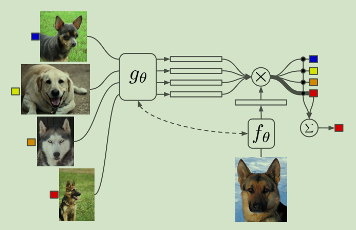
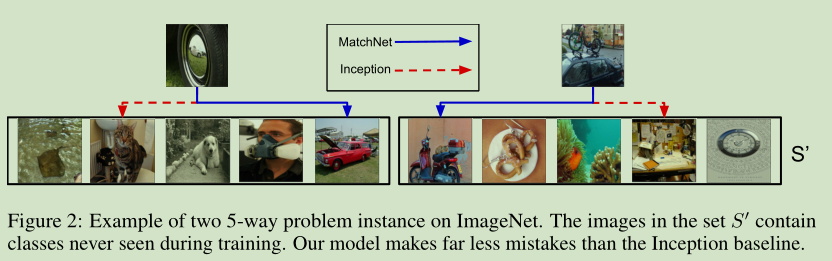
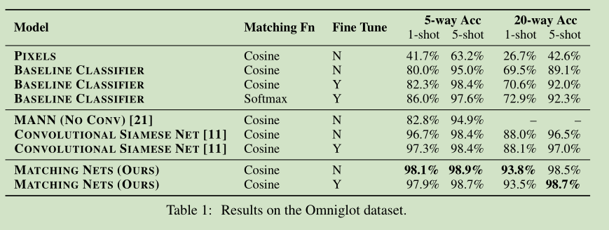
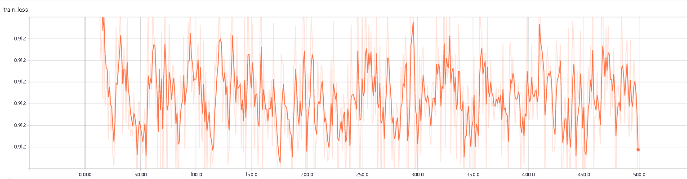
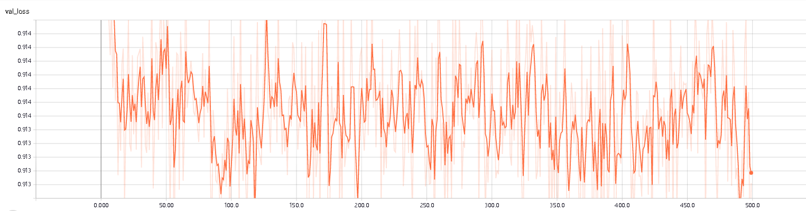
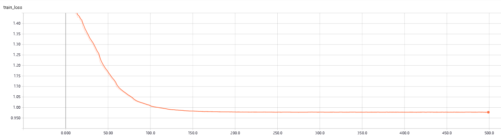
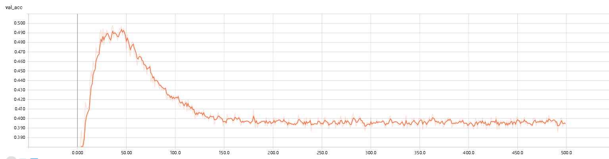

# 《Matching Networks for One Shot Learning》论文笔记及其代码阅读

论文地址：[Matching Networks for One Shot Learning](https://www.baidu.com/link?url=HObrwprNfoECdoWlwa__bIZe_b1ikMCBUZmdWl-8RaguIHBc6Vgm7iFHCocaS0Cf&wd=&eqid=e62747e6000f04aa000000065d764a61)

源代码地址:[MatchNet](https://github.com/gitabcworld/MatchingNetworks)

## 一、介绍

### 1、few-shot learning

&emsp;&emsp;最近的深度学习方法都是基于大量的训练有样本对问题进行有目标的训练来解决特定场景的问题，深度学习本身是为了模仿人的思维方式而设计的但是事实上人对于物体的理解和分辨并不需要大量的可用样本，只需要少量的样本便可以区分出不同物体之间的区别并进行分类识别。因此，根据少量样本的few-shot learning便是朝着这一目标前进的，few-shot相关问题的解决方式有三种：数据、模型和算法。基于数据的方法是通过变换对数据集进行扩充尽量和实际场景相同或借用现在已经存在的大型数据集进行迁移；基于模型的方法则在少量数据的基础上通过对模型的改进来提升模型自身的学习能力来提升算法性能，一般分为多任务学习，嵌入式学习，外部记忆网络学习和生成模型等；基于算法的相关方法则是希望通过学习如何学习或者改变目标参数空间使得算法更容易的寻找到最优解或次优解。

&emsp;&emsp;meta-learning便是基于算法的few-shot learning的解决方案，Matching Network是便是一种meta-learning。

### 2、matching networks

&emsp;&emsp;matching networks并不是某一个单独的网络，而是多个网络的贯序集合具体实现中3~4个左右。Matching networks的主要贡献有两个：

-   Matching Nets。结合现在比较流行的attention结构和记忆网络搭建的快速的学习网络。
-   测试和训练条件匹配的训练方式。因此，为了快速学习训练网络，通过仅显示每个类的几个少量的示例来训练，就像在提供一些新任务的示例时将如何测试，将任务从minibatch切换到minibatch。

## 二、Matching Networks

### 1、网络结构

#### （1）整体结构

&emsp;&emsp;Matching networks的网络结构



&emsp;&emsp;其实仅从网络结构图中查看可能不明所以然，但是从代码中便可以清晰的看到网络的具体结构和细节。（需要注意的是途中显示的彩色图像更准确的来说显示的是如何训练和具体的网络结构没有很直接的关系）

&emsp;&emsp;网络总共分为下面代码所示的四个部分：特征提取网络，记忆网络LSTM，距离度量网络和attetion分类网络。


#### （2）特征提取网络

```python
def convLayer(in_planes, out_planes, useDropout = False):
    "3x3 convolution with padding"
    seq = nn.Sequential(
        nn.Conv2d(in_planes, out_planes, kernel_size=3,
                  stride=1, padding=1, bias=True),
        nn.BatchNorm2d(out_planes),
        nn.ReLU(True),
        nn.MaxPool2d(kernel_size=2, stride=2)
    )
```


```python
		self.layer1 = convLayer(num_channels, layer_size, useDropout)
        self.layer2 = convLayer(layer_size, layer_size, useDropout)
        self.layer3 = convLayer(layer_size, layer_size, useDropout)
        self.layer4 = convLayer(layer_size, layer_size, useDropout)
```

&emsp;&emsp;上面是```self.g```的具体结构，其中layer_size为64。可以看到该网络是简单的四层卷积网络，对输入进行16倍下采样，这部分论文中并没有进行过多的说明，我认为这部分的主要作用便是对数据进行滤波进行特征提取以便后续的网络结构能够从更加干净的数据中学习到有用的信息。另外需要注意的是网络中并没有f相关的描述，但是从代码层面上看，f使用的是和g相同的网络结构。

#### （3）记忆网络

&emsp;&emsp;记忆网络部分即使简单的LSTM，这部分网络对得到对经过特征提取网络过滤的输出进一步的进行处理得到相应的domain instrests。

```python
        self.lstm = nn.LSTM(input_size=self.vector_dim,
                            num_layers=self.num_layers,
                            hidden_size=self.hidden_size,
                            bidirectional=True)
```

#### （4）距离度量网络

&emsp;&emsp;这部分准确的来说并不是一个网络结构，而是简单的余弦距离，如下代码所示。可能作者认为这部分可以使用一个具体的网络结构进行替换来达到类似的效果。

```python
for support_image in support_set:
            sum_support = torch.sum(torch.pow(support_image, 2), 1)     #平方和
            support_magnitude = sum_support.clamp(eps, float("inf")).rsqrt()        #平方根
            dot_product = input_image.unsqueeze(1).bmm(support_image.unsqueeze(2)).squeeze()
            cosine_similarity = dot_product * support_magnitude
            similarities.append(cosine_similarity)      #余弦距离
        similarities = torch.stack(similarities)
        return similarities
```

#### （5）attention模块

&emsp;&emsp;attention模块中采用的就是简单的softmax层结构:

```python
        softmax = nn.Softmax()
        softmax_similarities = softmax(similarities)
        preds = softmax_similarities.unsqueeze(1)
        preds = preds.bmm(support_set_y)
        preds = preds.squeeze()
        return preds
```

### 2、其他细节

#### （1）matching net的数学表示

&emsp;&emsp;从上面的网络结构图中可以看出左边四张图像和下方的一张图像，其中四张图像便是一个support set，1张图像是测试样例，二者一个support set和一个测试样例便是一个task。模型训练的过程中会将单个support set和一个测试样例作为输入同时进行特征提取，之后通过记忆网络进一步处理，再之后通过距离度量和attention模块得到最终的预测值。

&emsp;&emsp;整个模型通过测试样例和support set学习概率分布
$$
P(\hat{y} | \hat{x}, S)
$$
其中S是一个support set,x是测试样例，y是预测值。
$$
S=\left\{\left(x_{i}, y_{i}\right)\right\}_{i=1}^{k}
$$
整个模型可以表示为:
$$
\hat{y}=\sum_{i=1}^{k} a\left(\hat{x}, x_{i}\right) y_{i}
$$
&emsp;预测值y被看做是support set中样本的labels的线性组合，组合的权重是test example和support set中1个样本的关系——a(xˆ,xi)。其中a是一个通过某种距离度量的注意力机制，因此a取不同的形式整个网络结构会体现出不同的近似结构：

-   若a作为一个核函数，则模型近似于使用dnn做嵌入层，kde做分类层；
-   若a为一个0-1函数，则模型近似于dnn做嵌入层，knn做分类层。

#### （2）attention kernel

&emsp;&emsp;attention kernel采用的是cos距离上的softmax，可以从具体实现代码中看到模型实现经这两部分拆分为distancenetwork和attention。
$$
a\left(\hat{x}, x_{i}\right)=e^{c\left(f(\hat{x}), g\left(x_{i}\right)\right)} / \sum_{j=1}^{k} e^{c\left(f(\hat{x}), g\left(x_{j}\right)\right)}
$$
&emsp;&emsp;其中f和g函数可以是任意的嵌入函数，实际实现中可以使用dnn网络实现，而作者的代码实现中采用了四层卷积网络。

#### （3）上下文嵌入

&emsp;&emsp;在通过嵌入函数f和g处理后，输出再次经过循环神经记忆网络来进一步的加强context和个体之间的关系。
$$
f(\hat{x}, S)=\operatorname{attLSTM}\left(f^{\prime}(\hat{x}), g(S), K\right)
$$
其中g和f形同上面的描述的嵌入函数，S便是相关的context，x为特例，K为网络的timesteps。



### 3、训练方式

-   一个support set包含多个样本，support set中只有一个样本和测试样例同类别；

-   一个task是一个support和一个测试样例；
-   一个batch包含多个task；
-   训练Omniglot过程中并未使用LSTM，而miniImagenet使用了LSTM；
-   学习率以如下方式进行更新。


## 三、实验结果

### 1、论文中的结果




### 2、实验复现结果

&emsp;&emsp;训练采用的是论文代码的默认值。

#### 1、Omniglot

&emsp;&emsp;这个的结果还好，收敛的很快，后面的训练基本都是无用功。







#### 2、miniImagenet

&emsp;&emsp;这个可以明显的看到网络的准确率不是很高，而且验证集的loss和准确率本身就很无语，后面明显的过拟合了。







