# 《Bag of Tricks for Image Classification with Convolutional Neural Networks》论文阅读笔记
&emsp;&emsp;论文地址:[Bag of Tricks for Image Classification with Convolutional Neural Networks](https://arxiv.org/abs/1812.01187)
[toc]

## 一、简介
&emsp;&emsp;这篇文章旨在对当下深度学习方面不同网络不同测tricks对最终在ImageNet上的性能上的影响进行对比。当前使用的是ResNet-50网络，当然会对不同的网络进行对比，但是不同的tricks会使用相同的网络进行ResNet-50。下图为最终的网络结果：
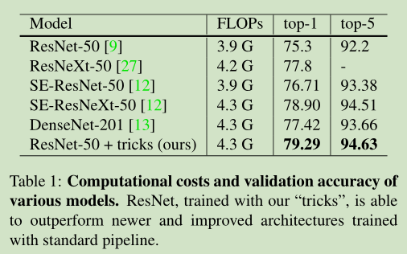

## 二、实验设置
&emsp;&emsp;为了控制变量，能够更有效地看到不同tricks的具体效用，因此有必要设置一些baseline进行对比试验。
### 1、Baseline
#### 1)、Baseline设置
&emsp;&emsp;训练采用的基本算法如下,就是普通的批量随机梯度下降算法：
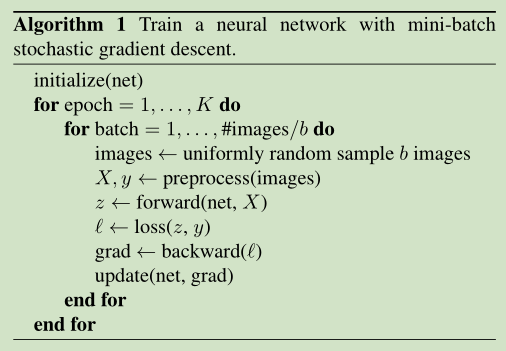
&emsp;&emsp;实验采用的基本模型为ResNet，在实验中会按如下方式一步步添加tricks:
- 1. 随机采样图像并将其解码为[0，255]中的32位浮点原始像素值;
- 2. 随机裁剪长宽比以[3/4，4/3]随机采样的矩形区域，以[8％，100％]随机采样的区域，然后将裁剪的区域调整为224 x 224的正方形图像;
- 3. 以0.5的概率水平翻转;
- 4. 比例色相，饱和度和亮度，其系数均由[0.6，1.4]统一得出;
- 5. 加上从正态分布N（0，0.1）采样的系数的PCA噪声;
- 6. 通过分别减去123.68、116.779、103.939并除以58.393、57.12、57.375来标准化RGB通道。

&emsp;&emsp;验证期间，将每张图片的较短边缘调整为256个像素，同时保持其宽高比。接下来，我们裁剪中心的224 x 224区域并标准化类似于训练的RGB通道。验证期间，我们不会执行任何随机扩充。
&emsp;&emsp;卷积层和完全连接层的权重均使用Xavier算法[6]进行初始化。特别是，我们将参数设置为从$[-a，a]$均匀得出的随机值，其中$a=\sqrt{6 /（d_{in} + d_{out}）}$。此处d_{in}和d_{out}分别是输入和输出通道的大小。所有bias都初始化为0。对于批归一化层，γ向量初始化为1，β向量初始化为0。
&emsp;&emsp;Nesterov加速梯度（NAG）下降[20]用于训练。每个模型在8个Nvidia V100 GPU上进行了120个epoch的训练，batch size为256。学习率被初始化为0.1，并在第30、60和90个epoch除以10。
#### 2)、Baseline实验结果
&emsp;&emsp;ResNet-50,Inception-V3,MobileNet在ImageNet上的结果如下图:
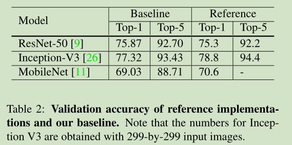

### 2、加速训练的方式
#### 1)、大批量训练
&emsp;&emsp;通常认为打的batch size会导致单词训练时间过长，网络性能下降等缺陷，但是小批量会导致local bathc的数据分布和原始数据差距过大而影响性能，因此这里提到的方式是为了在单机上保证网络的性能的同时提高batch size。
##### 线性缩放学习率
&emsp;&emsp;在小批量SGD中，梯度下降是一个随机过程，因为在每个批次中都是随机选择示例。增加批次大小不会改变随机梯度的期望，但会减小其方差。换句话说，大批量可以减少梯度中的噪声，因此我们可以提高学习率，从而沿着梯度方向的相反方向获得更大的进展。对于ResNet-50训练，根据批次大小线性增加学习率是有效的。baseline批量大小256选择0.1作为初始学习率，然后当更改为更大的批量$b$时，我们会将初始学习率提高到$0.1×b / 256$
##### 学习率warmup
&emsp;&emsp;在训练开始时，所有参数通常都是随机值，因此远离最终解。使用太大的学习率可能会导致数值不稳定。在warmp-up方法中，在开始时使用小的学习率，然后在训练过程稳定时切换回初始学习率。warmup将学习率从0线性增加到初始学习率。换句话说，假设将使用前m个批次（例如5个数据epoch）进行预热，并且初始学习速率为$η$，则在第i批次，$1≤i≤m$，我们将学习速率设为$iη/ m$。
##### 部分γ置0
&emsp;&emsp;ResNet网络由多个残差块组成，每个块由几个卷积层组成。给定输入$x$，假定block（x）是该块中最后一层的输出，则此剩余块将输出$x + block（x）$。注意，块的最后一层可以是批归一化（BN）层。BN层首先标准化其输入，用$\hat{x}$表示，然后执行比例变换$γ\hat{x} +β$。γ和β都是可学习的参数，其元素分别初始化为1s和0s。在零γ初始化试探法中，对位于残差块末尾的所有BN层初始化γ= 0。因此，所有残差块仅返回其输入，模拟了具有较少层数且在初始阶段更易于训练的网络。
##### 无bias衰减
&emsp;&emsp;权重衰减通常应用于所有可学习的参数，包括权重和偏差。等同于对所有参数应用L2正则化，以将其值逼近0。但是有文章表示建议仅对权重应用正则化，以避免过拟合。无偏差衰减试探法遵循此建议，它仅将权重衰减应用于卷积层和完全连接层中的权重。其他参数，包括BN层中的bias以及γ和β，均未调整。
&emsp;&emsp;注意，LARS提供了分层的自适应学习率，据报道对于非常大的批处理大小（超过16K）有效。虽然在文中，限于适用于单机培训的方法，但在这种情况下，不超过2K的批量通常会带来良好的系统效率。

#### 2)、低精度训练
&emsp;&emsp;神经网络通常以32位浮点（FP32）精度进行训练。也就是说，所有数字都以FP32格式存储，算术运算的输入和输出也都是FP32数字。但是，新硬件可能具有用于较低精度数据类型的增强型算术逻辑单元。例如，先前提到的Nvidia V100在FP32中提供14 TFLOPS，但在FP16中提供100 TFLOPS。如表3所示，从V100上的FP32切换到FP16后，总体训练速度提高了2到3倍。
&emsp;&emsp;尽管有性能上的好处，但降低的精度会导致范围变窄，从而使结果更可能超出范围，进而干扰训练进度。Micikevicius等,提出将所有参数和激活存储在FP16中，并使用FP16计算梯度。同时，所有参数在FP32中都有一个副本，用于参数更新。另外，将标量乘以损耗以更好地将梯度范围对准FP16也是一种可行的解决方案。

#### 3)、实验结果
&emsp;&emsp;加速之后性能上并未下降但是速度上基本上是原来的2-3倍。
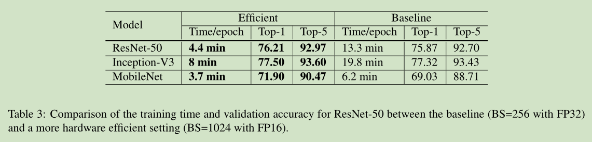
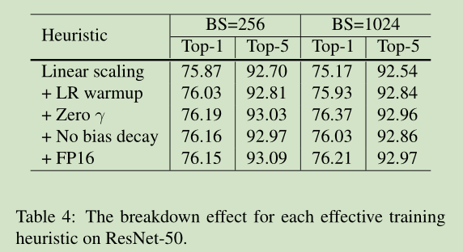

## 三、模型调整
&emsp;&emsp;模型调整是对网络体系结构的微小调整，例如更改特定卷积层的跨度。这种调整通常几乎不会改变计算的复杂性，但对模型准确性的影响却不可忽略。在本节中，将以ResNet为例研究模型调整的效果。
### 1、ResNet网络架构
&emsp;&emsp;ResNet的网络结构如下所示,网络的机构不做过多的说明结构很明显主要是四个stage组成，每个stage第一个是一个下采样的残差块，后面紧跟多个残差。:
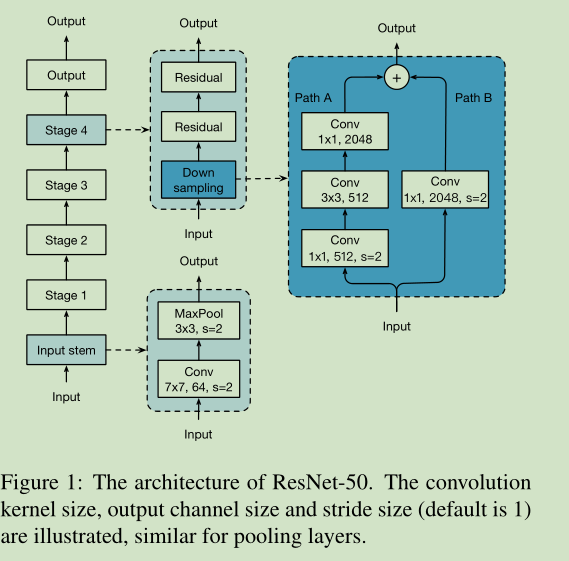

### 2、ResNet网络调整
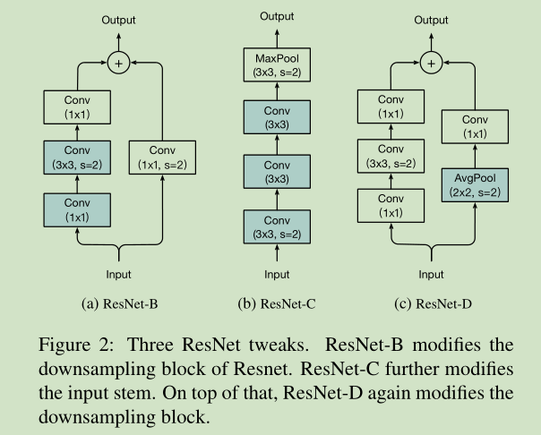
#### 1)、ResNet-B
&emsp;&emsp;ResNet-B更改了ResNet的下采样块。路径A中的卷积忽略了输入特征图的四分之三，因为它使用的内核大小为1×1，步幅为2。ResNet-B切换路径A中前两个卷积的步幅大小，如图所示，因此不会忽略任何信息。由于第二次卷积的核大小为3×3，因此路径A的输出形状保持不变
#### 2)、ResNet-C
&emsp;&emsp;此调整最初是在Inception-v2中提出的，实际上应该是VGG。观察发现，卷积的计算成本是核宽度或高度的平方。7×7卷积比3×3卷积贵5.4倍。因此，此调整用三个保守的3×3卷积代替了输入主干中的7×7卷积，如图2b所示，第一个和第二个卷积的输出通道为32，步幅为2，最后一个为2卷积使用64输出通道。
#### 3)、ResNet-D
&emsp;&emsp;受ResNet-B的启发，我们注意到下采样块路径B中的1×1卷积也忽略了3/4个输入特征图，想对其进行修改，因此不会忽略任何信息。根据经验，发现在卷积之前添加一个跨度为2的2×2平均池化层（其跨度更改为1）在实践中效果很好，并且对计算成本的影响很小。
### 3、实验结果
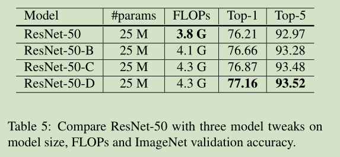

## 四、训练细化
### 1、Cosine Learning Rate Decay
&emsp;&emsp;一个简化的版本通过遵循余弦函数将学习率从初始值降低到0。假设批次总数为T（忽略预热阶段），则在批次t处，学习率ηt计算为：
$$
\eta_t=\frac{1}{2}(1+cos(\frac{t\pi}{T}))\eta
$$
&emsp;&emsp;$\eta$为原始学习率。使用cosine学习率衰减的效果如下图：

### 2、Label Smoothing
&emsp;&emsp;通常分类任务中，都是将网络的输出经过全连接层之后使用softmax将输出变成概率。假设该图像的真实标签为$y$，则可以将$i = y$的真概率分布构造为$p_i = 1$，否则将其构造为0。在训练期间，最小化负交叉熵损失以更新模型参数，以使这两个概率分布彼此相似。特别是，通过构造$p$的方式，一个$\ell(p,q)=-logp_y=-z_y+log(\sum_{i=1}^{K}exp(z_i))$。最优解是使得$z_y^{*}=inf$足够小。换句话说，它鼓励输出得分显着独特，这可能导致过度拟合。最初提出标签平滑的思想是训练Inception-v2，它将真实概率的构造更改为 
$$
q_i=\left\{\begin{array}{ll}1-\epsilon,如果 i=y,\\  \epsilon /(K-1), otherwise\end{array}\right.
$$
&emsp;&emsp;其中$\epsilon$是一个很小的数那么现在优化的目标就变成：
$$
z_i^{*}=\left\{\begin{array}{ll}log((K-1)(1-\epsilon)/\epsilon),如果 i=y,\\  \alpha, otherwise\end{array}\right.
$$
&emsp;&emsp;其中α可以是任意实数。这鼓励从全连接层层中有限输出，并且可以更好地推广。
当ε= 0时，间隙$log((K-1)(1-\epsilon)/\epsilon)$为∞，并且随着ε的增加，间隙减小。具体来说，当$ε=（K − 1）/ K$时，所有最佳$z_i^{*}$都相同。下图显示了给定ImageNet数据集的K = 1000时，间隙随着我们移动ε的变化。
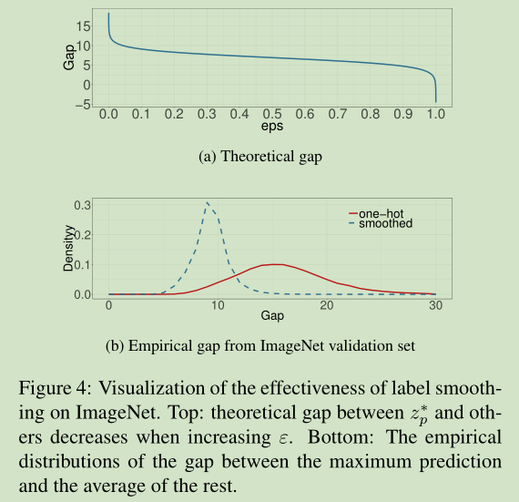

### 3、Knowledge Distillation
&emsp;&emsp;我们使用教师模型来帮助训练当前模型，即学生模型。教师模型通常是具有较高准确性的预训练模型，因此，通过模仿，学生模型可以提高自己的准确性，同时保持模型复杂性不变。一个示例是使用ResNet-152作为教师模型来帮助培训ResNet-50。
在训练过程中，我们增加了蒸馏损失，以惩罚教师模型和学习者模型的softmax输出之间的差异。给定输入，假设p是真实的概率分布，z和r分别是学生模型和教师模型的最后一个完全连接层的输出。请记住，之前我们使用负交叉熵损失‘$(p，softmax(z))$来测量p和z之间的差，这里我们再次使用相同的损失进行蒸馏。因此，损失更改为 
$$
\ell(p,softmax(z))+T^2\ell(softmax(\frac{r}{T}),softmax(\frac{z}{T}))
$$
&emsp;&emsp;其中T是使hypermax输出更加平滑的温度超参数，因此可以从老师的预测中提取标签分配的知识。
### 4、Mixup Training
&emsp;&emsp;在Mixup中将两个样本$(x_i,y_i)和(x_j,y_j)$合并为一个新的类别:
$$
\begin{aligned}
    \hat{x}=\lambda x_i+(1-\lambda)x_j \\
    \hat{y}=\lambda y_i+(1-\lambda)y_j
\end{aligned}
$$
&emsp;&emsp;$\lambda \in [0,1]$是一个随机的beta分布的数字，训练期间只使用$(\hat{x}, \hat{y})$

### 5、实验结果
&emsp;&emsp;训练期间设置$\epsilon=0.1,T=20$，mixup中使用分布为Beta(0.2,0.2),分别在不同任务上进行测试：
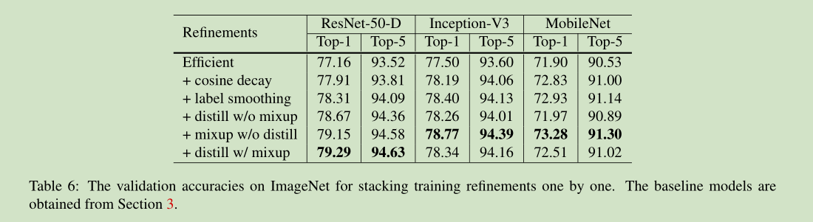

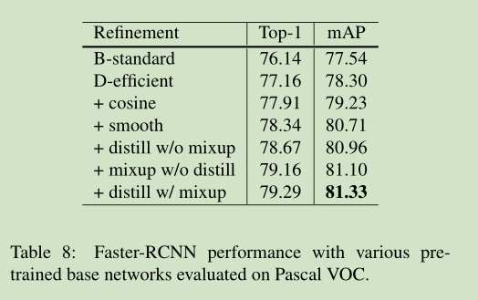
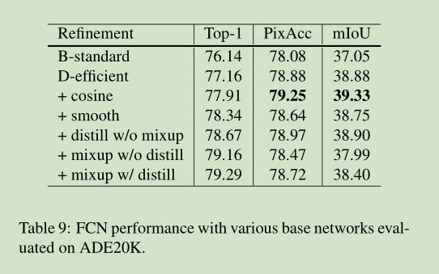