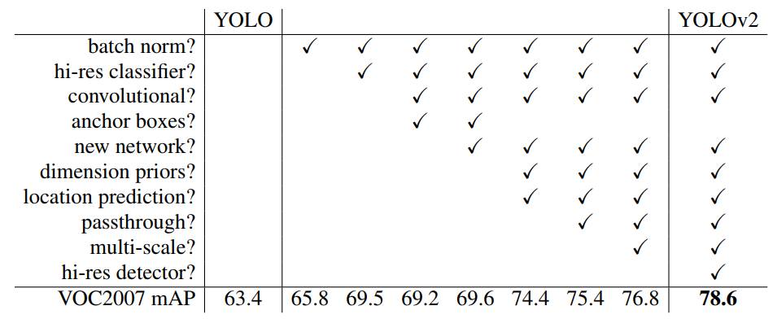
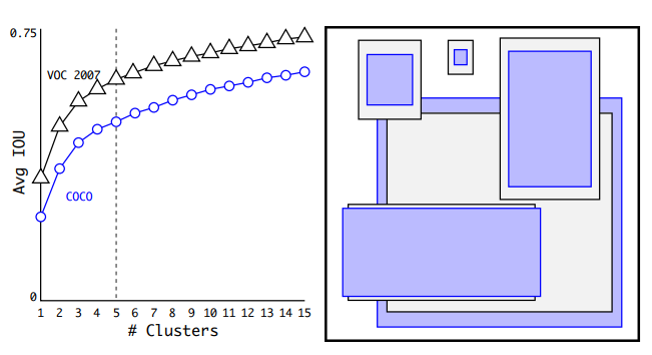
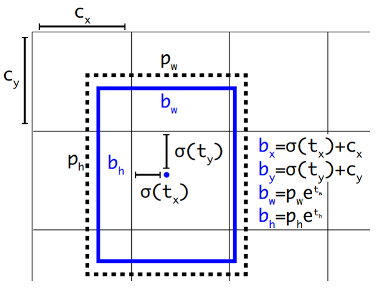
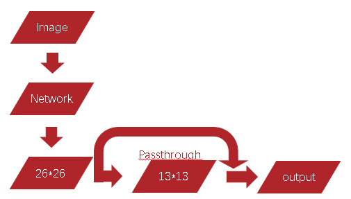
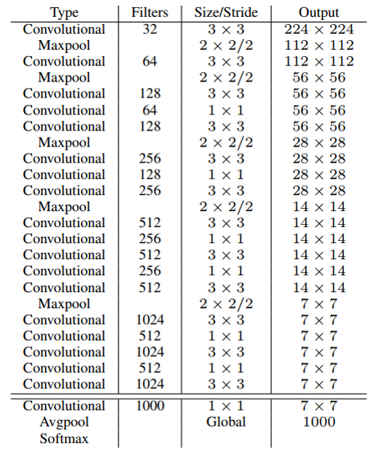

# YOLOV2

[TOC]

## 一、简介

&emsp;&emsp;yolo-v2是基于yolo-v1进行改进的更快准确率更高的实时目标检测算法，而且其分类网络yolo9000如起名所示能够分类检测多达200个类别9000个标签，相比于大多数分类算法来说也算是一个不小的突破。yolo-v2的改进是基于近几年的一下深度学习算法研究的一些改进算法从v1版本不断改进得到了，从论文中也可以明显的看到其改进的过程。下面详细说明。[yolov2论文](<https://arxiv.org/abs/1612.08242>)

## 二、yolov2具体改进

&emsp;&emsp;YOLOV1的主要缺陷是相比于之前的目标检测算法其检测精度和准确率并没有特别出彩的地方，会有更多的定位损失而且本身无法区分相距比较近切有重叠的物体。YOLOV2也是基于这些缺点着重进行改进的，其主要使用了一些特别的训练过程，参考了Faster RCNN的一些anchor box的算法，Inception-v2中提到的BN层等方法进行改进，下图便是其改进历程与相应的效果：



### 1、Batch Normalization

> &emsp;&emsp;Internal covariate shift：深度学习假设的前提是源空间和目的空间分布的一致性，而深度学习在不同层次之间训练的时候，数据分布是不断改变的，导致每一层都是在学习新的分布。

&emsp;&emsp;Batch Normalization是[Inception-v2](https://arxiv.org/pdf/1502.03167v3.pdf)提出来的，其最初的目的是解决Internal covariate shift问题,而相关于BN层是否解决了该问题好像存疑。如果对BN层原理解释有兴趣可以阅读Inception-v2的论文和相关研究BN层的论文，这里不做过多赘述。如果仅关注实验效果可以明确的是BN的确解决了反向传播过程中的梯度弥散和消失问题。下图为BN的实现算法，可以明显的看到BN是将输入数据进行归一化并加入了一定的偏移来保证其本身的泛化和非线性能力。


&emsp;&emsp;如下图为softmax的函数图象，可以看到sigmod函数本身存在的问题是当输入数据出入饱和区即函数值接近于0和1的位置时，训练时梯度将为0网络将无法更深一步的进行更新权重进行调整，而导致无法训练。BN层如果简单的使用标准正态分布那么数据分布就会集中于图像中的B段，这样激活函数近乎于一个线性函数，而激活函数是一个线性函数的情况下神经网络本身就不具备非线性能力，也就和单层感知机类似。因此加入两个超参数$\beta$和$\gamma$让数据处于A和C区来保证其的非线性能力，而$\epsilon$是为了防止除0出现异常，一般选取非常小的值。还有另一个问题需要思考的是现如今sigmod很少做为主干网络的激活函数，而选择RELU代替那么BN层是否还保存其特性。结论是有，但没有sigmod那么明显的提升，具体细节可以参考这篇文章[BN层对比实验](<https://mp.weixin.qq.com/s?__biz=MzUyMjE2MTE0Mw==&mid=2247487887&idx=1&sn=7b13cccaddd0b3b6a8ae3a6f37d817b6&chksm=f9d14f17cea6c6017a455a0cf4e7bf580c4566aedc7c451d321042eff196882f474f99ca4929&mpshare=1&scene=1&srcid=0530UfyUX1lLBd9GzHwe1iNr&key=e48b29212bec5a9407e764757d3aa0525ef23cb13cab22a30046ede911179d1ba318cc0dbfd8153d61bfca46d512a9295e7eec6a55de5f6a017544317b4cdd05223b43719218cf89896c4100bcc88956&ascene=1&uin=MTI5MzE4NDMwOQ%3D%3D&devicetype=Windows+10&version=62060739&lang=zh_CN&pass_ticket=4xG4NLhslZ%2BD80XdSFuaSzdA%2Fkkvytz3p03ipKFIYdRLiz6c1aAh4eeo8kKyQe6J>)。


&emsp;&emsp;第一步的提升便是使用BN层简化了训练提高了训练速度，加强了泛化能力，最终的实验结果mAP提升了2.4%个点。

### 2、高分辨率的分类器


&emsp;&emsp;之前的神经网络的输入图像都比较小，LeNet是32*32，AlexNet是256\*256,GoogleNet和YOLOV1是224\*224，这都会导致图像在缩小的同时丢失很多细节，而YOLO-V2采用了更高的分辨率图像，这在识别时可以保存更多的细节内容。

&emsp;&emsp;YOLOV2的具体做法分为两步:

1. 在ImageNet上使用448\*448的图像fine tune 10个epoch的分类网络,让网络适应高分辨率图像；
2. 之后再fine tune识别网络。

&emsp;&emsp;这一项的改进使得mAP提升了%4的点。

### 3、Anchor box

&emsp;&emsp;Yolo-V1存在一个明显的问题是整个网络会生成7\*7\*2=98个框，这基本意味着最终的目标的框只能从这些框中调整得出，而这必定会遗漏掉重叠目标，这也是yolo-v1的缺陷之一。YOLOV2的一个改进就是采用Anchro Box，在每个网格上有9个Anchor Box,减少目标的丢失。具体做法便是移除了yolov1的全连接层代替以Anchor box进行目标bonding box的预测。


&emsp;&emsp;其他一些改变有，移除一层pooling层来保证最后生成的feature map具有更高的像素包含更多的信息。将原来的输入448\*448修改为416\*416保证输出的feature map是奇数的即13*13,这样做的意义是一般图像的目标大概率处于图像的中心位置，当feature map为基数时最后负责检测该目标的grid便是中心的一个grid而不会是中心的四个grid这样可以加快速度。

&emsp;&emsp;基于以上的改进后yolo-v2最后会生成13\*13\*9=1521个bonding box，相比于yolov1的98个多的多。最后的结果是mAP降低了0.3的点，召回率从81%提升到88%，这也是相当不错的。

### 4、簇聚类

&emsp;&emsp;上一小结说过了Yolo-v2改用Anchor box进行bonding box的预测，而这些Anchor Box的形状如何确定也是个问题。Faster RCNN是手工挑选的Anchor Box，而Yolo-v2改用k-means聚类算法自动的进行挑选。然而聚类的一个关键就是距离，一般都会采用欧氏距离或者哈夫曼距离，但是这里是为了挑选更好的Anchor box，因此，yolo-v2采用下面的函数来做距离度量来取得IOU更高的框。

&emsp;&emsp;$d(box, centorid)=1-IOU(box,centroid)$

&emsp;&emsp;下图便是Yolov2在VOC和COCO数据集上进行实验所得到的框集合。可以看到大部分的框是高大于宽的。



&emsp;&emsp;下图是采用不同的选择算法挑选出的Anchor box的IOU对比，很明显的看到聚类簇提升了相关的IOU值：


&emsp;&emsp;关于K-means算法简单说下，其基本步骤如下:

```c++
选取k个初始质心（作为初始cluster）； 
repeat： 
	对每个样本点，计算得到距其最近的质心，将其类别标为该质心所对应的cluster； 
	重新计算k个cluser对应的质心； 
until 质心不再发生变化

```

### 5、直接定位预测

&emsp;&emsp;如果直接采用Anchor Box进行预测的一个问题就是在原来的更新规则$\lbrace x=(t_x*w_a)-x_a\\y=(t_y*h_a)-y_a\rbrace$上，如果最开始以一个随机的初始化，在训练时bonding box在调整过程中可能会移动到图像的任何位置会导致模型达到稳定需要很长的时间，而这和初衷不符合。因此yolo-v2在预测时采用sigmod函数将数值限制在[0-1]之间保证定位不会超出该grid。在实际操作时是每个grid预测5个bonding box(k-means得到的结果)，每个bonding box预测五个值($t_x,t_y,t_w,t_h,t_0$)，而具体的图片上相应值如下图。



**注释：**

1. $(t_x,t_y,t_w,t_h,t_0)$分别为预测的使用sigmod处理过的坐标，长宽和置信度；
2. $(c_x,c_y)$为bonding box所属cell的左上角的坐标；
3. $(b_x,b_y)$为bonding box的中心点；
4. $(p_w,p_h)$为先验框的长宽；
5. $(b_w,b_h)$为预测框的长宽。

&emsp;&emsp;对目标框的改进使得mAP提升了5.2%个点

### 6、细粒度的特征

&emsp;&emsp;到目前改进的模型最终输出的feature map是13\*13的，这个大小对于检测大物体基本没有障碍但是对检测小目标来说实在是很困难，这也是yolo-v1的问题之一。yolo-v2改进的地方就是在26\*26的feature map的地方添加了一个直通层(passthrough)，将26\*26\*512和13\*13\*2048的feature map结合起来增加模型的表现力。这个改进使得mAP提升了1%。



### 7、多尺度训练

&emsp;&emsp;yolov2为了增强模型的robust性还采用了多尺度训练，基本步骤是：每10个batch，模型在{320,352,...608}这些尺寸中随机选择一个尺寸进行训练。这里采用32作为训练图像尺寸间隔的原因是因为模型最终输出的feature map是相对于原图缩小了32倍，这样能够保证最后能够准确的得到相应的特征图。

&emsp;&emsp;下表显示了不同尺度和之前的算法的对比：


### 8、Darknet-19

&emsp;&emsp;yolo-v1采用的模型结构是基于googlenet改进的24层网络，而yolov2采用的是借鉴了VGG和NIN的darknet-19.从模型结构中可以看到首先是第一层的7\*7换成了多层3\*3代替然后是中间的卷积层减少了，最后提出了全连接层用全局平均池化代替，可以大幅度的减少参数。



## 三、yolov2损失函数


&emsp;&emsp;上面试yolov2的损失函数，每一项的具体含义如图所示：

1. 第一项区分出背景和物体，如果bonding box小于门限值就视为背景；
2. 第二项在12800代之前起作用，主要用来调这个anchor box，虽然使用k-means生成了一部分的anchor box但是这里还是进一步进行了调整；
3. 第三项调整预测出来的bonding box；
4. 第四项使得预测出来的bonding box更偏向于IOU比较大的；
5. 第五项是分类损失

&emsp;&emsp;图中每个元素的意义如下所示(从左到右，从上到下)：

1. W,H,A分别是feature map的宽高和Anchor box的数量；
2. $1_{MaxIOU < Thresh}$是一个0，1函数表示为超过门限值IOU的bonding box等于1，否则为0；Thresh为门限值，$\lambda_{noobj}$是这项损失的权重，$b^o_{ijk}$是预测出来的bonding box;
3. $1_{t<12800}$表示只在12800代之前进行调整,$\lambda_{prior}$是选择anchor box的权重，r是下x，y，w，h其中一个值，这里的损失计算不像前几项把bonding box的参数作为一个整体进行向量计算这里拆分开来了，$prior^r$为anchor box对应的r值，$b^r_{ijk}$为当前预测的bonding box的r值；
4. $\lambda_{coord}$是bonding box预测的权重，$truth^r$是ground truth对应的r值；
5. $\lambda_{obj}$为目标IOU的权重，$IOU^k_{truth}$为当前anchor box与ground truth的IOU
6. $\lambda_{class}$为目标分类的权重，C为类别数量，$truth^c$为ground truth的类别，$b^c_{ijk}$为该bond box的类别。

## 四、YOLO9000

&emsp;&emsp;YOLO9000是基于yolov2的一个分类网络，其特点是能够分类9000类，相比于传统的分类网络其分类的数量也算是一个突破。YOLO9000中提出的一个特别的训练方法叫做分类和识别级联训练(Joint classification and detection),作者提出这个的原因是当前应用中分类和识别的数据量不对等，分类数据标注的成本相对比较低，甚至于在互联网上的数据很多本身自带标签，而识别就不同基本上一定需要进行手工标注的，这就导致识别很难获得大量的数据。而yolo的分类和检测本身互相并没有太大的关联性，因此作者使用Image和COCO数据集联合训练来提升网络的性能。

&emsp;&emsp;但有个问题是ImageNe和COCO的类别是有交集的因此作者提出了一个层级分类（Hierarchical classification）方法，利用对Image和COCO的类标利用WordNet建立WordTree来表达不同类别之间的从属关系，比如woman和man的父节点就是person，类似这种关系，下图是作者建立的WordTree。可以明显的看到不同类别之间的从属关系还是比较明确的。


&emsp;&emsp;这样最后训练的时候只会得到叶子结点的分类概率，如果需要知道某个非叶子节点的概率值利用贝叶斯便计算路径上的类别概率的乘积便可得出出相应的概率值。如下图同意从属关系的类别概率排列是很有规律的，最后计算类别概率也不会太麻烦。


&emsp;&emsp;关于作者提出的联合训练，我的一个看法是即便是分类还是识别任务而这在特征提取阶段都是相同的不同的只是后续的目标任务，利用这种特点也许是这个方法能够成功的原因之一。

## 五、结果

&emsp;&emsp;下面两张图是yolov2在VOC2012数据集上和COCO数据集上和其他的一些目标检测算法的分类错误率和其他一些信息的对比图。


## 六、其他

&emsp;&emsp;下面的内容是论文中提到的，我不确定有没有必要，就简单翻译了下:

### 1、分类训练

&emsp;&emsp;我们使用随机梯度下降训练网络在标准的ImageNet 1000类分类数据集上进行160个epoch，起始学习率为0.1，多项式速率衰减，功率为4，权重衰减为0.0005，动量为0.9 使用Darknet神经网络框架。在训练中,我们使用标准数据增强技巧，包括随机裁剪，旋转和色调，饱和度和曝光变化。
&emsp;&emsp;如上所述，在我们对224×224的图像进行初步培训后，我们以更大的尺寸448对网络进行微调。对于这种微调，我们使用上述参数进行训练，但仅限10个时期，并以0.001的学习速率开始。在这种更高的分辨率下，我们的网络可实现76.5％的前1精度和93.3％的top-5精度。

### 2、检测训练

&emsp;&emsp;我们通过删除最后一个卷积层来修改这个网络以进行检测，并且在三个3×3卷积层上添加1024个滤波器，然后是最后的1×1卷积层，其中包含我们需要检测的输出数量。对于VOC，我们预测5个box，每个box有5个坐标，每个box 20个类别，所以5*(5+25)125个过滤器。我们还从最终的3×3×512层到倒数第二个卷积层添加了一个直通层，这样我们的模型就可以使用细粒度特征。
&emsp;&emsp;我们训练网络160个时期，起始学习率为0.001，在60和90 epoch除以10。我们使用0.0005的重量衰减和0.9的动量。我们使用类似的数据增加到YOLO和SSD随机裁剪，色移等。我们对COCO和VOC使用相同的训练策略。


