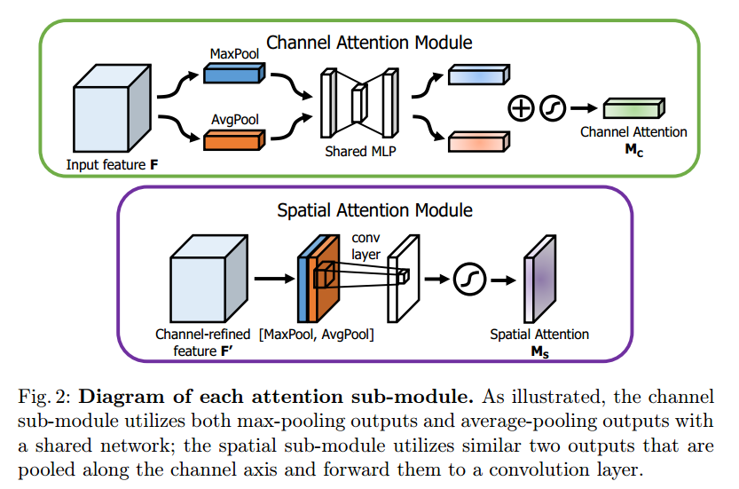
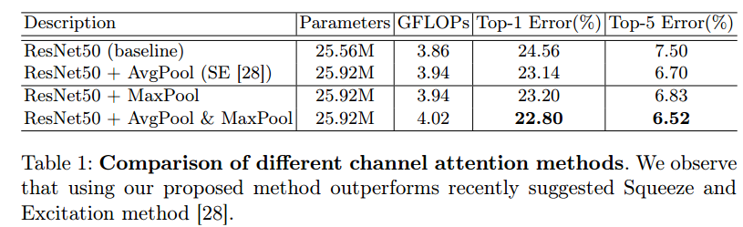
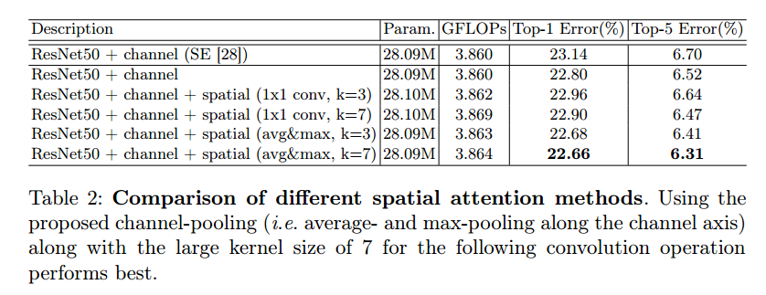
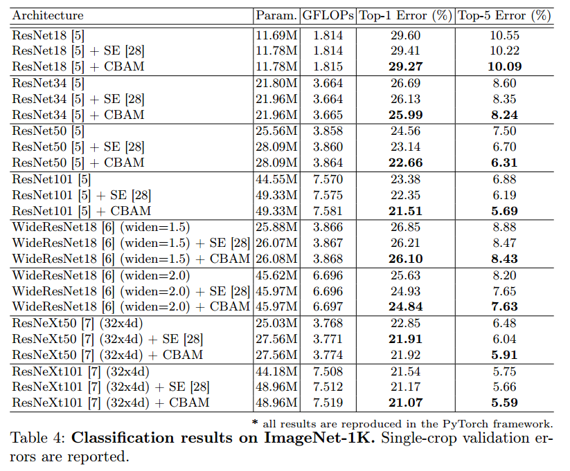
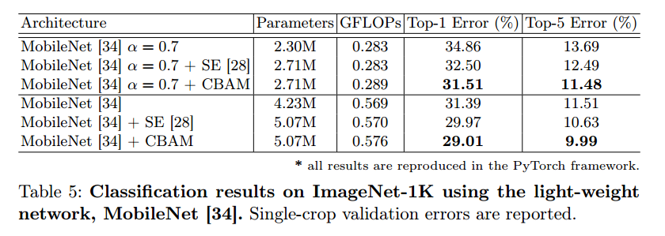
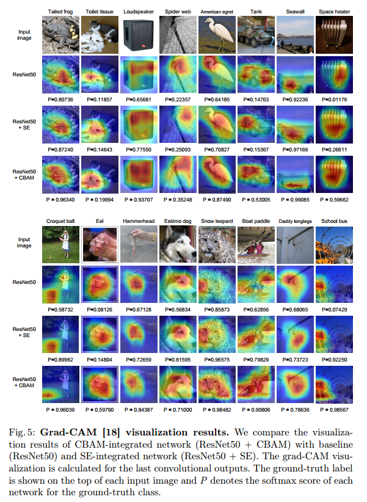
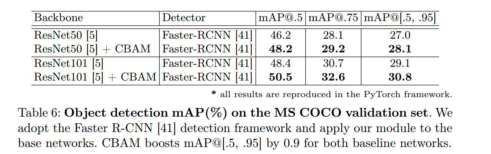
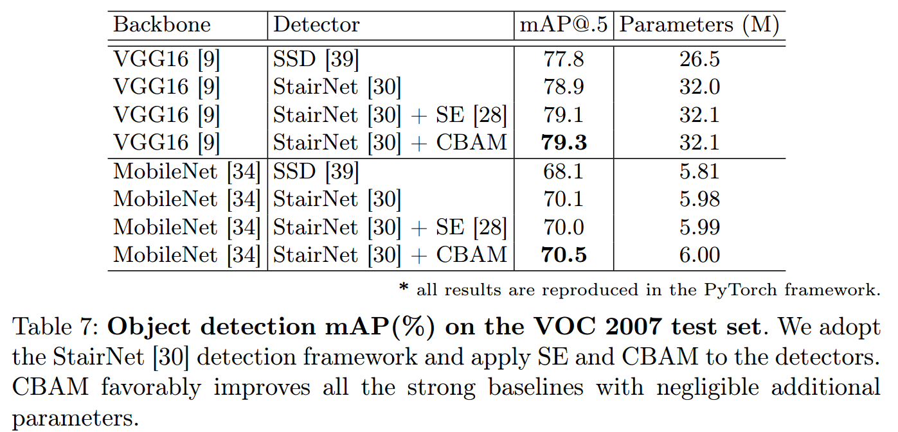

# 《CBAM: Convolutional Block Attention Module》论文阅读
&emsp;&emsp;论文地址：[CBAM: Convolutional Block Attention Module](https://arxiv.org/abs/1807.06521)
&emsp;&emsp;代码地址：[github](https://github.com/luuuyi/CBAM.PyTorch/blob/master/model/resnet_cbam.py)
[toc]

# 1. 简介
&emsp;&emsp;本文提出了一个CBAM注意力机制模块，和SEBlock不同的地方是CBAM多了一个空间注意力模块，通道注意力部分和SEBlock很像只是稍微改进了一下。


# 2. 结构
## 2.1 CBAM结构

### 2.1.1 Channel-Wise Attention
&emsp;&emsp;通道注意力部分可以从图中看到基本和SEBlock相同，只是加了一个分支Maxpooling，中间共享一个mlp，最后将两部分的输出相加经过sigmoid。
$$
M_c(F)=\sigma(MLP(AvgPool(F)) + MLP(MaxPool(F)))=\sigma(W_1(W_0(F_{avg}^c))+W_1(W_0(F^c_{max})))
$$
&emsp;&emsp;其中$W_0\in R^{\frac{C}{r*C}},W_1\in R^{C*\frac{C}{r}}$表示两层mlp的权重，两个分之共享权重并使用relu激活函数，$r$为中间通道reduction的比例。
### 2.1.2 Spatial Attention Module
&emsp;&emsp;空间注意力的结构也简单，使用average pooling和max pooling对输入feature map 在通道层面上进行压缩操作，对输入特征分别在通道维度上做了mean和max操作。最后得到了两个二维的 feature，将其按通道维度拼接在一起得到一个通道数为2的feature map，之后使用一个包含单个卷积核层对其进行卷积操作，要保证最后得到的feature在spatial 维度上与输入的feature map一致。
$$
M_c(F)=\sigma(f^{7*7}([AvgPool(F);MaxPool(F)]))=\sigma(F^{7*7([F^s_{avg};F_{max}^s])})
$$
&emsp;&emsp;可视化：
&emsp;$\sigma$表示sigmoid函数,$f^{7*7}$表示$7*7$卷积核,$F_{avg}^s \in R^{1*H*W}$和$F_{max}^s \in R^{1*H*W}$表示经过通道维度上的maxpooling和avgpooling操作的结果。
## 2.2 代码实现
```python
class ChannelAttention(nn.Module):
    def __init__(self, in_planes, ratio=16):
        super(ChannelAttention, self).__init__()
        self.avg_pool = nn.AdaptiveAvgPool2d(1)
        self.max_pool = nn.AdaptiveMaxPool2d(1)

        self.fc1   = nn.Conv2d(in_planes, in_planes // ratio, 1, bias=False)
        self.relu1 = nn.ReLU()
        self.fc2   = nn.Conv2d(in_planes // ratio, in_planes, 1, bias=False)

        self.sigmoid = nn.Sigmoid()

    def forward(self, x):
        avg_out = self.fc2(self.relu1(self.fc1(self.avg_pool(x))))
        max_out = self.fc2(self.relu1(self.fc1(self.max_pool(x))))
        out = avg_out + max_out
        return self.sigmoid(out)

class SpatialAttention(nn.Module):
    def __init__(self, kernel_size=7):
        super(SpatialAttention, self).__init__()

        assert kernel_size in (3, 7), 'kernel size must be 3 or 7'
        padding = 3 if kernel_size == 7 else 1

        self.conv1 = nn.Conv2d(2, 1, kernel_size, padding=padding, bias=False)
        self.sigmoid = nn.Sigmoid()

    def forward(self, x):
        avg_out = torch.mean(x, dim=1, keepdim=True)
        max_out, _ = torch.max(x, dim=1, keepdim=True)
        x = torch.cat([avg_out, max_out], dim=1)
        x = self.conv1(x)
        return self.sigmoid(x)
```
# 3. 实验结果
## 3.1 实验设置
&emsp;&emsp;**数据：**
&emsp;&emsp;MSCOCO和VOC 2007 目标检测任务
- 学习率0.1，没30个epoch更新一次
- 使用数据增强
- 图像剪切到225\*224

&emsp;&emsp;通道注意力模块使用不同的pooling组合结果

&emsp;&emsp;空间注意力模块使用不同的kernel和通道上的pooling操作

&emsp;&emsp;channel和spatial不同组合方式对比:

&emsp;&emsp;ImageNet上不同网络的表现

&emsp;&emsp;轻量化网络对比：


&emsp;&emsp;可视化：


MCOC和VOC 目标检测对比：

