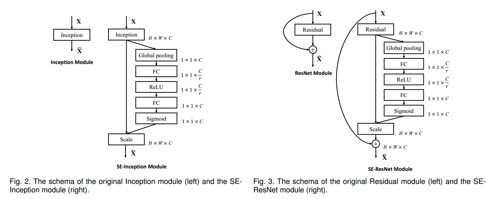
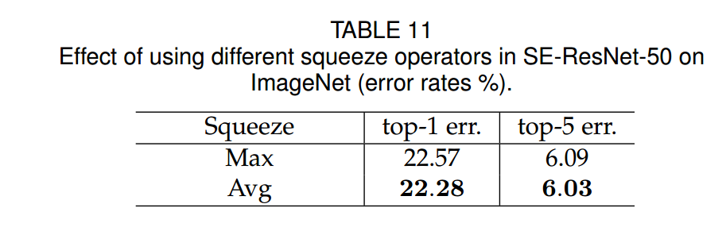
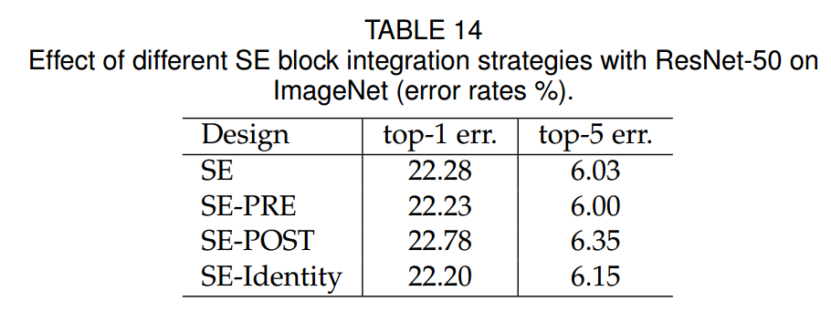
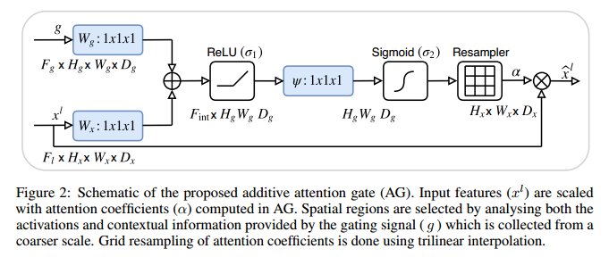
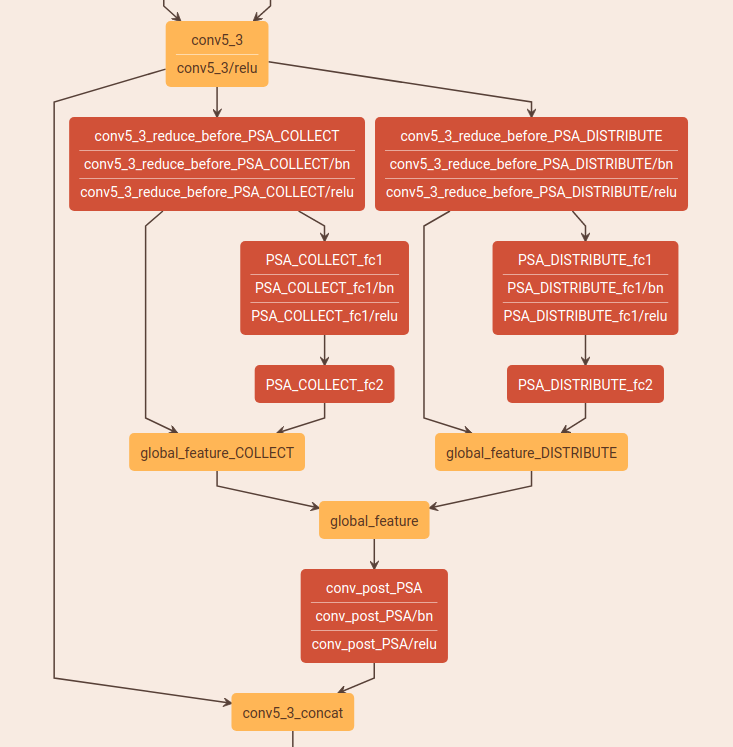

# 计算机视觉中的注意力机制(Attention Mechanism)
[toc]

# 1. 简介

# 2. 不同的注意力机制
## 2.1 SEBlock
&emsp;&emsp;论文地址:[Squeeze-and-Excitation Networks](http://xxx.itp.ac.cn/pdf/1709.01507.pdf)
### 2.1.1 SEBlock结构

&emsp;&emsp;上图便是SEBlock的结构，其中$X\in R^{H^{'}*W^{'}*C^{'}}$是网络的输入，其中$F_{tr}$为一些列卷积操作的集合$V=[v_1,v_2,...,v_C]$表示卷积操作，$U\in R^{H*W*C}$为经过一系列卷积操作的输出,$U=[u_1,u_2,...,u_C]$:
$$
u_C=v_C*X=\sum_{s=1}^{C^{'}}v_C^s*X^s, *是卷积操作,v_C^s是卷积在单个通道上的操作
$$
&emsp;&emsp;以上就是基本的输入输出。SEBlock分为三个部分Sequeez，Excitation， Scale。
**Sequeeze:**
&emsp;&emsp;Sequeeze操作是将$U$输出压缩成$Z\in R^{1*1*C}$，作者认为传统的卷积操作过于集中于局部地区，而无法提取上下文关系（context），可以通过使用GAP(global average pooling)实现这一点来作用于每个通道上来进行通道选择。
$$
z_c=F_{sq}(u_c)=\frac{1}{H*W}\sum^{H}_{i=1}\sum_{j=1}^{W}u_c(i,j)
$$
**Excitation:**
&emsp;&emsp;这一步是利用具有非线性的Sigmoid激活函数保证非线性的前提下进行通道选择。
$$
s=F_{ex}(z,W)=\sigma(g(z,w))\sigma(W_2\sigma(W_1 z))
$$
&emsp;&emsp;公式中$W_1\in R^{\frac{C}{r}*C}, W_2\in R^{C*\frac{C}{r}}$$\sigma$为$relu$，为了限制网络的复杂度，使用全连接层进行通道reduction。
**Scale：**
&emsp;&emsp;这部分就是将学习到的通道权重应用到原有的feature上去，就是个简单的乘法。
$$
\tilde{x_c}=F_{scale}(u_c, s_c)=s_cu_c,\tilde{X}=[\tilde{x_1},...,\tilde{x_C}]
$$

### 2.1.2 实现
&emsp;&emsp;SEBlock可以作为子模块插入不同的网络，作者在不同部分的选择过程中进行大量的实验进行比较选择。下面是不同网络实现的内容


#### 2.1.2.1 SEBlock的实现
&emsp;&emsp;SEBlock的实现基本结构是sequeeze + fn1 + fn2 + excitation,然后原始输入和该结构得到的通道权重相乘即可，而不同分不同实现效果不同，见下面的实验。fn1先将sequeeze得到的权重的通道降低到$\frac{C}{r}$，然再恢复到$C$。
**Sequeeze:**
&emsp;&emsp;Sequeeze操作主要使用GAP(global average pooling)和GMP(global max pooling)，下面是不同的选择的结果

**Excitation:**
&emsp;&emsp;Excitation操作主要可用为ReLU, Tanh, Sigmoid三个操作，下面是不同操作的效果:

**reduction:**
&emsp;&emsp;在具体实现中在sequeeze和excitation操作之间使用了两个全连接层先进行通道调整，而这里的通道调整比例为$r$，不同的$r$取值效果如下：

**插入方式：**
&emsp;&emsp;SEBlock不同的插入方式:



**code**
```python
class se_layer(nn.Module):
    def __init__(self, channel, reduction=16):
        super(se_layer, self).__init__()
        self.avg_pool = nn.AdaptiveAvgPool2d(1)
        self.fc = nn.Sequential(
            nn.Linear(channel, channel // reduction, bias=False),
            nn.ReLU(inplace=True),
            nn.Linear(channel // reduction, channel, bias=False),
            nn.Sigmoid()
        )

    def forward(self, x):
        b, c, _, _ = x.size()
        y = self.avg_pool(x).view(b, c)
        y = self.fc(y).view(b, c, 1, 1)
        return x * y.expand_as(x)


def main():
    import numpy as np
    feature = torch.rand(1, 16,7,7)
    block = se_layer(16)
    feature = block(feature)
    print(feature)
```
## 2.2 PAM and CAM
&emsp;&emsp;论文地址：[Dual Attention Network for Scene Segmentation](http://xxx.itp.ac.cn/pdf/1809.02983v2)
### 2.2.1 Position Attention Module

&emsp;&emsp;途中PAM分为四个分支，其中生成Attention的上BC两个分支，D用来生成经过attention map处理的feature，最下面的是保留原有的feature保证信息不丢失。
&emsp;&emsp;基本的流程：
- 输入$A\in R^{C*H*W}$，BCD三个分支分别经过conv+batch_norm+relu得到对应的输出$B\in R^{R*H*W}$,$C\in R^{C*H*W}$, $D\in R^{C*H*W}$
- $B，C$经过reshape维度编程$R^{C*N},N=H*W$，然后$B^{T}*C$得到$S^{R^{N*N}}$，得到的输出经过softmax得到$S\in R^{(H*W)*(H*W)}$的相应图,其中$s_ji$表示feature上点$j$对$i$的影响。
$$
s_{ji}=\frac{exp(B_i\cdot C_j)}{\sum^{N}_{i=1}exp(B_i\cdot C_j)}
$$
- 得到的attention map和输入进行相乘的操作；
- 最后和原有的输入进行加权的相加，如下公式,其中$\alpha$初始化为0，是可学习的。

$$
E_j=\alpha \sum_{i=1}^{N}(s_{ji}D_i)+A_j
$$
&emsp;&emsp;下面为流程图，不会出现feature之类的标签，主要以维度为主如C\*H\*W表示feature或者attention map是$C$通道高宽为$H,W$。

```mermaid
graph LR
    a[C*H*W]--conv+bn+relu-->b[C*H*W]
    a--conv+bn+relu-->c[C*H*W]
    a--conv+bn+relu-->d[C*H*W]

    b--reshape-->b1[C*N]
    b1--transpose-->b2[N*C]
    c--reshape-->c1[C*N]

    b2--*-->mul[N*N]
    c1--*-->mul

    mul--softmax-->softmax[N*N]
    softmax--reshape-->soft[H*W*H*W]

    soft--*-->fusion[C*H*W]
    d--*-->fusion

    fusion--*α-->weight[C*H*W]

    a--+-->add[C*H*W]
    weight--+-->add

    style a fill:#dddddd,stroke:#f06,stroke-width:2px,stroke-dasharray: 5, 5
    style b fill:#dddddd,stroke:#f06,stroke-width:2px,stroke-dasharray: 5, 5
    style c fill:#dddddd,stroke:#f06,stroke-width:2px,stroke-dasharray: 5, 5
    style c1 fill:#dddddd,stroke:#f06,stroke-width:2px,stroke-dasharray: 5, 5
    style mul fill:#dddddd,stroke:#f06,stroke-width:2px,stroke-dasharray: 5, 5
    style softmax fill:#dddddd,stroke:#f06,stroke-width:2px,stroke-dasharray: 5, 5
    style b1 fill:#dddddd,stroke:#f06,stroke-width:2px,stroke-dasharray: 5, 5
    style b2 fill:#dddddd,stroke:#f06,stroke-width:2px,stroke-dasharray: 5, 5
    style soft fill:#dddddd,stroke:#f06,stroke-width:2px,stroke-dasharray: 5, 5
    style fusion fill:#dddddd,stroke:#f06,stroke-width:2px,stroke-dasharray: 5, 5
    style d fill:#dddddd,stroke:#f06,stroke-width:2px,stroke-dasharray: 5, 5
    style add fill:#dddddd,stroke:#f06,stroke-width:2px,stroke-dasharray: 5, 5
    style weight fill:#dddddd,stroke:#f06,stroke-width:2px,stroke-dasharray: 5, 5
    linkStyle 0 stroke:#aa2222,stroke-width:2px
    linkStyle 1 stroke:#aa2222,stroke-width:2px
    linkStyle 2 stroke:#aa2222,stroke-width:2px
    linkStyle 3 stroke:#aa2222,stroke-width:2px
    linkStyle 4 stroke:#aa2222,stroke-width:2px
    linkStyle 5 stroke:#aa2222,stroke-width:2px
    linkStyle 6 stroke:#aa2222,stroke-width:2px
    linkStyle 7 stroke:#aa2222,stroke-width:2px
    linkStyle 8 stroke:#aa2222,stroke-width:2px
    linkStyle 9 stroke:#aa2222,stroke-width:2px
    linkStyle 10 stroke:#aa2222,stroke-width:2px
    linkStyle 11 stroke:#aa2222,stroke-width:2px
    linkStyle 12 stroke:#aa2222,stroke-width:2px
    linkStyle 13 stroke:#aa2222,stroke-width:2px
    linkStyle 14 stroke:#aa2222,stroke-width:2px

```


### 2.2.2 Channel Attention Module

&emsp;&emsp;CAM模块的操作和PAM非常相似不同之处是操作室基于通道的生成的attention map $S$大小为$C*C$，最后的加权参数为$\beta$也是可学习的,得到的attention map上的点$s_{ji}$表示$j$通道对$i$的影响。不做赘述。下面为流程图

```mermaid
graph LR
    a[C*H*W]--conv+bn+relu-->b[C*H*W]
    a--conv+bn+relu-->c[C*H*W]
    a--conv+bn+relu-->d[C*H*W]

    b--reshape-->b1[C*N]
    c1--transpose-->c2[N*C]
    c--reshape-->c1[C*N]

    c2--*-->mul[C*C]
    b1--*-->mul

    mul--softmax-->softmax[C*C]

    softmax--*-->fusion[C*H*W]
    d--*-->fusion

    fusion--*α-->weight[C*H*W]

    a--+-->add[C*H*W]
    weight--+-->add

        style a fill:#dddddd,stroke:#f06,stroke-width:2px,stroke-dasharray: 5, 5
    style b fill:#dddddd,stroke:#f06,stroke-width:2px,stroke-dasharray: 5, 5
    style c fill:#dddddd,stroke:#f06,stroke-width:2px,stroke-dasharray: 5, 5
    style c1 fill:#dddddd,stroke:#f06,stroke-width:2px,stroke-dasharray: 5, 5
    style mul fill:#dddddd,stroke:#f06,stroke-width:2px,stroke-dasharray: 5, 5
    style softmax fill:#dddddd,stroke:#f06,stroke-width:2px,stroke-dasharray: 5, 5
    style b1 fill:#dddddd,stroke:#f06,stroke-width:2px,stroke-dasharray: 5, 5
    style c2 fill:#dddddd,stroke:#f06,stroke-width:2px,stroke-dasharray: 5, 5
    style fusion fill:#dddddd,stroke:#f06,stroke-width:2px,stroke-dasharray: 5, 5
    style d fill:#dddddd,stroke:#f06,stroke-width:2px,stroke-dasharray: 5, 5
    style add fill:#dddddd,stroke:#f06,stroke-width:2px,stroke-dasharray: 5, 5
    style weight fill:#dddddd,stroke:#f06,stroke-width:2px,stroke-dasharray: 5, 5
    linkStyle 0 stroke:#aa2222,stroke-width:2px
    linkStyle 1 stroke:#aa2222,stroke-width:2px
    linkStyle 2 stroke:#aa2222,stroke-width:2px
    linkStyle 3 stroke:#aa2222,stroke-width:2px
    linkStyle 4 stroke:#aa2222,stroke-width:2px
    linkStyle 5 stroke:#aa2222,stroke-width:2px
    linkStyle 6 stroke:#aa2222,stroke-width:2px
    linkStyle 7 stroke:#aa2222,stroke-width:2px
    linkStyle 8 stroke:#aa2222,stroke-width:2px
    linkStyle 9 stroke:#aa2222,stroke-width:2px
    linkStyle 10 stroke:#aa2222,stroke-width:2px
    linkStyle 11 stroke:#aa2222,stroke-width:2px
    linkStyle 12 stroke:#aa2222,stroke-width:2px
    linkStyle 13 stroke:#aa2222,stroke-width:2px
```


### 2.2.3 代码实现
&emsp;&emsp;**CAM:**
```python
def hw_flatten(x):
    return K.reshape(x, shape=[K.shape(x)[0], K.shape(x)[1]*K.shape(x)[2], K.shape(x)[3]])

def cam(x):
    f =  hw_flatten(x) # [bs, h*w, c]
    g = hw_flatten(x) # [bs, h*w, c]
    h =  hw_flatten(x) # [bs, h*w, c]
    s = K.batch_dot(K.permute_dimensions(hw_flatten(g), (0, 2, 1)), hw_flatten(f))
    beta = K.softmax(s, axis=-1)  # attention map
    o = K.batch_dot(hw_flatten(h),beta)  # [bs, N, C]
    o = K.reshape(o, shape=K.shape(x))  # [bs, h, w, C]
    x = gamma * o + x
    return x
```

&emsp;&emsp;**PAM:**
```python
def hw_flatten(x):
    return K.reshape(x, shape=[K.shape(x)[0], K.shape(x)[1]*K.shape(x)[2], K.shape(x)[3]])

def pam(x):
    f = K.conv2d(x, kernel= kernel_f, strides=(1, 1), padding='same')  # [bs, h, w, c']
    g = K.conv2d(x, kernel= kernel_g, strides=(1, 1), padding='same')  # [bs, h, w, c']
    h = K.conv2d(x, kernel= kernel_h, strides=(1, 1), padding='same')  # [bs, h, w, c]
    s = K.batch_dot(hw_flatten(g), K.permute_dimensions(hw_flatten(f), (0, 2, 1))) #[bs, N, N]
    beta = K.softmax(s, axis=-1)  # attention map
    o = K.batch_dot(beta, hw_flatten(h))  # [bs, N, C]
    o = K.reshape(o, shape=K.shape(x))  # [bs, h, w, C]
    x =  gamma * o + x
    return x
```
## 2.3 CBAM
&emsp;&emsp;论文地址：[CBAM: Convolutional Block Attention Module](https://arxiv.org/abs/1807.06521)

### 2.3.1 CBAM结构


#### 2.3.1.1 Channel-Wise Attention
&emsp;&emsp;通道注意力部分可以从图中看到基本和SEBlock相同，只是加了一个分支Maxpooling，中间共享一个mlp，最后将两部分的输出相加经过sigmoid。
$$
M_c(F)=\sigma(MLP(AvgPool(F)) + MLP(MaxPool(F)))=\sigma(W_1(W_0(F_{avg}^c))+W_1(W_0(F^c_{max})))
$$
&emsp;&emsp;其中$W_0\in R^{\frac{C}{r*C}},W_1\in R^{C*\frac{C}{r}}$表示两层mlp的权重，两个分之共享权重并使用relu激活函数，$r$为中间通道reduction的比例。
#### 2.3.1.2 Spatial Attention Module
&emsp;&emsp;空间注意力的结构也简单，使用average pooling和max pooling对输入feature map 在通道层面上进行压缩操作，对输入特征分别在通道维度上做了mean和max操作。最后得到了两个二维的 feature，将其按通道维度拼接在一起得到一个通道数为2的feature map，之后使用一个包含单个卷积核层对其进行卷积操作，要保证最后得到的feature在spatial 维度上与输入的feature map一致。
$$
M_c(F)=\sigma(f^{7*7}([AvgPool(F);MaxPool(F)]))=\sigma(F^{7*7([F^s_{avg};F_{max}^s])})
$$
&emsp;&emsp;可视化：
&emsp;$\sigma$表示sigmoid函数,$f^{7*7}$表示$7*7$卷积核,$F_{avg}^s \in R^{1*H*W}$和$F_{max}^s \in R^{1*H*W}$表示经过通道维度上的maxpooling和avgpooling操作的结果。
### 2.3.2 代码实现
```python
class ChannelAttention(nn.Module):
    def __init__(self, in_planes, ratio=16):
        super(ChannelAttention, self).__init__()
        self.avg_pool = nn.AdaptiveAvgPool2d(1)
        self.max_pool = nn.AdaptiveMaxPool2d(1)

        self.fc1   = nn.Conv2d(in_planes, in_planes // ratio, 1, bias=False)
        self.relu1 = nn.ReLU()
        self.fc2   = nn.Conv2d(in_planes // ratio, in_planes, 1, bias=False)

        self.sigmoid = nn.Sigmoid()

    def forward(self, x):
        avg_out = self.fc2(self.relu1(self.fc1(self.avg_pool(x))))
        max_out = self.fc2(self.relu1(self.fc1(self.max_pool(x))))
        out = avg_out + max_out
        return self.sigmoid(out)

class SpatialAttention(nn.Module):
    def __init__(self, kernel_size=7):
        super(SpatialAttention, self).__init__()

        assert kernel_size in (3, 7), 'kernel size must be 3 or 7'
        padding = 3 if kernel_size == 7 else 1

        self.conv1 = nn.Conv2d(2, 1, kernel_size, padding=padding, bias=False)
        self.sigmoid = nn.Sigmoid()

    def forward(self, x):
        avg_out = torch.mean(x, dim=1, keepdim=True)
        max_out, _ = torch.max(x, dim=1, keepdim=True)
        x = torch.cat([avg_out, max_out], dim=1)
        x = self.conv1(x)
        return self.sigmoid(x)
```
## 2.4 Attention Gate
&emsp;&emsp;论文地址:[Attention U-Net:Learning Where to Look for the Pancreas](https://arxiv.org/ftp/arxiv/papers/1802/1802.06955.pdf)
&emsp;&emsp;Attention Gate是作者根据Disan: Directional self-attention network for rnn/cnn-free language understanding实现的一个类似于低纬度fature和高纬度feature融合得到比较可靠的attention map的attention结构。Attention Gate的结构比较简单，建议看论文时候不要看作者的解释感觉太绕了，建议先看源码再看论文会清晰很多。大概说一下和其他attention不同的是支出之处主要是在生成attention map时引用了低层feature和高层feature，处理方式也很简单先经过1\*1卷积核进行通道调整然后相加，之后的处理和普通的attention方法完全相同。
### 2.4.2 代码实现
&emsp;&emsp;


```python
class Attention_block(nn.Module):
    def __init__(self,F_g,F_l,F_int):
        super(Attention_block,self).__init__()
        self.W_g = nn.Sequential(
            nn.Conv2d(F_g, F_int, kernel_size=1,stride=1,padding=0,bias=True),
            nn.BatchNorm2d(F_int)
            )

        self.W_x = nn.Sequential(
            nn.Conv2d(F_l, F_int, kernel_size=1,stride=1,padding=0,bias=True),
            nn.BatchNorm2d(F_int)
        )

        self.psi = nn.Sequential(
            nn.Conv2d(F_int, 1, kernel_size=1,stride=1,padding=0,bias=True),
            nn.BatchNorm2d(1),
            nn.Sigmoid()
        )

        self.relu = nn.ReLU(inplace=True)

    def forward(self,g,x):
        g1 = self.W_g(g)
        x1 = self.W_x(x)
        psi = self.relu(g1+x1)
        psi = self.psi(psi)

        return x*psi
```

## 2.5 Criss-Cross Attention
&emsp;&emsp;论文地址：[CCNet: Criss-Cross Attention for Semantic Segmentation](https://arxiv.org/pdf/1811.11721.pdf)
&emsp;&emsp;Criss-Cross Attention可以认为是PAM（Position Attention Module）的改进版本，相对于PAM拥有更少的参数量，思想是单个Attention map只计算当前点对同行，同列的点的响应，然后使用两次Attention就可以解决无法达到边角的问题，既能保证性能，又能减少参数。
### 2.5.1 Criss-Cross Attention
&emsp;Criss-Cross Attention模块的结构如下所示，输入feature为$H\in \mathbb{R}^{C*W*H}$,$H$分为$Q,K,V$三个分支，都通过1\*1的卷积网络的进行降维得到${Q,K}\in \mathbb{R}^{C^{'}*W*H}$（$C^{'}<C$）。其中Attention Map $A\in \mathbb{R}^{(H+W-1)*W*H}$是$Q$和$K$通过Affinity操作计算的。Affinity操作定义为:
$$
d_{i,u}=Q_u\Omega_{i,u}^{T}
$$
&emsp;&emsp;其中$Q_u\in\mathbb{R}^{C^{'}}$是在特征图Q的空间维度上的u位置的值。$\Omega_u\in\mathbb{R}^{(H+W-1)C^{'}}$是$K$上$u$位置处的同列和同行的元素的集合。因此，$\Omega_{u,i}\in\mathbb{R}^{C^{'}}$是$\Omega_u$中的第$i$个元素，其中$i=[1,2,...,|\Omega_u|]$。而$d_{i,u}\in D$表示$Q_u$和$\Omega_{i,u}$之间的联系的权重,$D\in \mathbb{R}^{(H+W-1)*W*H}$。最后对$D$进行在通道维度上继续进行softmax操作计算Attention Map $A$。
&emsp;&emsp;另一个分支$V$经过一个1\*1卷积层得到$V \in \mathbb{R}^{C*W*H}$的适应性特征。同样定义$V_u \in \mathbb{R}^C$和$\Phi_u\in \mathbb{R}^{(H+W-1)*C}$, $\Phi_u$是$V$上u点的同行同列的集合，则定义Aggregation操作为:
$$
H_u^{'}\sum_{i \in |\Phi_u|}{A_{i,u}\Phi_{i,u}+H_u}
$$
&emsp;&emsp;该操作在保留原有feature的同时使用经过attention处理过的feature来保全feature的语义性质。


### 2.5.2 Recurrent Criss-Cross Attention
&emsp;&emsp;单个Criss-Cross Attention模块能够提取更好的上下文信息，但是下图所示，根据criss-cross attention模块的计算方式左边右上角蓝色的点只能够计算到和其同列同行的关联关系，也就是说相应的语义信息的传播无法到达左下角的点，因此再添加一个Criss-Cross Attention模块可以将该语义信息传递到之前无法传递到的点。

&emsp;&emsp;采用Recurrent Criss-Cross Attention之后，先定义loop=2，第一个loop的attention map为$A$，第二个loop的attention map为$A^{'}$，从原feature上位置$x^{'},y^{'}$到权重$A_{i,x,y}$的映射函数为$A_{i,x,y}=f(A,x,y,x^{'},y^{'})$，feature $H$中的位置用$\theta$表示，feature中$H^{''}$用$u$表示，如果$u$和$\theta$相同则:
$$
H_u^{''}\leftarrow[f(A,u,\theta)+1]\cdot f(A^{'},u,\theta)\cdot H_{\theta}
$$
&emsp;&emsp;其中$\leftarrow$表示加到操作，如果$u$和$\theta$不同则:
$$
H_u^{''}\leftarrow[f(A,u_x,\theta_{y}, \theta_{x}, \theta_{y})\cdot f(A^{'},u_x,u_{y}, u_{x}, \theta_{y})+f(A,\theta_x,u_{y}, \theta_{x}, \theta_{y})\cdot f(A^{'},u_x,u_{y}, \theta_{x}, \theta_{y})]\cdot H_{\theta}
$$
&emsp;&emsp;Cirss-Cross Attention模块可以应用于多种任务不仅仅是语义分割，作者同样在多种任务中使用了该模块，可以参考论文。


## 2.6 Point-wise Spatial Attention
&emsp;&emsp;论文地址：[PSANet: Point-wise Spatial Attention Network for Scene Parsing](https://hszhao.github.io/papers/eccv18_psanet.pdf)

### 2.6.1 Bi-Direction
&emsp;&emsp;一般情况下将单个feature上的点和其他点之间的关系通过如下公式计算得到有效feature：
$$
z_i=\frac{1}{N}\sum_{\forall j\in \Omega(i)}F(x_i,x_j,\triangle_{ij})x_j
$$
&emsp;&emsp;其中$z_i$是整合之后的feature位置$i$的值，$x_i$表示输入fearure在$i$的值$\forall j\in \Omega(i)$表示feature中所有和$i$位置相关的点，$\triangle_{ij}$表示位置$i$和$j$之间的相对位置。$F(x_i,x_j,\triangle_{ij})$表示学习到的点与点之间的相关关系。
&emsp;&emsp;对上式进行简化可以得到:
$$
z_i=\frac{1}{N}\sum_{\forall j\in \Omega(i)}F_{\triangle_{ij}}(x_i,x_j)x_j
$$
&emsp;&emsp;其中$F_{\triangle_{ij}}$表示一些列的位置相关函数或映射。如果按照上面的公式计算计算量将会非常大，因此进一步简化公式:
$$
F_{\triangle_{ij}}(x_i,x_j)\thickapprox F_{\triangle_{ij}}(x_i)
\Rightarrow
z_i=\frac{1}{N}\sum_{\forall j\in \Omega(i)}F_{\triangle_{ij}}(x_i)x_j
$$

&emsp;&emsp;上面的式子表示所有点对点$i$的影响，相对的$i$也对其他点施加影响，因此:
$$
\begin{aligned}
    & F_{\triangle_{ij}}(x_i,x_j) \thickapprox F_{\triangle_{ij}}(x_i) + F_{\triangle_{ij}}(x_j) \\
    \Rightarrow
    &z_i = \frac{1}{N}\sum_{\forall j\in \Omega(i)}F_{\triangle_{ij}}(x_i)x_j+\frac{1}{N}\sum_{\forall j\in \Omega(i)}F_{\triangle_{ij}}(x_j)x_j \\
    \Rightarrow
    &z_i=\frac{1}{N}\sum_{\forall j}\mathrm{a}^c_{i,j}\mathrm{x}_j+\frac{1}{N}\sum_{\forall j}\mathrm{a}^d_{i,j}\mathrm{x}_j
\end{aligned}
$$
&emsp;&emsp;其中$\mathrm{a}^c_{i,j}$和$\mathrm{d}^c_{i,j}$表示collect和distribute两个分支的attention map $A^c$和$A^d$中的值。

### 2.6.2 Point-Wise Spatial Attention Module
&emsp;&emsp;PSAM的结构很清晰如下图，该模块分为两个分支：Collect和Distribution。两个分支的基本结构基本相同：输入$X\in \mathbb{R}^{H*W*C}$，经过1\*1卷积核进行降维得到$X\in \mathbb{R}^{H*W*C_1},(C_1 < C)$,然后一个由1\*1卷积和BN层、激活层组成的卷积层进行特征自适应得到$H\in \mathbb{R}^{H*W*(2H-1)*(2W-1)}$，然后经过Attention模块得到Attention map $A\in\mathbb{R}^{H*W*C}$和原feature融合得到各自的$Z^c$和$Z^d$之后经过concat和原feature融合得到最终的结果。

### 2.6.3 Point-Wise Spatial Attention
&emsp;&emsp;结构在上一节基本解释清楚主要说一下这里的通道数是$(2H-1)(2W-1)$的原因是对该tensor进行reshape之后可以使得feature上每个点都能够在保证自身处于中心的情况下获取其他点的影响，如下图所示：

&emsp;&emsp;对于特征图生成$i$位置即$(k,l)$在Attention上的区域是从$[H-k, W-l]$开始的大小为$H*W$的区域：
$$
\mathrm{a}^c_{[k,l],[s,t]}=\mathrm{h}^c_{[k,l],[H-k+s,W-l+t]},\forall s\in[0,H),t\in [0,W)
$$
&emsp;&emsp;$\mathrm{a}$表示Attention Map，$\mathrm{h}$表示输入。
&emsp;&emsp;另外说一句，两个模块实现本质上差不多，唯一的区别是最后得到的attention map之前的feature是如何取到的，collect是将其他点的响应收集到目标点，distribution是将当前点分发给其他点，带着这样的想法看下C++源码就可以理解了。

### 2.6.4 代码
&emsp;&emsp;从上面的配置文件看网络的机构基本相同都是两个1\*1卷积核接一个attention模块，不同之处为attention的实现方式:
```cpp
switch (this->layer_param_.pointwise_spatial_attention_param().psa_type()) {
  case PointwiseSpatialAttentionParameter_PSAType_COLLECT:
    PSAForward_buffer_mask_collect_cpu<Dtype>(num_, feature_H_, feature_W_,
        mask_H_, mask_W_, half_mask_H_, half_mask_W_,
        bottom[1]->cpu_data(), mask_buffer_.mutable_cpu_data());
    break;
  case PointwiseSpatialAttentionParameter_PSAType_DISTRIBUTE:
    PSAForward_buffer_mask_distribute_cpu<Dtype>(num_, feature_H_, feature_W_,
        mask_H_, mask_W_, half_mask_H_, half_mask_W_,
        bottom[1]->cpu_data(), mask_buffer_.mutable_cpu_data());
    break;
  default:
    LOG(FATAL) << "Unknown PSA type.";
  }
```
&emsp;&emsp;Collect:
```cpp
template <typename Dtype>
void PSAForward_buffer_mask_collect_cpu(const int num_,
    const int feature_H_, const int feature_W_,
    const int mask_H_, const int mask_W_,
    const int half_mask_H_, const int half_mask_W_,
    const Dtype* mask_data, Dtype* buffer_data) {
  for(int n = 0; n < num_; n++) {
    for(int h = 0; h < feature_H_; h++) {
      for(int w = 0; w < feature_W_; w++) {
        // effective mask region : [hstart, hend) x [wstart, wend) with mask-indexed
        const int hstart = max(0, half_mask_H_ - h);
        const int hend = min(mask_H_, feature_H_ + half_mask_H_ - h);
        const int wstart = max(0, half_mask_W_ - w);
        const int wend = min(mask_W_, feature_W_ + half_mask_W_ - w);
        // (hidx,                    widx                   ) with mask-indexed
        // (hidx + h - half_mask_H_, widx + w - half_mask_W_) with feature-indexed
        for (int hidx = hstart; hidx < hend; hidx++) {
          for (int widx = wstart; widx < wend; widx++) {
            buffer_data[(n * feature_H_ * feature_W_ + (hidx + h - half_mask_H_) * feature_W_ + (widx + w - half_mask_W_)) * feature_H_ * feature_W_ + h * feature_W_ + w] =
                mask_data[((n * mask_H_ * mask_W_ + hidx * mask_W_ + widx) * feature_H_ + h) * feature_W_ + w];
          }
        }
      }
    }
  }
}
```
&emsp;&emsp;Distribution:
```cpp
template <typename Dtype>
void PSAForward_buffer_mask_distribute_cpu(const int num_,
    const int feature_H_, const int feature_W_,
    const int mask_H_, const int mask_W_,
    const int half_mask_H_, const int half_mask_W_,
    const Dtype* mask_data, Dtype* buffer_data) {
  for(int n = 0; n < num_; n++) {
    for(int h = 0; h < feature_H_; h++) {
      for(int w = 0; w < feature_W_; w++) {
        // effective mask region : [hstart, hend) x [wstart, wend) with mask-indexed
        const int hstart = max(0, half_mask_H_ - h);
        const int hend = min(mask_H_, feature_H_ + half_mask_H_ - h);
        const int wstart = max(0, half_mask_W_ - w);
        const int wend = min(mask_W_, feature_W_ + half_mask_W_ - w);
        // (hidx,                    widx                   ) with mask-indexed
        // (hidx + h - half_mask_H_, widx + w - half_mask_W_) with feature-indexed
        for (int hidx = hstart; hidx < hend; hidx++) {
          for (int widx = wstart; widx < wend; widx++) {
            buffer_data[(n * feature_H_ * feature_W_ + h * feature_W_ + w) * feature_H_ * feature_W_ + (hidx + h - half_mask_H_) * feature_W_ + (widx + w - half_mask_W_)] =
                mask_data[((n * mask_H_ * mask_W_ + hidx * mask_W_ + widx) * feature_H_ + h) * feature_W_ + w];
          }
        }
      }
    }
  }
}
```
&emsp;&emsp;唯一的区别就是这里:
```cpp
buffer_data[(n * feature_H_ * feature_W_ + (hidx + h - half_mask_H_) * feature_W_ + (widx + w - half_mask_W_)) * feature_H_ * feature_W_ + h * feature_W_ + w] =
                mask_data[((n * mask_H_ * mask_W_ + hidx * mask_W_ + widx) * feature_H_ + h) * feature_W_ + w];
```
```cpp
buffer_data[(n * feature_H_ * feature_W_ + h * feature_W_ + w) * feature_H_ * feature_W_ + (hidx + h - half_mask_H_) * feature_W_ + (widx + w - half_mask_W_)] =
                mask_data[((n * mask_H_ * mask_W_ + hidx * mask_W_ + widx) * feature_H_ + h) * feature_W_ + w];
```
&emsp;&emsp;图中第一项实在相同的feautre中索引不同的位置，第二项实在不同的feature中索引相同的位置。

&emsp;&emsp;第一行是索引相同通道上的某个点，第二个是索引具体某个通道。