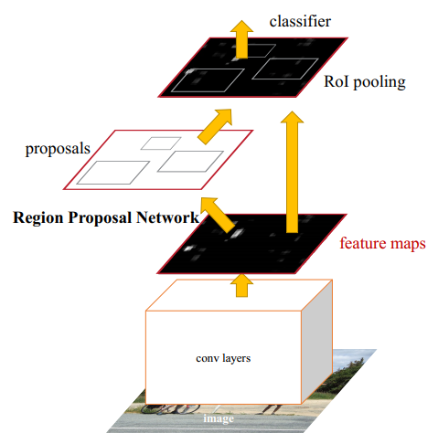
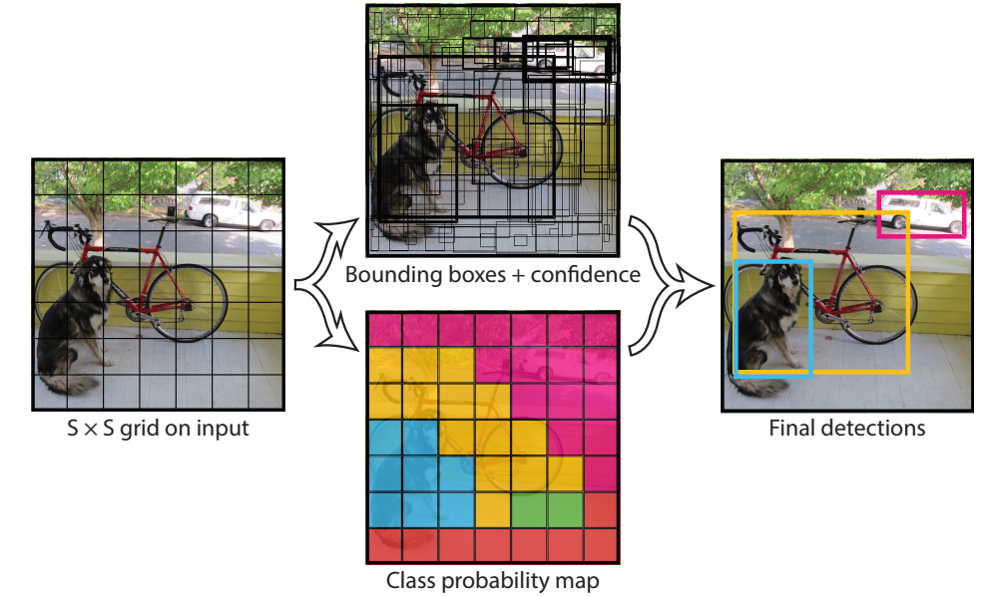
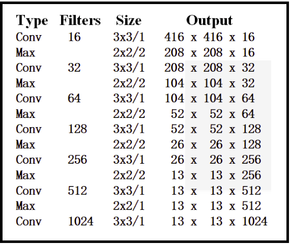
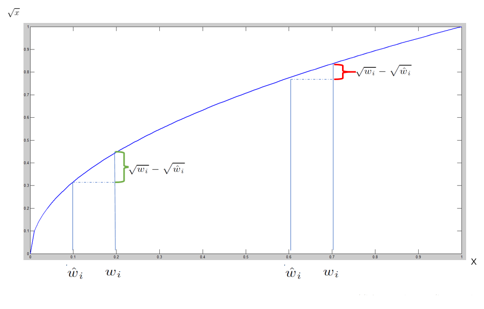
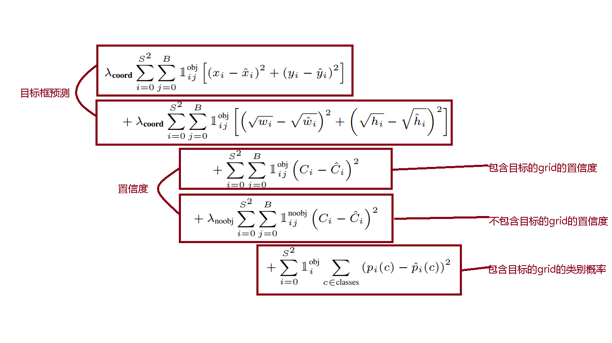
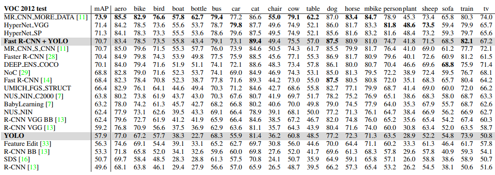
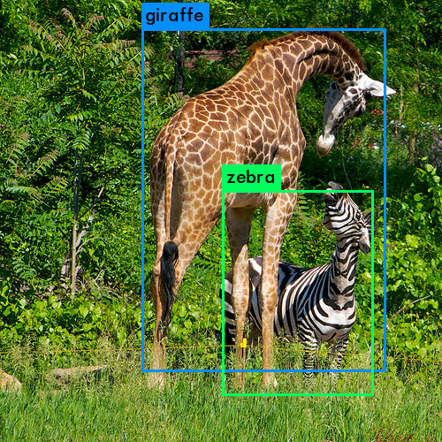
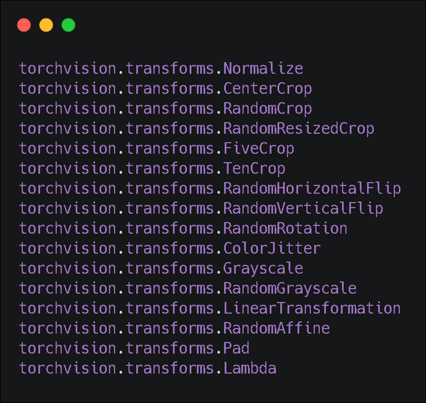

# YOLO:You only look once

[TOC]

## 一、YOLO-v1简介

&emsp;&emsp;yolo-v1是Joseph Redmon等人发表的一片one-stage的实时目标检测(object detection)[论文](<https://arxiv.org/abs/1506.02640>),相比于传统的目标检测算法和之前利用CNN进行目标检测的算法RCNN在处理速度和性能上有了一定的提升，按照论文中给出的数据yolo处理速度能够达到45 FPS，相对精度较低的fast yolo能达到155 FPS。除了最基本的性能优势外，yolo最吸引人的地方应该是yolo基于[darknet](<https://pjreddie.com/darknet/>)框架完全用C语言编写，没有任何外部库的依赖，可以支持OPENCV，OPENMP，CUDA，CUDNN等（言外之意，没有这些库yolo同样可以再cpu上运行，只是速度相对比较慢而已），几乎可以实现全平台的迁移。当然yolo本身也存在一些缺陷，yolo相比于其他算法会出现更多的定位误差，也就是说目标框不够准确，有一定的偏移，具体细节文中再说。

## 二、YOLO-V1流程

### 1、one-stage

> &emsp;&emsp;RCNN类目标检测算法基本步骤为：利用RPN或者FPN进行Region Proposal生成bonding box，然后对boungding box进行分类，最后post-processing对bonding box进行更深层次的去重优化。

> &emsp;&emsp;YOLO将object detection问题变为回归问题，直接在CNN输出层上回归目标框。

&emsp;&emsp;相比于RCNN yolo是one-stage算法直接可以通过网络得到目标的bonding box。

### 2、具体流程

&emsp;&emsp;Yolo将目标图像拆分为S×S的网格，而负责检测目标的网格是那个目标中心所在的网格。每个网格负责预测B个bonding box和置信度($confidence=Pr(Object)*IOU^{truth}_{pred}$，$Pr(Object)$为bonding box包含目标的概率要麽为0，要麽为1，$IOU^{truth}_{pred}$为ground truth和预测框的交并比)即(x,y,w,h,c)五个值,该置信度c表明当前该预测框包含目标的概率和目标框预测的准确度。每个网格还预测C个条件概率即$P(Class_i|Object)$有目标情况下的目标类别概率，利用贝叶斯公式即可得到类别概率:

&emsp;&emsp;$P(Class_i|Object)*Pr(Object)*IOU^{truth}_{pred}=Pr(Class_i)*IOU^{truth}_{pred}$

&emsp;&emsp;从上面看出Yolo需要回归的是一个S\*S\*(B\*5+C)的向量，在VOC数据集中yolo模型采用的参数是:S=7,B=2,C=20。

&emsp;&emsp;yolo的损失函数的采用就是很简单粗暴的均方差损失函数：

&emsp;&emsp;$J(x)=\frac{1}{2}||y-\vec{y}||^2_2​$

### 3、网络模型

&emsp;&emsp;如图所示，该网络模型有24层，按论文中的说法是借鉴googlenet的思想搭建的特征提取网络，但是googlenet的核心是inception block，我更倾向于该模型借鉴了VGG和NIN网络，因为多层小卷积重复排列是VGG第一次采用，利用1*1卷积核进行降维也是NIN论文中提到的模型结构。但的确利用1\*1卷积核进行降维减少参数量这个做法是Googlenet所做的，也可能作者冲着这点去的。

>Our network has 24 convolutional layers followed by 2 fully connected layers. Instead of the inception modules used by GoogLeNet, we simply use 1 × 1 reduction layers followed by 3 × 3 convolutional layers, similar to Lin et al [22].

&emsp;&emsp;可以看到网络最后的输出7\*7\*30就是上面提到的S\*S\*(B\*5+C)(S=7,B=2,C=20)的向量。

&emsp;&emsp;论文还提到了Fast Yolo的网络结构是9层网络，在darknet的cfg文件中只找到了tiny-yolo的模型结构，应该就是这个Fast yolo，相比于yolo的特征提取器，Fast yolo的网络没有使用1\*1卷积核而是多层3\*3卷积核的叠加中间穿插这Max Pooling。

### 4、实验过程中的缺陷及其改进

&emsp;&emsp;因为Yolo的损失函数简单粗暴的使用最小均方差损失，回归目标框损失和目标概率损失时二者在处于同等的地位导致模型的不稳定性。论文中的改进便是引入超参数$\lambda_{coord}$和$\lambda_{nobj}$来权衡定位误差和没有目标的网格的分类误差，在具体操作中$\lambda_{coord}=5$和$\lambda_{nobj}=0.5$。

&emsp;&emsp;另外，即便引入了超参数，定位误差在大目标和小目标虽然在尺度上相同，但是二者对误差的容忍程度并不相同，大目标对于小偏移是可以接受的，而小目标便无法接受哪怕一点而偏移。因此，采用平方根将二者对误差的容忍程度一定程度上区分开来，来提高小目标的定位精确度。从图中看出使用平方根后，同样的偏差可能对大目标并不敏感，但是对小目标影响程度就比大目标大，可以提高小目标的定位准确性。

&emsp;&emsp;目前每个grid有B个bonding box，而事实上一个grid只负责一个目标的检测，无法做到检测多个目标，因此保留过多的bonding box意义不大，因此改进后只保留IOU最大的那个bonding box。

&emsp;&emsp;下面为改进后完整的损失函数：

## 三、分析

### 1、效果

&emsp;&emsp;下图为yolo和之前的算法在VOC 2007数据集上的效果，可以明显的看到YOLO在拥有比较高的mAP的同时还能保证45FPS，而Fast yolo更是达到155FPS，其mAP也不算低，虽然RCNN系列的mAP比较高，但是达不到实时性。

&emsp;&emsp;下图为Fast R-CNN和yolo细节对比明显yolo的准确率不如Fast R-CNN，而且定位误差更是要比Fast R-CNN高一倍，这也是之后yolo版本主要改进的地方。

&emsp;&emsp;下图为yolo与当时的经典算法在VOC 2012上的分类错误率的比较，如果只看错误率的话，yolo基本不具备任何优势。

### 2、优缺点

**优点:**

1. 速度快，能够实现视频流实时检测；
2. 只需要进行一个feature extraction，对图像拥有全局视野；
3. 不同场景的图像的泛化能力不错；
4. 纯C代码可移植性非常强

**缺点:**

1. YOLO 对相互靠的很近的物体，还有很小的群体检测效果不好 ；
2. 同一类物体出现的新的不常见的长宽比和其他情况时，泛化能力偏弱；
3. 定位误差是影响检测效果的主要原因。

&emsp;&emsp;yolo的缺点很好理解:将图像分为多个网格，而每个网格只负责一个目标bonding box的预测，也就意味着yolo预测的上限就是S*S，并且近距离重叠物体大概率会出现只能检测到一个的情况，这也是yolov2致力于改进的地方。yolo的定位误差看下面两张图便可以明白：

## 四、其他

### 1、训练时的小Trick

1. 使用图像增强，例如随机缩放，平移，改变对比度，饱和度
2. 使用Dropout

&emsp;&emsp;其中第二点使用dropout，现在基本可以用bn(Batch normalization)来代替，效果更好，更好训练。

&emsp;&emsp;下面是tensorflow和pytorch提供的一些进行数据增强的API，相关API的功能直接从API函数名就可以看出来。

