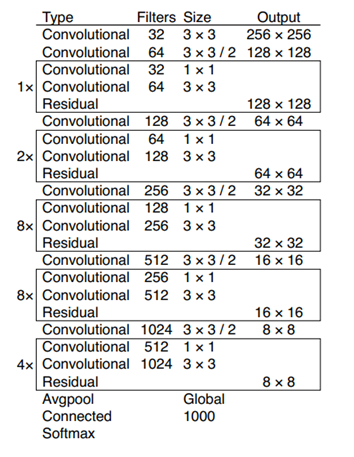
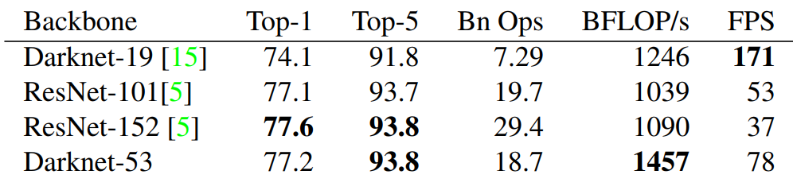

# YOLOV3

## 一、YOLOV3简介

&emsp;&emsp;YOLOV3的内容很少，正如作者在文中所说这篇仅仅是一个TECH REPORT。简单的说来YOLOV3相对于YOLOV2的改进主要在三个方面：

1. 改用logistic回归分类；
2. 改用Darknet-53特征提取网络，引入了残差结构；
3. 使用了类似FPN的结构进行预测。

## 二、改进

### 1、logistic

&emsp;&emsp;yoloV3在为每个bonding box做目标概率检测的时候改用logistic进行分类，这样的好处是即便两个类别有重叠但是还是会返回具体的类别概率，而不像softmax只会选择概率最高的那一个作为输出类别，如man和woman都是人的情况。

&emsp;&emsp;这样做还有一个结果是先验框中重叠最多的得分将是1，而并不是最好的先验框但是其IOU大与门限值的框会被忽略，而不作为更新的依据。

&emsp;&emsp;分类损失采用binarycross-entropy损失。

### 2、Darknet-53

&emsp;&emsp;YOLOV3采用了新的特征提取网络，该特征提取网络加入了残差块，可以明显的看到网络的深度相比之前的网络有了很大的提升。

&emsp;&emsp;下图为Darknet-53与之前的Darknet-19和其他版本的ResNet的效果对比，可以看到虽然Dakrnet-53的效果和Reset-152相差不大的情况下，但是Daknet-53做更少的浮点运算，速度更快。

### 3、FPN

&emsp;&emsp;YOLOV3 采用了类似FPN的在三个尺度上预测3个bonding box，在每个尺度上预测N\*N\*[3\*(4\+1\+80)]的向量其中信息包含bonding box的(x,y,w,h)和confidence和80个类别的分类信息。yolo在取不同尺度的feature map时为了将不同尺度的特征利用起来采用的是上采样和级联方式，这种做法很像googlnet中的将不同卷积核的特征充分利用起来，这样做的好处是可以从更早的卷积层中提取特征信息对于小目标来说有更好的效果。

&emsp;&emsp;yolov3的anchor box的选择同样是使用yolov2中提到的k-means，不同之处是yolov3采用9个anchor box，分别分发到三个尺寸的feauture上去，在COCO数据集上yolo采用的anchor box的尺寸是(10\*13),(16\*30),(33\*23),(30\*61),(62\*45),(59\*119),(116\*90),(156\*198),(373\*326)。

## 三、结果

&emsp;&emsp;从下面两张途中可以看出YOLOV3相对于其他检测网络一直以来的优势是其实时性，在IOU不断增大的时候其性能反而在下降，说明YOLOV3本身在准确率方面还有很大的不足。

