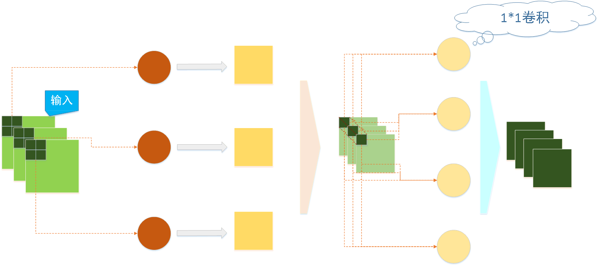
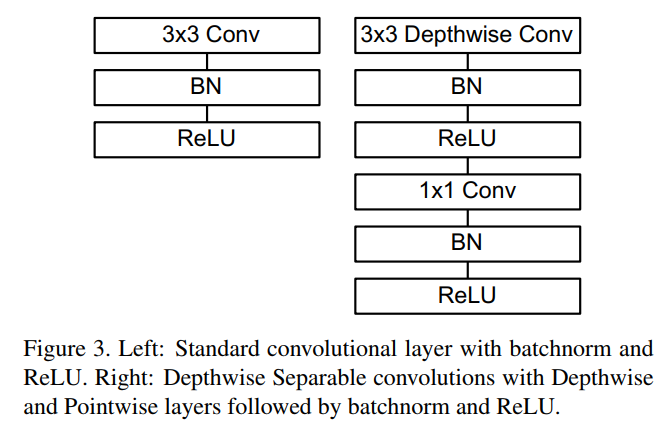
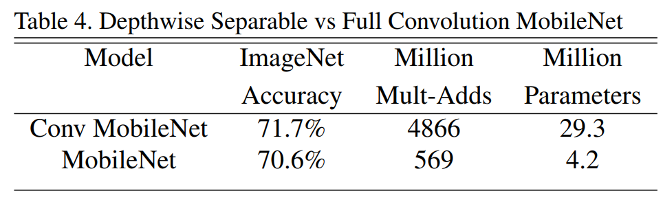
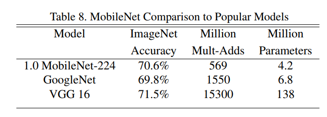
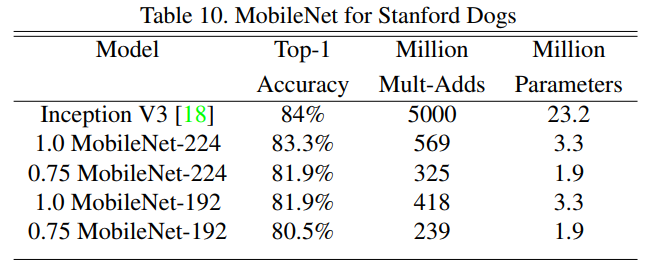

# MobileNet论文阅读笔记

[MobileNets: Efficient Convolutional Neural Networks for Mobile Vision Applications ](<https://arxiv.org/abs/1704.04861>)

## 一、简介

&emsp;&emsp;《MobileNets: Efficient Convolutional Neural Networks for Mobile Vision Applications》这篇论文提出了一个用于移动端设备高效的深度网络MobileNet。MobileNet是改变了传统的神经网络的卷积层，用深度可分离卷积对传统的卷积层进行分解，实现了在网络性能不下降的前提下大幅减少了网络的参数量，加快训练和运行速度。不仅如此，论文中还提供了通过超参数调整神经网络结构的办法，并对其进行实验分析得到了MobileNet族（MobileNets），可以通过在性能和速度两方面进行权衡得到符合自己的网络。

## 二、深度可分离卷积

### 1、深度可分离卷积

&emsp;&emsp;传统的卷积过程如下图所示，先通过卷积核在每个通道上进行一次卷积，在将不同通道得到的值相加得到一个值，然后该卷积核在输入上进行滑窗计算得到输出的一个通道上的feature map，其他卷积和进行同样的操作便可得到多个通道的输出。

&emsp;&emsp;而深度可分离卷积（depthwise separable convolution）将整个卷积过程拆分为两步，第一步先进行逐层卷积，也就是说在每个卷积核在对应的输入通道上进行卷积产生对应的单层feature map，之后再通过1\*1卷积核进行逐点卷积将不同通道的feature融合到一起，最后形成具体的feature map。具体过程如下图：

&emsp;&emsp;如下两张图分别为传统卷积和深层可分离卷积的过程举例。可以明显的看到深度可分离卷积并不是卷积的数学上的代替，仅仅是结构上的代替；如果将深层可分离卷积中的逐点卷积卷积核的权重全部改为1，那么深层可分离卷积在某种意义上和传统卷积是完全相同的，因为传统卷积做完滑窗之后是将数值相加得到最终的结果，等同于经过权值为1的1\*1卷积核的处理。

### 2、深度可分离卷积参数量

&emsp;&emsp;深层可分离卷积是将卷积的部分乘法操作分解成了加法来减少网络的参数量。论文中给定的参数两的计算是进行了估算，下面我先贴出论文中给出的计算量计算，然后再写我自己进行计算的过程。

&emsp;&emsp;前提：

- 卷积网络的输入：$D_F×D_F×M​$，$M​$为输入通道；
- 卷积网络的输出：$D_F×D_F×N​$，$N​$为输出通道；
- 卷积核大小:$D_K×D_K$;
- padding=1,stride=1

&emsp;&emsp;那么单层的卷积网络的参数量可以通过$\hat{\mathbf{G}}_{k, l, m}=\sum_{i, j} \hat{\mathbf{K}}_{i, j, m} \cdot \mathbf{F}_{k+i-1, l+j-1, m}$计算，那么单层卷积层的计算量为$D_{K} \cdot D_{K} \cdot M \cdot D_{F} \cdot D_{F}$。

&emsp;&emsp;而对于深层可分离卷积便可以使用公式$\hat{\mathbf{G}}_{k, l, m}=\sum_{i, j} \hat{\mathbf{K}}_{i, j, m} \cdot \mathbf{F}_{k+i-1, l+j-1, m}$计算计算量，第一部分即逐层卷积的计算量为$D_{K} \cdot D_{K} \cdot M \cdot D_{F} \cdot D_{F}$，第二部分逐点卷积的计算量为$M \cdot N \cdot D_{F} \cdot D_{F}$，所以总的计算量为$D_{K} \cdot D_{K} \cdot M \cdot D_{F} \cdot D_{F}+M \cdot N \cdot D_{F} \cdot D_{F}$。

&emsp;&emsp;而深层可分离卷积和传统卷积网络的参数两之比为：

$\begin{aligned} & \frac{D_{K} \cdot D_{K} \cdot M \cdot D_{F} \cdot D_{F}+M \cdot N \cdot D_{F} \cdot D_{F}}{D_{K} \cdot D_{K} \cdot M \cdot N \cdot D_{F} \cdot D_{F}} \\=& \frac{1}{N}+\frac{1}{D_{K}^{2}} \end{aligned}​$

&emsp;&emsp;明显的可以看到N一般都是远大于1的，$D_K​$多为1，3等奇数，也就是说单层的计算量只有当当前层为1\*1卷积时二者相同，否则传统卷积计算量至少是深层可分离卷积的9倍或更多。

### 3、推导计算量

&emsp;&emsp;条件：

- 输入$D_F×D_F×M$，$M$为输入通道；
- 卷积核：$D_K×D_K×N$；
- padding=0，stride=1

&emsp;&emsp;上面采用padding=0和stride=1是为了方便，我们的目的是估算计算量无需过于精确(这里只计算乘法的计算量，相比于加法乘法更耗时，因此以乘法为准，最后计算出的结果可以理解为进行了多少乘法)。

&emsp;&emsp;从上面的参数可以计算出网络的输出为$(\frac{Width-Height+2×padding}{stride}+1)^2×chanels_{out}=(D_F-D_K+1)^2×N​$，一个卷积核的计算量为$D_K×D_K​$，那么一个卷积核在一个输入通道上的计算量是$D_K×D_K×(D_F-D_K+1)^2​$，故单层的卷机网络的计算量为$D_K×D_K×(D_F-D_K+1)^2×M×N​$，在卷积网络中输入单通道分辨率的基本是大于输出的故有:

$D_K×D_K×(D_F-D_K+1)^2×M×N\\\ge D_K×D_K×D_F^2×M×N\\=D_K×D_K×D_F×D_F×M×N$

&emsp;&emsp;同理，在深层可分离卷积中，

- 第一步逐层卷积中，单个卷积核进行一次卷积的计算量是$D_K×D_K​$(注：这里的$D_K​$是逐层卷积的卷积核，因为逐点卷积的卷积核一定是1\*1)，那么一个卷积核在一个输入通道上的计算量是$D_K×D_K×(D_F-D_K+1)^2​$，第一步逐层卷积的计算量为$D_K×D_K×(D_F-D_K+1)^2×M\ge D_K×D_K×D_F×D_F×M​$
- 第二步逐点卷积只是对通道的融合，一个1\*1卷积核的计算量为$M​$，那么一个卷积核对所有通道的数据进行融合后的计算量为$(D_F-D_K+1)^2×M​$，$N​$个卷积核的计算量是$(D_F-D_K+1)^2×M×N\ge D_F×D_F×M×N ​$
- 总参数量为$ D_K×D_K×D_F×D_F×M+D_F×D_F×M×N​$

## 三、网络结构

&emsp;&emsp;下图为MobileNet网络结构中的结构和传统的卷机网络的区别，和预想不一样的是MobileNet在逐层卷积和1\*1卷积核之后都添加了BN层和RELU激活层。

&emsp;&emsp;下图为MobileNet的整体结构，如果把其中的3\*3和1*1网络结构堪称传统的卷机网络可以发现，这是一个和VGG非常相似的没有多余的结构的网络，但是比VGG要深，这里有28层。

&emsp;&emsp;下表为mobilenet中的计算量的分布，可以明显的看到网络的计算量大部分集中于1\*1卷积核中，作者认为对于矩阵运算，稀疏矩阵运算速度比一定比稠密矩阵运算快，除非能够找到对于稀疏矩阵好的压缩办法，而MobileNet的网络计算量主要集中与1\*1网络，这一特点正式网络所体现的高效性来源之一。另外传统的卷积矩阵计算是通过通过高度优化的通用矩阵乘法（GEMM）函数来实现，但是操作时需要在内存中进行初始重新排序，称为im2col，以便将其映射到GEMM。而MobileNet的1×1卷积不需要在存储器中重新排序，并且可以直接用GEMM实现，这也大大加快了计算速度。

## 四、网络改进

&emsp;&emsp;MobileNet论文中还提到了通过超参数$\alpha$和$\rho$对网络进行修改来挑选更好的网络，该技巧在最新的EffiecientNet中同样使用了，并且增加了深度这一维度。

&emsp;&emsp;在这里$\alpha$用来控制网络的宽度，即通道数，$\rho$用来控制网络输入的分辨率，这两个参数的修改都是基于上面提到的MobileNet基础网络进行修改的，$\alpha$和$\rho$取值一般为(0,1]。采用这两个参数后网络的输入输出通道由$M,N$变成了$\alpha M$和$\alpha N$，那么网络的计算量变成$ D_K×D_K×D_F×D_F×\alpha M+D_F×D_F×\alpha M×\alpha N$，也就是网络的计算量改变了大概$\alpha ^ 2$；对于$\rho$，网络的计算量变为 $D_K×D_K×\rho D_F×\rho D_F×M+\rho D_F×\rho D_F×M×N$,计算量大概改变了$\rho ^ 2$总的计算量变为$D_K×D_K×\rho D_F×\rho D_F×\alpha M+\rho D_F×\rho D_F×\alpha M×\alpha N$。

&emsp;&emsp;作者改变不同的参数值进行实验得到了下面两张表，第一张是改变$\alpha$，第二张是改变$\rho$的效果。

&emsp;&emsp;作者还分别选择了$\alpha={0.25,0.5,0.75,1.0},\rho={224,192,160,128}​$分别进行自由组合成16个网络分别进行了性能对比，如下图分别为在ImageNet上操作数和准确度的关系和参数量和准确度的关系，基本符合参数量越多，操作越多准确率越高的趋势：

## 五、效果

&emsp;&emsp;下表为可分离卷积和传统的卷积网络的对比：

&emsp;&emsp;下面几张图分别为MobileNet和流行的网络的性能和参数量对比，很明显MobileNet基本上能够做到参数量大幅减少的情况下准确度并不会减少多少。

&emsp;&emsp;作者还对比了其他目标识别，人脸识别等领域的效果。

