# 《Res2Net: A New Multi-scale Backbone Architecture》论文阅读笔记
&emsp;&emsp;论文地址：[Res2Net: A New Multi-scale Backbone Architecture](https://arxiv.org/pdf/1904.01169.pdf)
&emsp;&emsp;代码地址：[github](https://github.com/gasvn/Res2Net)

## 一、简介
&emsp;&emsp;在现实情况中，大部分场景都是场景中的物体尺寸并不一致，所以特征提取网络需要的是从图像中多尺度的提取特征。文中提取的Res2Net相比于其他的特征提取网络从网络的内部对通道进行分组，更加细粒度的提取更加丰富的特征。

## 二、网络结构
### 1、Res2Net
&emsp;&emsp;在每一个bottlenect block中，在一个1\*1卷积层之后，在通道上将feature拆分成$s$个feature map的子集$x_i,i\in {1,2,...,s}$，则每一个feature的子集$x_i$都有相同的尺寸是原有的$\frac{1}{s}$原始的通道。
$$
y_i=\left\{\begin{array}{ll}x_i,i=1\\  K_i(x_i),i=2 \\ K_i(x_i+y_{i-1}),2<i\le s\end{array}\right.
$$
&emsp;&emsp;其中$K_i()$表示3\*3卷积操作，$x_i$表示每个子集。
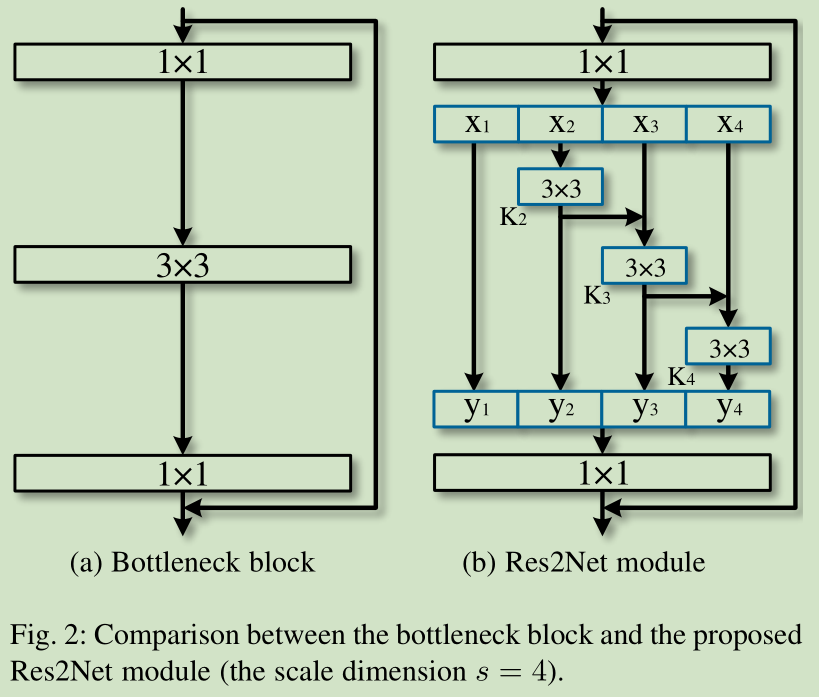

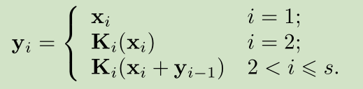

### 2、Res2Net和其他模块组合
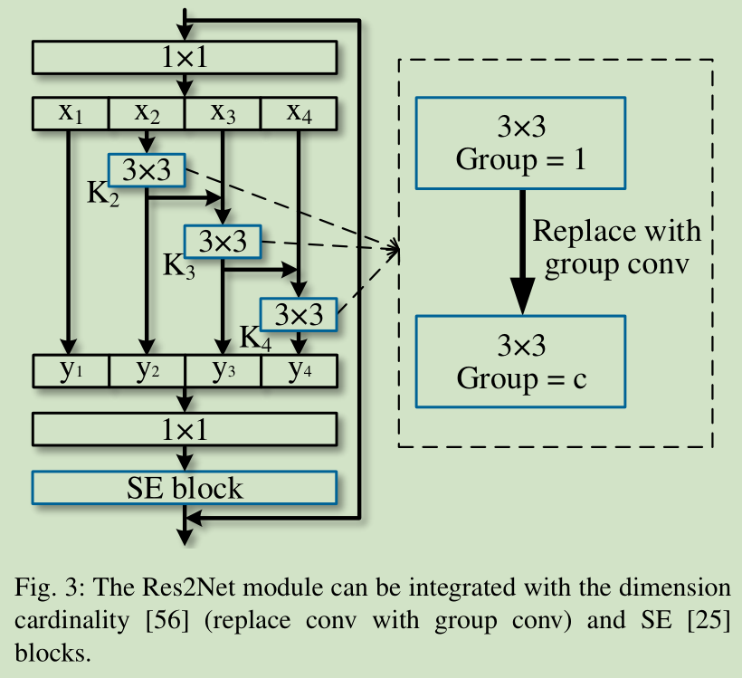
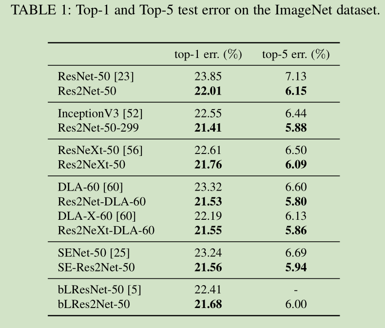

## 三、代码
### 1、Bottle2neck
&emsp;&emsp;可以看到Bottle2neck首先是经过卷积层将输出扩大$s$倍，然后再在扩张后的feature上进行拆分。
```python
class Bottle2neck(nn.Module):
    expansion = 4

    def __init__(self, inplanes, planes, stride=1, downsample=None, baseWidth=26, scale = 4, stype='normal'):
        """ Constructor
        Args:
            inplanes: input channel dimensionality
            planes: output channel dimensionality
            stride: conv stride. Replaces pooling layer.
            downsample: None when stride = 1
            baseWidth: basic width of conv3x3
            scale: number of scale.
            type: 'normal': normal set. 'stage': first block of a new stage.
        """
        super(Bottle2neck, self).__init__()

        width = int(math.floor(planes * (baseWidth/64.0)))
        self.conv1 = nn.Conv2d(inplanes, width*scale, kernel_size=1, bias=False)
        self.bn1 = nn.BatchNorm2d(width*scale)
        
        if scale == 1:
          self.nums = 1
        else:
          self.nums = scale -1
        if stype == 'stage':
            self.pool = nn.AvgPool2d(kernel_size=3, stride = stride, padding=1)
        convs = []
        bns = []
        for i in range(self.nums):
          convs.append(nn.Conv2d(width, width, kernel_size=3, stride = stride, padding=1, bias=False))
          bns.append(nn.BatchNorm2d(width))
        self.convs = nn.ModuleList(convs)
        self.bns = nn.ModuleList(bns)

        self.conv3 = nn.Conv2d(width*scale, planes * self.expansion, kernel_size=1, bias=False)
        self.bn3 = nn.BatchNorm2d(planes * self.expansion)

        self.relu = nn.ReLU(inplace=True)
        self.downsample = downsample
        self.stype = stype
        self.scale = scale
        self.width  = width

    def forward(self, x):
        residual = x

        out = self.conv1(x)
        out = self.bn1(out)
        out = self.relu(out)

        spx = torch.split(out, self.width, 1)
        for i in range(self.nums):
          if i==0 or self.stype=='stage':
            sp = spx[i]
          else:
            sp = sp + spx[i]
          sp = self.convs[i](sp)
          sp = self.relu(self.bns[i](sp))
          if i==0:
            out = sp
          else:
            out = torch.cat((out, sp), 1)
        if self.scale != 1 and self.stype=='normal':
          out = torch.cat((out, spx[self.nums]),1)
        elif self.scale != 1 and self.stype=='stage':
          out = torch.cat((out, self.pool(spx[self.nums])),1)

        out = self.conv3(out)
        out = self.bn3(out)

        if self.downsample is not None:
            residual = self.downsample(x)

        out += residual
        out = self.relu(out)

        return out
```

### 2、Res2Net
```python
class Res2Net(nn.Module):

    def __init__(self, block, layers, baseWidth = 26, scale = 4, num_classes=1000):
        self.inplanes = 64
        super(Res2Net, self).__init__()
        self.baseWidth = baseWidth
        self.scale = scale
        self.conv1 = nn.Conv2d(3, 64, kernel_size=7, stride=2, padding=3,
                               bias=False)
        self.bn1 = nn.BatchNorm2d(64)
        self.relu = nn.ReLU(inplace=True)
        self.maxpool = nn.MaxPool2d(kernel_size=3, stride=2, padding=1)
        self.layer1 = self._make_layer(block, 64, layers[0])
        self.layer2 = self._make_layer(block, 128, layers[1], stride=2)
        self.layer3 = self._make_layer(block, 256, layers[2], stride=2)
        self.layer4 = self._make_layer(block, 512, layers[3], stride=2)
        self.avgpool = nn.AvgPool2d(7, stride=1)
        self.fc = nn.Linear(512 * block.expansion, num_classes)

        for m in self.modules():
            if isinstance(m, nn.Conv2d):
                nn.init.kaiming_normal_(m.weight, mode='fan_out', nonlinearity='relu')
            elif isinstance(m, nn.BatchNorm2d):
                nn.init.constant_(m.weight, 1)
                nn.init.constant_(m.bias, 0)

    def _make_layer(self, block, planes, blocks, stride=1):
        downsample = None
        if stride != 1 or self.inplanes != planes * block.expansion:
            downsample = nn.Sequential(
                nn.Conv2d(self.inplanes, planes * block.expansion,
                          kernel_size=1, stride=stride, bias=False),
                nn.BatchNorm2d(planes * block.expansion),
            )

        layers = []
        layers.append(block(self.inplanes, planes, stride, downsample=downsample, 
                        stype='stage', baseWidth = self.baseWidth, scale=self.scale))
        self.inplanes = planes * block.expansion
        for i in range(1, blocks):
            layers.append(block(self.inplanes, planes, baseWidth = self.baseWidth, scale=self.scale))

        return nn.Sequential(*layers)

    def forward(self, x):
        x = self.conv1(x)
        x = self.bn1(x)
        x = self.relu(x)
        x = self.maxpool(x)

        x = self.layer1(x)
        x = self.layer2(x)
        x = self.layer3(x)
        x = self.layer4(x)

        x = self.avgpool(x)
        x = x.view(x.size(0), -1)
        x = self.fc(x)

        return x
```

## 四、结果
### 一、分类任务
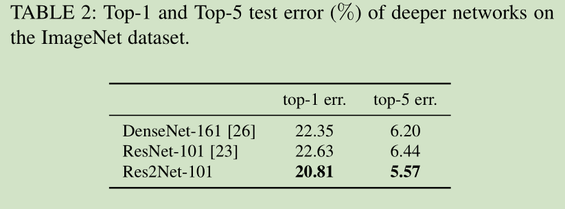
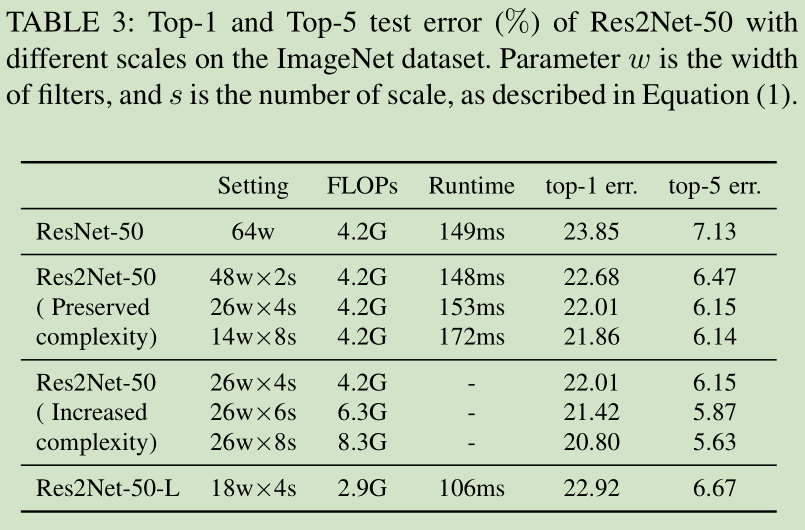
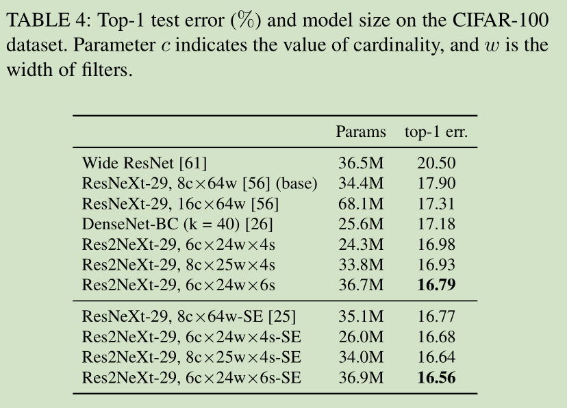
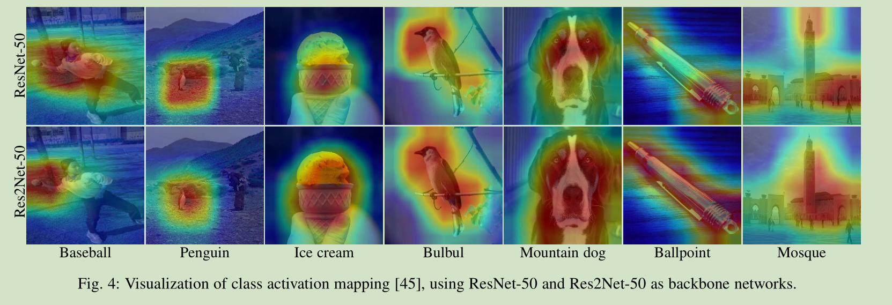
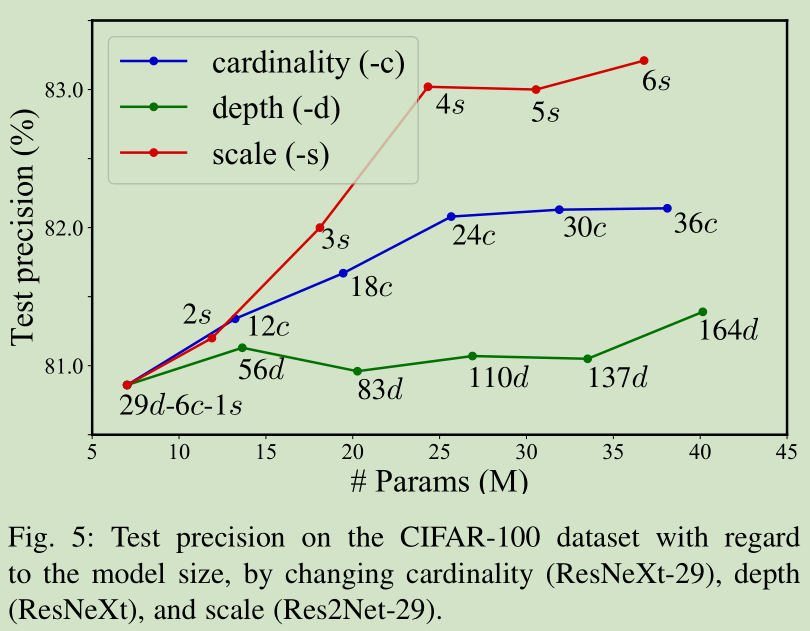
### 二、目标检测
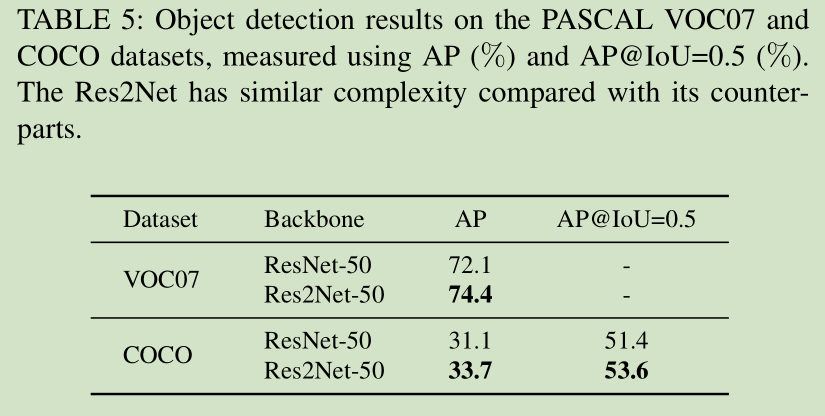
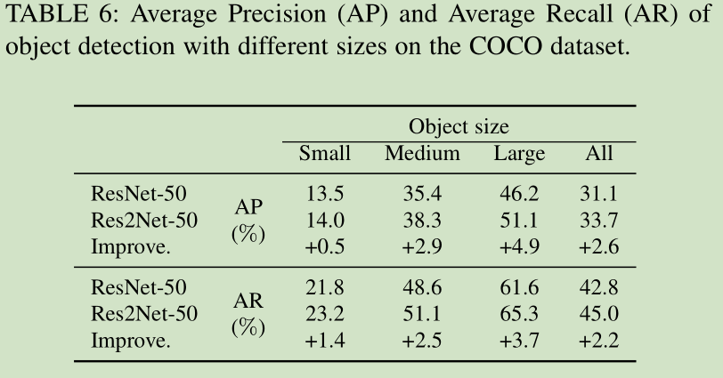
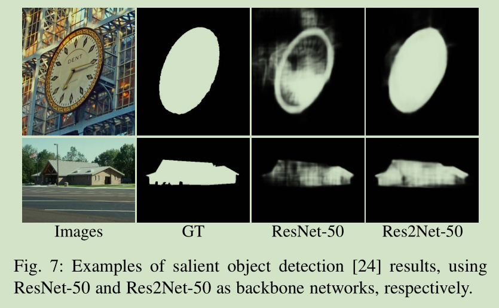
### 三、语义分割
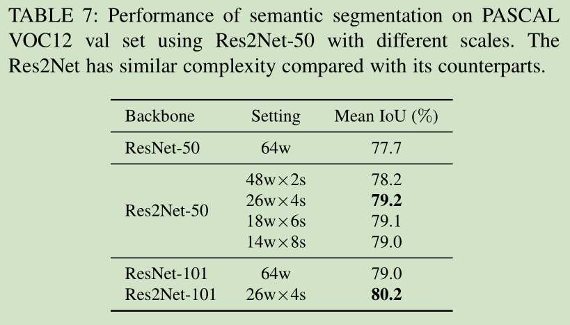
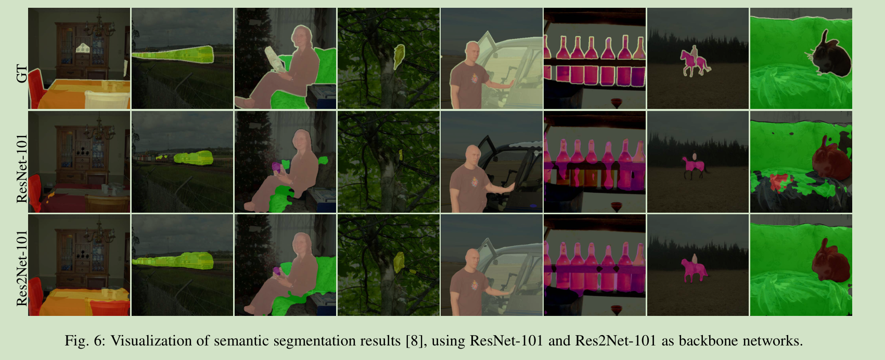
### 四、关键点检测
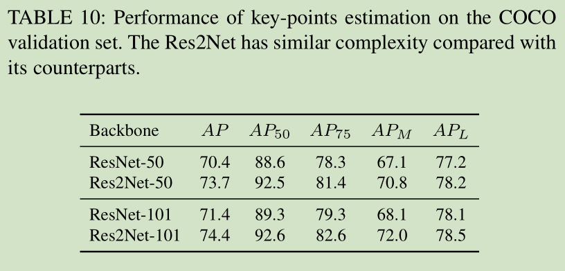