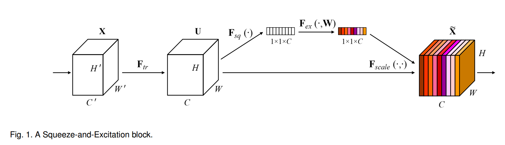
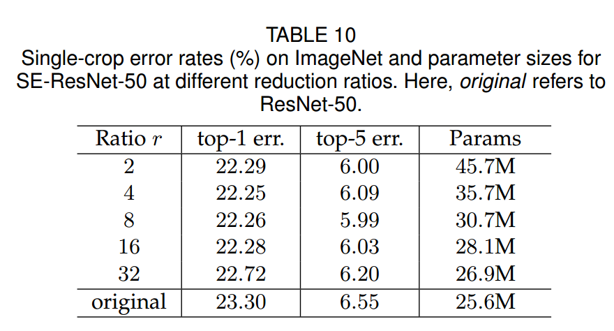
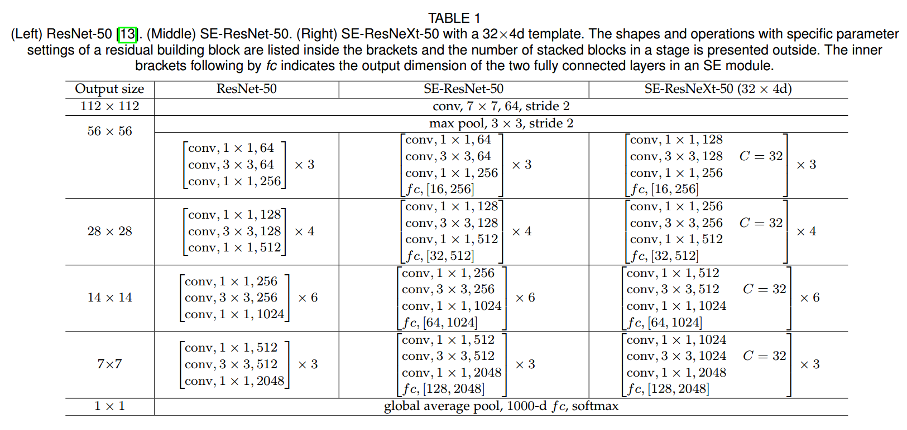
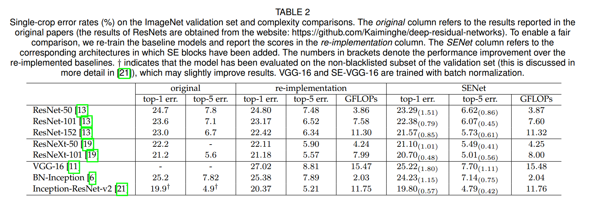
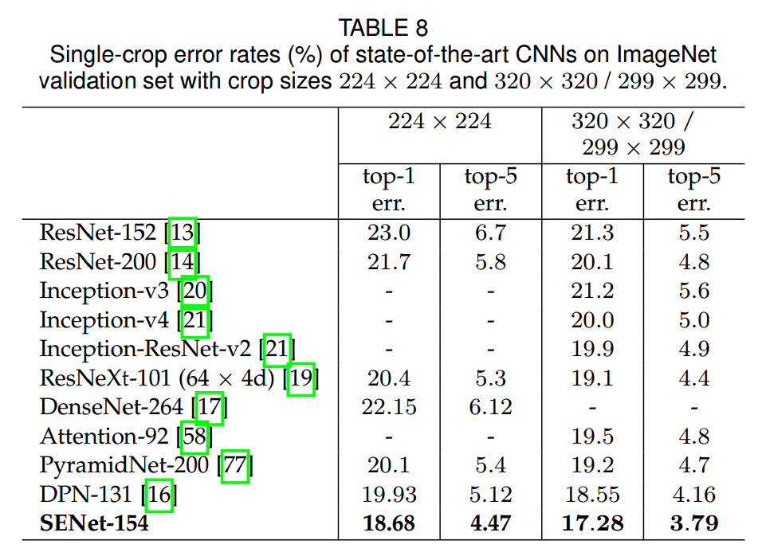
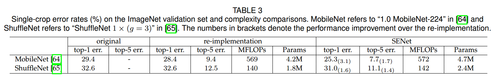
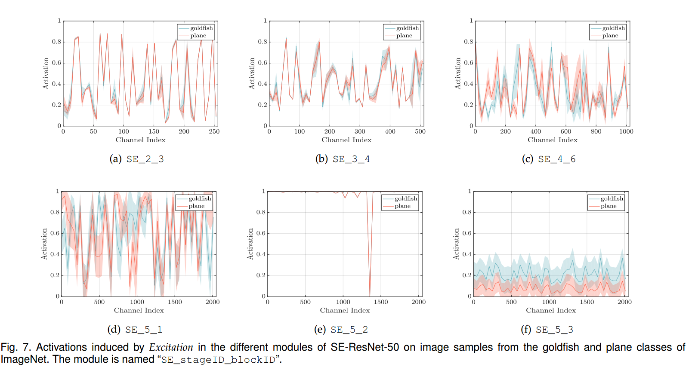
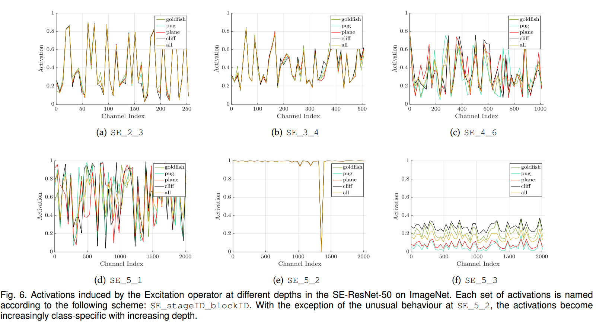

# 《Squeeze-and-Excitation Networks》论文阅读
&emsp;&emsp;论文地址:[Squeeze-and-Excitation Networks](http://xxx.itp.ac.cn/pdf/1709.01507.pdf)
&emsp;&emsp;论文代码:[github](https://github.com/moskomule/senet.pytorch/blob/master/senet/se_module.py)

## 1. 简介
&emsp;&emsp;SENet是207年ILSVRC分类比赛的冠军网络结构，准确的说文章中提出的结构是一个SEBlock，作为一个自学习的子模块，可以嵌入到大部分主流的网络。文中提出的网络SEResNet就是在ResNet的基础上添加了SEBlock结构。
&emsp;&emsp;SEBlock现在可能的叫法为channel-wise attention(通道注意力模块)，准确的来说就是在原来网络的每个bottleneck之后的feature上添加了一个权重矩阵，而这个矩阵可以增强大部分部分feature，抑制部分feature，而增强哪部分，抑制哪部分是完全是根据网络的损失自学习的。
&emsp;激活状态：
&emsp;&emsp;引入了SEBlock当然会导致网络的参数量增加，但是由于SEBlock是作用于每个bottleneck后的feature，一般的网络中的bottleneck也就四五个，而SEBlock的结构本身就简单，也就意味着虽然引入了部分参数但是真实引入的参数量并不多，在可接受的范围内。
&emsp;&emsp;另外说一点，这篇论文的思想很简单，但是实验很充足，有必要实验结果都看一下。
## 2. 网络结构
### 2.1 SEBlock结构

&emsp;&emsp;上图便是SEBlock的结构，其中$X\in R^{H^{'}*W^{'}*C^{'}}$是网络的输入，其中$F_{tr}$为一些列卷积操作的集合$V=[v_1,v_2,...,v_C]$表示卷积操作，$U\in R^{H*W*C}$为经过一系列卷积操作的输出,$U=[u_1,u_2,...,u_C]$:
$$
u_C=v_C*X=\sum_{s=1}^{C^{'}}v_C^s*X^s, *是卷积操作,v_C^s是卷积在单个通道上的操作
$$
&emsp;&emsp;以上就是基本的输入输出。SEBlock分为三个部分Sequeez，Excitation， Scale。
**Sequeeze:**
&emsp;&emsp;Sequeeze操作是将$U$输出压缩成$Z\in R^{1*1*C}$，作者认为传统的卷积操作过于集中于局部地区，而无法提取上下文关系（context），可以通过使用GAP(global average pooling)实现这一点来作用于每个通道上来进行通道选择。
$$
z_c=F_{sq}(u_c)=\frac{1}{H*W}\sum^{H}_{i=1}\sum_{j=1}^{W}u_c(i,j)
$$
**Excitation:**
&emsp;&emsp;这一步是利用具有非线性的Sigmoid激活函数保证非线性的前提下进行通道选择。
$$
s=F_{ex}(z,W)=\sigma(g(z,w))\sigma(W_2\sigma(W_1 z))
$$
&emsp;&emsp;公式中$W_1\in R^{\frac{C}{r}*C}, W_2\in R^{C*\frac{C}{r}}$$\sigma$为$relu$，为了限制网络的复杂度，使用全连接层进行通道reduction。
**Scale：**
&emsp;&emsp;这部分就是将学习到的通道权重应用到原有的feature上去，就是个简单的乘法。
$$
\tilde{x_c}=F_{scale}(u_c, s_c)=s_cu_c,\tilde{X}=[\tilde{x_1},...,\tilde{x_C}]
$$

### 2.2 实现
&emsp;&emsp;SEBlock可以作为子模块插入不同的网络，作者在不同部分的选择过程中进行大量的实验进行比较选择。下面是不同网络实现的内容

#### 2.2.1 SEBlock的实现
&emsp;&emsp;SEBlock的实现基本结构是sequeeze + fn1 + fn2 + excitation,然后原始输入和该结构得到的通道权重相乘即可，而不同分不同实现效果不同，见下面的实验。fn1先将sequeeze得到的权重的通道降低到$\frac{C}{r}$，然再恢复到$C$。
**Sequeeze:**
&emsp;&emsp;Sequeeze操作主要使用GAP(global average pooling)和GMP(global max pooling)，下面是不同的选择的结果

**Excitation:**
&emsp;&emsp;Excitation操作主要可用为ReLU, Tanh, Sigmoid三个操作，下面是不同操作的效果:

**reduction:**
&emsp;&emsp;在具体实现中在sequeeze和excitation操作之间使用了两个全连接层先进行通道调整，而这里的通道调整比例为$r$，不同的$r$取值效果如下：

**插入方式：**
&emsp;&emsp;SEBlock不同的插入方式:


**code**
```python
class se_layer(nn.Module):
    def __init__(self, channel, reduction=16):
        super(se_layer, self).__init__()
        self.avg_pool = nn.AdaptiveAvgPool2d(1)
        self.fc = nn.Sequential(
            nn.Linear(channel, channel // reduction, bias=False),
            nn.ReLU(inplace=True),
            nn.Linear(channel // reduction, channel, bias=False),
            nn.Sigmoid()
        )

    def forward(self, x):
        b, c, _, _ = x.size()
        y = self.avg_pool(x).view(b, c)
        y = self.fc(y).view(b, c, 1, 1)
        return x * y.expand_as(x)


def main():
    import numpy as np
    feature = torch.rand(1, 16,7,7)
    block = se_layer(16)
    feature = block(feature)
    print(feature)
```
#### 2.2.2 网络结构

&emsp;&emsp;上图是不同基础网络的不同实现网络结构。
**模型参数量:**
&emsp;&emsp;使用的基础网络Resnet-50需要~3.86 GFLOPs(224 * 224输入)，而对于引入使用GAP的SEBlock的SE-ResNet-50网络需要~3.87GFLOPs,只增加了0.26%,引入的参数量（即全连接层的参数量）计算公式如下:
$$
\frac{2}{r}\sum_{s=1}^{S}N_sC_s^2
$$
&emsp;&emsp;$r$表示reduction的比例，$S$表示模块插入的stage数量，$C_s$输出通道,$N_s$表示stage重复次数。

## 3. 实验效果
### 1. 实验设置
**数据：**
&emsp;&emsp;ImageNet 2012 (1.2M 训练图,50K验证图，1000个类别)
**指标：**
&emsp;&emsp;top-1 error 和top-5 error
**设置：**
- 数据增强:随机裁剪到224\*224(299\*299 inception-ResNet-v2)，随机水平翻转;
- RGB三通道normalise;
- SGD, momentum 0.9
- minibatch size=1024
- learning rate=0.6，每30个epoch下降10倍


&emsp;&emsp;不同任务的结果：



&emsp;激活状态：

