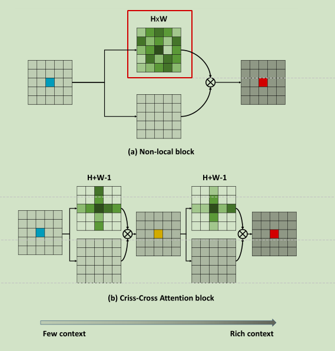
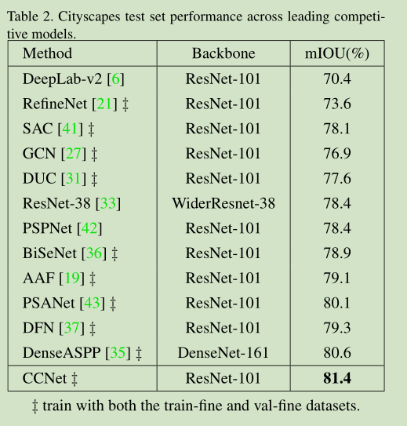
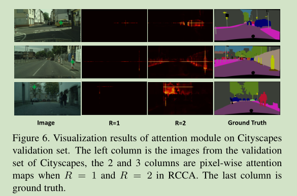
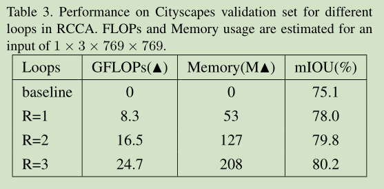
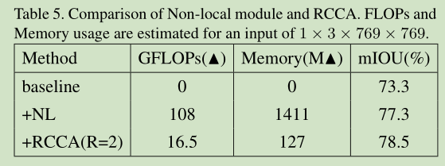

# 《CCNet: Criss-Cross Attention for Semantic Segmentation》论文阅读笔记
&emsp;&emsp;论文地址：[CCNet: Criss-Cross Attention for Semantic Segmentation](https://arxiv.org/pdf/1811.11721.pdf)
&emsp;&emsp;代码地址：[CCNet github](https://github.com/speedinghzl/CCNet)
[toc]
## 一、简介
&emsp;&emsp;CCNet是2018年11月发布的一篇语义分割方面的文章中提到的网络，该网络有三个优势：
- GPU内存友好；
- 计算高效；
- 性能好。

&emsp;&emsp;CCNet之前的论文比如FCNs只能管制局部特征和少部分的上下文信息，空洞卷积只能够集中于当前像素而无法生成密集的上下文信息，虽然PSANet能够生成密集的像素级的上下文信息但是计算效率过低，其计算复杂度高达O((H*W)*(H*W))。因此可以明显的看出，CCNet的目的是高效的生成密集的像素级的上下文信息。
&emsp;&emsp;Cirss-Cross Attention Block的参数对比如下图所示：

&emsp;&emsp;CCNet论文的主要贡献：
- 提出了Cirss-Cross Attention Module；
- 提出了高效利用Cirss-Cross Attention Module的CCNet。
## 二、结构
### 1、CCNet结构
&emsp;&emsp;CCNet的网络结构如下图所示：

&emsp;&emsp;CCNet的基本结构描述如下：
- 1、图像通过特征提取网络得到feature map的大小为$H*W$,为了更高效的获取密集的特征图，将原来的特征提取网络中的后面两个下采样去除，替换为空洞卷积，使得feature map的大小为输入图像的1/8；
- 2、feature map X分为两个分支，分别进入3和4；
- 3、一个分支先将X进行通道缩减压缩特征，然后通过两个CCA（Cirss-Cross Attention）模块，两个模块共享相同的参数，得到特征$H^{''}$；
- 4、另一个分支保持不变为X；
- 5、将3和4两个分支的特征融合到一起最终经过upsample得到分割图像。
### 2、Criss-Cross Attention
&emsp;Criss-Cross Attention模块的结构如下所示，输入feature为$H\in \mathbb{R}^{C*W*H}$,$H$分为$Q,K,V$三个分支，都通过1\*1的卷积网络的进行降维得到${Q,K}\in \mathbb{R}^{C^{'}*W*H}$（$C^{'}<C$）。其中Attention Map $A\in \mathbb{R}^{(H+W-1)*W*H}$是$Q$和$K$通过Affinity操作计算的。Affinity操作定义为:
$$
d_{i,u}=Q_u\Omega_{i,u}^{T}
$$
&emsp;&emsp;其中$Q_u\in\mathbb{R}^{C^{'}}$是在特征图Q的空间维度上的u位置的值。$\Omega_u\in\mathbb{R}^{(H+W-1)C^{'}}$是$K$上$u$位置处的同列和同行的元素的集合。因此，$\Omega_{u,i}\in\mathbb{R}^{C^{'}}$是$\Omega_u$中的第$i$个元素，其中$i=[1,2,...,|\Omega_u|]$。而$d_{i,u}\in D$表示$Q_u$和$\Omega_{i,u}$之间的联系的权重,$D\in \mathbb{R}^{(H+W-1)*W*H}$。最后对$D$进行在通道维度上继续进行softmax操作计算Attention Map $A$。
&emsp;&emsp;另一个分支$V$经过一个1\*1卷积层得到$V \in \mathbb{R}^{C*W*H}$的适应性特征。同样定义$V_u \in \mathbb{R}^C$和$\Phi_u\in \mathbb{R}^{(H+W-1)*C}$则定义Aggregation操作为:
$$
H_u^{'}\sum_{i \in |\Phi_u|}{A_{i,u}\Phi_{i,u}+H_u}
$$
&emsp;&emsp;该操作在保留原有feature的同时使用经过attention处理过的feature来保全feature的语义性质。


### 3、Recurrent Criss-Cross Attention
&emsp;&emsp;单个Criss-Cross Attention模块能够提取更好的上下文信息，但是下图所示，根据criss-cross attention模块的计算方式左边右上角蓝色的点只能够计算到和其同列同行的关联关系，也就是说相应的语义信息的传播无法到达左下角的点，因此再添加一个Criss-Cross Attention模块可以将该语义信息传递到之前无法传递到的点。

&emsp;&emsp;采用Recurrent Criss-Cross Attention之后，先定义loop=2，第一个loop的attention map为$A$，第二个loop的attention map为$A^{'}$，从原feature上位置$x^{'},y^{'}$到权重$A_{i,x,y}$的映射函数为$A_{i,x,y}=f(A,x,y,x^{'},y^{'})$，feature $H$中的位置用$\theta$表示，feature中$H^{''}$用$u$表示，如果$u$和$\theta$相同则:
$$
H_u^{''}\leftarrow[f(A,u,\theta)+1]\cdot f(A^{'},u,\theta)\cdot H_{\theta}
$$
&emsp;&emsp;其中$\leftarrow$表示加到操作，如果$u$和$\theta$不同则:
$$
H_u^{''}\leftarrow[f(A,u_x,\theta_{y}, \theta_{x}, \theta_{y})\cdot f(A^{'},u_x,u_{y}, u_{x}, \theta_{y})+f(A,\theta_x,u_{y}, \theta_{x}, \theta_{y})\cdot f(A^{'},u_x,u_{y}, \theta_{x}, \theta_{y})]\cdot H_{\theta}
$$
&emsp;&emsp;Cirss-Cross Attention模块可以应用于多种任务不仅仅是语义分割，作者同样在多种任务中使用了该模块，可以参考论文。
### 4、代码
&emsp;&emsp;下面是Cirss-Cross Attention模块的代码可以看到ca_weight便是Affinity操作，ca_map便是Aggregation操作。
```python
class CrissCrossAttention(nn.Module):
    """ Criss-Cross Attention Module"""
    def __init__(self,in_dim):
        super(CrissCrossAttention,self).__init__()
        self.chanel_in = in_dim

        self.query_conv = nn.Conv2d(in_channels = in_dim , out_channels = in_dim//8 , kernel_size= 1)
        self.key_conv = nn.Conv2d(in_channels = in_dim , out_channels = in_dim//8 , kernel_size= 1)
        self.value_conv = nn.Conv2d(in_channels = in_dim , out_channels = in_dim , kernel_size= 1)
        self.gamma = nn.Parameter(torch.zeros(1))

    def forward(self,x):
        proj_query = self.query_conv(x)
        proj_key = self.key_conv(x)
        proj_value = self.value_conv(x)

        energy = ca_weight(proj_query, proj_key)
        attention = F.softmax(energy, 1)
        out = ca_map(attention, proj_value)
        out = self.gamma*out + x

        return out
```
&emsp;&emsp;Affinity操作定义如下：
```python
class CA_Weight(autograd.Function):
    @staticmethod
    def forward(ctx, t, f):
        # Save context
        n, c, h, w = t.size()
        size = (n, h+w-1, h, w)
        weight = torch.zeros(size, dtype=t.dtype, layout=t.layout, device=t.device)

        _ext.ca_forward_cuda(t, f, weight)
        
        # Output
        ctx.save_for_backward(t, f)

        return weight

    @staticmethod
    @once_differentiable
    def backward(ctx, dw):
        t, f = ctx.saved_tensors

        dt = torch.zeros_like(t)
        df = torch.zeros_like(f)

        _ext.ca_backward_cuda(dw.contiguous(), t, f, dt, df)

        _check_contiguous(dt, df)

        return dt, df
```
&emsp;&emsp;Aggregation操作定义如下：
```python
class CA_Map(autograd.Function):
    @staticmethod
    def forward(ctx, weight, g):
        # Save context
        out = torch.zeros_like(g)
        _ext.ca_map_forward_cuda(weight, g, out)
        
        # Output
        ctx.save_for_backward(weight, g)

        return out

    @staticmethod
    @once_differentiable
    def backward(ctx, dout):
        weight, g = ctx.saved_tensors

        dw = torch.zeros_like(weight)
        dg = torch.zeros_like(g)

        _ext.ca_map_backward_cuda(dout.contiguous(), weight, g, dw, dg)

        _check_contiguous(dw, dg)

        return dw, dg
```
&emsp;&emsp;其中使用ext是c库文件:

&emsp;&emsp;RCC模块的实现如下所示：
```python
class RCCAModule(nn.Module):
    def __init__(self, in_channels, out_channels, num_classes):
        super(RCCAModule, self).__init__()
        inter_channels = in_channels // 4
        self.conva = nn.Sequential(nn.Conv2d(in_channels, inter_channels, 3, padding=1, bias=False),
                                   InPlaceABNSync(inter_channels))
        self.cca = CrissCrossAttention(inter_channels)
        self.convb = nn.Sequential(nn.Conv2d(inter_channels, inter_channels, 3, padding=1, bias=False),
                                   InPlaceABNSync(inter_channels))

        self.bottleneck = nn.Sequential(
            nn.Conv2d(in_channels+inter_channels, out_channels, kernel_size=3, padding=1, dilation=1, bias=False),
            InPlaceABNSync(out_channels),
            nn.Dropout2d(0.1),
            nn.Conv2d(512, num_classes, kernel_size=1, stride=1, padding=0, bias=True)
            )

    def forward(self, x, recurrence=1):
        output = self.conva(x)
        for i in range(recurrence):
            output = self.cca(output)
        output = self.convb(output)

        output = self.bottleneck(torch.cat([x, output], 1))
        return output
```
&emsp;&emsp;CCNet的整体结构:
```python
class ResNet(nn.Module):
    def __init__(self, block, layers, num_classes):
        self.inplanes = 128
        super(ResNet, self).__init__()
        self.conv1 = conv3x3(3, 64, stride=2)
        self.bn1 = BatchNorm2d(64)
        self.relu1 = nn.ReLU(inplace=False)
        self.conv2 = conv3x3(64, 64)
        self.bn2 = BatchNorm2d(64)
        self.relu2 = nn.ReLU(inplace=False)
        self.conv3 = conv3x3(64, 128)
        self.bn3 = BatchNorm2d(128)
        self.relu3 = nn.ReLU(inplace=False)
        self.maxpool = nn.MaxPool2d(kernel_size=3, stride=2, padding=1)

        self.relu = nn.ReLU(inplace=False)
        self.maxpool = nn.MaxPool2d(kernel_size=3, stride=2, padding=1, ceil_mode=True) # change
        self.layer1 = self._make_layer(block, 64, layers[0])
        self.layer2 = self._make_layer(block, 128, layers[1], stride=2)
        self.layer3 = self._make_layer(block, 256, layers[2], stride=1, dilation=2)
        self.layer4 = self._make_layer(block, 512, layers[3], stride=1, dilation=4, multi_grid=(1,1,1))
        #self.layer5 = PSPModule(2048, 512)
        self.head = RCCAModule(2048, 512, num_classes)

        self.dsn = nn.Sequential(
            nn.Conv2d(1024, 512, kernel_size=3, stride=1, padding=1),
            InPlaceABNSync(512),
            nn.Dropout2d(0.1),
            nn.Conv2d(512, num_classes, kernel_size=1, stride=1, padding=0, bias=True)
            )

    def forward(self, x, recurrence=1):
    x = self.relu1(self.bn1(self.conv1(x)))
    x = self.relu2(self.bn2(self.conv2(x)))
    x = self.relu3(self.bn3(self.conv3(x)))
    x = self.maxpool(x)
    x = self.layer1(x)
    x = self.layer2(x)
    x = self.layer3(x)
    x_dsn = self.dsn(x)
    x = self.layer4(x)
    x = self.head(x, recurrence)
    return [x, x_dsn]
```
## 三、结果
&emsp;&emsp;与主流的方法的比较:

&emsp;&emsp;下面是不同loop时的效果可以看到loop=2时的效果要比loop=2好。下面是不同loop的attention map。




