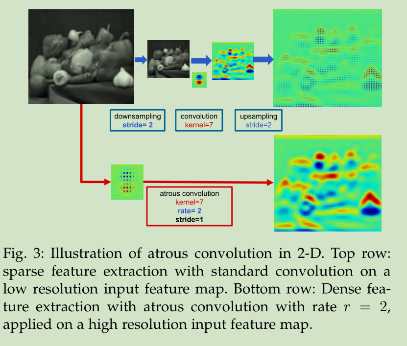
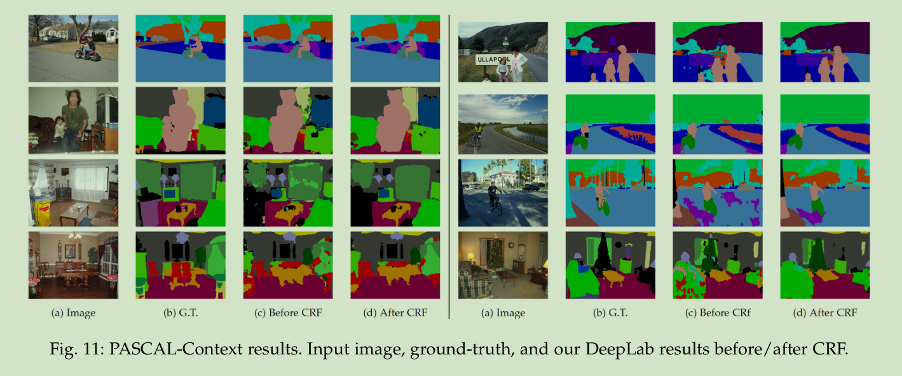

# Deeplab系列论文阅读笔记
**DeepLabv1:**
&emsp;&emsp;论文地址：[DeepLab: Semantic Image Segmentation with Deep Convolutional Nets, Atrous Convolution, and Fully Connected CRFs](https://arxiv.org/pdf/1606.00915.pdf)
&emsp;&emsp;论文代码：[github](https://github.com/isht7/pytorch-deeplab-resnet)
**DeepLabv2:**
&emsp;&emsp;论文地址：
&emsp;&emsp;代码地址：
**DeepLabv3:**
&emsp;&emsp;论文地址：
&emsp;&emsp;代码地址：
**DeepLabv3+:**
&emsp;&emsp;论文地址：
&emsp;&emsp;代码地址：

[toc]
## 一、DeepLabv1
### 1、简介
&emsp;&emsp;使用深度学习进行语义分割主要有多个方面的挑战：1、深度网络中对输入进行多次下采样，降低了feature的分辨率丢失了部分信息；2、图像中目标是多尺度的；3、由于深度网络的不变性导致位置信息丢失。作者针对这三个问题提出了DeepLab，作者的主要贡献是：
- 移除原有深度网络的部分下采样层，在之后网络中使用空洞卷积对feature进行上采样；
- 提出了ASPP（Atrous Spatial Pyramid Pooling）对feature进行多尺度的提取；
- 提出了全连接的CRF（Conditional Random Field）。

&emsp;&emsp;该网络的三个优势:
- 速度快；
- 准确率高；
- 网络简单

### 2、网络结构

#### 1、Atrous Convolution
&emsp;&emsp;空洞卷积，文中称（atrous convolution）的公式如下：
$$
y[i] = \sum_{k=1}^{K}{x[i+rk]w[k]}
$$
&emsp;&emsp;其中$y$为输出，$x$为输入，$i$为输入索引，$k$为卷积核内索引，当$r=1$时就是标准的卷积核。下面两张图时空洞卷积的结构，可以看到空洞卷积只是标准卷积的卷积核采样之间补零来扩大感受野。需要注意的是，虽然该层的感受野得到了很大的提升但是也会导致网络在信息提取时掠过一些点而丢失部分信息。

&emsp;&emsp;下图时空洞卷积的feature和标准卷积的feature对比：

#### 2、Atrous Spatial Pyramid Pooling

&emsp;&emsp;ASPP的结构很简单就是将同一个feature经过多个不同尺寸的空洞卷积进行采样融合后得到的。

#### 3、Fully Connected CRF
&emsp;&emsp;CRF方法已经很早用于语义分割，一般都是用来进行平滑噪声，但是其高昂的计算代价和会丢失部分结构信息这个缺陷是不容忽视的。相比于short-range CRFs，作者提取了fully connected CRFs，其能量函数如下：
$$
E(x)=\sum_{i}{\theta_i(x_i)}+\sum_{ij}{\theta_{ij}(x_i,x_j)}
$$
&emsp;&emsp;其中$\theta_{i}(x_i)=-logP(x_i)$,$P(x_i)$为位置$i$的分类概率。

$$
\theta_{ij}(x_i,x_j)=μ(x_i,x_j)[w_1e^{(-\frac{||p_i-p_j||^2}{2\sigma^2_\alpha}-\frac{||I_i-I_j||^2}{2\sigma^2_\beta})}+w_2e^{-\frac{||p_i-p_j||^2}{2\sigma^2_\gamma}}]
$$
&emsp;&emsp;其中$\mu(x_i,x_j)=1,ifx_i\neq x_j, otherwise 0$表示只有不同点是才有惩罚。并且可以看到公式中用到了两个高斯核：第一个惩罚值取决于像素的位置和颜色($I$)，第二个只取决于像素的位置。第一个内核强制具有相似颜色和位置的像素具有相似的标签，而第二个内核仅在强制执行平滑性时才考虑空间接近性。

### 3、结果

## 二、DeepLabv2

## 三、DeepLabv3

## 四、DeepLabv3+