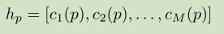
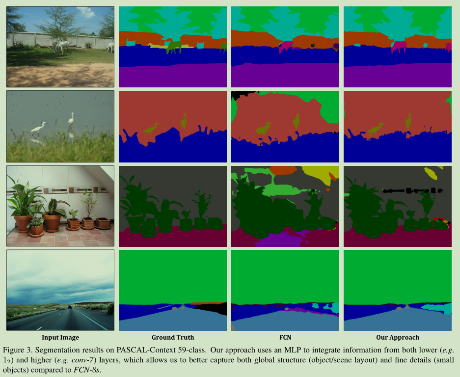
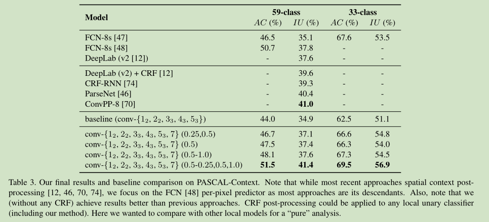

# PixelNet论文笔记
[toc]

&emsp;&emsp;这篇论文没怎么看懂
&emsp;&emsp;[PixelNet: Towards a General Pixel-Level Architecture](https://arxiv.org/pdf/1609.06694.pdf)
&emsp;&emsp;[github](https://github.com/aayushbansal/PixelNet)
## 一、简介
&emsp;&emsp;pixelnet相比于之前的fcns等网络而言参数量更加少，而且将采样的思想引入到了特征提取的层面上。
## 二、网络结构
### 1、网络结构
&emsp;&emsp;
&emsp;&emsp;图示的网络的结构只是网络的特征提取器的结构和最终的方法的结构不同，最终的方式是对每一个层次的feature成为一个超柱描述器，而每一层的特征是通过线性插值或者转置卷积还原到原来的只存的大小，然后通过下面的python代码的方式进行采样，最终通过一个mlp对每个像素点进行采样最终得到具体像素的分类。另外采样是对单张图像的采样。


&emsp;&emsp;该多尺度采样层直接提取与$c_i$中最接近像素位置$p_j$的4个离散位置相对应的4个卷积特征，然后通过来即时计算$c_i(p_j)$双线性插值代码如下。
```python
def c_i(self, pixels_set, layers):
    hypercols_for_batch = torch.cuda.FloatTensor()
    for j,batch_item in enumerate(pixels_set):
        x = batch_item[:, 1]  # gets all the x_coords
        y = batch_item[:, 2]  # gets all the y_coords
        hypercols = torch.cuda.FloatTensor()
        for i, layer in enumerate(layers):
            layer_height = layer[j].size(1)
            layer_width = layer[j].size(2)
            tx = (x.type(self.dtype) - self.padding_rate[i]) / self.comp_rate[i]
            ty = (y.type(self.dtype) - self.padding_rate[i]) / self.comp_rate[i]
            tx1 = torch.floor(tx).type(torch.cuda.LongTensor)
            ty1 = torch.floor(ty).type(torch.cuda.LongTensor)
            # tx1 = tx - 1
            # ty1 = ty - 1

            tx2 = tx1 + 1
            ty2 = ty1 + 1

            tx1 = torch.clamp(tx1, 0, layer_width - 1)
            tx2 = torch.clamp(tx2, 0, layer_width - 1)
            ty1 = torch.clamp(ty1, 0, layer_height - 1)
            ty2 = torch.clamp(ty2, 0, layer_height - 1)

            Ia = layer[j][:, ty1, tx1]
            Ib = layer[j][:, ty2, tx1]
            Ic = layer[j][:, ty1, tx2]
            Id = layer[j][:, ty2, tx2]

            wa = (tx2 - x) * (ty2 - y)
            wb = (tx2 - x) * (y - ty1)
            wc = (x - tx1) * (ty2 - y)
            wd = (x - tx1) * (y - ty1)

            upsampled_layer = wa.type(self.dtype)*Ia + wb.type(self.dtype)*Ib + wc.type(self.dtype)*Ic + wd.type(self.dtype)*Id
            hypercols = torch.cat((hypercols,upsampled_layer.unsqueeze(0)),1)
        hypercols_for_batch = torch.cat((hypercols,hypercols_for_batch))
    return hypercols_for_batch
```
&emsp;&emsp;文中使用的mlp分类器如下，是一个简单的两层非线性分类器。
```python
    self.MLP_Layer = torch.nn.Sequential(
        torch.nn.Linear(self.sample_size * 960, 4096),
        torch.nn.ReLU(),
        torch.nn.Dropout(p=0.5),
        torch.nn.Linear(4096, self.sample_size),
        torch.nn.Dropout(p=0.5)
    )
```
## 三、结果
&emsp;&emsp;与其他网络的对比图，明显看到pixelnet的整体性效果是挺好的但是有明显的分类错误：
&emsp;&emsp;
&emsp;&emsp;不同参数的对比图：
&emsp;&emsp;
&emsp;&emsp;与FCNs的参数量对比图，本文的方法的参数两要少的很多，虽然使用了全连接层但是相比于传统的分类网络这里的全连接层很小而且负担的任务很小：
&emsp;&emsp;
&emsp;&emsp;不同采样率对比图，可以看到小的采样率并不会使得网络的性能下降，而且能够降低计算量：

&emsp;&emsp;在数据集BSDS上的对比：
