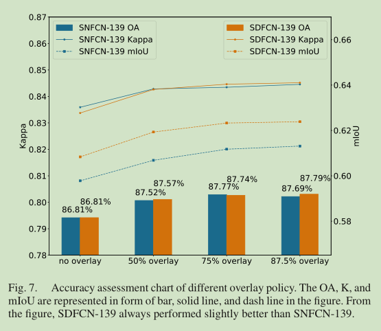

# SDFCN论文阅读笔记
&emsp;&emsp;这篇论文没什么想说的感觉就是抄的。

## 一、简介
&emsp;&emsp;没什么简介，文章中说是基于FCNs，但是从结构上明显是U-Net的身影，而且这篇论文发表于2018年9月，另外一篇基于U-Net改的论文R2U-Net和这个结构很相似只不过用的是现在比较常用的Residual模块，这也合乎常理，毕竟resnet作为比较成功的结构。可能网络是基于一个全新的backbone也说不定。问题是没有目的的修改网络的结构，挺别扭的。
## 二、模型
&emsp;&emsp;下面是模型的总体结构图，第一种就是去除连接层的U-Net，第二种结构上就是U-Net：

&emsp;&emsp;下面是论文中使用的shortcut结构，这里再每个block中将模型的channel数量拓宽了4倍，虽然说更多的神经元数量意味着更加丰富的信息但是这样简单粗暴的拓宽神经元的channel不会导致参数两暴涨吗？，也许每个block将原来的两个3\*3的卷积变成单个3\*3的卷积和两个1\*1卷积可以提升网络的非线性能力的同时减少参数量。

## 三、结果

