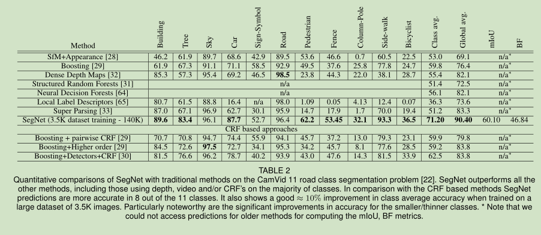

# SegNet论文阅读笔记
[toc]
&emsp;&emsp;论文链接:[SegNet: A Deep Convolutional Encoder-Decoder Architecture for Image Segmentation](https://arxiv.org/pdf/1511.00561.pdf)
&emsp;&emsp;代码链接:[github](https://github.com/ZijunDeng/pytorch-semantic-segmentation)
## 一、简介
&emsp;&emsp;SegNet是比较早期的一个编码器-解码器语义分割网络，相比于FCNs能够在保证性能的同时降低运算量。（论文因为是发表于早期卷积网络并不是特别广泛应用的时候，因此论文中多次一些卷积网络相关的基础内容进行了解释，笔记中不会进行进一步的描述）。
## 二、网络结构
### 1、结构
&emsp;&emsp;如下与为SegNet的网络结构，其结构和U-Net非常相似，唯一不同的地方是SegNet中的高层和低层特征融合使用的是concat，而U-Net使用的是直接相加，另外SegNet的基本结构是基于Vgg16的前13层提取出来的，而U-Net并不是。另外说一点，SegNet的网络参数的贡献应该来自于FCNs，抛弃了全连接层因为VGG16参数量过多完全是因为全连接层的参数量巨大。
&emsp;&emsp;如下图为SegNet的网络结构代码，其结构很清晰没有必要做过多的解释。

```python
class _DecoderBlock(nn.Module):
    def __init__(self, in_channels, out_channels, num_conv_layers):
        super(_DecoderBlock, self).__init__()
        middle_channels = in_channels / 2
        layers = [
            nn.ConvTranspose2d(in_channels, in_channels, kernel_size=2, stride=2),
            nn.Conv2d(in_channels, middle_channels, kernel_size=3, padding=1),
            nn.BatchNorm2d(middle_channels),
            nn.ReLU(inplace=True)
        ]
        layers += [
                      nn.Conv2d(middle_channels, middle_channels, kernel_size=3, padding=1),
                      nn.BatchNorm2d(middle_channels),
                      nn.ReLU(inplace=True),
                  ] * (num_conv_layers - 2)
        layers += [
            nn.Conv2d(middle_channels, out_channels, kernel_size=3, padding=1),
            nn.BatchNorm2d(out_channels),
            nn.ReLU(inplace=True),
        ]
        self.decode = nn.Sequential(*layers)

    def forward(self, x):
        return self.decode(x)
```

```python
class SegNet(nn.Module):
    def __init__(self, num_classes, pretrained=True):
        super(SegNet, self).__init__()
        vgg = models.vgg19_bn()
        if pretrained:
            vgg.load_state_dict(torch.load(vgg19_bn_path))
        features = list(vgg.features.children())
        self.enc1 = nn.Sequential(*features[0:7])
        self.enc2 = nn.Sequential(*features[7:14])
        self.enc3 = nn.Sequential(*features[14:27])
        self.enc4 = nn.Sequential(*features[27:40])
        self.enc5 = nn.Sequential(*features[40:])

        self.dec5 = nn.Sequential(
            *([nn.ConvTranspose2d(512, 512, kernel_size=2, stride=2)] +
              [nn.Conv2d(512, 512, kernel_size=3, padding=1),
               nn.BatchNorm2d(512),
               nn.ReLU(inplace=True)] * 4)
        )
        self.dec4 = _DecoderBlock(1024, 256, 4)
        self.dec3 = _DecoderBlock(512, 128, 4)
        self.dec2 = _DecoderBlock(256, 64, 2)
        self.dec1 = _DecoderBlock(128, num_classes, 2)
        initialize_weights(self.dec5, self.dec4, self.dec3, self.dec2, self.dec1)

    def forward(self, x):
        enc1 = self.enc1(x)
        enc2 = self.enc2(enc1)
        enc3 = self.enc3(enc2)
        enc4 = self.enc4(enc3)
        enc5 = self.enc5(enc4)

        dec5 = self.dec5(enc5)
        dec4 = self.dec4(torch.cat([enc4, dec5], 1))
        dec3 = self.dec3(torch.cat([enc3, dec4], 1))
        dec2 = self.dec2(torch.cat([enc2, dec3], 1))
        dec1 = self.dec1(torch.cat([enc1, dec2], 1))
        return dec1
```
### 2、Pooling indices
&emsp;&emsp;和其他网络不同之处，下采样的过程中保留了原来pooling数值的位置，然后恢复时再恢复这里的信息，而不是直接用使用deconvolution进行上采样，能够减少计算量的同时节省内存。

## 三、实验
### 1、实验设置
- 使用固定学习率0.1和动量0.9的随机梯度下降（SGD），使用Caffe实现SegNet-Basic；
- 在每个epoch之前都shuffle一次，然后按顺序构成minibatch（batchsize=12），从而确保每个图像在一个epoch中只被使用一次；
- 使用交叉熵损失。
### 2、实验结果

