# Deeplab系列论文阅读笔记
**DeepLabv1:**
&emsp;&emsp;论文地址：[SEMANTIC IMAGE SEGMENTATION WITH DEEP CONVOLUTIONAL NETS AND FULLY C ONNECTED CRFS](https://arxiv.org/pdf/1412.7062v3.pdf)
&emsp;&emsp;论文代码：[github](https://github.com/TheLegendAli/DeepLab-Context)
**DeepLabv2:**
&emsp;&emsp;论文地址：[DeepLab: Semantic Image Segmentation with Deep Convolutional Nets, Atrous Convolution, and Fully Connected CRFs](https://arxiv.org/pdf/1606.00915.pdf)
&emsp;&emsp;代码地址：[github](https://github.com/DrSleep/tensorflow-deeplab-resnet)
**DeepLabv3:**
&emsp;&emsp;论文地址：[Rethinking Atrous Convolution for Semantic Image Segmentation](https://arxiv.org/abs/1706.05587)
&emsp;&emsp;代码地址：[github](https://github.com/NanqingD/DeepLabV3-Tensorflow)
**DeepLabv3+:**
&emsp;&emsp;论文地址：[Encoder-Decoder with Atrous Separable Convolution for Semantic Image Segmentation](https://arxiv.org/abs/1802.02611v1)
&emsp;&emsp;代码地址：[github](https://github.com/tensorflow/models/tree/master/research/deeplab)

[toc]
## 一、DeepLabv1
### 1、简介
&emsp;&emsp;现有的深度学习网络存在两个问题：
- 经过下采样的feature会丢失信息特别是细节信息，这偏偏是语义分割任务中最需要的之一；
- 现如今使用的大多数backbone都是再分类任务上进行验证的因此迫于分类任务的不变性，网络会丢失细节的feature。

&emsp;&emsp;针对上面的问题作者提出了全连接的CRF来捕获细微的细节信息。

### 2、网络结构
&emsp;&emsp;将VGG16的分类层换成卷积层变成全卷积网络，为了防止下采样导致分辨率过小，在最后的两个最大池化层不下采样(padding到原大小)，再通过2或4的采样率的空洞卷积对特征图做采样扩大感受野，缩小步幅。

#### 1)、空洞卷积
&emsp;&emsp;网络中使用了空洞卷积：
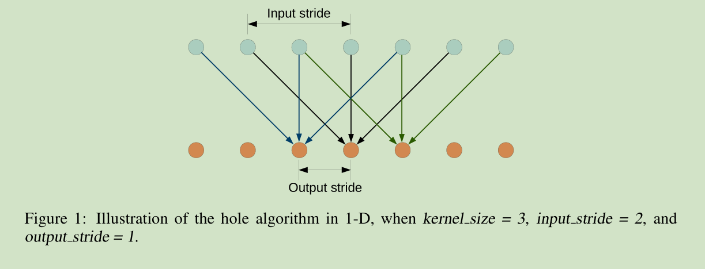

#### 2)、CRF
&emsp;&emsp;CRF方法已经很早用于语义分割，一般都是用来进行平滑噪声，但是其高昂的计算代价和会丢失部分结构信息这个缺陷是不容忽视的。相比于short-range CRFs，作者提取了fully connected CRFs，其能量函数如下：
$$
E(x)=\sum_{i}{\theta_i(x_i)}+\sum_{ij}{\theta_{ij}(x_i,x_j)}
$$
&emsp;&emsp;其中$\theta_{i}(x_i)=-logP(x_i)$,$P(x_i)$为位置$i$的分类概率。

$$
\theta_{ij}(x_i,x_j)=μ(x_i,x_j)[w_1e^{(-\frac{||p_i-p_j||^2}{2\sigma^2_\alpha}-\frac{||I_i-I_j||^2}{2\sigma^2_\beta})}+w_2e^{-\frac{||p_i-p_j||^2}{2\sigma^2_\gamma}}]
$$
&emsp;&emsp;其中$\mu(x_i,x_j)=1,ifx_i\neq x_j, otherwise 0$表示只有不同点是才有惩罚。并且可以看到公式中用到了两个高斯核：第一个惩罚值取决于像素的位置和颜色($I$)，第二个只取决于像素的位置。第一个内核强制具有相似颜色和位置的像素具有相似的标签，而第二个内核仅在强制执行平滑性时才考虑空间接近性。
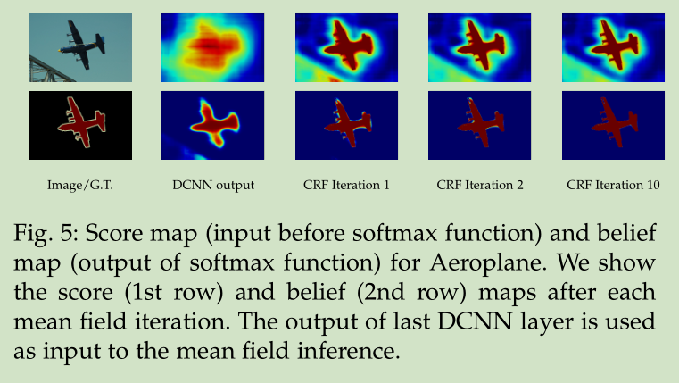

#### 3)、多尺度预测
&emsp;&emsp;在输入图像和前四个最大池化层的输出上附加了两层的MLP(第一层是128个3×3卷积，第二层是128个1×1卷积)，最终输出的特征映射送到模型的最后一层辅助预测，合起来模型最后的softmax层输入特征多了5×128=640个通道，实验表示多尺度有助于提升预测结果，但是效果不如CRF明显。

### 3、结果
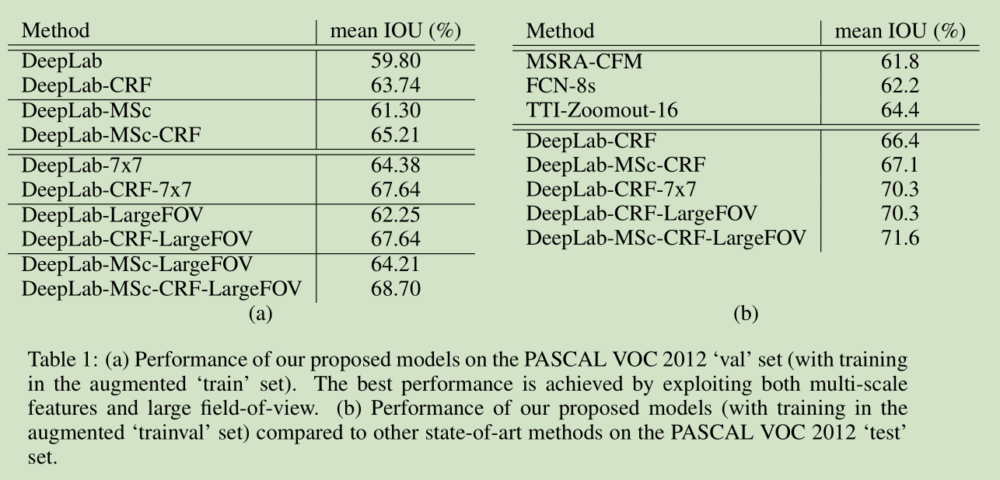
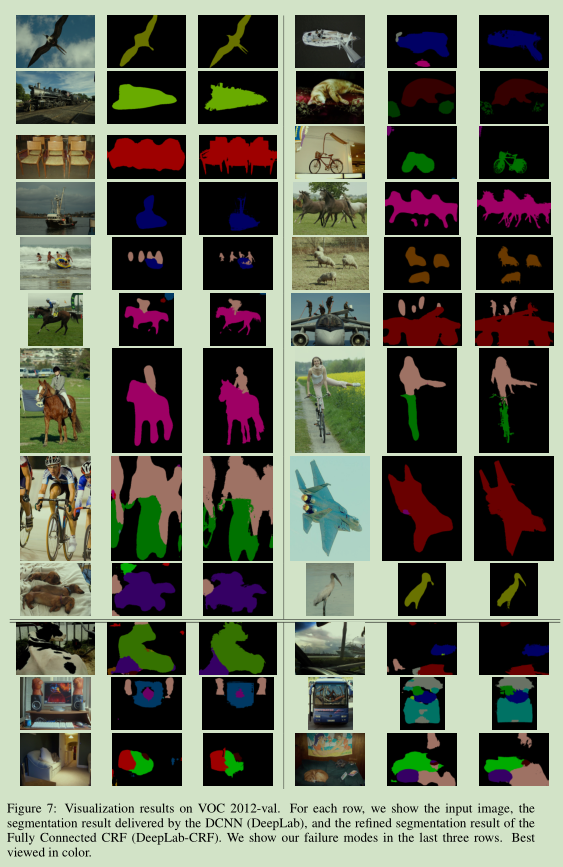

## 二、DeepLabv2
### 1、简介
&emsp;&emsp;使用深度学习进行语义分割主要有多个方面的挑战：1、深度网络中对输入进行多次下采样，降低了feature的分辨率丢失了部分信息；2、图像中目标是多尺度的；3、由于深度网络的不变性导致位置信息丢失。作者针对这三个问题提出了DeepLab，作者的主要贡献是：
- 移除原有深度网络的部分下采样层，在之后网络中使用空洞卷积对feature进行上采样；
- 提出了ASPP（Atrous Spatial Pyramid Pooling）对feature进行多尺度的提取；
- 提出了全连接的CRF（Conditional Random Field）。

&emsp;&emsp;该网络的三个优势:
- 速度快；
- 准确率高；
- 网络简单

### 2、网络结构
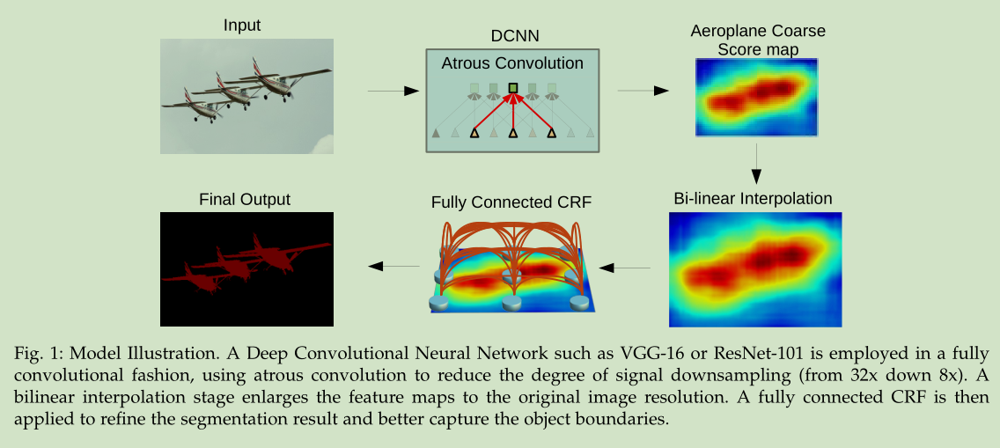
#### 1)、Atrous Convolution
&emsp;&emsp;空洞卷积，文中称（atrous convolution）的公式如下：
$$
y[i] = \sum_{k=1}^{K}{x[i+rk]w[k]}
$$
&emsp;&emsp;其中$y$为输出，$x$为输入，$i$为输入索引，$k$为卷积核内索引，当$r=1$时就是标准的卷积核。下面两张图时空洞卷积的结构，可以看到空洞卷积只是标准卷积的卷积核采样之间补零来扩大感受野。需要注意的是，虽然该层的感受野得到了很大的提升但是也会导致网络在信息提取时掠过一些点而丢失部分信息。
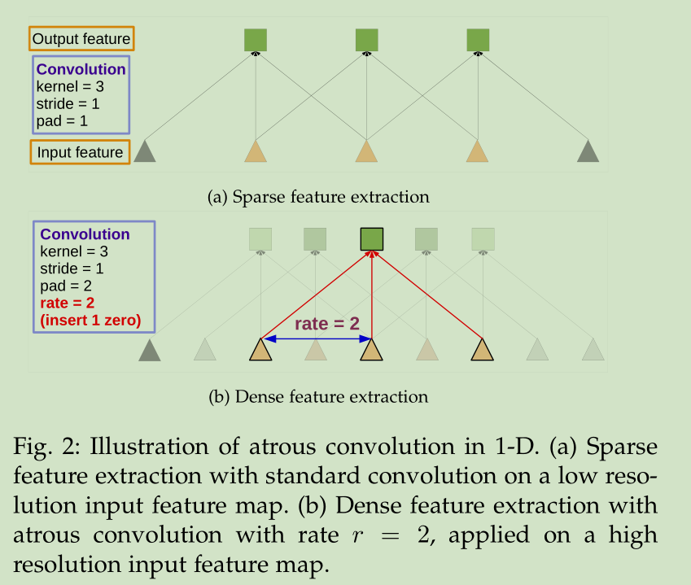
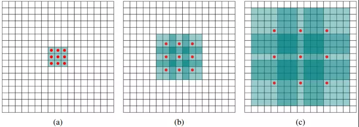
&emsp;&emsp;下图时空洞卷积的feature和标准卷积的feature对比：

#### 2)、Atrous Spatial Pyramid Pooling
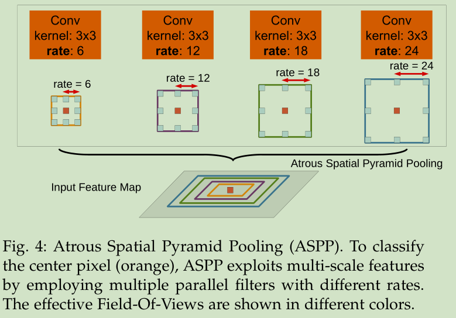
&emsp;&emsp;ASPP的结构很简单就是将同一个feature经过多个不同尺寸的空洞卷积进行采样融合后得到的。
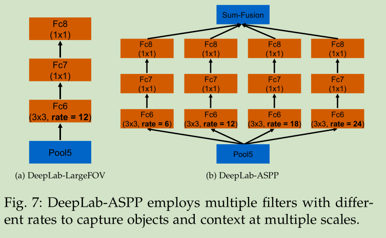

#### 3)、Fully Connected CRF
&emsp;&emsp;CRF方法已经很早用于语义分割，一般都是用来进行平滑噪声，但是其高昂的计算代价和会丢失部分结构信息这个缺陷是不容忽视的。相比于short-range CRFs，作者提取了fully connected CRFs，其能量函数如下：
$$
E(x)=\sum_{i}{\theta_i(x_i)}+\sum_{ij}{\theta_{ij}(x_i,x_j)}
$$
&emsp;&emsp;其中$\theta_{i}(x_i)=-logP(x_i)$,$P(x_i)$为位置$i$的分类概率。

$$
\theta_{ij}(x_i,x_j)=μ(x_i,x_j)[w_1e^{(-\frac{||p_i-p_j||^2}{2\sigma^2_\alpha}-\frac{||I_i-I_j||^2}{2\sigma^2_\beta})}+w_2e^{-\frac{||p_i-p_j||^2}{2\sigma^2_\gamma}}]
$$
&emsp;&emsp;其中$\mu(x_i,x_j)=1,ifx_i\neq x_j, otherwise 0$表示只有不同点是才有惩罚。并且可以看到公式中用到了两个高斯核：第一个惩罚值取决于像素的位置和颜色($I$)，第二个只取决于像素的位置。第一个内核强制具有相似颜色和位置的像素具有相似的标签，而第二个内核仅在强制执行平滑性时才考虑空间接近性。

### 3)、结果

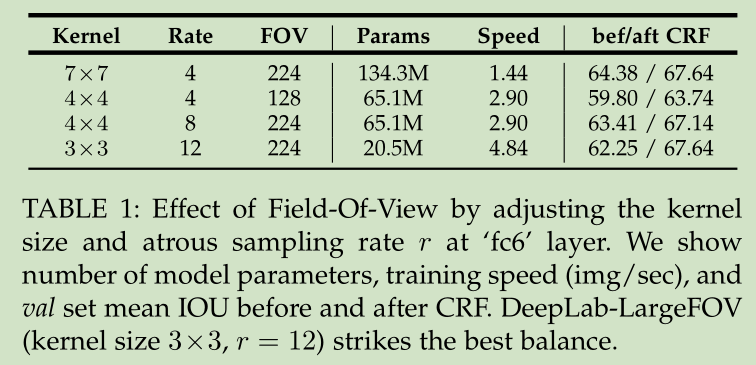

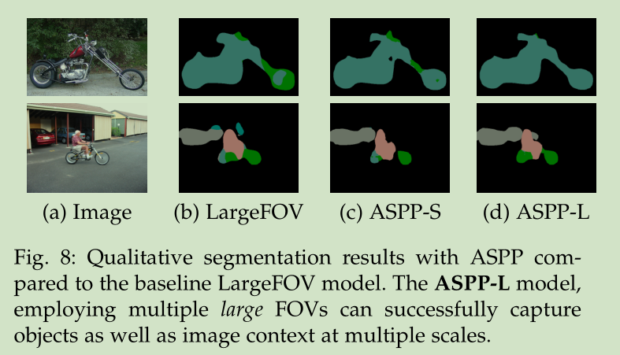
## 三、DeepLabv3
### 1、简介
&emsp;&emsp;Deeplab系列所面对的问题基本上都是:深度网络中才采样可以保证网络提取更加抽象的feature，但是会丢失细节信息，对于语义分割任务并不友好，作者提取空洞卷积应对。图像中应对多尺度物体是的解决方案：
- 1、图像金字塔，提供不同比例的输入；
- 2、编解码器获得多尺度特征；
- 3、额外的模块级联；
- 4、SPP空间金字塔池化

&emsp;&emsp;作者针对空洞卷积的特征提取效果进行了不同尺度的分析并提供了解决方案最终提出了Deeplabv3。
### 2、网络结构
#### 1)、Atrous Spatial Pyramid Pooling

&emsp;&emsp;作者基于Resnet的基本结构进行修改，保留Resnet50的前四个block，在后面添加级联模块。
作者发现在65/*65的特征图上进行实验时，当空洞卷积的rate接近feature大小时，该层的效果等价于1\*1卷积（这不是当然的吗），只有卷积层中间的一个点起作用（这里的空洞卷积核大小位3）。为了解决这个问题，作何对feature进行GAP（全局平均池化），然后将结果经过一个 1\*1\*256的卷积层，再将该feature使用双线性插值上采样到需要的尺寸。

#### 2)、Deeplabv3网络结构
&emsp;&emsp;Deeplabv3最终采用的是(6,12,18)三个rate。

### 3、结果
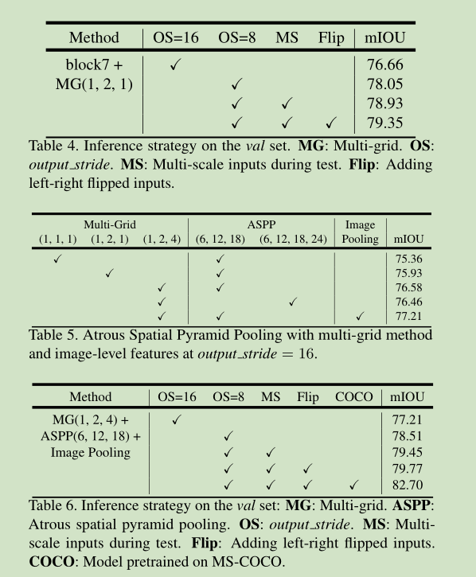
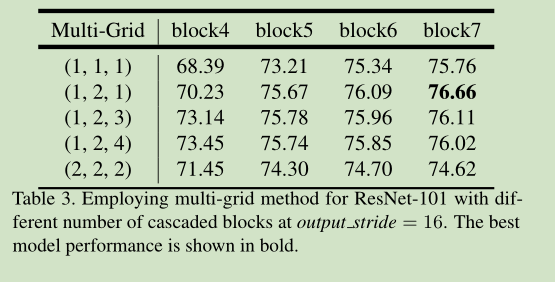
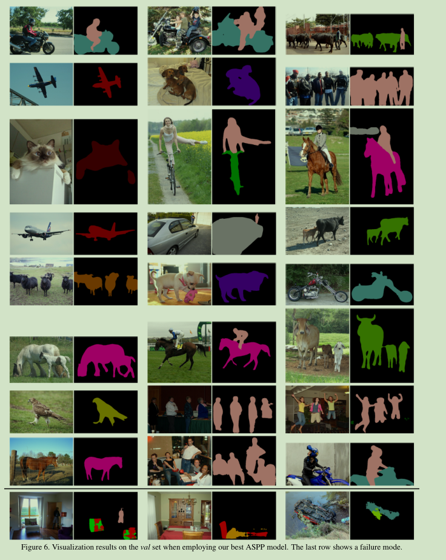
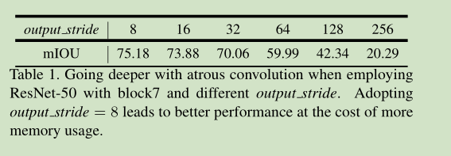

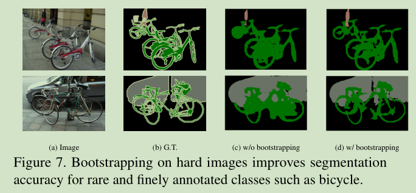

## 四、DeepLabv3+

### 1、简介
&emsp;&emsp;Deeplabv3+是基于Deeplabv3改进的版本引入了Xception作为backbone，并对Xception进行了修改插入了空洞卷积层，引入了encoder-decoder，将空洞卷积实现为可分离卷积。
### 2、网络结构
#### 1)、可分离空洞卷积
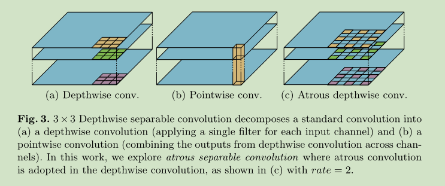
#### 2)、Xception改

#### 3)、Deeplabv3+
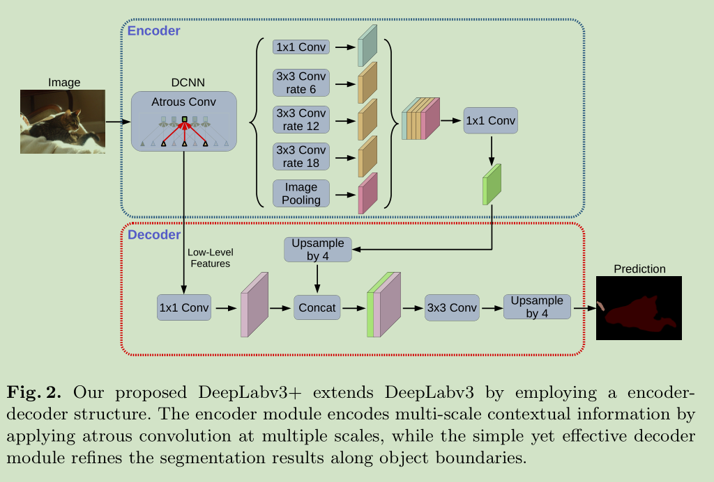

### 3、结果

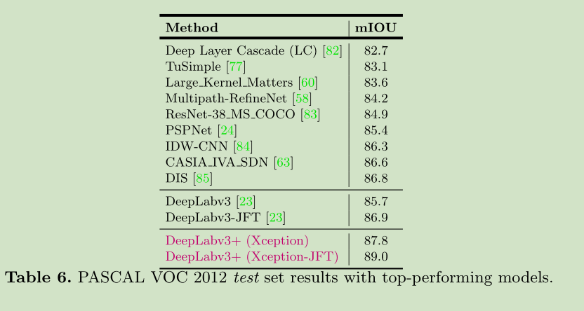

