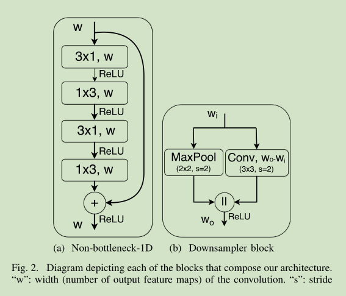

# 《Efficient ConvNet for Real-time Semantic Segmentation》论文地址
&emsp;&emsp;论文地址：[Efficient ConvNet for Real-time Semantic Segmentation](http://www.robesafe.uah.es/personal/eduardo.romera/pdfs/Romera17iv.pdf)
&emsp;&emsp;论文代码：[github](https://github.com/Eromera/erfnet_pytorch)

# 一、简介
&emsp;&emsp;ERFNet是一个实时语义分割网络，基于可分离卷积和新型的残差块在保证准确率的前提下提升性能。

# 二、网络结构
&emsp;&emsp;

&emsp;&emsp;这里的Downsampleblock来自于Enet的初始化层。而Non-bottleneck则使用两个分解3\*3代替5\*5另外每个3\*3分解为两个非对称卷积。而且还引入了空洞卷积，参数设置同样来自于Deeplabv3。其中1~16层位Encoder，17~23位Decoder。

# 三、结果
&emsp;&emsp;

