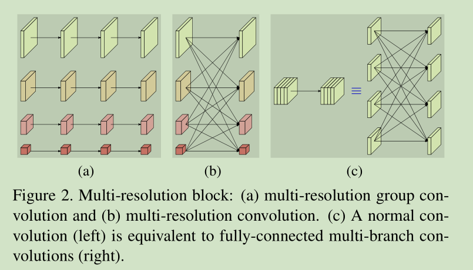
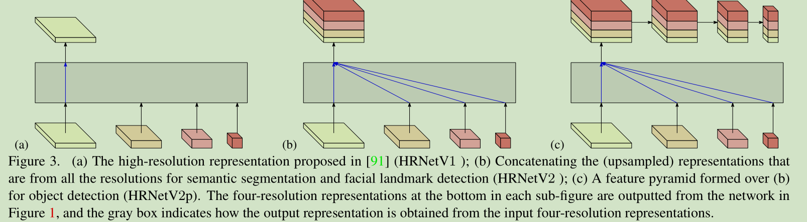

# 《High-Resolution Representations for Labeling Pixels and Regions》论文阅读笔记

&emsp;&emsp;[High-Resolution Representations for Labeling Pixels and Regions](https://arxiv.org/pdf/1904.04514.pdf)

&emsp;&emsp;[github](https://github.com/HRNet/HRNet-Semantic-Segmentation)

## 一、简介
&emsp;&emsp;这篇文章准确的来说和并不完全和语义分割相关，类似于一个backbone的设计，是基于HRNet设计的，而且设计思想很粗暴，把HRNet最后得到的四个不同尺寸的feature进行concat,直接参数两暴涨。
## 二、网络结构



&emsp;&emsp;看代码实现更直观，就是简单的堆叠。
```python
x0_h, x0_w = x[0].size(2), x[0].size(3)
        x1 = F.upsample(x[1], size=(x0_h, x0_w), mode='bilinear')
        x2 = F.upsample(x[2], size=(x0_h, x0_w), mode='bilinear')
        x3 = F.upsample(x[3], size=(x0_h, x0_w), mode='bilinear')

        x = torch.cat([x[0], x1, x2, x3], 1)
```
## 三、结果


