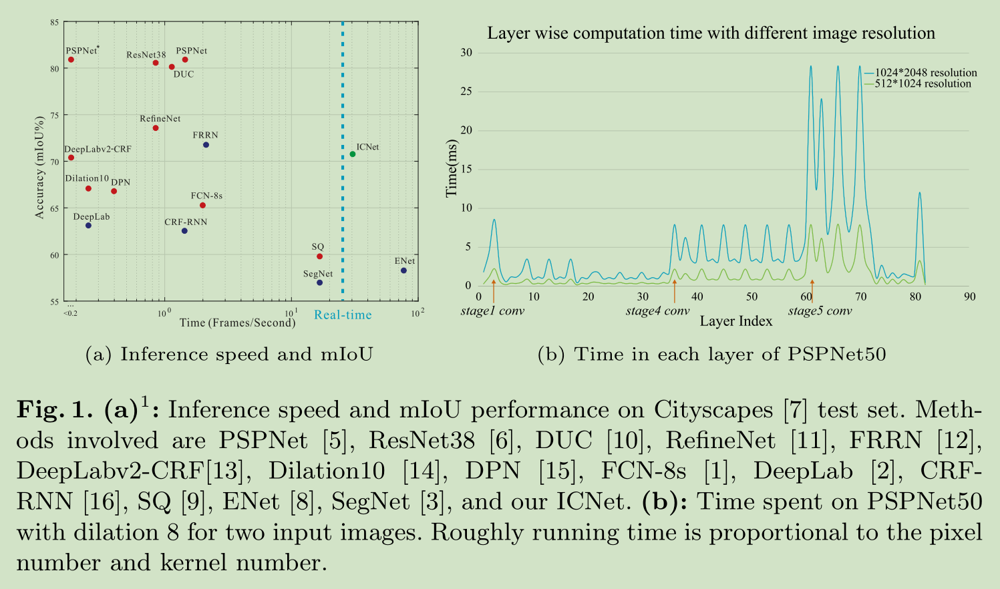
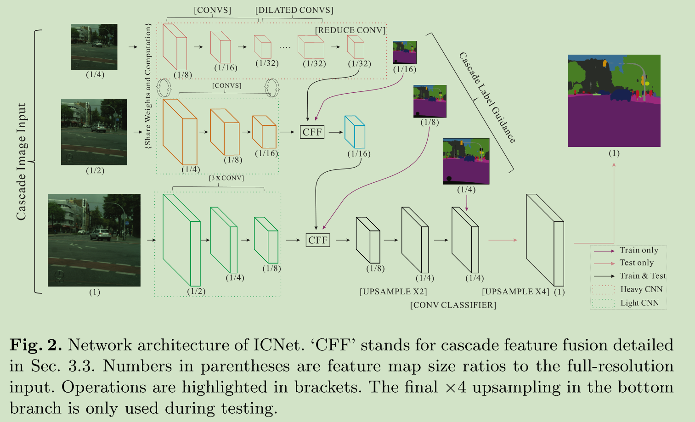
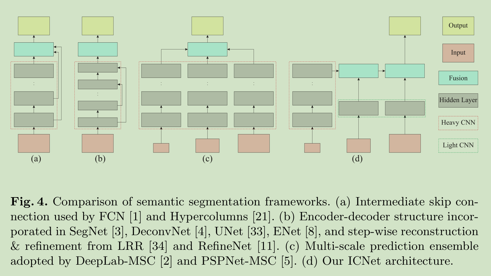
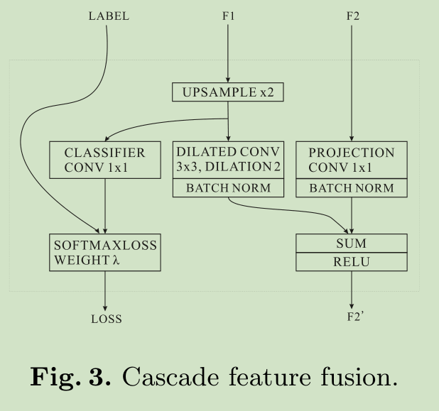
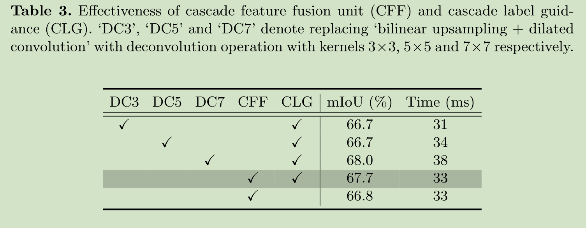
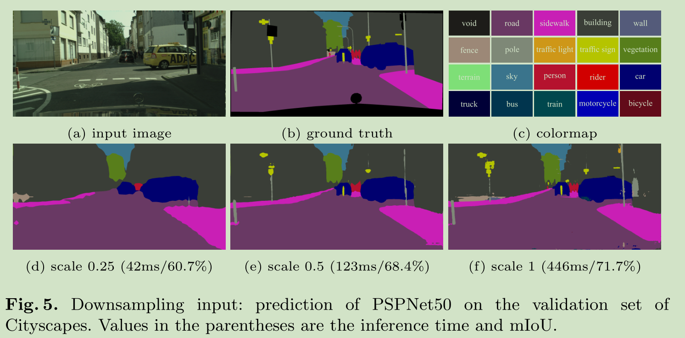
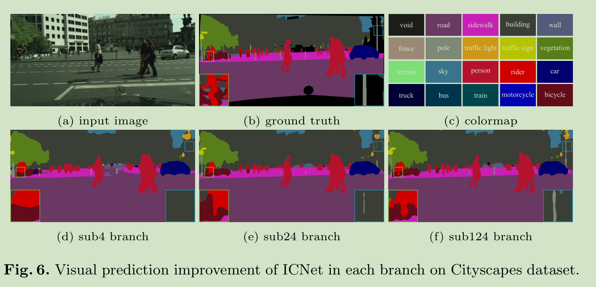

# 《ICNet for Real-Time Semantic Segmentation on High-Resolution Images》论文阅读笔记
&emsp;&emsp;论文地址：[ICNet for Real-Time Semantic Segmentation on High-Resolution Images](https://arxiv.org/pdf/1704.08545.pdf)
&emsp;&emsp;代码地址：[github](https://github.com/hszhao/ICNet)
[toc]

## 1、简介

&emsp;&emsp;如上图所示位不同网络的速度对比，右边是PSPNet的网络不同层的计算量对比。作者提出的ICNet是一个实时语义分割网络，该网络提出的主要思想是将提取语义信息和空间细节信息分割开来，让低像素的图像经过整个网络提供语义信息，高像素的图像经过浅层的网络提供空间位置和细节信息。

## 2、网络结构
### 1、ICNet
&emsp;&emsp;ICNet网络的结构如下图所示，结构很清晰不需多说：


```python
def forward(self, x):
        h, w = x.shape[2:]

        # H, W -> H/2, W/2
        x_sub2 = F.interpolate(
            x, size=get_interp_size(x, s_factor=2), mode="bilinear", align_corners=True
        )

        # H/2, W/2 -> H/4, W/4
        x_sub2 = self.convbnrelu1_1(x_sub2)     #3*3
        x_sub2 = self.convbnrelu1_2(x_sub2)     #3*3
        x_sub2 = self.convbnrelu1_3(x_sub2)     #3*3

        # H/4, W/4 -> H/8, W/8
        x_sub2 = F.max_pool2d(x_sub2, 3, 2, 1)

        # H/8, W/8 -> H/16, W/16
        x_sub2 = self.res_block2(x_sub2)
        x_sub2 = self.res_block3_conv(x_sub2)
        # H/16, W/16 -> H/32, W/32
        x_sub4 = F.interpolate(
            x_sub2, size=get_interp_size(x_sub2, s_factor=2), mode="bilinear", align_corners=True
        )
        x_sub4 = self.res_block3_identity(x_sub4)

        x_sub4 = self.res_block4(x_sub4)
        x_sub4 = self.res_block5(x_sub4)

        x_sub4 = self.pyramid_pooling(x_sub4)
        x_sub4 = self.conv5_4_k1(x_sub4)

        x_sub1 = self.convbnrelu1_sub1(x)
        x_sub1 = self.convbnrelu2_sub1(x_sub1)
        x_sub1 = self.convbnrelu3_sub1(x_sub1)

        x_sub24, sub4_cls = self.cff_sub24(x_sub4, x_sub2)
        x_sub12, sub24_cls = self.cff_sub12(x_sub24, x_sub1)

        x_sub12 = F.interpolate(
            x_sub12, size=get_interp_size(x_sub12, z_factor=2), mode="bilinear", align_corners=True
        )

        sub124_cls = self.classification(x_sub12)

        if self.training:
            return sub124_cls, sub24_cls, sub4_cls
        else:
            sub124_cls = F.interpolate(
                sub124_cls,
                size=get_interp_size(sub124_cls, z_factor=4),
                mode="bilinear",
                align_corners=True,
            )
            return sub124_cls
```
### 2、Cascade Feature Fusion

```python
class cascadeFeatureFusion(nn.Module):
    def __init__(
        self, n_classes, low_in_channels, high_in_channels, out_channels, is_batchnorm=True
    ):
        super(cascadeFeatureFusion, self).__init__()

        bias = not is_batchnorm

        self.low_dilated_conv_bn = conv2DBatchNorm(
            low_in_channels,
            out_channels,
            3,
            stride=1,
            padding=2,
            bias=bias,
            dilation=2,
            is_batchnorm=is_batchnorm,
        )
        self.low_classifier_conv = nn.Conv2d(
            int(low_in_channels),
            int(n_classes),
            kernel_size=1,
            padding=0,
            stride=1,
            bias=True,
            dilation=1,
        )  # Train only
        self.high_proj_conv_bn = conv2DBatchNorm(
            high_in_channels,
            out_channels,
            1,
            stride=1,
            padding=0,
            bias=bias,
            is_batchnorm=is_batchnorm,
        )

    def forward(self, x_low, x_high):
        x_low_upsampled = F.interpolate(
            x_low, size=get_interp_size(x_low, z_factor=2), mode="bilinear", align_corners=True
        )

        low_cls = self.low_classifier_conv(x_low_upsampled)

        low_fm = self.low_dilated_conv_bn(x_low_upsampled)
        high_fm = self.high_proj_conv_bn(x_high)
        high_fused_fm = F.relu(low_fm + high_fm, inplace=True)

        return high_fused_fm, low_cls
```
## 3、结果





