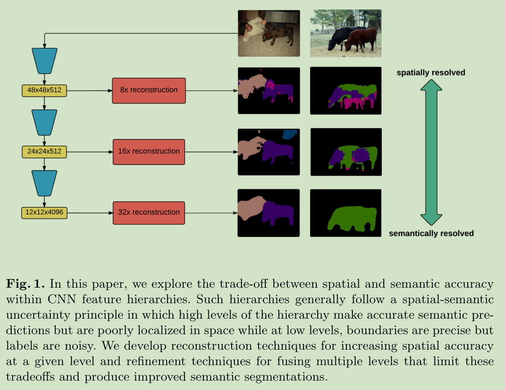
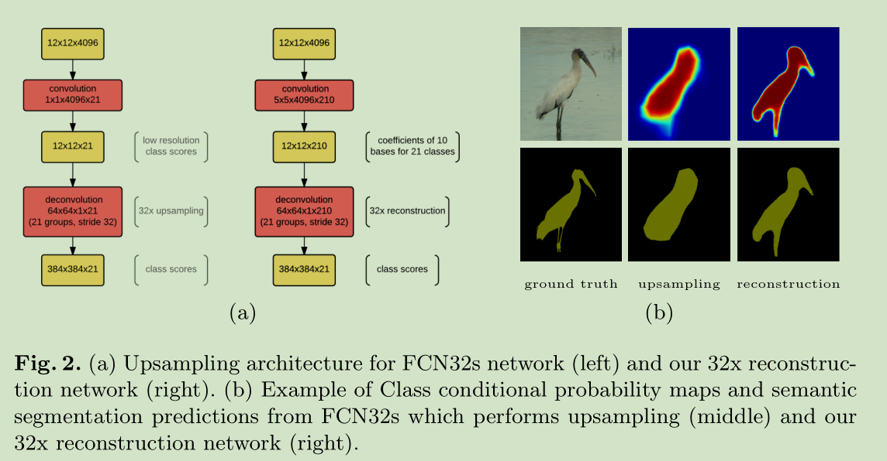
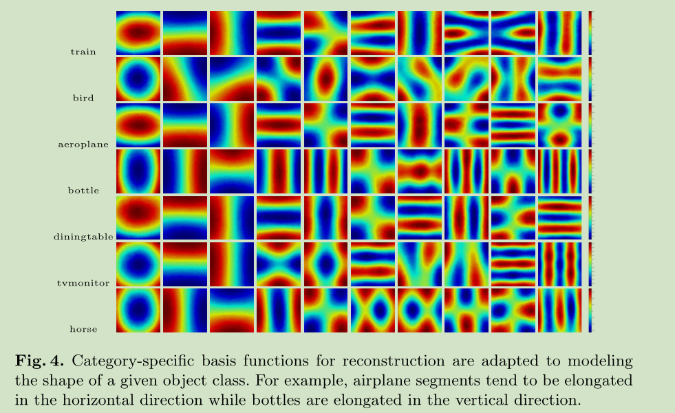
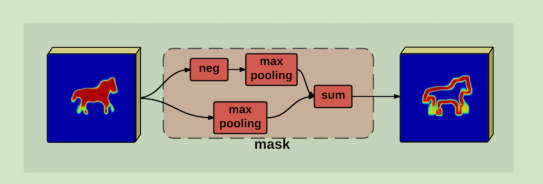
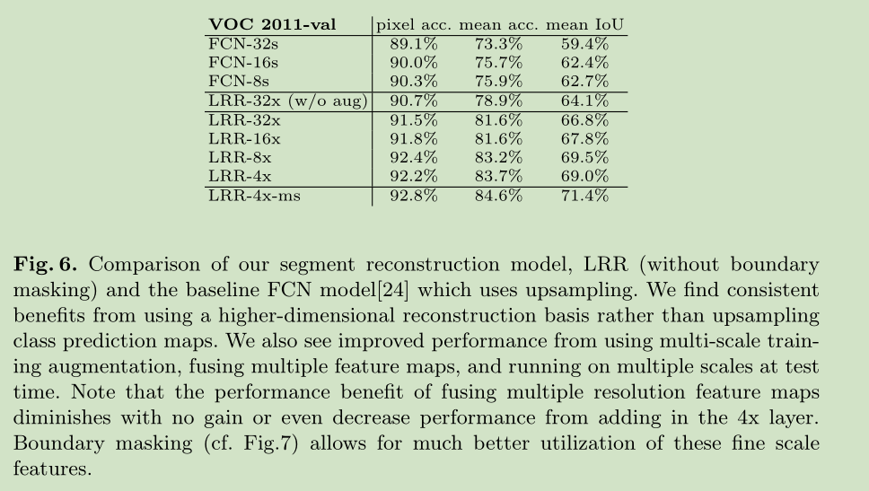
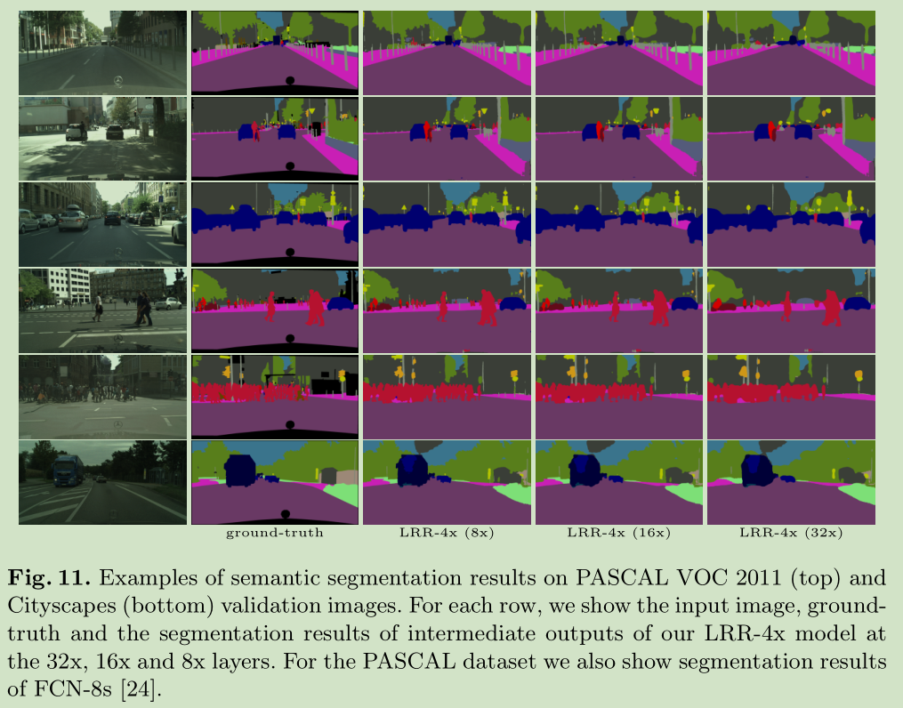
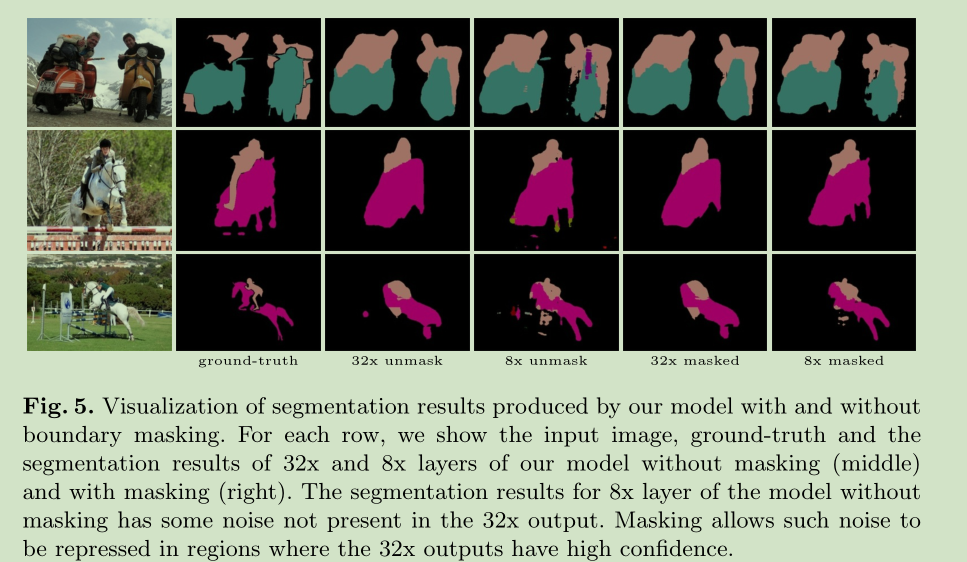
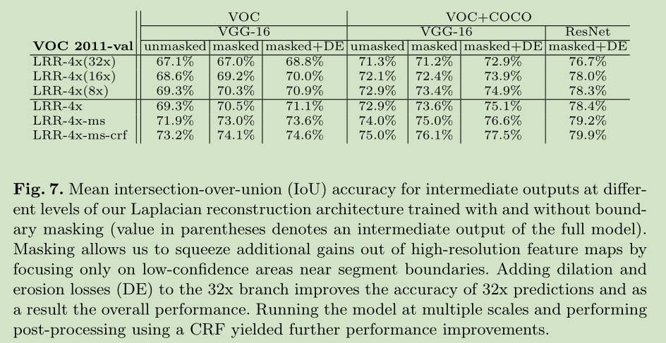

# 《Laplacian Pyramid Reconstruction and Refinement for Semantic Segmentation》论文阅读笔记

&emsp;&emsp;论文地址：[Laplacian Pyramid Reconstruction and Refinement for Semantic Segmentation](https://arxiv.org/pdf/1605.02264.pdf)

&emsp;&emsp;论文代码：[github](https://github.com/golnazghiasi/LRR)

## 一、简介
&emsp;&emsp;这篇论文证明了虽然卷积特征图的表观空间分辨率较低，但高维特征表示却包含重要的子像素位置信息，并提出一个基于拉普拉斯金字塔的多分辨率重建体系结构，该体系结构使用了来自高分辨率特征图的跳过连接和乘性门控，以逐步完善从较低分辨率图重建的分段边界。
&emsp;&emsp;为了解决网络中使用下采样导致的信息丢失，文章提出了一个使用数据自适应基函数(data-adapted basis functions)的方法提升上采样的效果。作者认为高分辨率层浅，接收场小，因此产生固有的噪声预测，像素损耗高。它们的贡献相对于线性融合过程中的低分辨率图层而言权重明显降低，因此它们对最终预测的影响相对较小。
&emsp;&emsp;由于作者认为一般的特征融合的concat会导致通道维度过高，sum会丢失网络提取的高维语义信息，因此作者提出的网络结构中的skip链接使用的的时相乘进行特征融合而不是一般使用的concat和sum。
## 二、网络结构

### 1、Reconstruction with learned basis functions
&emsp;&emsp;为了避免网络中提取的特征信息损失，作者不直接将feature map下采样为低分辨率的类别分数feature，而是使用高分辨率基函数的线性组合来表达高分辨率分数的空间模式，这一方法被作者成为reconnect。

**Reconstruction by deconvolution：**
&emsp;&emsp;在具体实现过程中为了得到4\*大小的特征图，可以使用kernel size为8\*8然后使用stride=4。
$$
Y_c[i,j]=\sum^{K-1}_{k=0}\sum_{(u,v)\in {0,1}^2}B_{k,c}[m_s(i)+s\cdot u,m_s(j)+s\cdot v]\cdot X_{k,c}[q_s(i)-u,q_s(j)-v]
$$
&emsp;&emsp;其中$s$表示步长，$q_i(i)=\lfloor\frac{i}{s}\rfloor$,$m_s(i)=i mod  s$时$s$除以$s$的余数feature $\mathbf{X}\in \mathbb{R}^{H*W*K*C}$通过基函数$\mathbf{B}\in \mathbb{R}^{2s*2s*K*C}$映射到输出$\mathbf{Y}\in \mathbb{R}^{sH*sW*C}$,$B_{k,c}$包含类别$c$的第$k$个基函数，并且拥有相应的权空间$X_{k,c}$,这里假设$X_{k,c}$为0 padding，$Y_c$被适当的裁剪。
**Connection to spline interpolation：**
&emsp;&emsp;我们注意到，改进双线性插值的经典方法是使用从非重叠多项式基函数的标准集合构建的高阶样条插值，其中权重通过分析确定，以确保相邻小块之间的连续性。我们使用学习的滤波器和基函数的方法对从高维激活到系数X的映射进行了最小假设，但也不能保证Y的连续性。我们通过使用较大的滤波器内核（即5×5×4096）来部分解决此问题，以根据特征激活来预测系数$X_{k,c}$。这模仿了样条插值中使用的在相邻基权之间引入线性相关性的计算，并根据经验提高了输出预测的连续性。(这部分是纯粹的翻译，不是很懂什么意思)
**Learning basis functions：**
&emsp;&emsp;为了利用有限数量的训练数据并加快训练速度，使用一组有意义的过滤器初始化反卷积层，这些过滤器是通过对示例分段补丁执行PCA来估算的。为此，我们从训练数据中为每个类别提取10000个patch，其中每个patch的大小为32×32，并且至少2％的patch像素是该类别的成员。将PCA应用于提取的patch，以计算特定于类的基础函数集。图4显示了不同类别的PASCAL VOC数据集的示例基础。有趣的是，由于不同的段形状统计，各类之间存在一些显着差异。发现对于具有相同基集（根据需要下采样）的不同级别的重构金字塔，初始化重构滤波器就足够了。在我们的模型和FCN双线性上采样模型中，都观察到端到端训练导致基本函数的变化不明显（<10 -7）。
&emsp;&emsp;发现以8×8的分辨率采样的10个函数足以准确重建类分数图。训练有10个以上基函数的模型通常会为高频基函数预测零权重系数。这建议了从低分辨率特征图中可以提取多少空间信息的限制（即，大约比双线性多3倍）。但是由于模型的局限性无法达到这一性能。

### 2、Laplacian Pyramid Refinement

&emsp;&emsp;网络的结构如上图，需要注意的是上面的reconstruction和mask部分，reconstruction部分就是上面提到的，而masks如下所示，使用两个分支一个是negative的maxpooling一个是整成的maxpooling，之后叠加得到边界信息，通过控制池化的大小，就可以控制mask的线条粗细。

&emsp;&emsp;每一部分网络的输出，都会被送入重构模块生成该分辨率大小的分割图，而每一个分割图都会产生softmax loss并回传梯度，低分辨率的分割图经过上采样生成与上一个分辨率一样大小的分割图，再生成mask，与该层的分割图进行点乘，再于上一层的分割图相加，得到refine后的分割图，并把这个分割图作为本层最终的结果，送入再下一层并求softmax loss，以此类推。

## 三、结果

