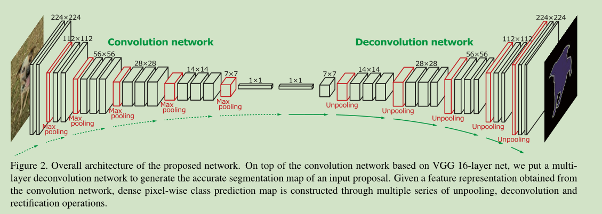
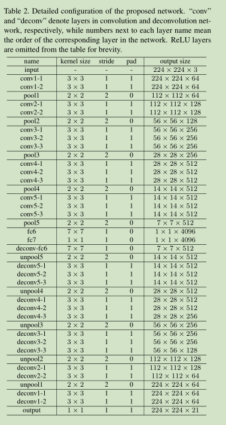
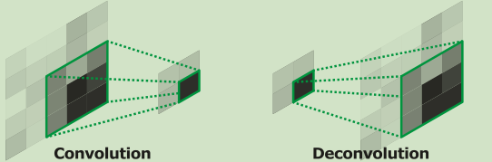
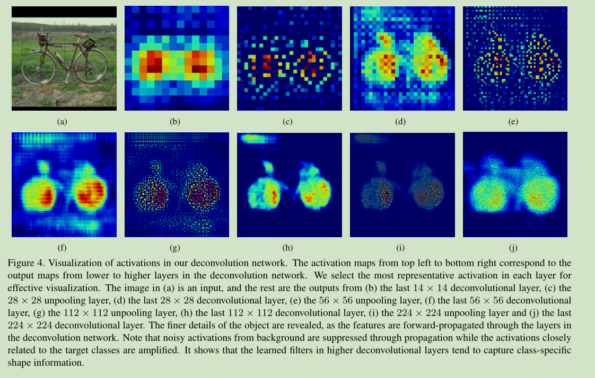
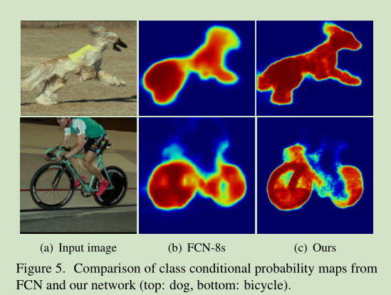
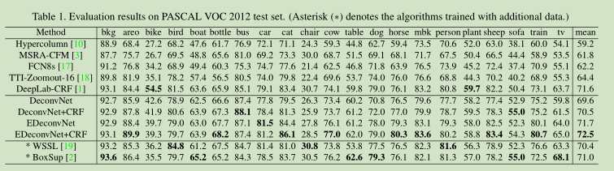
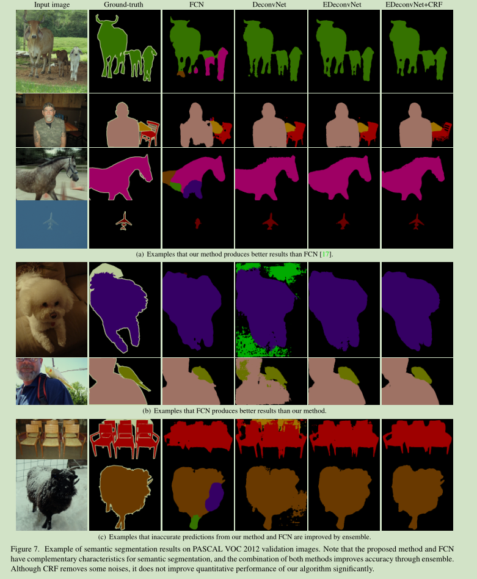

# 《Learning Deconvolution Network for Semantic Segmentation》阅读笔记

&emsp;&emsp;论文地址：[Learning Deconvolution Network for Semantic Segmentation](https://arxiv.org/pdf/1505.04366.pdf)

&emsp;&emsp;论文代码：[github](https://github.com/fabianbormann/Tensorflow-DeconvNet-Segmentation)

## 一、简介
&emsp;&emsp;FCNs网络存在两个缺陷：
- 1、网络的感受野缺陷无法应对多尺度的目标；
- 2、网络中生成的feature map可以小到16\*16会丢失大量信息，即便使用skip也无法弥补。

&emsp;&emsp;作者提出了Deconvolution网络来应对这些问题。

## 二、网络结构

&emsp;&emsp;网络的结构如上图所示，网络完全对称主要由两部分组成Encoder和Decoder，Encoder部分完全由convolution层和maxpooling下采样层，decoder由deconvolution和unpooling上采样层组成。网络由VGG-16修改而来，移除了VGG最后一个分类层中间添加了两个全连接层。

### 1、Unpooling
&emsp;&emsp;Unpooling和Maxpooling之类的才做恰恰相反，是将feature上采样到更大的输出。Unpooling的具体实现是在switch操作中将在池操作期间选择的最大激活位置记录下来，这些变量用于将每个激活放回其原始池位置。

&emsp;&emsp;如下公式，maxpooling时记住5，6，8，9四个位置的索引，在Unpooling时将对应的值放置到对应的位置其他位置置0。
$$
\left[
\begin{matrix}
    1 & 2 & 3 \\
    4 & 5 & 6 \\
    7 & 8 & 9 \\
\end{matrix}
\right]
\Rightarrow^{maxpooling}
\left[
\begin{matrix}
    5 & 6 \\
    8 & 9
\end{matrix}
\right]
\Rightarrow^{unpooling}
\left[
\begin{matrix}
    0 & 0 & 0 \\
    0 & 5 & 6 \\
    0 & 8 & 9 \\
\end{matrix}
\right]
$$
### 2、Deconvolution
&emsp;&emsp;Deconvolution和convolution不同是一对多。

&emsp;&emsp;如下图：一般的操作是对输入进行padding或者在输入间插入0，来做卷积。

&emsp;&emsp;从上面的Unpooling可以看出Unpooling得到的结果是一个稀疏矩阵，Deconvolution的作用就是将改稀疏矩阵变成密集矩阵。如下图为可视化效果。可以任务Unpooling保留了图像的位置信息，Deconvolution用来恢复其细节信息。

## 三、结果
&emsp;&emsp;

