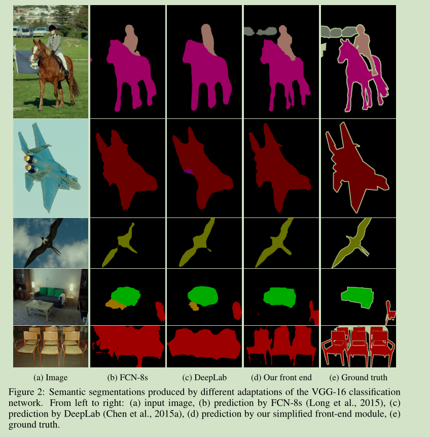
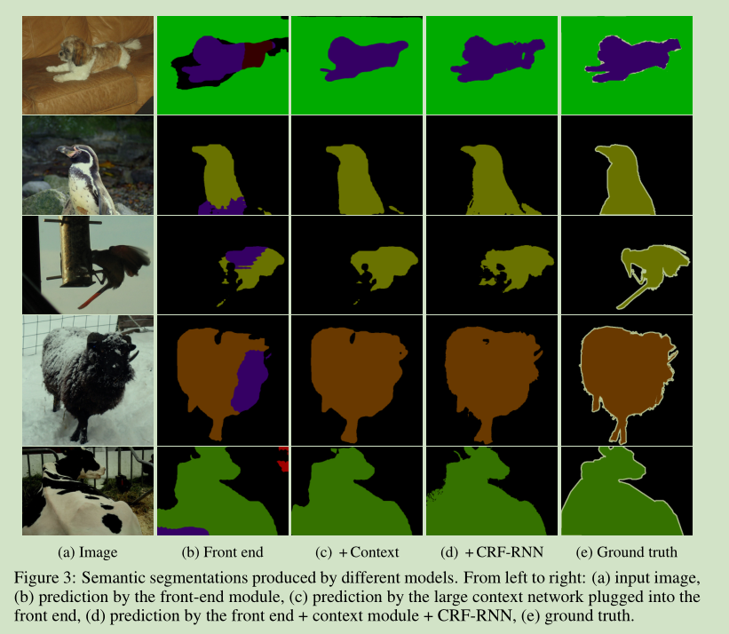
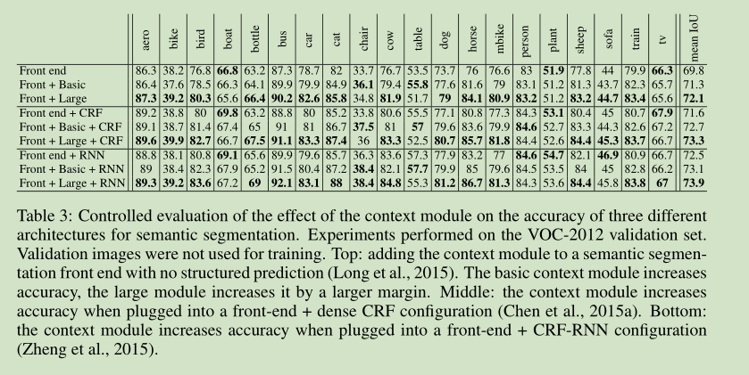

# 《MULTI-SCALE CONTEXT AGGREGATION BY DILATED CONVOLUTIONS》论文阅读笔记

&emsp;&emsp;论文地址：[MULTI-SCALE CONTEXT AGGREGATION BY DILATED CONVOLUTIONS](https://arxiv.org/pdf/1511.07122.pdf)

&emsp;&emsp;论文代码：[github](https://github.com/hangzhaomit/semantic-segmentation-pytorch)

## 一、简介
&emsp;&emsp;语义分割相比于分类是一种密集信息的分类任务，需要更多的细节和上下文信息，如何获取更好的上下文信息是目前大多数研究的方向，一般的做法是多尺度输入，融合网络不同stage的featue得到多尺度feature或者使用特殊的模块提取更好的上下文信息，本文提出一个使用空洞卷积的多尺度上下文信息提取模块，可以被应用于多种网络。

## 二、网络结构
&emsp;&emsp;
### 1、空洞卷积
&emsp;&emsp;空洞卷积，文中称（atrous convolution）的公式如下：
$$
y[i] = \sum_{k=1}^{K}{x[i+rk]w[k]}
$$
&emsp;&emsp;其中$y$为输出，$x$为输入，$i$为输入索引，$k$为卷积核内索引，当$r=1$时就是标准的卷积核。下面两张图时空洞卷积的结构，可以看到空洞卷积只是标准卷积的卷积核采样之间补零来扩大感受野。需要注意的是，虽然该层的感受野得到了很大的提升但是也会导致网络在信息提取时掠过一些点而丢失部分信息。如下图可以看到当rate越大时空洞卷积的感受野越大。作者使用空洞卷积作为网络的基本层的原因时空洞卷积可以获得大范围的感受野而不会丢失过多的信息，而且能够收敛。


### 2、MULTI-SCALE CONTEXT AGGREGATION
&emsp;&emsp;该模块的结构如下图所示，基本是由空洞卷积组成。整个模块并不会改变输入的大小意思就是输入的大小是$\mathbb{R}^{C*W*H}$则输出也是$\mathbb{R}^{C*W*H}$。

&emsp;&emsp;从模块的结构图中可以看到该结构总共有7层，所有层的kernel size都是3，不同层的rate分别是[1,1,2,4,8,16]。最后一层中的1\*1卷积是用来将通道降低到和输入相同。
```python
def add_context(model: Sequential) -> Sequential:
    """ Append the context layers to the frontend. """
    model.add(ZeroPadding2D(padding=(33, 33)))
    model.add(Convolution2D(42, 3, 3, activation='relu', name='ct_conv1_1'))
    model.add(Convolution2D(42, 3, 3, activation='relu', name='ct_conv1_2'))
    model.add(AtrousConvolution2D(84, 3, 3, atrous_rate=(2, 2), activation='relu', name='ct_conv2_1'))
    model.add(AtrousConvolution2D(168, 3, 3, atrous_rate=(4, 4), activation='relu', name='ct_conv3_1'))
    model.add(AtrousConvolution2D(336, 3, 3, atrous_rate=(8, 8), activation='relu', name='ct_conv4_1'))
    model.add(AtrousConvolution2D(672, 3, 3, atrous_rate=(16, 16), activation='relu', name='ct_conv5_1'))
    model.add(Convolution2D(672, 3, 3, activation='relu', name='ct_fc1'))
    model.add(Convolution2D(21, 1, 1, name='ct_final'))

    return model
```

### 3、初始化
&emsp;&emsp;作者做实验发现使用常用的神经网络初始化并不能使网络奏效，因此作者更替换初始化方法。
$$
k^b(t,a)=1_{[t=0]}1_{[a=b]}
$$
&emsp;&emsp;其中$a$是输入feature的索引，$b$是输出feature的索引
$$
k^b(t,a)=\left\{\begin{array}{ll}\frac{C}{c_i+1},t=0 and \lfloor \frac{aC}{c_i} \rfloor = \lfloor \frac{bC}{c_{i+1}}\rfloor\\  \epsilon , otherwise\end{array}\right.
$$
&emsp;&emsp;其中$c_i$和$c_{i+1}$是相邻两个feature的通道数，$\epsilon \sim \mathscr{N}(0,\sigma^2),\sigma \ll C/c_{i+1}$,$C$是输出通道数，也就是类别数。
### 4、网络前端
&emsp;&emsp;网络的前段时基于VGG-16修改的，去除了最后两个pooling和conv层，并使用rate=2的空洞卷积代替，最终网络能够得到一个高分辨率的feature，64\*64。
```python
def get_frontend(input_width, input_height) -> Sequential:
    model = Sequential()
    # model.add(ZeroPadding2D((1, 1), input_shape=(input_width, input_height, 3)))
    model.add(Convolution2D(64, 3, 3, activation='relu', name='conv1_1', input_shape=(input_width, input_height, 3)))
    model.add(Convolution2D(64, 3, 3, activation='relu', name='conv1_2'))
    model.add(MaxPooling2D((2, 2), strides=(2, 2)))

    model.add(Convolution2D(128, 3, 3, activation='relu', name='conv2_1'))
    model.add(Convolution2D(128, 3, 3, activation='relu', name='conv2_2'))
    model.add(MaxPooling2D((2, 2), strides=(2, 2)))

    model.add(Convolution2D(256, 3, 3, activation='relu', name='conv3_1'))
    model.add(Convolution2D(256, 3, 3, activation='relu', name='conv3_2'))
    model.add(Convolution2D(256, 3, 3, activation='relu', name='conv3_3'))
    model.add(MaxPooling2D((2, 2), strides=(2, 2)))

    model.add(Convolution2D(512, 3, 3, activation='relu', name='conv4_1'))
    model.add(Convolution2D(512, 3, 3, activation='relu', name='conv4_2'))
    model.add(Convolution2D(512, 3, 3, activation='relu', name='conv4_3'))

    # Compared to the original VGG16, we skip the next 2 MaxPool layers,
    # and go ahead with dilated convolutional layers instead

    model.add(AtrousConvolution2D(512, 3, 3, atrous_rate=(2, 2), activation='relu', name='conv5_1'))
    model.add(AtrousConvolution2D(512, 3, 3, atrous_rate=(2, 2), activation='relu', name='conv5_2'))
    model.add(AtrousConvolution2D(512, 3, 3, atrous_rate=(2, 2), activation='relu', name='conv5_3'))

    # Compared to the VGG16, we replace the FC layer with a convolution

    model.add(AtrousConvolution2D(4096, 7, 7, atrous_rate=(4, 4), activation='relu', name='fc6'))
    model.add(Dropout(0.5))
    model.add(Convolution2D(4096, 1, 1, activation='relu', name='fc7'))
    model.add(Dropout(0.5))
    # Note: this layer has linear activations, not ReLU
    model.add(Convolution2D(21, 1, 1, activation='linear', name='fc-final'))

    # model.layers[-1].output_shape == (None, 16, 16, 21)
    return model
```
## 三、结果
&emsp;&emsp;




