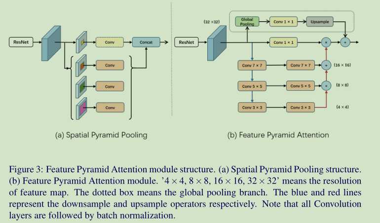
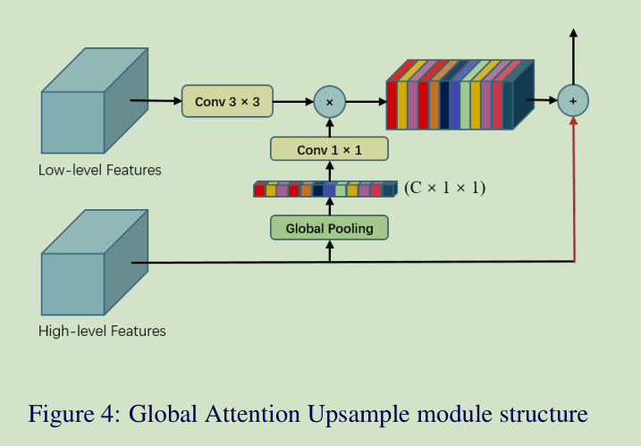
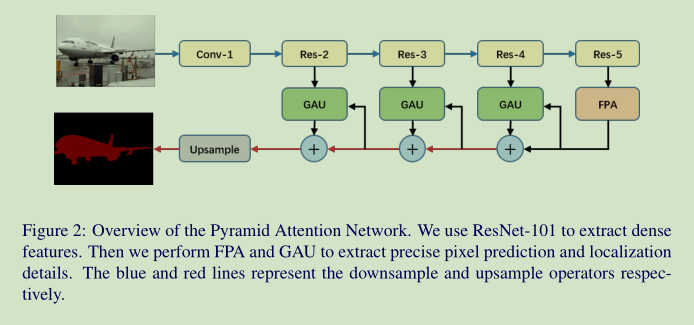
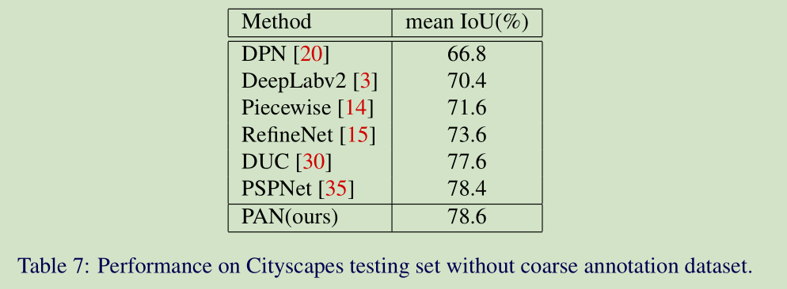

# 《Pyramid Attention Network for Semantic Segmentation》论文阅读笔记
&emsp;&emsp;论文地址:[Pyramid Attention Network for Semantic Segmentation](https://arxiv.org/abs/1805.10180v1)
&emsp;&emsp;论文代码:无
[toc]

## 一、简介
&emsp;&emsp;现如今的语义分割大部分都会使用基本的CNN网络做backbone，之后再使用自建的模块来提取图像中的空间位置信息，当然不同的提取方式都有各自的优点和缺点。ASPP模块可能出现Grid Artifacts（网络尾影），PSPNet可能会丢失像素级的位置信息。这篇论文主要灵感来源于SENet和ParseNet构建了一种FPA（Feature Pyramid Attention）模块来提取更多的信息。
&emsp;&emsp;本文的主要贡献：
- FPA模块和GAU（Global Attention Upsample）模块；
- PAN网络（Pyramid Attention Network）

## 二、网络结构
### 1、Feature Pyramid Attention
&emsp;&emsp;FPA模块的结构如下图所示，主要分为三个部分：上边第一个分支是SENet中的通道注意力机制的Attention部分；中间的分支是保留原始的feature并通过1\*1卷积核降维保证计算量不会太大；下面的分支是一个简单的FPN的型结构，但是问题是为什么采用7\*7这么大的卷积核不是很明白，按理来说三层3\*3网络的计算量要比单层7\*7的计算量小而且感受野也相同。

### 2、Global Attention Upsample
&emsp;&emsp;PSPNet和Deeplab对输出上采样采取的是使用双线性插值，DUC采用比较大的channel的卷积和reshape达到目标尺寸。但是这都会丢失相关的细节信息。GAU结构如下图所示，从就结构上看其实就是一个简单的通道注意力，不同之处是利用高层信息监督低层信息的attention map。

### 3、Pyramid Attention Network
&emsp;&emsp;

## 三、结果
&emsp;&emsp;下面是结果对比可以看到FCN对小目标和一些细节注重并不好，FPA会好一点儿。

&emsp;&emsp;不同模块结合后的结果：

