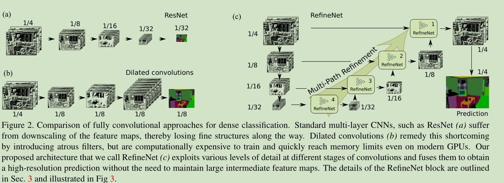
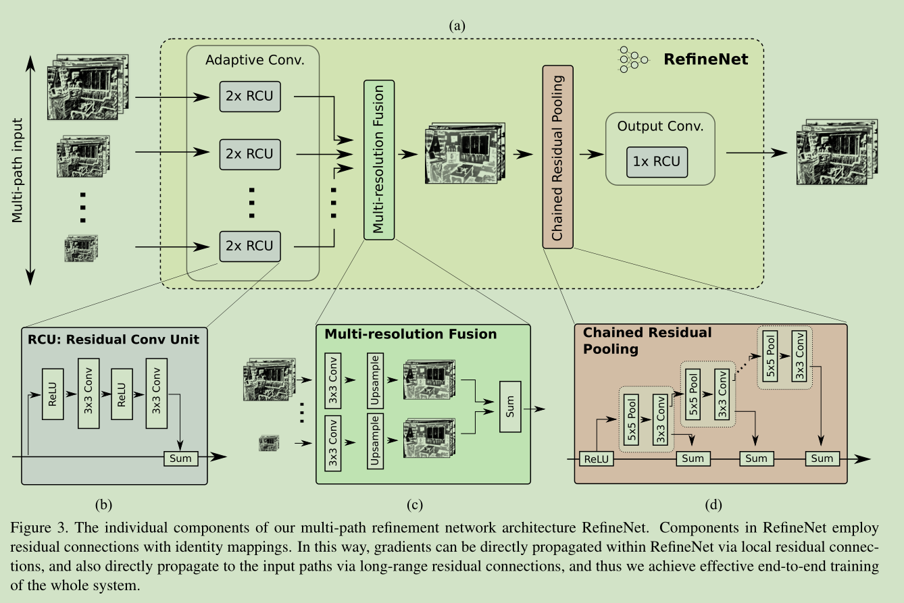
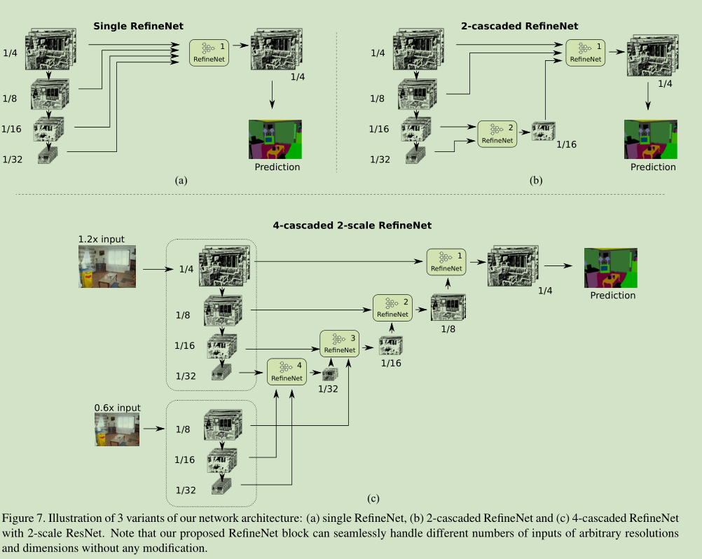
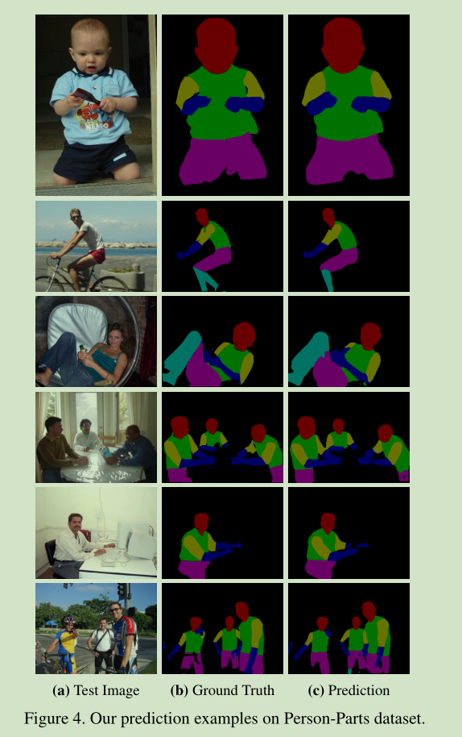
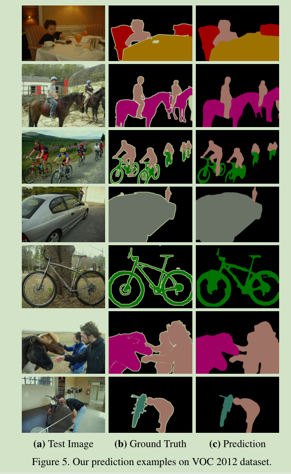

# 《RefineNet: Multi-Path Refinement Networks for High-Resolution Semantic Segmentation》论文阅读笔记
&emsp;&emsp;论文地址：[RefineNet: Multi-Path Refinement Networks for High-Resolution Semantic Segmentation](https://arxiv.org/pdf/1611.06612.pdf)
&emsp;&emsp;代码地址：[github](https://github.com/guosheng/refinenet)
[toc]

## 一、简介
&emsp;&emsp;语义分割的关键在于融合从低层的feature中提取出细节信息，从高层的feature中提取相关的语义信息并将二者有效的结合在一起。Deeplab作为一种比较有效的语义分割方法存在一些缺点：计算量过大和使用空洞卷积信息损失了一些。为了更好的提取feature，作者提出了RefineNet：
- 多路Refinement Network；
- 链式残差pooling

## 二、结构
&emsp;&emsp;

### 1、RefineNet

## 三、结果
&emsp;&emsp;如果看结果的话效果要好不少。

&emsp;&emsp;仔细看的话会发现图像的边界无法很清楚的分开，缺少充足的细节信息。

