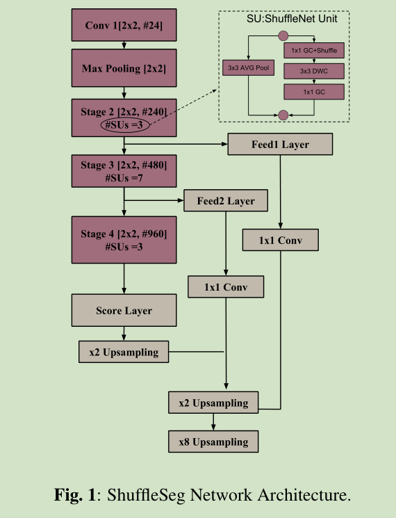
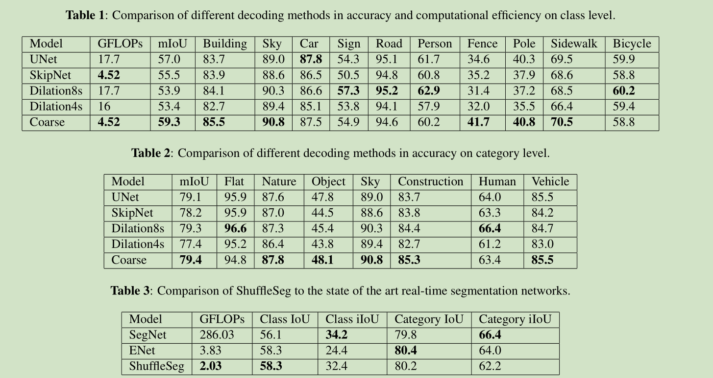

# 《SHUFFLESEG: REAL-TIME SEMANTIC SEGMENTATION NETWORK》论文阅读笔记

&emsp;&emsp;论文地址:[SHUFFLESEG: REAL-TIME SEMANTIC SEGMENTATION NETWORK]()

&emsp;&emsp;论文代码:[github](https://github.com/MSiam/TFSegmentation)

## 一、简介
&emsp;&emsp;本文提出的实时语义分割网络是基于ShuffleNet提出的高效分割网络，不同于其他语义分割网络ENet，LinkNet等本文提出的网络首次引入了分组卷积和通道混淆在保证性能的情况下提高速度。

## 二、网络结构
&emsp;&emsp;在MobileNet和ShuffleNet中已经得到证明深度可分离卷积和分组卷积可以减少网络的参数量，而不会影响表征能力，但是对于堆叠分组卷积可能导致输出的通道仅仅来源于于有限数量的输入通道，因此有了通道改组来解决这个问题。在本文提出的网络中的编码器中就是借鉴shufflenet的网络结构引入了分组卷积和通道改组。

&emsp;&emsp;网络结构很简单如上图所示，最终作者实现了三个语义分割网络FCNs，U-Net和DilateNet。

## 三、结果

