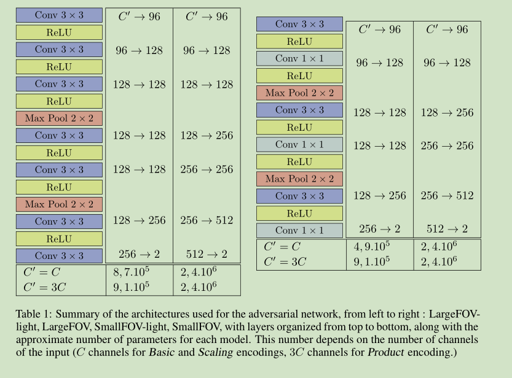
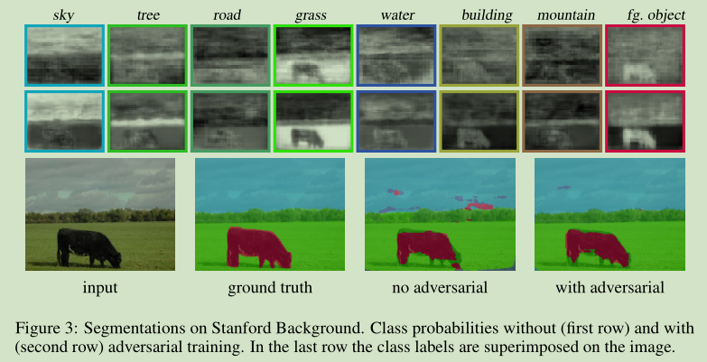
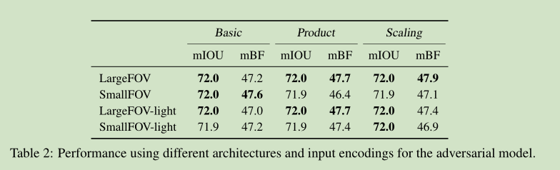

# 《Semantic Segmentation using Adversarial Networks》论文阅读笔记

&emsp;&emsp;论文地址：[Semantic Segmentation using Adversarial Networks](https://arxiv.org/pdf/1611.08408.pdf)

&emsp;&emsp;[github](https://github.com/oyam/Semantic-Segmentation-using-Adversarial-Networks)

## 一、简介
&emsp;&emsp;论文作者提到以往的语义分割方法都是先对图像进行下采样再进行上采样得到比较好的feature，将不同层级之间的feature进行融合得到最终的语义分割图，没有很好的利用像素与像素之间的相互关系。即便后连出现的CRF有效的该晒了结果但是其效果终究是有限的。因此作者提出了使用对抗方法训练语义分割。这篇文章的主要贡献：
- 第一次经对抗方法应用到语义分割中；
- 使用对抗方法在没有增加网络负担的情况下增强了网络的效果

## 二、网络结构

### 1、结构

&emsp;&emsp;如图为网络的结构流程。GAN本身是利用博弈的思想，生成器生成图片通过判别器进行判别直到判别网络无法识别出图像的真假为止。作者提出的方法希望通过判别器判别生成的类标签和ground truth的差距。如图，网络的训练判别如下：
$$
判别器输出=
\left\{
\begin{array}
    {ll}
    1,输入为ground truth + image\\
    0,输入为class pred map + image
\end{array}\right.
$$
&emsp;&emsp;而传统使用的FCNs等网络就可以用作GAN中的生成器，只需再搭建一个判别器即可。
&emsp;&emsp;大概整理下就是：网络通过对抗生成的方式调整语义分割网络生成的类标签接近于ground truth。
**Standford Background dataset:**
&emsp;&emsp;Standford的数据集采用的是multi-scale分割网络。输入则是对地面真相标签图进行下采样以匹配分割网络的输出分辨率，并以one-hot编码方式输入到对抗对象。

**Pascal VOC 2012 dataset:**
&emsp;&emsp;VOC数据集采用的是Dilated-8作为分割网络。作者针对这个网络探索了三个变体的输入：Basic，Product 和Scaling。
- Basic：直接输入概率图；
- Product：使用label map，并且将概率图和下采样后的原图像相乘得到3*C通道的map，输入到对抗网络；
- Scaling：$\bar{y}_{il}=max(\tau,s(x)_{il})$，$i$为位置，$l$为ground truth，其他位置$c$的值为$\bar{y}_{ic}=s(x)_{ic}(1-\bar{y}_{il})/(1-s(x)_{il})$,$\tau=0.9$。
  

### 2、损失函数
&emsp;&emsp;损失函数采用的是混合损失函数，前半部分是语义分割常用的损失函数，后半部分是GAN的损失函数(以下公式中$y_n$表示类标签，$x_n$表示输入)：
$$
\ell(\theta_s,\theta_a)=\sum_{n=1}^{N}\ell_{mce}(s(x_n),y_n)-\lambda[\ell_{bce}(a(x_n,y_n),1)+\ell_{bce}(a(x_n,y_n),0)]
$$
&emsp;&emsp;在实际训练过程中会将GAN和分割网络分开训练，先训练GAN再训练分割网络。类似于EM算法先固定一个参数，训练另一个，之后再固定之前的再训练原来的，如此交替。
$$
\sum_{n=1}^{N}\ell_{bce}(a(x_n,y_n),1)+\ell_{bce}(a(x_n,y_n),0)
$$
$$
\sum_{n=1}^{N}\ell_{mce}(s(x_n),y_n)-\lambda\ell_{bce}(a(x_n,y_n),0)
$$
## 三、结果

