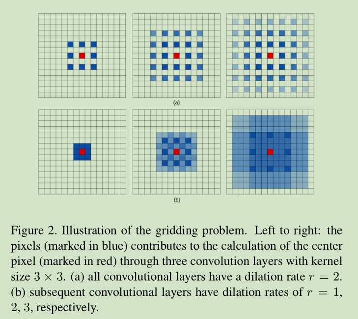
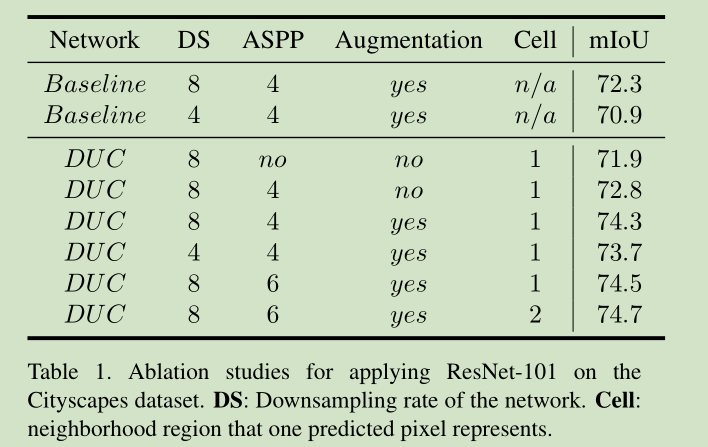
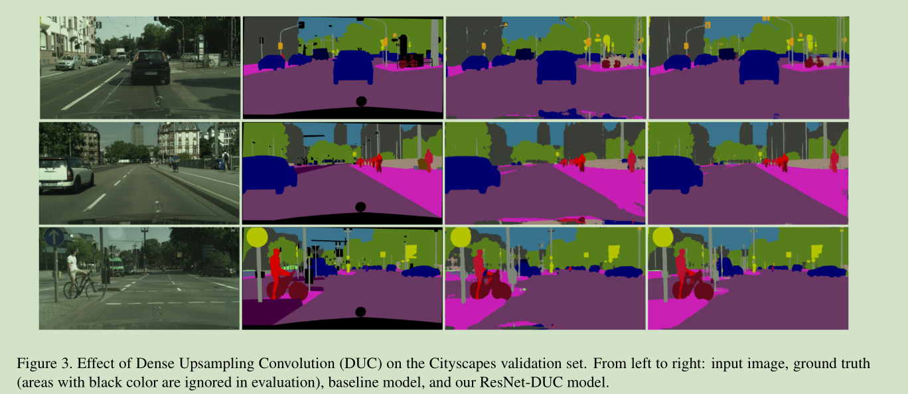
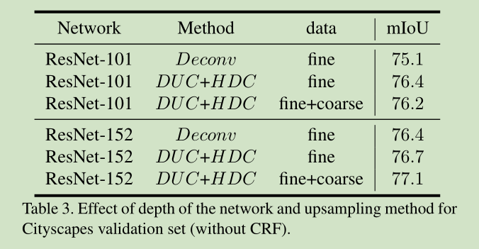
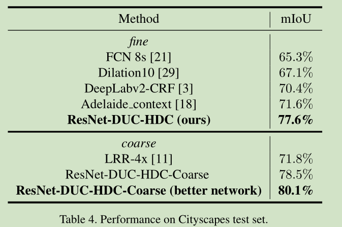

# 《Understanding Convolution for Semantic Segmentation》论文阅读笔记

&emsp;&emsp;[Understanding Convolution for Semantic Segmentation]()

&emsp;&emsp;[github](https://github.com/TuSimple/TuSimple-DUC)

## 一、简介
&emsp;&emsp;现如今的语义分割大多是都是沿袭早期的Encoder-Decoder结构和FCNs，在此基础上进行修改，之后出现了使用空洞卷积和CRF改善网络性能的方法。但是新出的方法有两个缺陷：
1、上采样大多数使用非线性插值或者Deconvolution，非线性插值是不可学习的很难恢复额外的信息，而Deconvolution必须填充0来对feature进行unpooling；
2、采用空洞卷积会在feature上造成grid效用，如果rate过大略过的信息会过多。
&emsp;&emsp;作者针对这两个问题分别提出了Dense Upsampling Convolution(DUC)结构和Hubrid Dilation Convolution（HDC）。
## 二、网络结构

### 1、Dense Upsampling Convolution(DUC)
&emsp;&emsp;DUC的输入大小是$H*W*C$经过一个深层的FCN后得到一个大小为$h*w*c$的feature map，而$h=H/d,w=W/d$其中$d$是下采样因子。DUC直接在feature上使用卷积操作来获取密集的像素级预测图。经过backbone得到的feautre经过一个卷积层之后得到$h*w*(d^w*L)$大小的输出，$L$是目标任务的分类总数，之后经过reshape得到目标输出$H*W*L$得到分类预测图。
&emsp;&emsp;下面为代码实现可以看到DUC主要分为两部分一部分是普通的卷积操作，用来改变通道，另一部分是PixelShuffle，用来reshape，这个操作来源于论文[Real-Time Single Image and Video Super-Resolution Using an Efficient Sub-Pixel Convolutional Neural Network]，具体步骤如下图：(https://arxiv.org/abs/1609.05158)，这样相当于将输出相同通道上的信息存储在输入的不同的通道上使得最终的结果是可学习的。

```python
class _DenseUpsamplingConvModule(nn.Module):
    def __init__(self, down_factor, in_dim, num_classes):
        super(_DenseUpsamplingConvModule, self).__init__()
        upsample_dim = (down_factor ** 2) * num_classes
        self.conv = nn.Conv2d(in_dim, upsample_dim, kernel_size=3, padding=1)
        self.bn = nn.BatchNorm2d(upsample_dim)
        self.relu = nn.ReLU(inplace=True)
        self.pixel_shuffle = nn.PixelShuffle(down_factor)

    def forward(self, x):
        x = self.conv(x)
        x = self.bn(x)
        x = self.relu(x)
        x = self.pixel_shuffle(x)
        return x
```
### 2、Hybrid Dilated Convolution(HDC)
&emsp;&emsp;空洞卷积是在普通的卷积之间添加空洞率来得到更大的感受野是最近比较好用的一类语义分割方法，但是存在grid问题，如下图如果多层的空洞卷积层使用相同的rate，或者成比例都会使得网络错过大量的信息，当rate越大这个缺陷越明显。并且对于深度网络来说信息更小的概率传递到后面的层次。

&emsp;&emsp;因此对于$N$层$K*K$大小空洞率为$[r_1,r_2,...,r_n]$设计的目标就是让$M_2\le K$,其中$M_i$表示两个非0元素之间的距离，$M_n=r_n$:
$$
M_i = max[M_{i+1}-2r_i,M_{i+1}-2(M_{i+1}-r_i),r_i]
$$
&emsp;&emsp;例如对于$K=3,r=[1,2,5]$符合要求：
$$
M_2=max[5 - 2 * 2, 5 - 2(5 - 2)),2]=2<K=3
$$
&emsp;&emsp;而对于$r=[1,2,9]$
$$
M_2=max[9-2*2,-9+2*2,2]=5>K=3
$$
不符合，这么做的目的是使得空洞卷积更多的覆盖feature而不丢失信息。在实际应用中如上图所示，使用$r=[1,2,3]$之后空洞卷积层能够覆盖更多的信息。
```python
class ResNetDUCHDC(nn.Module):
    # the size of image should be multiple of 8
    def __init__(self, num_classes, pretrained=True):
        super(ResNetDUCHDC, self).__init__()
        resnet = models.resnet152()
        if pretrained:
            resnet.load_state_dict(torch.load(res152_path))
        self.layer0 = nn.Sequential(resnet.conv1, resnet.bn1, resnet.relu, resnet.maxpool)
        self.layer1 = resnet.layer1
        self.layer2 = resnet.layer2
        self.layer3 = resnet.layer3
        self.layer4 = resnet.layer4

        for n, m in self.layer3.named_modules():
            if 'conv2' in n or 'downsample.0' in n:
                m.stride = (1, 1)
        for n, m in self.layer4.named_modules():
            if 'conv2' in n or 'downsample.0' in n:
                m.stride = (1, 1)
        layer3_group_config = [1, 2, 5, 9]
        for idx in range(len(self.layer3)):
            self.layer3[idx].conv2.dilation = (layer3_group_config[idx % 4], layer3_group_config[idx % 4])
            self.layer3[idx].conv2.padding = (layer3_group_config[idx % 4], layer3_group_config[idx % 4])
        layer4_group_config = [5, 9, 17]
        for idx in range(len(self.layer4)):
            self.layer4[idx].conv2.dilation = (layer4_group_config[idx], layer4_group_config[idx])
            self.layer4[idx].conv2.padding = (layer4_group_config[idx], layer4_group_config[idx])

        self.duc = _DenseUpsamplingConvModule(8, 2048, num_classes)

    def forward(self, x):
        x = self.layer0(x)
        x = self.layer1(x)
        x = self.layer2(x)
        x = self.layer3(x)
        x = self.layer4(x)
        x = self.duc(x)
        return x
```
## 三、结果





