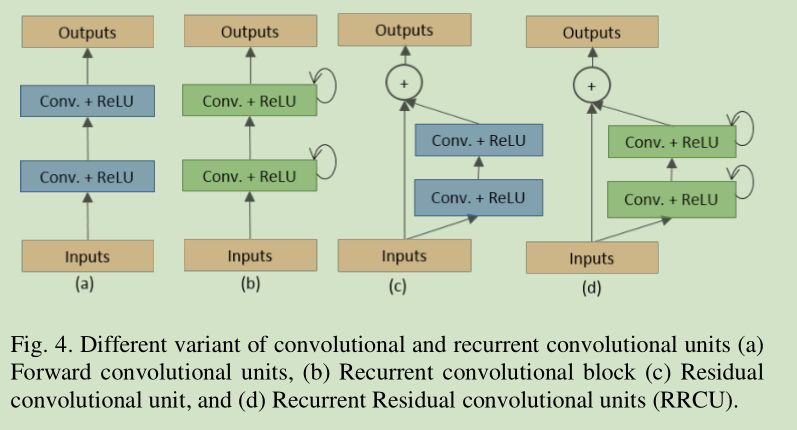
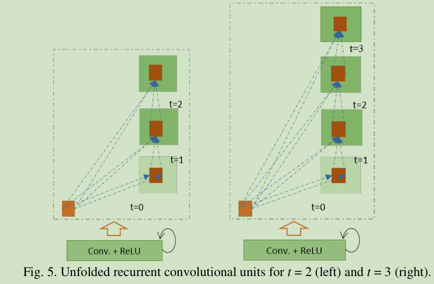
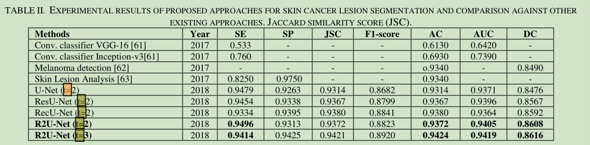
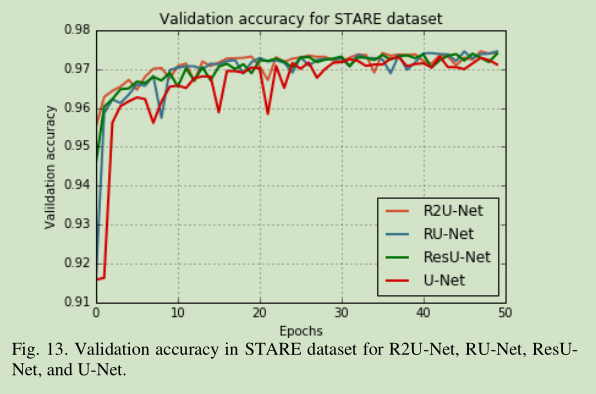
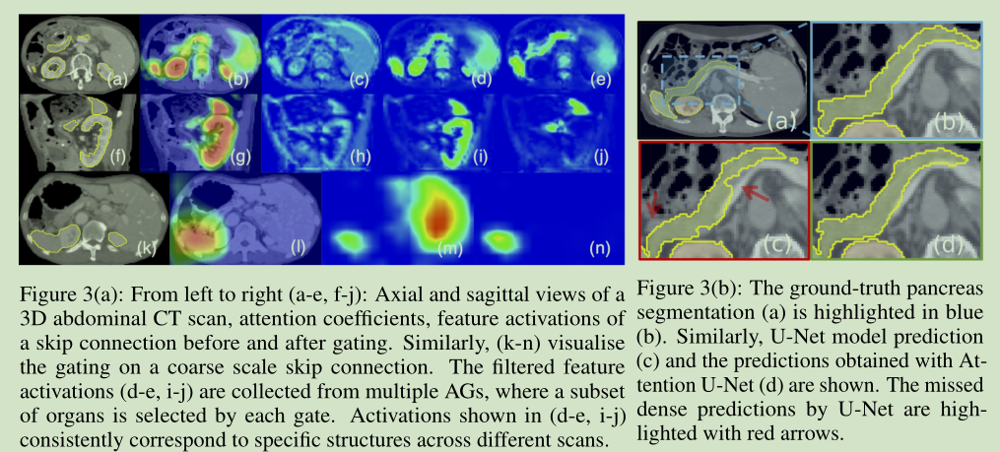

# U-Net论文阅读笔记
[toc]

&emsp;&emsp;U-Net论文地址:[U-Net: Convolutional Networks for Biomedical Image Segmentation](https://arxiv.org/abs/1505.04597)
## 一、简介
&emsp;&emsp;U-Net是比较早一批出现的全卷积语义分割网络，最早的是FCN。U-Net使用了一种编码器-解码器的结构，能够很好的识别出待预测图像的细节信息。
## 二、结构

### 1、网络结构
&emsp;&emsp;U-Net的基本结构如下图所示:

&emsp;&emsp;可以明显的看到整个网络包含20个卷积层，只有一个是1\*1卷积层，其余全部是3\*3卷积层，另外，高层的特征通过contact与低层的特征进行融合二者的信息。但是，需要注意的是网络的输入大小和输出大小不一致，输入大小为572\*572，输出大小为388\*388，这是因为U-Net对原图像进行了镜像操作（如下图）。镜像的边界宽度是通过网络的感受野来确定的，整个网络的感受野的大小为:
$$
respective field=(((2 + 2) * 2 + 2 + 2) * 2 + 2 + 2) * 2 + 2 + 2 = 60%感受野计算公式存疑，网上查到的都是rf=(rf_{i-1} - 1)*stride+kernel
$$
&emsp;&emsp;因此对原本512的图像不同方向分别镜像加宽30个像素。


## 三、实验
### 1、损失函数
&emsp;&emsp;U-Net的损失函数是根据具体的任务ISBI数据集进行设计的，该数据集样本如下：


&emsp;&emsp;U-Net设计了带边界全职的损失函数:
$$
E=\sum_{X \in \Omega}w(X)log(p_{l(x)}(X))
$$
&emsp;&emsp;其中$p_{l(x)}$是softmax损失函数,$l$表示像素点的标签值：
$$
w(X)=w_c(X)+w_0\dot{e^{-\frac{(d_1(x)+d_2(x))^2}{2\sigma^2}}}
$$
&emsp;&emsp;$d_1$表示想读点距离最近细胞的距离，$d_2$表示想读点距离第二近的细胞的距离，其中$w_0$和$\sigma$为常数值，$w_0=10,\sigma=5$，$w_c$是平衡类别比例的权值
### 2、数据扩充
&emsp;&emsp;U-Net数据扩充采用了如下方式:


### 3、结果


## 四、U-Net改
### 1、R2U-Net
&emsp;&emsp;论文地址:[Recurrent Residual Convolutional Neural Network based on U-Net (R2U-Net) for Medical Image Segmentation](https://arxiv.org/ftp/arxiv/papers/1802/1802.06955.pdf)
&emsp;&emsp;代码地址:[github](https://github.com/LeeJunHyun/Image_Segmentation#r2u-net)

#### 1)、网络结构


&emsp;&emsp;R2U-Net有三个版本分别是R2U-Net,RU-Net和ResU-Net，三者基本都是基于上面的U-Net框架修改的，不同的是编解码器中每一层中的卷积层模块被替换成伊阿棉几个模块，其中a是原始的U-Net中使用的模块，后面三个分别是几个新网络结构使用的模块。

&emsp;&emsp;下面是Recurrent Block的结构图，其实并不是很直观，直接看代码的话会好很多。

&emsp;&emsp;下面是Recurrent Block的代码结构，就是简单的conv的堆叠,也就意味着更多的参数量和计算量：
```python
class Recurrent_block(nn.Module):
    def __init__(self,ch_out,t=2):
        super(Recurrent_block,self).__init__()
        self.t = t
        self.ch_out = ch_out
        self.conv = nn.Sequential(
            nn.Conv2d(ch_out,ch_out,kernel_size=3,stride=1,padding=1,bias=True),
		    nn.BatchNorm2d(ch_out),
			nn.ReLU(inplace=True)
        )

    def forward(self,x):
        for i in range(self.t):

            if i==0:
                x1 = self.conv(x)
            
            x1 = self.conv(x+x1)
        return x1
        
class RRCNN_block(nn.Module):
    def __init__(self,ch_in,ch_out,t=2):
        super(RRCNN_block,self).__init__()
        self.RCNN = nn.Sequential(
            Recurrent_block(ch_out,t=t),
            Recurrent_block(ch_out,t=t)
        )
        self.Conv_1x1 = nn.Conv2d(ch_in,ch_out,kernel_size=1,stride=1,padding=0)

    def forward(self,x):
        x = self.Conv_1x1(x)
        x1 = self.RCNN(x)
        return x+x1
```
&emsp;&emsp;不同的t选择时的效果但是并不是绝对的，不同任务不同的t效果不同。


#### 2)、实验结果
&emsp;&emsp;结果上看的话相比于U-Net训练更加稳定，当然效果要好一点儿。



### 2、Attention U-Net
&emsp;&emsp;论文地址:[Attention U-Net:Learning Where to Look for the Pancreas](https://arxiv.org/ftp/arxiv/papers/1802/1802.06955.pdf)
&emsp;&emsp;代码地址:[github](https://github.com/ozan-oktay/Attention-Gated-Networks)

#### 1)、网络结构
&emsp;&emsp;Attention U-Net的网络结构基本和U-Net相同，不同之处时在每个解码模块之前加入了一个Attention Gate，这个Attention Gate用来学习低层和高层信息融合时候的权重。

&emsp;&emsp;下面是论文中给出的Attention Gate的结构图，其中$F_g$对应低层的feature，$F_l$对应高层的feature，二者分别通过一个1\*1的卷积层之后进行融合（从代码上看就是简单的相加），之后分别经过激活层，1\*1卷积层和sigmoid得到相应的权重，再将该权重应用于原feature，如下为具体的代码，更加明显清晰。

```python
class Attention_block(nn.Module):
    def __init__(self,F_g,F_l,F_int):
        super(Attention_block,self).__init__()
        self.W_g = nn.Sequential(
            nn.Conv2d(F_g, F_int, kernel_size=1,stride=1,padding=0,bias=True),
            nn.BatchNorm2d(F_int)
            )
        
        self.W_x = nn.Sequential(
            nn.Conv2d(F_l, F_int, kernel_size=1,stride=1,padding=0,bias=True),
            nn.BatchNorm2d(F_int)
        )

        self.psi = nn.Sequential(
            nn.Conv2d(F_int, 1, kernel_size=1,stride=1,padding=0,bias=True),
            nn.BatchNorm2d(1),
            nn.Sigmoid()
        )
        
        self.relu = nn.ReLU(inplace=True)
        
    def forward(self,g,x):
        g1 = self.W_g(g)
        x1 = self.W_x(x)
        psi = self.relu(g1+x1)
        psi = self.psi(psi)

        return x*psi
```
#### 2)、实验
&emsp;&emsp;attention 的结果图

&emsp;&emsp;实验结果图：
