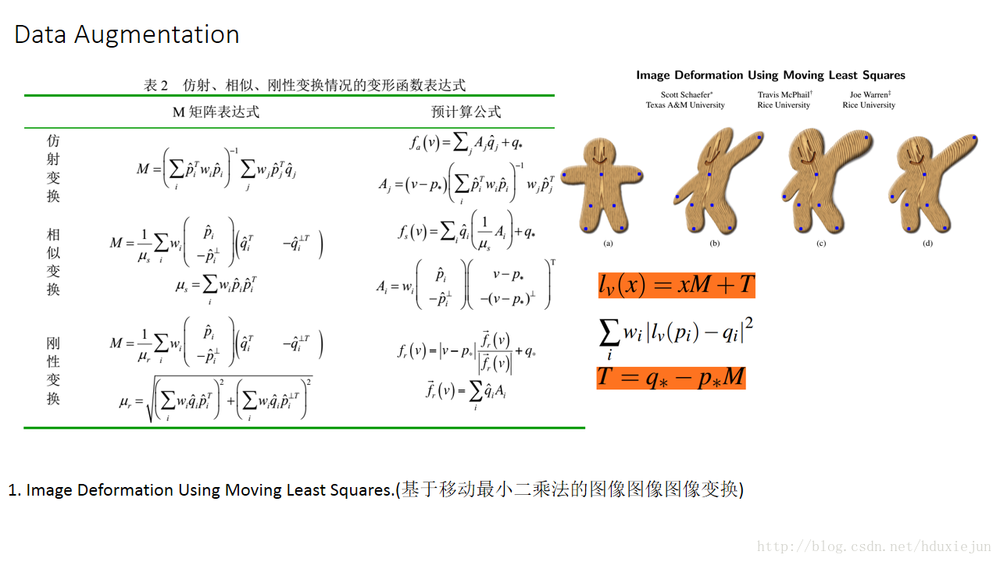
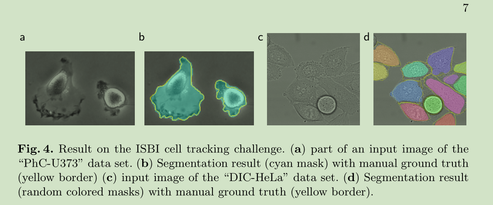

# U-Net论文阅读笔记
[toc]

&emsp;&emsp;U-Net论文地址:[U-Net: Convolutional Networks for Biomedical Image Segmentation](https://arxiv.org/abs/1505.04597)
## 一、简介
&emsp;&emsp;U-Net是比较早一批出现的全卷积语义分割网络，最早的是FCN。U-Net使用了一种编码器-解码器的结构，能够很好的识别出待预测图像的细节信息。
## 二、结构

### 1、网络结构
&emsp;&emsp;U-Net的基本结构如下图所示:

&emsp;&emsp;可以明显的看到整个网络包含20个卷积层，只有一个是1\*1卷积层，其余全部是3\*3卷积层，另外，高层的特征通过contact与低层的特征进行融合二者的信息。但是，需要注意的是网络的输入大小和输出大小不一致，输入大小为572\*572，输出大小为388\*388，这是因为U-Net对原图像进行了镜像操作（如下图）。镜像的边界宽度是通过网络的感受野来确定的，整个网络的感受野的大小为:
$$
respective field=(((2 + 2) * 2 + 2 + 2) * 2 + 2 + 2) * 2 + 2 + 2 = 60
$$
&emsp;&emsp;因此对原本512的图像不同方向分别镜像加宽30个像素。

## 三、实验
### 1、损失函数
&emsp;&emsp;U-Net的损失函数是根据具体的任务ISBI数据集进行设计的，该数据集样本如下：

&emsp;&emsp;U-Net设计了带边界全职的损失函数:
$$
E=\sum_{X \in \Omega}w(X)log(p_{l(x)}(X))
$$
&emsp;&emsp;其中$p_{l(x)}$是softmax损失函数,$l$表示像素点的标签值：
$$
w(X)=w_c(X)+w_0\dot{e^{-\frac{(d_1(x)+d_2(x))^2}{2\sigma^2}}}
$$
&emsp;&emsp;$d_1$表示想读点距离最近细胞的距离，$d_2$表示想读点距离第二近的细胞的距离，其中$w_0$和$\sigma$为常数值，$w_0=10,\sigma=5$，$w_c$是平衡类别比例的权值
### 2、数据扩充
&emsp;&emsp;U-Net数据扩充采用了如下方式:

### 3、结果

