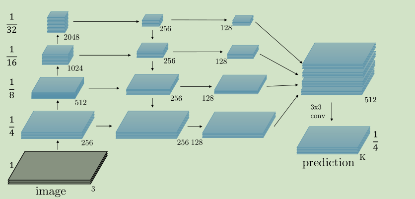
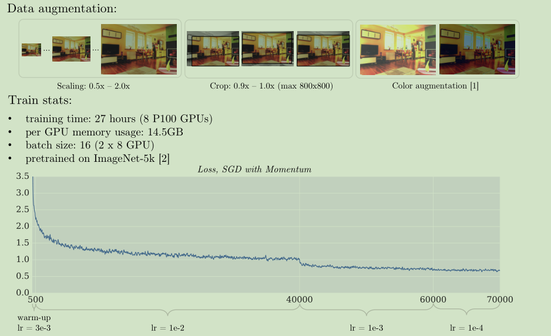

# 《A Unified Architecture for Instance and Semantic Segmentation》论文阅读笔记
&emsp;&emsp;论文地址:[A Unified Architecture for Instance and Semantic Segmentation](http://presentations.cocodataset.org/COCO17-Stuff-FAIR.pdf)
&emsp;&emsp;代码地址:[github](https://github.com/qubvel/segmentation_models)

## 一、简介
&emsp;&emsp;全是图。
## 二、网络结构

## 三、结果

