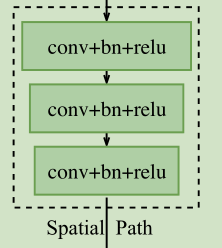
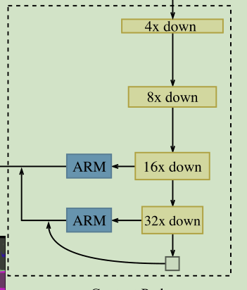
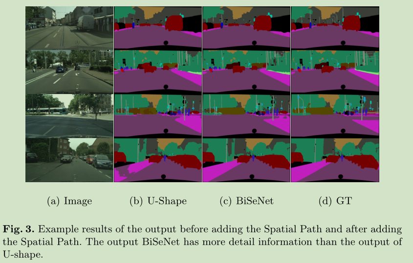

# 《BiSeNet: Bilateral Segmentation Network for Real-time Semantic Segmentation》论文阅读笔记
&emsp;&emsp;论文地址:[BiSeNet: Bilateral Segmentation Network forReal-time Semantic Segmentation](https://arxiv.org/pdf/1808.00897.pdf)
&emsp;&emsp;论文代码:[github](https://github.com/ycszen/TorchSeg)
## 一、简介
&emsp;&emsp;看标题顾名思义，文章主要针对实时语义分割任务做网络设计。文中提到一般的加速语义分割网络的基本方式是：
- 1、限制输入大小。很容易丢失网络边界的空间信息，导致准确率下降。
- 2、裁剪网络结构。裁剪网络会弱化网络的表征能力。
- 3、类似ENet丢弃模型的最后一个阶段。这会导致网络的感受野不足以覆盖大目标。


&emsp;&emsp;因此文中提出了BiSeNet(Bilateral Segmentation Network)，包含SP(Spatial Path)和CP(Context Path)。其中，SP使用三个卷积层堆叠得到1/8的包含丰富空间细节信息的feature；CP在Xception的尾部附加一个全局平均池化层，其输入为backbone的最大值。文中还提出了FFM(Feature Fusion Module)和ARM(Attention Refinement Module)用来保证网络的准确率。
&emsp;&emsp;文章的主要贡献：
- 提出BiSeNet；
- 设计了FFM和ARM。

## 二、网络结构


### 1、Spatial Path
&emsp;&emsp;SP结构没什么好说的就是三层卷积层，stride=2，最终得到1/8原始尺寸的feature。


### 2、Context Path
&emsp;&emsp;就是Xception将最后两个stage用skip链接中间加入ARM模块进行特征增强。


### 3、Attention Refinement Module
&emsp;&emsp;简单的attention，也许不是用$×$而是用$F+Attr(F)$好点儿。


### 4、Feature Fusion Module
&emsp;&emsp;两条路径的特征在特征表示级别上有所不同。因此，不能简单地总结这些功能。SP捕获的空间信息主要对丰富的细节信息进行​​编码。此外，CP的输出特征主要对上下文信息进行编码。换句话说，SP的输出特征为低电平，而CP的输出特征为高电平。使用FFM融合模块来融合这些功能。
&emsp;&emsp;FFM说白了就是Attention。


### 5、损失函数
&emsp;&emsp;网络中使用了辅助分支帮助训练网络
$$
loss=\frac{1}{N}\sum_i{L_i}=\frac{1}{N}\sum_i{-log(\frac{e^{p_i}}{\sum_j{e^p_j}})}
$$
$$
L(X;W)=l_p(X;W)+\alpha\sum_{i=2}^{K}l_i(X_i;W)
$$
&emsp;&emsp;$l_p$是principal loss（具体是什么没查到）,$X_i$是第$i$个stage输出的feature。
## 三、代码
### 1、Spatial Path
&emsp;&emsp;这个实现和论文提到的结构有所不同，但智利的更加合理。
```python
class SpatialPath(nn.Module):
    def __init__(self, in_planes, out_planes, norm_layer=nn.BatchNorm2d):
        super(SpatialPath, self).__init__()
        inner_channel = 64
        self.conv_7x7 = ConvBnRelu(in_planes, inner_channel, 7, 2, 3,
                                   has_bn=True, norm_layer=norm_layer,
                                   has_relu=True, has_bias=False)
        self.conv_3x3_1 = ConvBnRelu(inner_channel, inner_channel, 3, 2, 1,
                                     has_bn=True, norm_layer=norm_layer,
                                     has_relu=True, has_bias=False)
        self.conv_3x3_2 = ConvBnRelu(inner_channel, inner_channel, 3, 2, 1,
                                     has_bn=True, norm_layer=norm_layer,
                                     has_relu=True, has_bias=False)
        self.conv_1x1 = ConvBnRelu(inner_channel, out_planes, 1, 1, 0,
                                   has_bn=True, norm_layer=norm_layer,
                                   has_relu=True, has_bias=False)

    def forward(self, x):
        x = self.conv_7x7(x)
        x = self.conv_3x3_1(x)
        x = self.conv_3x3_2(x)
        output = self.conv_1x1(x)

        return output
```
### 2、Context Path
&emsp;&emsp;
```python
class BiSeNet(nn.Module):
    def __init__(self, out_planes, is_training,
                 criterion, ohem_criterion, pretrained_model=None,
                 norm_layer=nn.BatchNorm2d):
        super(BiSeNet, self).__init__()
        self.context_path = xception39(pretrained_model, norm_layer=norm_layer)

        self.business_layer = []
        self.is_training = is_training

        self.spatial_path = SpatialPath(3, 128, norm_layer)

        conv_channel = 128
        self.global_context = nn.Sequential(
            nn.AdaptiveAvgPool2d(1),
            ConvBnRelu(256, conv_channel, 1, 1, 0,
                       has_bn=True,
                       has_relu=True, has_bias=False, norm_layer=norm_layer)
        )

        # stage = [256, 128, 64]
        arms = [AttentionRefinement(256, conv_channel, norm_layer),
                AttentionRefinement(128, conv_channel, norm_layer)]
        refines = [ConvBnRelu(conv_channel, conv_channel, 3, 1, 1,
                              has_bn=True, norm_layer=norm_layer,
                              has_relu=True, has_bias=False),
                   ConvBnRelu(conv_channel, conv_channel, 3, 1, 1,
                              has_bn=True, norm_layer=norm_layer,
                              has_relu=True, has_bias=False)]

        if is_training:
            heads = [BiSeNetHead(conv_channel, out_planes, 2,
                                 True, norm_layer),
                     BiSeNetHead(conv_channel, out_planes, 1,
                                 True, norm_layer),
                     BiSeNetHead(conv_channel * 2, out_planes, 1,
                                 False, norm_layer)]
        else:
            heads = [None, None,
                     BiSeNetHead(conv_channel * 2, out_planes, 1,
                                 False, norm_layer)]

        self.ffm = FeatureFusion(conv_channel * 2, conv_channel * 2,
                                 1, norm_layer)

        self.arms = nn.ModuleList(arms)
        self.refines = nn.ModuleList(refines)
        self.heads = nn.ModuleList(heads)

        self.business_layer.append(self.spatial_path)
        self.business_layer.append(self.global_context)
        self.business_layer.append(self.arms)
        self.business_layer.append(self.refines)
        self.business_layer.append(self.heads)
        self.business_layer.append(self.ffm)

        if is_training:
            self.criterion = criterion
            self.ohem_criterion = ohem_criterion

    def forward(self, data, label=None):
        spatial_out = self.spatial_path(data)

        context_blocks = self.context_path(data)
        context_blocks.reverse()

        global_context = self.global_context(context_blocks[0])
        global_context = F.interpolate(global_context,
                                       size=context_blocks[0].size()[2:],
                                       mode='bilinear', align_corners=True)

        last_fm = global_context
        pred_out = []

        for i, (fm, arm, refine) in enumerate(zip(context_blocks[:2], self.arms,
                                                  self.refines)):
            fm = arm(fm)
            fm += last_fm
            last_fm = F.interpolate(fm, size=(context_blocks[i + 1].size()[2:]),
                                    mode='bilinear', align_corners=True)
            last_fm = refine(last_fm)
            pred_out.append(last_fm)
        context_out = last_fm

        concate_fm = self.ffm(spatial_out, context_out)
        # concate_fm = self.heads[-1](concate_fm)
        pred_out.append(concate_fm)

        if self.is_training:
            aux_loss0 = self.ohem_criterion(self.heads[0](pred_out[0]), label)
            aux_loss1 = self.ohem_criterion(self.heads[1](pred_out[1]), label)
            main_loss = self.ohem_criterion(self.heads[-1](pred_out[2]), label)

            loss = main_loss + aux_loss0 + aux_loss1
            return loss

        return F.log_softmax(self.heads[-1](pred_out[-1]), dim=1)
``
### 3、Attention Refinement Module
&emsp;&emsp;显然就是channelattention。
```python
class AttentionRefinement(nn.Module):
    def __init__(self, in_planes, out_planes,
                 norm_layer=nn.BatchNorm2d):
        super(AttentionRefinement, self).__init__()
        self.conv_3x3 = ConvBnRelu(in_planes, out_planes, 3, 1, 1,
                                   has_bn=True, norm_layer=norm_layer,
                                   has_relu=True, has_bias=False)
        self.channel_attention = nn.Sequential(
            nn.AdaptiveAvgPool2d(1),
            ConvBnRelu(out_planes, out_planes, 1, 1, 0,
                       has_bn=True, norm_layer=norm_layer,
                       has_relu=False, has_bias=False),
            nn.Sigmoid()
        )

    def forward(self, x):
        fm = self.conv_3x3(x)
        fm_se = self.channel_attention(fm)
        fm = fm * fm_se

        return fm
```
### 4、Feature Fusion Module
&emsp;&emsp;
```python
class FeatureFusion(nn.Module):
    def __init__(self, in_planes, out_planes,
                 reduction=1, norm_layer=nn.BatchNorm2d):
        super(FeatureFusion, self).__init__()
        self.conv_1x1 = ConvBnRelu(in_planes, out_planes, 1, 1, 0,
                                   has_bn=True, norm_layer=norm_layer,
                                   has_relu=True, has_bias=False)
        self.channel_attention = nn.Sequential(
            nn.AdaptiveAvgPool2d(1),
            ConvBnRelu(out_planes, out_planes // reduction, 1, 1, 0,
                       has_bn=False, norm_layer=norm_layer,
                       has_relu=True, has_bias=False),
            ConvBnRelu(out_planes // reduction, out_planes, 1, 1, 0,
                       has_bn=False, norm_layer=norm_layer,
                       has_relu=False, has_bias=False),
            nn.Sigmoid()
        )

    def forward(self, x1, x2):
        fm = torch.cat([x1, x2], dim=1)
        fm = self.conv_1x1(fm)
        fm_se = self.channel_attention(fm)
        output = fm + fm * fm_se
        return output
```
## 四、结果



