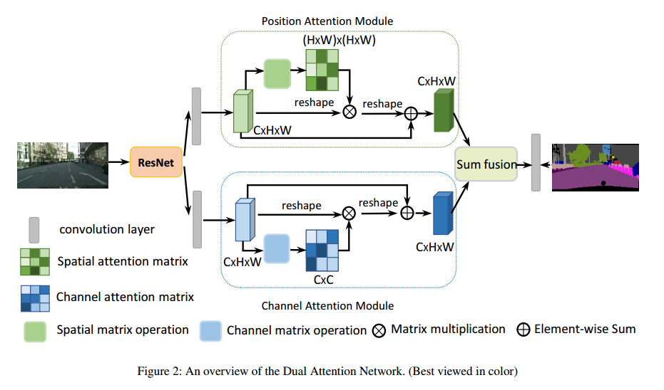
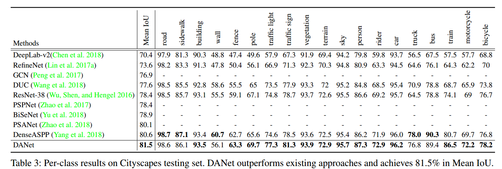
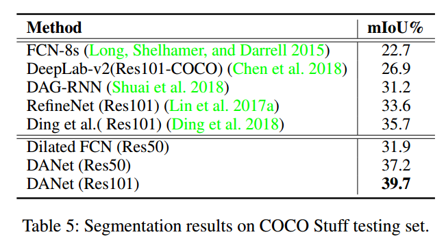
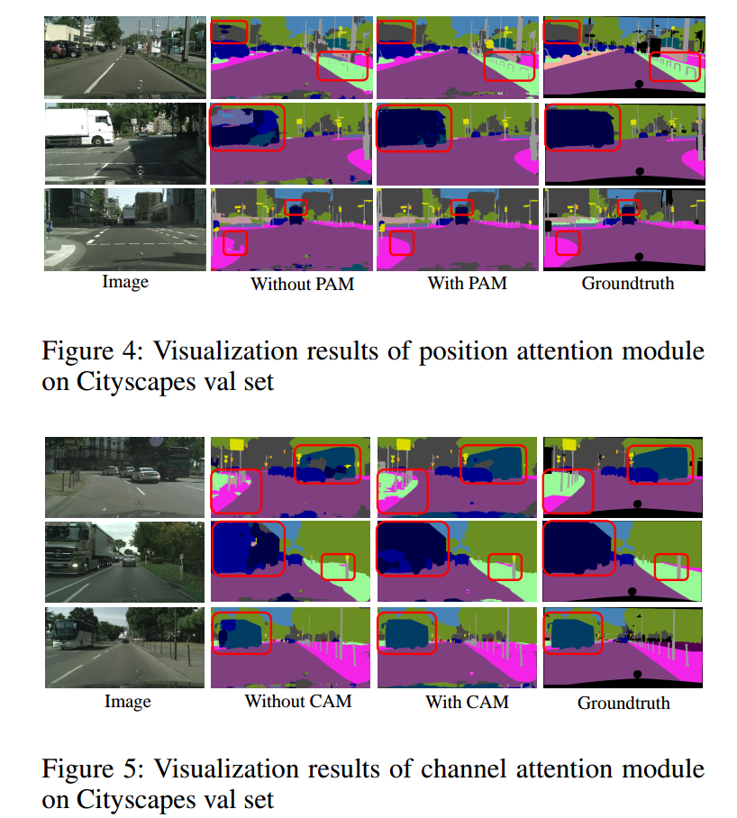

# 《Dual Attention Network for Scene Segmentation》论文阅读
&emsp;&emsp;论文地址：[Dual Attention Network for Scene Segmentation](http://xxx.itp.ac.cn/pdf/1809.02983v2)
&emsp;&emsp;代码地址：[github](http://xxx.itp.ac.cn/pdf/1809.02983v2)

# 1. 简介
&emsp;&emsp;文章中介绍了一种注意力机制，分为两个模块PAM(position attention module)和CAM(channel attention module)，结构和non-local之类的attention非常相似。作者使用这个结构的用意是通过不同通道和不同像素之间相互影响生成attention map来进行feature中的区域选取。实现方式基本就是attention的思想：通道加权，像素加权。
&emsp;&emsp;另外作者基于这两个模块设计了DANet。

# 2. 结构
&emsp;&emsp;下图是DANet的整体结构，基础网络是经过修改的ResNet，后面接两个分支PAM和CAM，最后将两个分支的feature进行相加经过一个卷积层得到最终的分割图。DANet的backbone是将Resnet最后的两个block的下采样层去掉之后使用dilation convolution(空洞卷积)实现保证网络的feture map尺寸只下降了$\frac{1}{8}$。

## 2.1 Position Attention Module

&emsp;&emsp;途中PAM分为四个分支，其中生成Attention的上BC两个分支，D用来生成经过attention map处理的feature，最下面的是保留原有的feature保证信息不丢失。
&emsp;&emsp;基本的流程：
- 输入$A\in R^{C*H*W}$，BCD三个分支分别经过conv+batch_norm+relu得到对应的输出$B\in R^{R*H*W}$,$C\in R^{C*H*W}$, $D\in R^{C*H*W}$
- $B，C$经过reshape维度编程$R^{C*N},N=H*W$，然后$B^{T}*C$得到$S^{R^{N*N}}$，得到的输出经过softmax得到$S\in R^{(H*W)*(H*W)}$的相应图,其中$s_ji$表示feature上点$j$对$i$的影响。
$$
s_{ji}=\frac{exp(B_i\cdot C_j)}{\sum^{N}_{i=1}exp(B_i\cdot C_j)}
$$
- 得到的attention map和输入进行相乘的操作；
- 最后和原有的输入进行加权的相加，如下公式,其中$\alpha$初始化为0，是可学习的。

$$
E_j=\alpha \sum_{i=1}^{N}(s_{ji}D_i)+A_j
$$
&emsp;&emsp;下面为流程图，不会出现feature之类的标签，主要以维度为主如C\*H\*W表示feature或者attention map是$C$通道高宽为$H,W$。

```mermaid
graph LR
    a[C*H*W]--conv+bn+relu-->b[C*H*W]
    a--conv+bn+relu-->c[C*H*W]
    a--conv+bn+relu-->d[C*H*W]

    b--reshape-->b1[C*N]
    b1--transpose-->b2[N*C]
    c--reshape-->c1[C*N]

    b2--*-->mul[N*N]
    c1--*-->mul

    mul--softmax-->softmax[N*N]
    softmax--reshape-->soft[H*W*H*W]

    soft--*-->fusion[C*H*W]
    d--*-->fusion

    fusion--*α-->weight[C*H*W]

    a--+-->add[C*H*W]
    weight--+-->add

    style a fill:#dddddd,stroke:#f06,stroke-width:2px,stroke-dasharray: 5, 5
    style b fill:#dddddd,stroke:#f06,stroke-width:2px,stroke-dasharray: 5, 5
    style c fill:#dddddd,stroke:#f06,stroke-width:2px,stroke-dasharray: 5, 5
    style c1 fill:#dddddd,stroke:#f06,stroke-width:2px,stroke-dasharray: 5, 5
    style mul fill:#dddddd,stroke:#f06,stroke-width:2px,stroke-dasharray: 5, 5
    style softmax fill:#dddddd,stroke:#f06,stroke-width:2px,stroke-dasharray: 5, 5
    style b1 fill:#dddddd,stroke:#f06,stroke-width:2px,stroke-dasharray: 5, 5
    style b2 fill:#dddddd,stroke:#f06,stroke-width:2px,stroke-dasharray: 5, 5
    style soft fill:#dddddd,stroke:#f06,stroke-width:2px,stroke-dasharray: 5, 5
    style fusion fill:#dddddd,stroke:#f06,stroke-width:2px,stroke-dasharray: 5, 5
    style d fill:#dddddd,stroke:#f06,stroke-width:2px,stroke-dasharray: 5, 5
    style add fill:#dddddd,stroke:#f06,stroke-width:2px,stroke-dasharray: 5, 5
    style weight fill:#dddddd,stroke:#f06,stroke-width:2px,stroke-dasharray: 5, 5
    linkStyle 0 stroke:#aa2222,stroke-width:2px
    linkStyle 1 stroke:#aa2222,stroke-width:2px
    linkStyle 2 stroke:#aa2222,stroke-width:2px
    linkStyle 3 stroke:#aa2222,stroke-width:2px
    linkStyle 4 stroke:#aa2222,stroke-width:2px
    linkStyle 5 stroke:#aa2222,stroke-width:2px
    linkStyle 6 stroke:#aa2222,stroke-width:2px
    linkStyle 7 stroke:#aa2222,stroke-width:2px
    linkStyle 8 stroke:#aa2222,stroke-width:2px
    linkStyle 9 stroke:#aa2222,stroke-width:2px
    linkStyle 10 stroke:#aa2222,stroke-width:2px
    linkStyle 11 stroke:#aa2222,stroke-width:2px
    linkStyle 12 stroke:#aa2222,stroke-width:2px
    linkStyle 13 stroke:#aa2222,stroke-width:2px
    linkStyle 14 stroke:#aa2222,stroke-width:2px

```


## 2.2 Channel Attention Module

&emsp;&emsp;CAM模块的操作和PAM非常相似不同之处是操作室基于通道的生成的attention map $S$大小为$C*C$，最后的加权参数为$\beta$也是可学习的,得到的attention map上的点$s_{ji}$表示$j$通道对$i$的影响。不做赘述。下面为流程图

```mermaid
graph LR
    a[C*H*W]--conv+bn+relu-->b[C*H*W]
    a--conv+bn+relu-->c[C*H*W]
    a--conv+bn+relu-->d[C*H*W]

    b--reshape-->b1[C*N]
    c1--transpose-->c2[N*C]
    c--reshape-->c1[C*N]

    c2--*-->mul[C*C]
    b1--*-->mul

    mul--softmax-->softmax[C*C]

    softmax--*-->fusion[C*H*W]
    d--*-->fusion

    fusion--*α-->weight[C*H*W]

    a--+-->add[C*H*W]
    weight--+-->add

        style a fill:#dddddd,stroke:#f06,stroke-width:2px,stroke-dasharray: 5, 5
    style b fill:#dddddd,stroke:#f06,stroke-width:2px,stroke-dasharray: 5, 5
    style c fill:#dddddd,stroke:#f06,stroke-width:2px,stroke-dasharray: 5, 5
    style c1 fill:#dddddd,stroke:#f06,stroke-width:2px,stroke-dasharray: 5, 5
    style mul fill:#dddddd,stroke:#f06,stroke-width:2px,stroke-dasharray: 5, 5
    style softmax fill:#dddddd,stroke:#f06,stroke-width:2px,stroke-dasharray: 5, 5
    style b1 fill:#dddddd,stroke:#f06,stroke-width:2px,stroke-dasharray: 5, 5
    style c2 fill:#dddddd,stroke:#f06,stroke-width:2px,stroke-dasharray: 5, 5
    style fusion fill:#dddddd,stroke:#f06,stroke-width:2px,stroke-dasharray: 5, 5
    style d fill:#dddddd,stroke:#f06,stroke-width:2px,stroke-dasharray: 5, 5
    style add fill:#dddddd,stroke:#f06,stroke-width:2px,stroke-dasharray: 5, 5
    style weight fill:#dddddd,stroke:#f06,stroke-width:2px,stroke-dasharray: 5, 5
    linkStyle 0 stroke:#aa2222,stroke-width:2px
    linkStyle 1 stroke:#aa2222,stroke-width:2px
    linkStyle 2 stroke:#aa2222,stroke-width:2px
    linkStyle 3 stroke:#aa2222,stroke-width:2px
    linkStyle 4 stroke:#aa2222,stroke-width:2px
    linkStyle 5 stroke:#aa2222,stroke-width:2px
    linkStyle 6 stroke:#aa2222,stroke-width:2px
    linkStyle 7 stroke:#aa2222,stroke-width:2px
    linkStyle 8 stroke:#aa2222,stroke-width:2px
    linkStyle 9 stroke:#aa2222,stroke-width:2px
    linkStyle 10 stroke:#aa2222,stroke-width:2px
    linkStyle 11 stroke:#aa2222,stroke-width:2px
    linkStyle 12 stroke:#aa2222,stroke-width:2px
    linkStyle 13 stroke:#aa2222,stroke-width:2px
```


## 2.3 代码实现
&emsp;&emsp;**CAM:**
```python
def hw_flatten(x):
    return K.reshape(x, shape=[K.shape(x)[0], K.shape(x)[1]*K.shape(x)[2], K.shape(x)[3]])

def cam(x):
    f =  hw_flatten(x) # [bs, h*w, c]
    g = hw_flatten(x) # [bs, h*w, c]
    h =  hw_flatten(x) # [bs, h*w, c]
    s = K.batch_dot(K.permute_dimensions(hw_flatten(g), (0, 2, 1)), hw_flatten(f))
    beta = K.softmax(s, axis=-1)  # attention map
    o = K.batch_dot(hw_flatten(h),beta)  # [bs, N, C]
    o = K.reshape(o, shape=K.shape(x))  # [bs, h, w, C]
    x = gamma * o + x
    return x
```

&emsp;&emsp;**PAM:**
```python
def hw_flatten(x):
    return K.reshape(x, shape=[K.shape(x)[0], K.shape(x)[1]*K.shape(x)[2], K.shape(x)[3]])

def pam(x):
    f = K.conv2d(x, kernel= kernel_f, strides=(1, 1), padding='same')  # [bs, h, w, c']
    g = K.conv2d(x, kernel= kernel_g, strides=(1, 1), padding='same')  # [bs, h, w, c']
    h = K.conv2d(x, kernel= kernel_h, strides=(1, 1), padding='same')  # [bs, h, w, c]
    s = K.batch_dot(hw_flatten(g), K.permute_dimensions(hw_flatten(f), (0, 2, 1))) #[bs, N, N]
    beta = K.softmax(s, axis=-1)  # attention map
    o = K.batch_dot(beta, hw_flatten(h))  # [bs, N, C]
    o = K.reshape(o, shape=K.shape(x))  # [bs, h, w, C]
    x =  gamma * o + x
    return x
```

# 3. 实验结果
&emsp;&emsp;实验：分别在Citycapes，PASCAL Context， COCO Stuff上进行了实验。
## 3.1 实验设置
- 学习率初始化和更新为:
$$
lr * (1-\frac{iter}{total_iter})^{0.9}
$$
- 基础学习率为0.01, Cityscapes为0.001, momentum=0.9, weight-decay=0.0001;
- 数据增强：随机左右翻转

## 3.2 结果




&emsp;&emsp;可视化：

