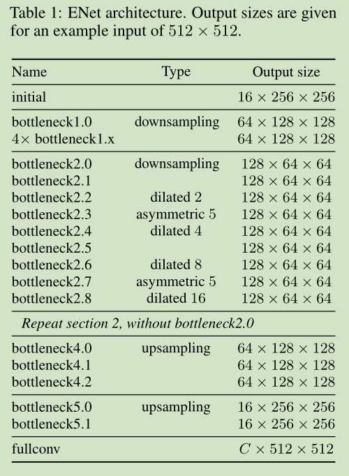

# 《ENet: A Deep Neural Network Architecture for Real-Time Semantic Segmentation》论文阅读笔记
&emsp;&emsp;论文地址：[ENet: A Deep Neural Network Architecture for Real-Time Semantic Segmentation](https://arxiv.org/pdf/1606.02147.pdf)
&emsp;&emsp;论文代码：[github](https://github.com/TimoSaemann/ENet)

[toc]

## 一、简介
&emsp;&emsp;ENet是一个实时语义分割网络。

## 二、网络结构

&emsp;&emsp;从途中可以看到网络总共分为5个stage：
- 第一个stage：initial模块；
- 第2-3，encoder；
- 第4-5，decoder。
&emsp;&emsp;在decoder中maxpooling被替换成max unpooling， padding被替换为没有bias的spatial convolution。
&emsp;&emsp;并且网络中的上采样层和下采样层和其他的Encoder-Decoder不同，上采样层比较少，而下采样层比较多，作者认为上采样层仅仅是对输出的微调并不起过多的作用。作者在训练的过程中引入了随机深度，随即失活某个残差。

### 1、Initialize Stage

&emsp;&emsp;对图像进行下采样会有两个缺陷：丢失空间和细节信息；语义分割任务需要和输入相同大小的输出，多大的下采样就意味着多大的上采样，也就会意味着有额外的开销。但是下采样会过滤掉荣誉的信息提取出语义和上下文信息。
&emsp;&emsp;因此需要在保证开销的情况下下采样输入，ENet采用了如上图的下采样模块：一个3\*3卷积和一个maxpooling并联，输出进行contact，在使用时只使用了很小的channel。这么做的一个原因是通常信息是高度冗余的可以压缩成更高效的表示，并且作者对channel数进行修改16-32发现准确率并不会上升。
```python
self.initial_block = InitialBlock(3, 16, relu=encoder_relu)
```

```python
class InitialBlock(nn.Module):
    def __init__(self,
                 in_channels,
                 out_channels,
                 bias=False,
                 relu=True):
        super().__init__()

        if relu:
            activation = nn.ReLU
        else:
            activation = nn.PReLU

        # Main branch - As stated above the number of output channels for this
        # branch is the total minus 3, since the remaining channels come from
        # the extension branch
        self.main_branch = nn.Conv2d(
            in_channels,
            out_channels - 3,
            kernel_size=3,
            stride=2,
            padding=1,
            bias=bias)

        # Extension branch
        self.ext_branch = nn.MaxPool2d(3, stride=2, padding=1)

        # Initialize batch normalization to be used after concatenation
        self.batch_norm = nn.BatchNorm2d(out_channels)

        # PReLU layer to apply after concatenating the branches
        self.out_activation = activation()

    def forward(self, x):
        main = self.main_branch(x)
        ext = self.ext_branch(x)

        # Concatenate branches
        out = torch.cat((main, ext), 1)

        # Apply batch normalization
        out = self.batch_norm(out)

        return self.out_activation(out)
```
### 2、非线性
&emsp;&emsp;网络中使用了PRELU作为激活函数，PRELU和RELU的区别如下图：

&emsp;&emsp;PRELU的负半轴的参数的斜率是自学习的，相比于RELU有少量的参数但是对模型有提升。下面是整个ENet中的权值分布：

&emsp;&emsp;可以看到初始化模块的权重方差较大，而编码器中的权值都是负数表明输入更倾向于正值，学习到的信息更加准确。另外上采样层的权值变化比较大。

### 3、非对称卷积
&emsp;&emsp;网络中采用了n=5的非对称卷积，在Inception-V3中作者任务n\*n的卷积核等价于1\*n和n\*1的串联卷积，后者能够更好的提取语义信息，且当个大核卷积等价于多个小核卷积（VGG）。
```python
if asymmetric:
            self.ext_conv2 = nn.Sequential(
                nn.Conv2d(
                    internal_channels,
                    internal_channels,
                    kernel_size=(kernel_size, 1),
                    stride=1,
                    padding=(padding, 0),
                    dilation=dilation,
                    bias=bias), nn.BatchNorm2d(internal_channels), activation(),
                nn.Conv2d(
                    internal_channels,
                    internal_channels,
                    kernel_size=(1, kernel_size),
                    stride=1,
                    padding=(0, padding),
                    dilation=dilation,
                    bias=bias), nn.BatchNorm2d(internal_channels), activation())
```

### 4、空洞卷积
&emsp;&emsp;网络中的空洞卷积设置来源于DeeplabV3中对空洞卷积的探讨。利用空洞可以在不增加计算量的情况下扩大感受野提高特征提取能力。

```python
self.dilated2_2 = RegularBottleneck(
            128, dilation=2, padding=2, dropout_prob=0.1, relu=encoder_relu)
        self.asymmetric2_3 = RegularBottleneck(
            128,
            kernel_size=5,
            padding=2,
            asymmetric=True,
            dropout_prob=0.1,
            relu=encoder_relu)
        self.dilated2_4 = RegularBottleneck(
            128, dilation=4, padding=4, dropout_prob=0.1, relu=encoder_relu)
        self.regular2_5 = RegularBottleneck(
            128, padding=1, dropout_prob=0.1, relu=encoder_relu)
        self.dilated2_6 = RegularBottleneck(
            128, dilation=8, padding=8, dropout_prob=0.1, relu=encoder_relu)
        self.asymmetric2_7 = RegularBottleneck(
            128,
            kernel_size=5,
            asymmetric=True,
            padding=2,
            dropout_prob=0.1,
            relu=encoder_relu)
        self.dilated2_8 = RegularBottleneck(
            128, dilation=16, padding=16, dropout_prob=0.1, relu=encoder_relu)
```
## 三、结果


