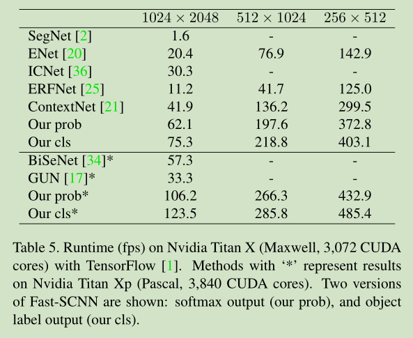

# 《Fast-SCNN: Fast Semantic Segmentation Network》论文阅读笔记
&emsp;&emsp;论文地址：[Fast-SCNN: Fast Semantic Segmentation Network](https://arxiv.org/pdf/1902.04502.pdf)
&emsp;&emsp;论文代码：[github](https://github.com/DeepVoltaire/Fast-SCNN)

[toc]
## 一、简介
&emsp;&emsp;Fast-SCNN是基于BiseNet和ICNet等实时语义分割网络改进的网络结构，同样采用了两个分支的结构：一个浅层分支提取图像的空间信息；另一个深层分支提取图像的上下文信息。
&emsp;&emsp;文章的主要贡献：
- 提出了Fast-SCNN
- 提出了千层的learning to downsample模块（不明觉厉）。


## 二、网络结构
&emsp;&emsp;网络的基本结构如图所示：

&emsp;&emsp;网络分为四个部分Learning To Down-Sample模块，Global Feature Extractor和Feature Fusion模块和Classifier模块。

```python
class Fast_SCNN(torch.nn.Module):
    def __init__(self, input_channel, num_classes):
        super().__init__()

        self.learning_to_downsample = LearningToDownsample(input_channel)
        self.global_feature_extractor = GlobalFeatureExtractor()
        self.feature_fusion = FeatureFusionModule()
        self.classifier = Classifier(num_classes)

    def forward(self, x):
        shared = self.learning_to_downsample(x)
        x = self.global_feature_extractor(shared)
        x = self.feature_fusion(shared, x)
        x = self.classifier(x)
        return x
```
### 1、Learning To Down-Sample
&emsp;&emsp;**结构描述:**从代码看的话更加直观，结构也很简单就是一层普通的卷积层后面接两个可分离卷积，得到的输出feature大小是原输出大小的1/8。
&emsp;&emsp;**code:**
```python
class LearningToDownsample(torch.nn.Module):
    def __init__(self, in_channels):
        super().__init__()
        self.conv1 = ConvBlock(in_channels=in_channels, out_channels=32, stride=2)
        self.sconv1 = nn.Sequential(
            nn.Conv2d(32, 32, kernel_size=3, stride=2, padding=1, dilation=1, groups=32, bias=False),
            nn.BatchNorm2d(32),
            nn.Conv2d(32, 48, kernel_size=1, stride=1, padding=0, dilation=1, groups=1, bias=False),
            nn.BatchNorm2d(48),
            nn.ReLU(inplace=True))
        self.sconv2 = nn.Sequential(
            nn.Conv2d(48, 48, kernel_size=3, stride=2, padding=1, dilation=1, groups=48, bias=False),
            nn.BatchNorm2d(48),
            nn.Conv2d(48, 64, kernel_size=1, stride=1, padding=0, dilation=1, groups=1, bias=False),
            nn.BatchNorm2d(64),
            nn.ReLU(inplace=True))

    def forward(self, x):
        x = self.conv1(x)
        x = self.sconv1(x)
        x = self.sconv2(x)
        return x
```
### 2、Global Feature Extractor
&emsp;&emsp;**结构描述：** 借鉴于MobileNet的网络结构采用多层可分离卷积的残差块，之后再接一个PSPModule。
&emsp;&emsp;**code:**
```python
class GlobalFeatureExtractor(torch.nn.Module):
    def __init__(self):
        super().__init__()
        self.first_block = nn.Sequential(InvertedResidual(64, 64, 2, 6),
                                         InvertedResidual(64, 64, 1, 6),
                                         InvertedResidual(64, 64, 1, 6))
        self.second_block = nn.Sequential(InvertedResidual(64, 96, 2, 6),
                                          InvertedResidual(96, 96, 1, 6),
                                          InvertedResidual(96, 96, 1, 6))
        self.third_block = nn.Sequential(InvertedResidual(96, 128, 1, 6),
                                         InvertedResidual(128, 128, 1, 6),
                                         InvertedResidual(128, 128, 1, 6))
        self.ppm = PSPModule(128, 128)

    def forward(self, x):
        x = self.first_block(x)
        x = self.second_block(x)
        x = self.third_block(x)
        x = self.ppm(x)
        return x
```
```python
class InvertedResidual(nn.Module):
    def __init__(self, inp, oup, stride, expand_ratio):
        super(InvertedResidual, self).__init__()
        self.stride = stride
        assert stride in [1, 2]

        hidden_dim = round(inp * expand_ratio)
        self.use_res_connect = self.stride == 1 and inp == oup

        if expand_ratio == 1:
            self.conv = nn.Sequential(
                # dw
                nn.Conv2d(hidden_dim, hidden_dim, 3, stride, 1, groups=hidden_dim, bias=False),
                nn.BatchNorm2d(hidden_dim),
                nn.ReLU(inplace=True),
                # pw-linear
                nn.Conv2d(hidden_dim, oup, 1, 1, 0, bias=False),
                nn.BatchNorm2d(oup),
            )
        else:
            self.conv = nn.Sequential(
                # pw
                nn.Conv2d(inp, hidden_dim, 1, 1, 0, bias=False),
                nn.BatchNorm2d(hidden_dim),
                nn.ReLU(inplace=True),
                # dw
                nn.Conv2d(hidden_dim, hidden_dim, 3, stride, 1, groups=hidden_dim, bias=False),
                nn.BatchNorm2d(hidden_dim),
                nn.ReLU(inplace=True),
                # pw-linear
                nn.Conv2d(hidden_dim, oup, 1, 1, 0, bias=False),
                nn.BatchNorm2d(oup),
            )

    def forward(self, x):
        if self.use_res_connect:
            return x + self.conv(x)
        else:
            return self.conv(x)
```
```python
class PSPModule(nn.Module):
    def __init__(self, features, out_features=1024, sizes=(1, 2, 3, 6)):
        super().__init__()
        self.stages = []
        self.stages = nn.ModuleList([self._make_stage(features, size) for size in sizes])
        self.bottleneck = nn.Conv2d(features * (len(sizes) + 1), out_features, kernel_size=1)
        self.relu = nn.ReLU()

    def _make_stage(self, features, size):
        prior = nn.AdaptiveAvgPool2d(output_size=(size, size))
        conv = nn.Conv2d(features, features, kernel_size=1, bias=False)
        return nn.Sequential(prior, conv)

    def forward(self, feats):
        h, w = feats.size(2), feats.size(3)
        priors = [F.interpolate(input=stage(feats), size=(h,w), mode='bilinear',
                                align_corners=True) for stage in self.stages] + [feats]
        # import pdb;pdb.set_trace()
        bottle = self.bottleneck(torch.cat(priors, 1))
        return self.relu(bottle)
```
### 3、Feature Fusion Module
&emsp;&emsp;**结构描述：** 这个模块来自于BiseNet，结构图如下:

&emsp;&emsp;**code:**
```python
class FeatureFusionModule(torch.nn.Module):
    def __init__(self):
        super().__init__()
        self.sconv1 = ConvBlock(in_channels=128, out_channels=128, stride=1, dilation=1, groups=128)
        self.conv_low_res = nn.Conv2d(128, 128, kernel_size=1, stride=1, padding=0, bias=True)

        self.conv_high_res = nn.Conv2d(64, 128, kernel_size=1, stride=1, padding=0, bias=True)
        self.relu = nn.ReLU()

    def forward(self, high_res_input, low_res_input):
        low_res_input = F.interpolate(input=low_res_input, scale_factor=4, mode='bilinear', align_corners=True)
        low_res_input = self.sconv1(low_res_input)
        low_res_input = self.conv_low_res(low_res_input)

        high_res_input = self.conv_high_res(high_res_input)
        x = torch.add(high_res_input, low_res_input)
        return self.relu(x)
```
### 4、Classifier
&emsp;&emsp;**结构描述：** 三层卷积：前两层为可分离卷积，最后一层为普通卷积。
&emsp;&emsp;**code:** 
```python
class Classifier(torch.nn.Module):
    def __init__(self, num_classes):
        super().__init__()
        self.sconv1 = ConvBlock(in_channels=128, out_channels=128, stride=1, dilation=1, groups=128)
        self.sconv2 = ConvBlock(in_channels=128, out_channels=128, stride=1, dilation=1, groups=128)
        self.conv = nn.Conv2d(128, num_classes, kernel_size=1, stride=1, padding=0, bias=True)

    def forward(self, x):
        x = self.sconv1(x)
        x = self.sconv1(x)
        return self.conv(x)
```
## 四、结果





