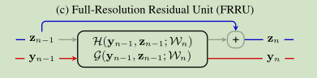
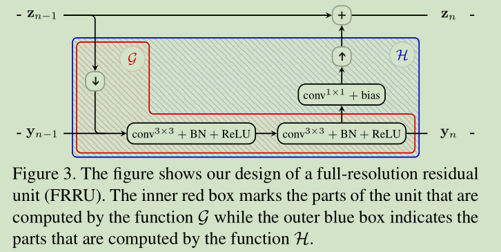

# 《Full-Resolution Residual Networks for Semantic Segmentation in Street Scenes》论文笔记

&emsp;&emsp;论文地址：[Full-Resolution Residual Networks for Semantic Segmentation in Street Scenes](https://arxiv.org/pdf/1611.08323.pdf)

&emsp;&emsp;论文代码：[github](https://github.com/TobyPDE/FRRN)

## 一、简介
&emsp;&emsp;语义分割任务面对的是信息密集的像素级分类任务，相比于简单的图像分类任务需要更多的信息，而现如今使用的大多数网络都是先对输入进行下采样然后将输出上采样到输入的尺寸得到结果，这样很容易丢失信息。作者提出了一个ResNet类似的网络结构，该网络有两个stream组成：一个以完整的图像分辨率传递信息精确的保留细节信息；另一个负责理解图像中不同物体之间的关系。

## 二、网络结构

&emsp;&emsp;FRRN借鉴了ResNet的网络设计原则，分为两个stream，一份steam是残差stream通过连续的残差相加得到feature；另一份是使用传统的卷积和池化得到feature。

&emsp;&emsp;对于网络的目标：细节信息和高级语义信息。细节信息存在于浅层的网络中，正好对应了残差stream；而高级语义信息需要更大的感受野去获取，因此存在于池化stream。

### 1、Full Resolution Residual Units
**结构：**
&emsp;&emsp;FRRN由一些列的FRRUs（Full Resolution Residual Units）组成，每个FRRU由两个输入和两个输出，其结构图如下所示：

&emsp;&emsp;其中$z_{n-1}$是第$n$个FRRU的残差输入，$y_{n-1}$是第$n$个FRRU的pooling输入，则输出为:
$$
\begin{aligned}
    z_n = z_{n-1} + \mathcal{H}(y_{n-1}, z_{n-1};\mathcal{W}_n)\\
y_n = z_{n-1} + \mathcal{G}(y_{n-1}, z_{n-1};\mathcal{W}_n)
\end{aligned}
$$
&emsp;&emsp;其中$\mathcal{W_n}$表示其参数。当$\mathcal{G}\equiv0$，时FRRU就变成了RU（Resiual Unit），整个网络就变成了简单的残差网络；如果$\mathcal{H}\equiv0$整个网络就变成了传统的深层卷积网络。
**反向传播：**
&emsp;&emsp;FRRN的反向传播类似于ResNet，对于$n<m$:
$$
z_m = z_n + \sum_{i=n}^{m-1}\mathcal{H}({y_i,z_i;\mathcal{W}_{i+1}})
$$
&emsp;&emsp;对于损失值$l$有：
$$
\begin{aligned}
    \frac{\partial l}{\partial {\mathcal{W}_n}}
    & =\frac{\partial l}{\partial {z_n}}
    \frac{\partial z_n}{\partial {\mathcal{W}_n}}+
    \frac{\partial l}{\partial {y_n}}
    \frac{\partial y_n}{\partial {\mathcal{W}_n}}\\
    & =\frac{\partial z_n}{\partial {\mathcal{W}_n}}(\frac{\partial l}{\partial {\mathcal{z}_m}}+\frac{\partial l}{\partial {\mathcal{z}_m}}\sum_{i=n}^{m-1}{\frac{\partial \mathcal{H}(y_i;z_i;\mathcal{W_{i+1}})}{\partial {\mathcal{z}_n}}})+\frac{\partial l}{\partial {\mathcal{y}_n}}\frac{\partial y_n}{\partial {\mathcal{W}_n}}
\end{aligned}
$$
**细节：**
&emsp;&emsp;如下图为网络中使用到的细节结构：

&emsp;&emsp;对于两个输入pooling stream和residual stream，先对residual stream进行pooling得到和pooling stream相同尺寸的大小然后concat，再经过连个3\*3的传统卷积+BN+RELU的结构，之后分为两部分：一部分作为下一个pooling stream的输入；另一个经过1\*1卷积核的处理后经过上采样和上一个residual stream的输入相加得到下一个residual stream的输入。这里的上采样作者发现使用简单的空间维度的数据重复要比二次线性插值效果好。
### 2、Full-Resolution Residual Networks (FRRNs)

网络中的上采样和下采样同其他网络类似使用双线性插值和maxpooling。

## 三、结果
&emsp;&emsp;

