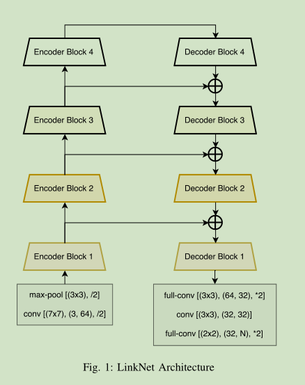
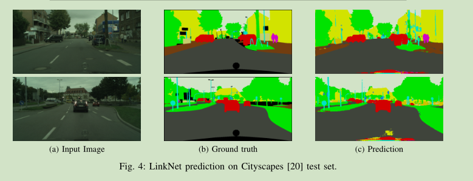
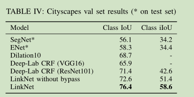
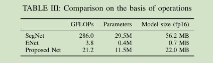

# 《LinkNet: Exploiting Encoder Representations for Efficient Semantic Segmentation》论文阅读笔记
&emsp;&emsp;论文地址：[LinkNet: Exploiting Encoder Representations for Efficient Semantic Segmentation](https://arxiv.org/pdf/1707.03718.pdf)
&emsp;&emsp;论文代码：[gitub](https://github.com/e-lab/LinkNet)
[toc]

## 一、简介
&emsp;&emsp;LinkNet是一个基于Encoder-Decoder的实时语义分割网络。

## 二、网络结构

## 三、结果

