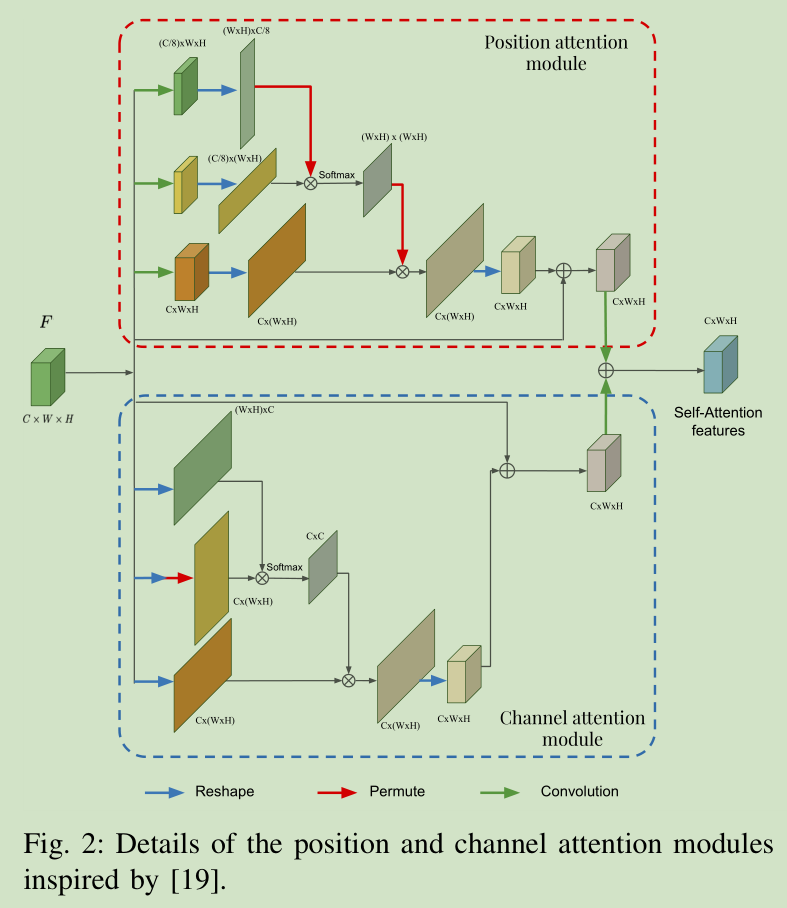
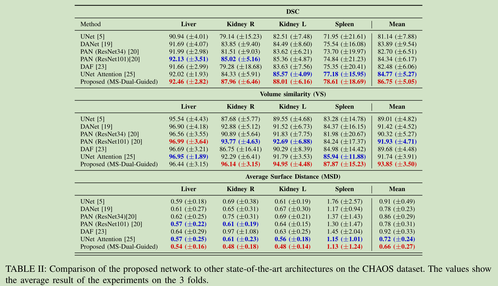
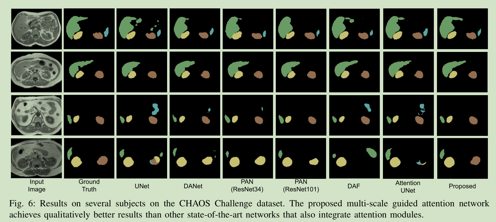

# 《Multi-scale guided attention for medical image segmentation》论文阅读笔记
[toc]

&emsp;&emsp;[Multi-scale guided attention for medical image segmentation](https://arxiv.org/pdf/1906.02849.pdf)
&emsp;&emsp;代码地址:[github](https://github.com/sinAshish/Multi-Scale-Attention)
## 一、简介
&emsp;&emsp;
## 二、结构

&emsp;&emsp;网络的整体结构如图所示，网络的backbone是ResNet-101，下面将详细描述网络的细节。
### 1、多尺度Attention Maps
&emsp;&emsp;多尺度特征是将经过Resnet-101提取后的多个特征图经过不同的处理整合以提取更多的信息。结构图中$F_s^{'}$是每个block之后生成的特征经过线性插值后恢复到相同的尺寸后的特征图。然后将多个特征图concat成一个tensor，再经过conv操作得到$F_{MS}$,$F_{MS}={F_0^{'},F_1^{'},F_2^{'},F_3^{'}}$。之后将每个block的feature $F_s^{'}$和$F_{MS}$进行concat得到对应的特征经过卷积滤波得到$\mathcal{A}_s$。
$$\mathcal{A}_s=AttMod_s(conv([F_s^{'},F_{MS}]))
$$
&emsp;&emsp;其中AttMod是Gudides Attention模块。
### 2、空间和通道Self-Attenton模块
&emsp;&emsp;传统深度分割模型中的感受野减少到局部附近，这限制了对更广泛和更丰富的上下文表示进行建模的能力。另一方面，可以将通道映射视为特定于类的响应，其中不同的语义响应相互关联。因此，另一种增强特定语义特征表示的策略是改善通道映射之间的依赖性。因此文中提出了方位和通道注意力模块。

#### 1）、Position Attention Module(PAM):

&emsp;&emsp;输入为$F\in \mathbb{R}^{C*W*H}$，其中C，W，H分别表示feature的通道，宽和高。然后改feature分为三个分支：
- 分支一：经过1\*1卷积进行通道降维得到$F_0^p\in\mathbb{R}^{\frac{C}{8}*W*H}$。然后$F_0^p$经过reshape变成$F_0^p\in\mathbb{R}^{(W*H)*\frac{C}{8}}$。(这里的$F_0^p$是一个二维矩阵，第一维的shape是$W*H$，第二维是$\frac{C}{8}$，后面用括号括起来同理);
- 分支二：经过1\*1卷积进行通道降维得到$F_1^p\in\mathbb{R}^{\frac{C}{8}*W*H}$，再经过reshape得到$F_1^p\in\mathbb{R}^{\frac{C}{8}*(W*H)}$。
- 分支三：经过卷积操作保持尺寸不变$F_2^p\in\mathbb{R}^{C*W*H}$，经过reshap得到$F_2^p\in\mathbb{R}^{C*(W*H)}$。

&emsp;&emsp;之后分支一的输出$F_0^p$和分支二的输出$F_1^p$经过相乘和softmax得到空间Attention Map$S^p\in \mathbb{R}^{(W*H)*(W*H)}$：
$$
s^p_{i,j}=\frac{e^{F_{0,i}^p \cdot F_{1,j}^p}}{\sum^{W*H}_{i=1}{e^{F_{0,i}^p \cdot F_{1,j}^p}}}
$$
&emsp;&emsp;其中$s^p_{i,j}$表示第$i$个位置对第$j$个位置的影响。
&emsp;&emsp;第三个branch的输出$F_2^p$和Attention Map S经过reshap得到输出尺寸为$\mathbb{R}^{C*W*H}$,再和$F$相加得到最终的输出。
$$
F_{PAM,j}=\lambda_p\sum_{i=1}^{W*H}s^p_{i,j}F^p_{2,j}+F_j
$$
&emsp;&emsp;其中$\lambda_p$初始化为0之后不断的更新得到最终的方位注意力特征图。
#### 2)、Channel Attenton Modudle(CAM):

&emsp;&emsp;CAM的操作和PAM很类似首先输入$F\in \mathbb{R}^{C*W*H}$分为三个分支：
- 分支一：直接reshape为$F_0^c\in \mathbb{R}^{(W*H)*C}$;
- 分支二：直接reshape为$F_1^c\in \mathbb{R}^{C*(W*H)}$;
- 分支三：直接reshape为$F_2^c\in \mathbb{R}^{C*(W*H)}$。

&emsp;&emsp;$F_0^c$和$F_1^c$相乘再经过softmax得到通道Attention Map$S^c\in \mathbb{R}^{C*C}$:
$$
s^c_{i,j}=\frac{e^{F_{0,i}^c \cdot F_{1,j}^c}}{\sum^{W*H}_{i=1}{e^{F_{0,i}^c \cdot F_{1,j}^c}}}
$$
&emsp;&emsp;然后$F_2^c$和$S^c$相乘再经过reshape得到$F_{CAM}\in \mathbb{R}^{C*W*H}$:
$$
F_{CAM,j}=\lambda_p\sum_{i=1}^{C}s^c_{i,j}F^c_{2,j}+F_j
$$
&emsp;&emsp;其中的$\lambda_c$也初始化为0在训练过程中不断更新最终得到通道注意力特征图。
### 3、Guiding Attention

&emsp;&emsp;Guiding Attention模块的结构如图所示$F_s^{'}$为每个block的feature，$F_{MS}$为不同block的feature经过融合后的结果。
&emsp;&emsp;首先，将$F_s^{'}$和$F_{MS}$经过concat得到$F$。$F$分为两个分支并行：经过PAM和CAM生成自注意力特征图；经过自编码器将输入特征$F$压缩为潜在空间中的压缩表示，以获取更多的语义信息，并且通过如下损失保证左右两个自编码器相近。
$$
\mathcal{L}_G=||\mathbb{E}_1(F)-\mathbb{E}_2(F_{SA})||_2^2
$$
&emsp;&emsp;其中$F_{SA}$为第一阶段生成的特征图。
&emsp;&emsp;然后将$F_MS$和自编码器生成的$\hat{F}$和经过PAM和CAM处理的$F$结合到一起得到$F_{SA}$。之后对$F_{SA}$进行第一阶段类似的操作得到最终Guiding Attention MAP。其中保证两个自编码器一致的损失为:
$$
\mathcal{L}_{Rec}=||F-\hat{F}||_2^2+||F_{SA}-\hat{F}_{SA}||_2^2
$$
&emsp;&emsp;因为有多个feature因此最终的损失为:
$$
\mathcal{L}_{G_{Total}}=\sum^{S}_{s=0}{\mathcal{L}^s_G}
$$
&emsp;&emsp;总体的重建损失为
$$
\mathcal{L}_{Rec_{Total}}=\sum^{S}_{s=0}{\mathcal{L}^s_{Rec}}
$$
### 4、深度监督
&emsp;&emsp;尽管注意力模块不需要辅助目标函数，但在每个比例尺上使用额外的监督会促使中间特征图在每个图像比例尺上具有语义上的区别。
$$
\mathcal{L}_{Seg_{Total}}=\sum_{s=0}^S{\mathcal{L^S_{Seg_{F^{'}}}}}+\sum_{s=0}^S{\mathcal{L^S_{Seg_{A}}}}
$$
&emsp;&emsp;其中第一项是指原始特征$F^{'}_s$上的分割结果，第二项是对注意力特征提供的分割结果进行评估。在所有情况下，网络预测和ground truth标签之间的多类交叉熵都被用作分割损失。考虑到所有损失，优化的最终目标函数变为:
$$
\mathcal{L}_{Total}=\alpha\mathcal{L}_{Seg_{Total}}+\beta\mathcal{L}_{G_{Total}}+\gamma\mathcal{L}_{Rec_{Total}}
$$
&emsp;&emsp;其中α，β和γ控制每个项在主要损失函数中的重要性。
## 三、代码
### 1、Encoder-Decoder
&emsp;&emsp;编码器：
```python
class _EncoderBlock(Module):
    def __init__(self, in_channels, out_channels, dropout=False):
        super(_EncoderBlock, self).__init__()
        layers = [
            nn.Conv2d(in_channels, out_channels, kernel_size=3, padding=1),
            nn.BatchNorm2d(out_channels),
            nn.ReLU(inplace=True),
            nn.Conv2d(out_channels, out_channels, kernel_size=3, padding=1),
            nn.BatchNorm2d(out_channels),
            nn.ReLU(inplace=True),
        ]
        if dropout:
            layers.append(nn.Dropout())
        layers.append(nn.MaxPool2d(kernel_size=2, stride=2))
        self.encode = nn.Sequential(*layers)

    def forward(self, x):
        return self.encode(x)
```
&emsp;&emsp;解码器：
```
class _DecoderBlock(Module):
    def __init__(self, in_channels, middle_channels, out_channels):
        super(_DecoderBlock, self).__init__()
        self.decode = nn.Sequential(
            nn.Conv2d(in_channels, middle_channels, kernel_size=3, padding=1),
            nn.BatchNorm2d(middle_channels),
            nn.ReLU(inplace=True),
            nn.Conv2d(middle_channels, middle_channels, kernel_size=3, padding=1),
            nn.BatchNorm2d(middle_channels),
            nn.ReLU(inplace=True),
            nn.ConvTranspose2d(middle_channels, out_channels, kernel_size=2, stride=2),
        )

    def forward(self, x):
        return self.decode(x)
```
### 2、PAM和CAM
&emsp;&emsp;PAM模块：
```python
class PAM_Module(Module):
    """ Position attention module"""
    #Ref from SAGAN
    def __init__(self, in_dim):
        super(PAM_Module, self).__init__()
        self.chanel_in = in_dim

        self.query_conv = Conv2d(in_channels=in_dim, out_channels=in_dim//8, kernel_size=1)
        self.key_conv = Conv2d(in_channels=in_dim, out_channels=in_dim//8, kernel_size=1)
        self.value_conv = Conv2d(in_channels=in_dim, out_channels=in_dim, kernel_size=1)
        self.gamma = Parameter(torch.zeros(1))

        self.softmax = Softmax(dim=-1)
    def forward(self, x):
        """
            inputs :
                x : input feature maps( B X C X H X W)
            returns :
                out : attention value + input feature
                attention: B X (HxW) X (HxW)
        """
        m_batchsize, C, height, width = x.size()
        proj_query = self.query_conv(x).view(m_batchsize, -1, width*height).permute(0, 2, 1)
        proj_key = self.key_conv(x).view(m_batchsize, -1, width*height)

        energy = torch.bmm(proj_query, proj_key)
        attention = self.softmax(energy)
        proj_value = self.value_conv(x).view(m_batchsize, -1, width*height)

        out = torch.bmm(proj_value, attention.permute(0, 2, 1))
        out = out.view(m_batchsize, C, height, width)

        out = self.gamma*out + x
        return out
```
&emsp;&emsp;CAM模块：
```python
class CAM_Module(Module):
    """ Channel attention module"""
    def __init__(self, in_dim):
        super(CAM_Module, self).__init__()
        self.chanel_in = in_dim


        self.gamma = Parameter(torch.zeros(1))
        self.softmax  = Softmax(dim=-1)
    def forward(self,x):
        """
            inputs :
                x : input feature maps( B X C X H X W)
            returns :
                out : attention value + input feature
                attention: B X C X C
        """
        m_batchsize, C, height, width = x.size()
        proj_query = x.view(m_batchsize, C, -1)
        proj_key = x.view(m_batchsize, C, -1).permute(0, 2, 1)
       
        energy = torch.bmm(proj_query, proj_key)
        energy_new = torch.max(energy, -1, keepdim=True)[0].expand_as(energy)-energy
        attention = self.softmax(energy_new)
        proj_value = x.view(m_batchsize, C, -1)

        out = torch.bmm(attention, proj_value)
        out = out.view(m_batchsize, C, height, width)

        out = self.gamma*out + x
        return out
```
### 3、結果處理
```python
return ((predict1_2 + predict2_2 + predict3_2 + predict4_2) / 4)
```
## 四、实验结果
### 1、实验设置
**数据集：** 采用MRI数据集。
**网络结构：** 采用ResNet-101做backbone，并对提取的模型进行消融实验，分别对两个模块PAM和CAM进行分析，然后结合两个模块得到DualNet进行实验。SM-DualNet通过多尺度提取网路的语义信息的网络结构。MSDualNet-Guided结构为使用了上面介绍的所有模块。实验中对比网络U-Net,PAN,DualNet，Attention U-Net。
**训练和实现细节：**batch-size=8,使用adam优化器，$\beta_1$=0.9,$\beta_2$=0.99，学习率设置为0.001并每50个epoch乘以0.5。使用交叉熵损失，上面提到的损失函数的三个参数$\alpha,\beta,\gamma$分别设置为1,0.25,0.1。
**评价指标：**
$$
DSC=\frac{2|A\bigcap B|}{|A|+|B|} 
$$
$$
VS=1-abs(A-B)/(A+B)
$$
$$
MSD=\frac{1}{|A|+|B|}(\sum_{a\in A}d(a,b)+\sum_{b\in B}d(b,a))
$$
### 2、结果
&emsp;&emsp;



