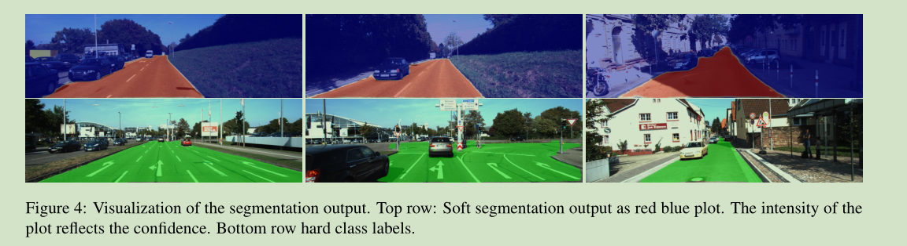
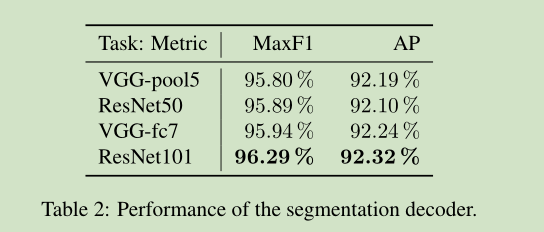
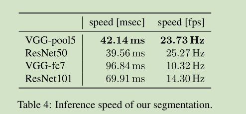

# 《MultiNet: Real-time Joint Semantic Reasoning for Autonomous Driving》论文阅读笔记

&emsp;&emsp;论文地址：[MultiNet: Real-time Joint Semantic Reasoning for Autonomous Driving](https://arxiv.org/pdf/1612.07695.pdf)

&emsp;&emsp;论文代码：[github](https://github.com/MarvinTeichmann/MultiNet)

## 一、简介
&emsp;&emsp;这篇文章是一个关于分类任务、目标检测和语义分割三个任务联合的网络，网络的结构没有多大的创新型使用的是类似FCN的Encoder-Decoder结构。
## 二、网络结构

## 三、结果

