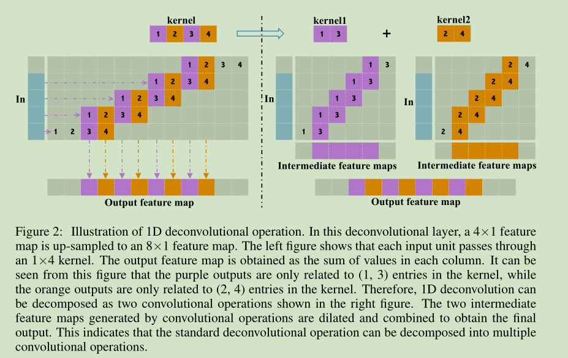
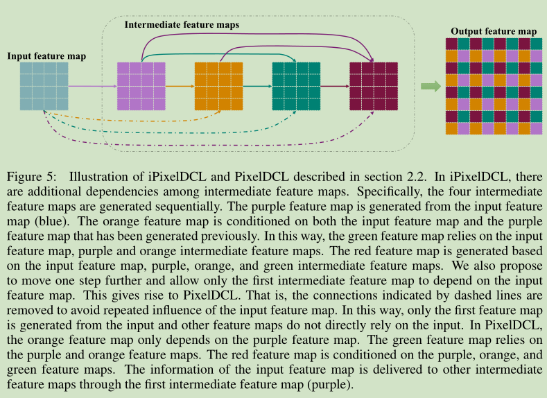
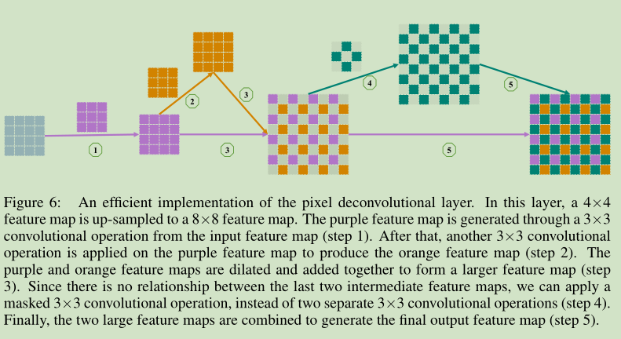
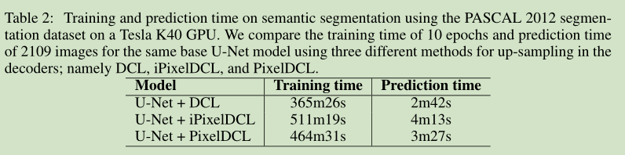

# 《PIXEL DECONVOLUTIONAL NETWORKS》论文阅读笔记
&emsp;&emsp;论文地址：[PIXEL DECONVOLUTIONAL NETWORKS](https://arxiv.org/pdf/1705.06820.pdf)

&emsp;&emsp;代码地址：[github](https://github.com/HongyangGao/PixelDCN)

## 一、简介
&emsp;&emsp;这篇文章提出的PixelDCL主要是为了解决Deconvolution所造成的棋盘效应。
## 二、细节
### 1、Tranditional Deconvolutional Layers
&emsp;&emsp;传统的Deconvolution操作分为两个：空洞卷积和转置卷积，这里讨论的是转置卷积。转置卷积的操作一般是先对输入进行padding或者插入0，然后对其使用普通的卷积操作即可。

&emsp;&emsp;但是如果这样进行上采样会出现棋盘效应，如下图所示，可以看到Deconvolution操作可以分解为多个卷积操作的合集，而分为多少个具体看上采样的倍数。

&emsp;&emsp;上图是一维情况的下的结果，下图是二维图像下的情况，可以看到得到的输出feature中点与点之间的关系基本没有。

&emsp;&emsp;用公式描述的话,假设上采样两倍：
$$
\begin{aligned}
    F_1=F_{in}\circledast k_1,&F_2=F_{in}\circledast k_2,F_3=F_{in}\circledast k_3,F_4=F_{in}\circledast k_4\\
    &F_{out}=F1\oplus F2\oplus F3\oplus F4
\end{aligned}
$$
&emsp;&emsp;$F_{in},F_{out}$分别对应输入和输出的feature，$k_i$表示核内的参数。
&emsp;&emsp;为了更加直观的理解上面的说法，看下图，基本操作是先对输入填充0，然后进行卷积操作，最终得到的结果可以看到右上角的部分只和输入右上角的元素相关，其他位置相同，而且每个小方格中的四个位置的元素信息和对应的卷积核中对应位置中的信息相关，像素与像素之间基本不相关。

&emsp;&emsp;从反卷积的上述解释中可以清楚地看出，这些中间特征图之间没有直接关系，因为它们是由独立的卷积核生成的。
&emsp;&emsp;现如今解决这个问题的一种做法是使用后处理，但是这样会导致网络并不是end-to-end的。

### 2、Pixel Deconvolution Layers
&emsp;&emsp;为了解决deconvolution layer存在的棋盘效应，作者提出了pixel deconvolutional layers(PixelDCL)可以将不同像素之间的关系有效的利用起来。
**iPixelDCL:**
&emsp;&emsp;PixelDCL如下面的公式所示，$F_{in},F_{out}$分别对应输入和输出的feature，$k_i$表示核内的参数。
$$
\begin{aligned}
    F_1=F_{in}\circledast k_1,&F_2=[F_{in},F_1]\circledast k_2,F_3=[F_{in},F_1,F_2]\circledast k_3,F_4=[F_{in},F_1,F_2,F_3]\circledast k_4,\\
    &F_{out}=F_1\oplus F_2\oplus F_3\oplus F_4
\end{aligned}
$$

**PixelDCL:**
&emsp;&emsp;从上面的公式中可以看出，其实该层次中存在信息冗余，可以一处部分的冗余，这样不仅仅可以减少计算量还可以减少深度模型的参数量。
$$
\begin{aligned}
    F_1=F_{in}\circledast k_1,&F_2=[F_1]\circledast k_2,F_3=[F_1,F_2]\circledast k_3,F_4=[F_1,F_2,F_3]\circledast k_4,\\
    &F_{out}=F_1\oplus F_2\oplus F_3\oplus F_4
\end{aligned}
$$
&emsp;&emsp;下面是一个改进的版本，先生成途中的紫色的feature，然后根据紫色的feature生成橘色的feature，将两个feature穿插成目标大小的feature，再用masked卷积生成剩下的位置的信息，最终填充到一起得到最终的feature。

## 三、结果

