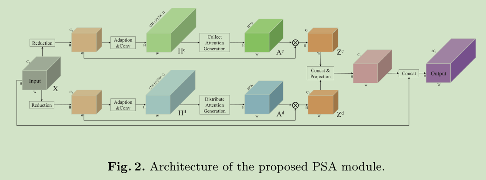
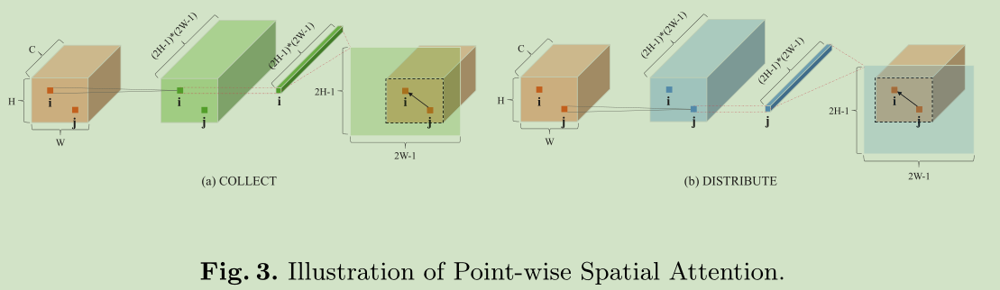
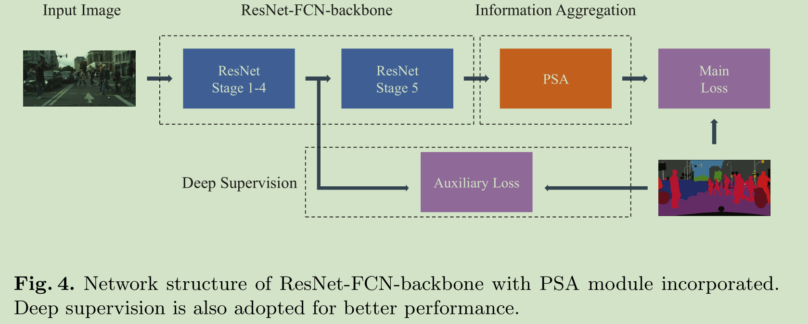
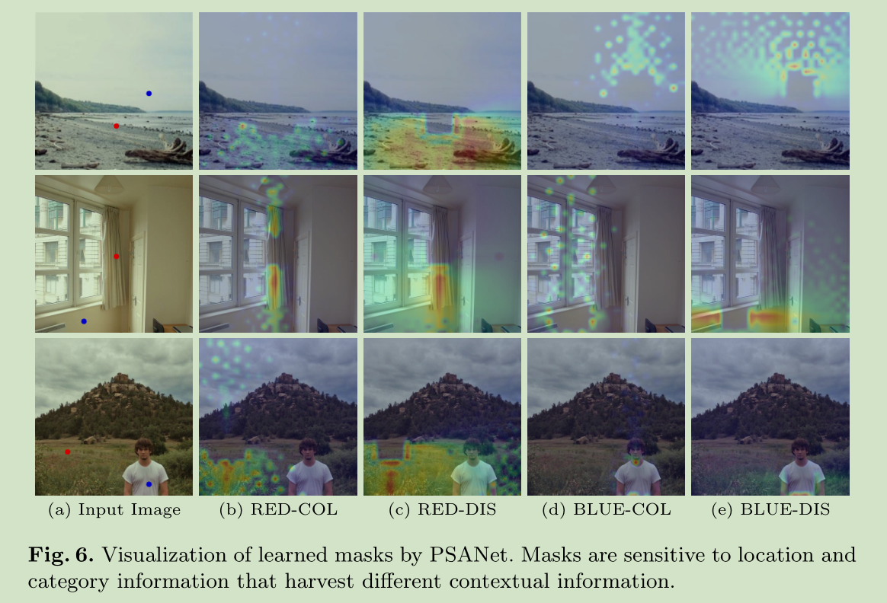

# 《PSANet: Point-wise Spatial Attention Network for Scene Parsing》论文阅读笔记
&emsp;&emsp;论文地址：[PSANet: Point-wise Spatial Attention Network for Scene Parsing](https://hszhao.github.io/papers/eccv18_psanet.pdf)
&emsp;&emsp;论文代码：[github](https://github.com/hszhao/PSANet)
[toc]

## 一、简介
&emsp;&emsp;PSANet提出了一个feature map中每个点和其他点之间影响的自适应attention mask来获取大范围的全局上下文信息。这一实现是通过模型中的PSA(Point-Wise Spatial Attention)模块，该模块将每个点的影响分为两个部分，一个是该点对其他点所施加的影响(Distribution)，另一个是该点从其他点所收集到的影响(Collect)。
&emsp;&emsp;文章的主要贡献：
- 1、双边point-wise上下文信息提取模块；
- 2、PSANet。

## 二、网络结构
### 1、Bi-Direction
&emsp;&emsp;一般情况下将单个feature上的点和其他点之间的关系通过如下公式计算得到有效feature：
$$
z_i=\frac{1}{N}\sum_{\forall j\in \Omega(i)}F(x_i,x_j,\triangle_{ij})x_j
$$
&emsp;&emsp;其中$z_i$是整合之后的feature位置$i$的值，$x_i$表示输入fearure在$i$的值$\forall j\in \Omega(i)$表示feature中所有和$i$位置相关的点，$\triangle_{ij}$表示位置$i$和$j$之间的相对位置。$F(x_i,x_j,\triangle_{ij})$表示学习到的点与点之间的相关关系。
&emsp;&emsp;对上式进行简化可以得到:
$$
z_i=\frac{1}{N}\sum_{\forall j\in \Omega(i)}F_{\triangle_{ij}}(x_i,x_j)x_j
$$
&emsp;&emsp;其中$F_{\triangle_{ij}}$表示一些列的位置相关函数或映射。如果按照上面的公式计算计算量将会非常大，因此进一步简化公式:
$$
F_{\triangle_{ij}}(x_i,x_j)\thickapprox F_{\triangle_{ij}}(x_i) 
\Rightarrow 
z_i=\frac{1}{N}\sum_{\forall j\in \Omega(i)}F_{\triangle_{ij}}(x_i)x_j
$$

&emsp;&emsp;上面的式子表示所有点对点$i$的影响，相对的$i$也对其他点施加影响，因此:
$$
\begin{aligned}
    & F_{\triangle_{ij}}(x_i,x_j) \thickapprox F_{\triangle_{ij}}(x_i) + F_{\triangle_{ij}}(x_j) \\
    \Rightarrow 
    &z_i = \frac{1}{N}\sum_{\forall j\in \Omega(i)}F_{\triangle_{ij}}(x_i)x_j+\frac{1}{N}\sum_{\forall j\in \Omega(i)}F_{\triangle_{ij}}(x_j)x_j \\
    \Rightarrow
    &z_i=\frac{1}{N}\sum_{\forall j}\mathrm{a}^c_{i,j}\mathrm{x}_j+\frac{1}{N}\sum_{\forall j}\mathrm{a}^d_{i,j}\mathrm{x}_j
\end{aligned}
$$
&emsp;&emsp;其中$\mathrm{a}^c_{i,j}$和$\mathrm{d}^c_{i,j}$表示collect和distribute两个分支的attention map $A^c$和$A^d$中的值。

### 2、Point-Wise Spatial Attention Module
&emsp;&emsp;PSAM的结构很清晰如下图，该模块分为两个分支：Collect和Distribution。两个分支的基本结构基本相同：输入$X\in \mathbb{R}^{H*W*C}$，经过1\*1卷积核进行降维得到$X\in \mathbb{R}^{H*W*C_1},(C_1 < C)$,然后一个由1\*1卷积和BN层、激活层组成的卷积层进行特征自适应得到$H\in \mathbb{R}^{H*W*(2H-1)*(2W-1)}$，然后经过Attention模块得到Attention map $A\in\mathbb{R}^{H*W*C}$和原feature融合得到各自的$Z^c$和$Z^d$之后经过concat和原feature融合得到最终的结果。

### 3、Point-Wise Spatial Attention
&emsp;&emsp;结构在上一节基本解释清楚主要说一下这里的通道数是$(2H-1)(2W-1)$的原因是对该tensor进行reshape之后可以使得feature上每个点都能够在保证自身处于中心的情况下获取其他点的影响，如下图所示：

&emsp;&emsp;对于特征图生成$i$位置即$(k,l)$在Attention上的区域是从$[H-k, W-l]$开始的大小为$H*W$的区域：
$$
\mathrm{a}^c_{[k,l],[s,t]}=\mathrm{h}^c_{[k,l],[H-k+s,W-l+t]},\forall s\in[0,H),t\in [0,W)
$$
&emsp;&emsp;$\mathrm{a}$表示Attention Map，$\mathrm{h}$表示输入。
### 4、网络结构


## 三、代码
### 1、PSA COLLECT Module
```caffe
layer {
  name: "conv5_3_reduce_before_PSA_COLLECT"
  type: "Convolution"
  bottom: "conv5_3"
  top: "conv5_3_reduce_before_PSA_COLLECT"
  param {
    lr_mult: 10
    decay_mult: 1
  }
  convolution_param {
    num_output: 512
    kernel_size: 1
    stride: 1
    weight_filler {
      type: "msra"
    }
    bias_term: false
  }
}
layer {
  name: "conv5_3_reduce_before_PSA_COLLECT/bn"
  type: "BN"
  bottom: "conv5_3_reduce_before_PSA_COLLECT"
  top: "conv5_3_reduce_before_PSA_COLLECT"
  param {
    lr_mult: 10
    decay_mult: 0
  }
  param {
    lr_mult: 10
    decay_mult: 0
  }
  param {
    lr_mult: 0
    decay_mult: 0
  }
  param {
    lr_mult: 0
    decay_mult: 0
  }
  bn_param {
    slope_filler {
      type: "constant"
      value: 1
    }
    bias_filler {
      type: "constant"
      value: 0
    }
    frozen: true
    momentum: 0.95
  }
}
layer {
  name: "conv5_3_reduce_before_PSA_COLLECT/relu"
  type: "ReLU"
  bottom: "conv5_3_reduce_before_PSA_COLLECT"
  top: "conv5_3_reduce_before_PSA_COLLECT"
}

# gen attention

layer {
  name: "PSA_COLLECT_fc1"
  type: "Convolution"
  bottom: "conv5_3_reduce_before_PSA_COLLECT"
  top: "PSA_COLLECT_fc1"
  param {
    lr_mult: 10
    decay_mult: 1
  }
  convolution_param {
    num_output: 512
    kernel_size: 1
    stride: 1
    weight_filler {
      type: "msra"
    }
    bias_term: false
  }
}
layer {
  name: "PSA_COLLECT_fc1/bn"
  type: "BN"
  bottom: "PSA_COLLECT_fc1"
  top: "PSA_COLLECT_fc1"
  param {
    lr_mult: 10
    decay_mult: 0
  }
  param {
    lr_mult: 10
    decay_mult: 0
  }
  param {
    lr_mult: 0
    decay_mult: 0
  }
  param {
    lr_mult: 0
    decay_mult: 0
  }
  bn_param {
    slope_filler {
      type: "constant"
      value: 1
    }
    bias_filler {
      type: "constant"
      value: 0
    }
    frozen: true
    momentum: 0.95
  }
}
layer {
  name: "PSA_COLLECT_fc1/relu"
  type: "ReLU"
  bottom: "PSA_COLLECT_fc1"
  top: "PSA_COLLECT_fc1"
}
layer {
  name: "PSA_COLLECT_fc2"
  type: "Convolution"
  bottom: "PSA_COLLECT_fc1"
  top: "PSA_COLLECT_fc2"
  param {
    lr_mult: 10
    decay_mult: 1
  }
  convolution_param {
    num_output:  3481 # 59*59
    kernel_size: 1
    stride: 1
    weight_filler {
      type: "msra"
    }
    bias_term: false
  }
}

# global fusion

layer {
  name: "global_feature_COLLECT"
  type: "PointwiseSpatialAttention"
  bottom: "conv5_3_reduce_before_PSA_COLLECT"
  bottom: "PSA_COLLECT_fc2"
  top: "global_feature_COLLECT"
  pointwise_spatial_attention_param {
    psa_type: COLLECT
    is_softmax: true
    normalization_factor: 1.0
  }
}
```
### 2、PSA DISTRIBUTE Module
```caffe
layer {
  name: "conv5_3_reduce_before_PSA_DISTRIBUTE"
  type: "Convolution"
  bottom: "conv5_3"
  top: "conv5_3_reduce_before_PSA_DISTRIBUTE"
  param {
    lr_mult: 10
    decay_mult: 1
  }
  convolution_param {
    num_output: 512
    kernel_size: 1
    stride: 1
    weight_filler {
      type: "msra"
    }
    bias_term: false
  }
}
layer {
  name: "conv5_3_reduce_before_PSA_DISTRIBUTE/bn"
  type: "BN"
  bottom: "conv5_3_reduce_before_PSA_DISTRIBUTE"
  top: "conv5_3_reduce_before_PSA_DISTRIBUTE"
  param {
    lr_mult: 10
    decay_mult: 0
  }
  param {
    lr_mult: 10
    decay_mult: 0
  }
  param {
    lr_mult: 0
    decay_mult: 0
  }
  param {
    lr_mult: 0
    decay_mult: 0
  }
  bn_param {
    slope_filler {
      type: "constant"
      value: 1
    }
    bias_filler {
      type: "constant"
      value: 0
    }
    frozen: true
    momentum: 0.95
  }
}
layer {
  name: "conv5_3_reduce_before_PSA_DISTRIBUTE/relu"
  type: "ReLU"
  bottom: "conv5_3_reduce_before_PSA_DISTRIBUTE"
  top: "conv5_3_reduce_before_PSA_DISTRIBUTE"
}

# gen attention

layer {
  name: "PSA_DISTRIBUTE_fc1"
  type: "Convolution"
  bottom: "conv5_3_reduce_before_PSA_DISTRIBUTE"
  top: "PSA_DISTRIBUTE_fc1"
  param {
    lr_mult: 10
    decay_mult: 1
  }
  convolution_param {
    num_output: 512
    kernel_size: 1
    stride: 1
    weight_filler {
      type: "msra"
    }
    bias_term: false
  }
}
layer {
  name: "PSA_DISTRIBUTE_fc1/bn"
  type: "BN"
  bottom: "PSA_DISTRIBUTE_fc1"
  top: "PSA_DISTRIBUTE_fc1"
  param {
    lr_mult: 10
    decay_mult: 0
  }
  param {
    lr_mult: 10
    decay_mult: 0
  }
  param {
    lr_mult: 0
    decay_mult: 0
  }
  param {
    lr_mult: 0
    decay_mult: 0
  }
  bn_param {
    slope_filler {
      type: "constant"
      value: 1
    }
    bias_filler {
      type: "constant"
      value: 0
    }
    frozen: true
    momentum: 0.95
  }
}
layer {
  name: "PSA_DISTRIBUTE_fc1/relu"
  type: "ReLU"
  bottom: "PSA_DISTRIBUTE_fc1"
  top: "PSA_DISTRIBUTE_fc1"
}
layer {
  name: "PSA_DISTRIBUTE_fc2"
  type: "Convolution"
  bottom: "PSA_DISTRIBUTE_fc1"
  top: "PSA_DISTRIBUTE_fc2"
  param {
    lr_mult: 10
    decay_mult: 1
  }
  convolution_param {
    num_output:  3481 #59*59
    kernel_size: 1
    stride: 1
    weight_filler {
      type: "msra"
    }
    bias_term: false
  }
}

# global fusion

layer {
  name: "global_feature_DISTRIBUTE"
  type: "PointwiseSpatialAttention"
  bottom: "conv5_3_reduce_before_PSA_DISTRIBUTE"
  bottom: "PSA_DISTRIBUTE_fc2"
  top: "global_feature_DISTRIBUTE"
  pointwise_spatial_attention_param {
    psa_type: DISTRIBUTE
    is_softmax: true
    normalization_factor: 1.0
  }
}
```
### 3、区别
&emsp;&emsp;从上面的配置文件看网络的机构基本相同都是两个1\*1卷积核接一个attention模块，不同之处为attention的实现方式:
```cpp
switch (this->layer_param_.pointwise_spatial_attention_param().psa_type()) {
  case PointwiseSpatialAttentionParameter_PSAType_COLLECT:
    PSAForward_buffer_mask_collect_cpu<Dtype>(num_, feature_H_, feature_W_,
        mask_H_, mask_W_, half_mask_H_, half_mask_W_,
        bottom[1]->cpu_data(), mask_buffer_.mutable_cpu_data());
    break;
  case PointwiseSpatialAttentionParameter_PSAType_DISTRIBUTE:
    PSAForward_buffer_mask_distribute_cpu<Dtype>(num_, feature_H_, feature_W_,
        mask_H_, mask_W_, half_mask_H_, half_mask_W_,
        bottom[1]->cpu_data(), mask_buffer_.mutable_cpu_data());
    break;
  default:
    LOG(FATAL) << "Unknown PSA type.";
  }
```
&emsp;&emsp;Collect:
```cpp
template <typename Dtype>
void PSAForward_buffer_mask_collect_cpu(const int num_,
    const int feature_H_, const int feature_W_,
    const int mask_H_, const int mask_W_,
    const int half_mask_H_, const int half_mask_W_,
    const Dtype* mask_data, Dtype* buffer_data) {
  for(int n = 0; n < num_; n++) {
    for(int h = 0; h < feature_H_; h++) {
      for(int w = 0; w < feature_W_; w++) {
        // effective mask region : [hstart, hend) x [wstart, wend) with mask-indexed
        const int hstart = max(0, half_mask_H_ - h);
        const int hend = min(mask_H_, feature_H_ + half_mask_H_ - h);
        const int wstart = max(0, half_mask_W_ - w);
        const int wend = min(mask_W_, feature_W_ + half_mask_W_ - w);
        // (hidx,                    widx                   ) with mask-indexed
        // (hidx + h - half_mask_H_, widx + w - half_mask_W_) with feature-indexed
        for (int hidx = hstart; hidx < hend; hidx++) {
          for (int widx = wstart; widx < wend; widx++) {
            buffer_data[(n * feature_H_ * feature_W_ + (hidx + h - half_mask_H_) * feature_W_ + (widx + w - half_mask_W_)) * feature_H_ * feature_W_ + h * feature_W_ + w] =
                mask_data[((n * mask_H_ * mask_W_ + hidx * mask_W_ + widx) * feature_H_ + h) * feature_W_ + w];
          }
        }
      }
    }
  }
}
```
&emsp;&emsp;Distribution:
```cpp
template <typename Dtype>
void PSAForward_buffer_mask_distribute_cpu(const int num_,
    const int feature_H_, const int feature_W_,
    const int mask_H_, const int mask_W_,
    const int half_mask_H_, const int half_mask_W_,
    const Dtype* mask_data, Dtype* buffer_data) {
  for(int n = 0; n < num_; n++) {
    for(int h = 0; h < feature_H_; h++) {
      for(int w = 0; w < feature_W_; w++) {
        // effective mask region : [hstart, hend) x [wstart, wend) with mask-indexed
        const int hstart = max(0, half_mask_H_ - h);
        const int hend = min(mask_H_, feature_H_ + half_mask_H_ - h);
        const int wstart = max(0, half_mask_W_ - w);
        const int wend = min(mask_W_, feature_W_ + half_mask_W_ - w);
        // (hidx,                    widx                   ) with mask-indexed
        // (hidx + h - half_mask_H_, widx + w - half_mask_W_) with feature-indexed
        for (int hidx = hstart; hidx < hend; hidx++) {
          for (int widx = wstart; widx < wend; widx++) {
            buffer_data[(n * feature_H_ * feature_W_ + h * feature_W_ + w) * feature_H_ * feature_W_ + (hidx + h - half_mask_H_) * feature_W_ + (widx + w - half_mask_W_)] =
                mask_data[((n * mask_H_ * mask_W_ + hidx * mask_W_ + widx) * feature_H_ + h) * feature_W_ + w];
          }
        }
      }
    }
  }
}
```
&emsp;&emsp;唯一的区别就是这里:
```cpp
buffer_data[(n * feature_H_ * feature_W_ + (hidx + h - half_mask_H_) * feature_W_ + (widx + w - half_mask_W_)) * feature_H_ * feature_W_ + h * feature_W_ + w] =
                mask_data[((n * mask_H_ * mask_W_ + hidx * mask_W_ + widx) * feature_H_ + h) * feature_W_ + w];
```
```cpp
buffer_data[(n * feature_H_ * feature_W_ + h * feature_W_ + w) * feature_H_ * feature_W_ + (hidx + h - half_mask_H_) * feature_W_ + (widx + w - half_mask_W_)] =
                mask_data[((n * mask_H_ * mask_W_ + hidx * mask_W_ + widx) * feature_H_ + h) * feature_W_ + w];
```
&emsp;&emsp;图中第一项实在相同的feautre中索引不同的位置，第二项实在不同的feature中索引相同的位置。


## 四、结果
&emsp;&emsp;看结果的话不能说没用也不能说多有用。




