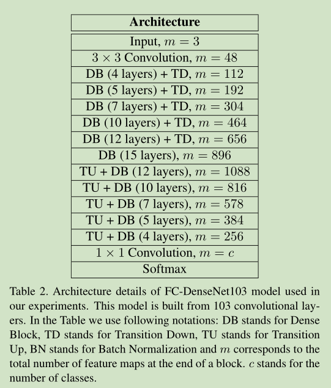

# 《The One Hundred Layers Tiramisu: Fully Convolutional DenseNets for Semantic Segmentation》论文阅读笔记
&emsp;&emsp;论文地址:[The One Hundred Layers Tiramisu: Fully Convolutional DenseNets for Semantic Segmentation](https://arxiv.org/pdf/1611.09326.pdf)
&emsp;&emsp;论文代码:[github](https://github.com/SimJeg/FC-DenseNet)
## 一、简介
&emsp;&emsp;这篇文章提出了一个基于DenseNet的Fully Convolutional DenseNets，作者认为这个结构的主要优点是：
- 参数高效，参数的使用效率更高；
- 深层网络的表征能力；
- 特征重用。

&emsp;&emsp;本文的主要贡献：
- 将DenseNet应用于语义分割任务构建了Fully Convolutional DenseNets；
- 文中根据Dense Block提出的上采样路径比标准的上采样路径效果好的多。

## 二、网络结构
&emsp;&emsp;FCNs的基本结构是采用一个下采样和一个上采样编码提取特征和恢复原信息。而通过skip连接能够从下采样中获得空间细节图像有助于恢复原始图像。

### 1、DenseNet结构
&emsp;&emsp;传统的卷积层操作是：$x_\ell$基于上一层的输出$x_{\ell - 1}$经过卷积操作$H_{\ell}$，$H_{\ell}$通常是是一个卷积操作接一个非线性激活层和dropout：
$$
x_{\ell} = H_{\ell}(x_{\ell - 1})
$$
&emsp;&emsp;而ResNet通过残差结构整合低层和原始信息：
$$
x_{\ell} = H_{\ell}(x_{\ell - 1}) + x_{\ell - 1}
$$
&emsp;&emsp;更深层次的DenseNet则是通过将多层的feature通过多个残差链接在一起重用feature：
$$
x_{\ell} = H_{\ell}([x_{\ell - 1},x_{\ell - 2},...,x_0])
$$


### 2、Fully Convolutional DenseNets
&emsp;&emsp;


## 三、代码
### 1、TransitionDown
```python
def TransitionDown(inputs, n_filters, dropout_p=0.2):
    """ Apply first a BN_ReLu_conv layer with filter size = 1, and a max pooling with a factor 2  """

    l = BN_ReLU_Conv(inputs, n_filters, filter_size=1, dropout_p=dropout_p)
    l = Pool2DLayer(l, 2, mode='max')

    return l
    # Note : network accuracy is quite similar with average pooling or without BN - ReLU.
    # We can also reduce the number of parameters reducing n_filters in the 1x1 convolution
```
### 2、TransitionUp
```python
def TransitionUp(skip_connection, block_to_upsample, n_filters_keep):
    """
    Performs upsampling on block_to_upsample by a factor 2 and concatenates it with the skip_connection """

    # Upsample
    l = ConcatLayer(block_to_upsample)
    l = Deconv2DLayer(l, n_filters_keep, filter_size=3, stride=2,
                      crop='valid', W=HeUniform(gain='relu'), nonlinearity=linear)
    # Concatenate with skip connection
    l = ConcatLayer([l, skip_connection], cropping=[None, None, 'center', 'center'])

    return l
```

## 四、结果
### 1、实验设置
&emsp;&emsp;
&emsp;&emsp;**评价指标:** $$IoU(c)=\frac{\sum_i(o_i==c \land y_i == c)}{\sum_i(o_i==c \lor y_i == c)}$$ 
&emsp;&emsp;**结构细节:**


### 2、实验结果

